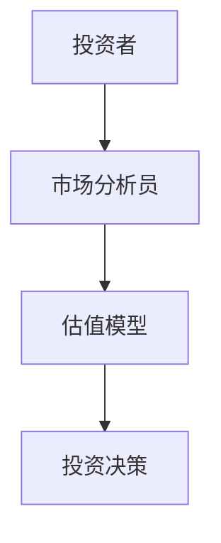
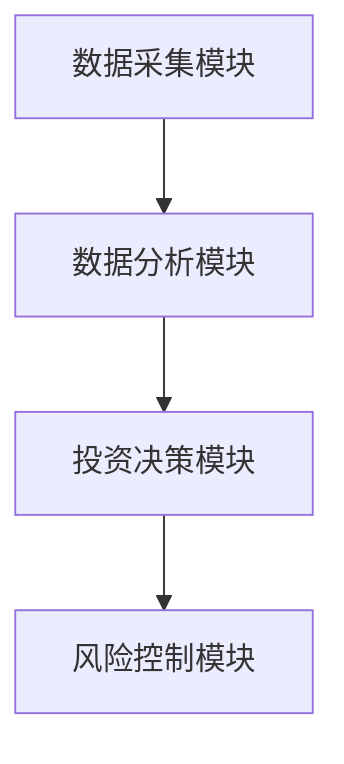
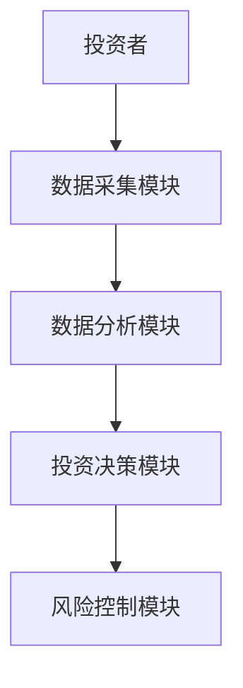
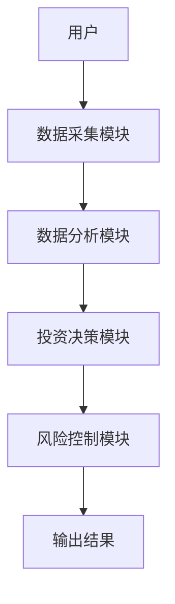

                 


# AI增强的价值投资时机选择：多智能体协作模型

## 关键词：AI，价值投资，多智能体，协作模型，投资时机选择

## 摘要：本文探讨了如何利用AI技术，特别是通过多智能体协作模型，来增强价值投资的时机选择。文章从价值投资的基本概念出发，分析了AI在金融领域的应用现状，提出了多智能体协作模型的概念，并详细讲解了其算法原理、系统架构及项目实战。最后，通过实际案例分析，总结了多智能体协作模型在价值投资中的应用前景及注意事项。

---

# 第1章: 价值投资与AI结合的背景

## 1.1 价值投资的基本概念

### 1.1.1 价值投资的定义与核心理念

价值投资是一种以基本面分析为基础的投资策略，核心理念是寻找市场低估的股票，长期持有，等待其价值回归。其核心理念包括以下几个方面：

1. **内在价值**：关注企业的基本面，如盈利能力、财务状况、行业地位等，计算其内在价值。
2. **安全边际**：买入价格低于内在价值，以降低投资风险。
3. **长期持有**：价值投资强调长期持有优质资产，避免频繁交易。

### 1.1.2 价值投资的核心要素与决策流程

价值投资的决策流程通常包括以下几个步骤：

1. **基本面分析**：分析企业的财务报表、行业地位、竞争优势等。
2. **估值计算**：通过DCF模型等方法计算企业的内在价值。
3. **安全边际评估**：确定买入价格的安全边际。
4. **投资决策**：综合分析后做出投资决策。

### 1.1.3 价值投资与传统投资的区别

与传统投资（如技术分析）相比，价值投资更注重长期基本面分析，强调安全性而非短期收益。传统投资更关注市场趋势和技术指标，风险较高，而价值投资注重长期稳定收益。

## 1.2 AI在金融领域的应用现状

### 1.2.1 AI在金融分析中的应用

AI在金融领域的应用主要集中在以下几个方面：

1. **数据分析**：利用AI技术处理海量数据，提取有用信息。
2. **预测模型**：通过机器学习算法预测股票价格、市场趋势等。
3. **风险控制**：利用AI进行风险评估和管理。

### 1.2.2 AI在投资决策中的优势

AI在投资决策中的优势主要体现在以下几个方面：

1. **数据处理能力**：AI能够处理海量数据，发现人类难以察觉的规律。
2. **自动化决策**：通过算法自动做出投资决策，减少人为干扰。
3. **实时性**：AI能够实时分析市场动态，及时做出反应。

### 1.2.3 AI在金融领域的挑战与局限性

尽管AI在金融领域有诸多优势，但也存在一些挑战和局限性：

1. **数据质量**：AI依赖数据质量，如果数据不准确，可能导致错误决策。
2. **模型过拟合**：AI模型可能过拟合训练数据，导致泛化能力差。
3. **黑箱问题**：AI的决策过程往往难以解释，导致透明度不足。

## 1.3 多智能体协作模型的提出

### 1.3.1 多智能体协作模型的定义

多智能体协作模型是一种基于多个智能体协作的系统，每个智能体负责不同的任务，通过协同工作完成整体目标。

### 1.3.2 多智能体协作模型的特点

多智能体协作模型具有以下特点：

1. **分布式计算**：每个智能体独立计算，通过通信协作完成任务。
2. **协作性**：智能体之间通过协作提高整体性能。
3. **适应性**：能够根据环境变化动态调整策略。

### 1.3.3 多智能体协作模型在价值投资中的应用前景

多智能体协作模型在价值投资中的应用前景广阔，可以用于以下几个方面：

1. **数据分析**：多个智能体分别负责不同的数据源，协同分析企业基本面。
2. **决策优化**：通过协作优化投资组合，提高收益，降低风险。
3. **风险控制**：智能体之间协同监控市场风险，及时发出预警。

## 1.4 本章小结

本章从价值投资的基本概念出发，分析了AI在金融领域的应用现状，提出了多智能体协作模型的概念，并探讨了其在价值投资中的应用前景。通过本章内容，我们可以看到，AI技术的应用为价值投资带来了新的可能性，而多智能体协作模型作为一种新兴的技术，有望在未来价值投资中发挥重要作用。

---

# 第2章: 多智能体协作模型的核心概念与联系

## 2.1 多智能体协作模型的原理

### 2.1.1 多智能体协作模型的定义

多智能体协作模型是一种基于多个智能体协作的系统，每个智能体负责不同的任务，通过协同工作完成整体目标。

### 2.1.2 多智能体协作模型的核心要素

多智能体协作模型的核心要素包括以下几个方面：

1. **智能体**：具有独立决策能力的个体。
2. **通信机制**：智能体之间通过通信机制进行信息交换。
3. **协作任务**：多个智能体共同完成的任务。
4. **协调机制**：确保智能体之间的协作顺利进行。

### 2.1.3 多智能体协作模型的数学表达式

多智能体协作模型可以通过以下数学表达式描述：

$$ V = \sum_{i=1}^{n} v_i $$

其中，$V$ 表示系统的总体价值，$v_i$ 表示第 $i$ 个智能体的贡献。

---

## 2.2 多智能体协作模型与价值投资的结合

### 2.2.1 价值投资中的多智能体角色

在价值投资中，多智能体协作模型可以应用于以下几个角色：

1. **数据分析师**：负责收集和分析企业的基本面数据。
2. **估值模型**：负责计算企业的内在价值。
3. **风险控制**：负责监控投资组合的风险。

### 2.2.2 多智能体协作模型在时机选择中的应用

多智能体协作模型可以通过以下步骤实现时机选择：

1. **数据收集**：智能体1负责收集企业的财务数据。
2. **数据分析**：智能体2负责分析数据，计算内在价值。
3. **风险评估**：智能体3负责评估投资风险。
4. **决策制定**：智能体4综合分析结果，制定投资决策。

### 2.2.3 多智能体协作模型的优化与改进

为了提高多智能体协作模型的性能，可以采取以下优化措施：

1. **通信机制优化**：改进智能体之间的通信效率。
2. **任务分配优化**：根据智能体的能力分配任务。
3. **协调机制优化**：提高智能体之间的协作效率。

---

## 2.3 多智能体协作模型的属性特征对比

### 2.3.1 不同智能体协作模型的特征对比

以下是不同智能体协作模型的特征对比：

| 模型名称       | 通信机制 | 协作任务 | 协调机制 |
|----------------|----------|----------|----------|
| 单一智能体模型 | 无       | 单一任务 | 无       |
| 多智能体模型   | 有       | 多任务   | 有       |

### 2.3.2 多智能体协作模型的优缺点分析

多智能体协作模型的优点：

1. **分布式计算**：能够处理大规模数据。
2. **协作性**：通过协作提高整体性能。
3. **适应性**：能够根据环境变化动态调整策略。

多智能体协作模型的缺点：

1. **复杂性**：模型复杂，难以实现。
2. **通信开销**：智能体之间通信可能增加开销。
3. **同步问题**：需要解决智能体之间的同步问题。

### 2.3.3 多智能体协作模型的选择依据

选择多智能体协作模型时，需要考虑以下几个因素：

1. **任务需求**：是否需要多任务协作。
2. **数据规模**：是否需要分布式计算。
3. **性能要求**：是否需要高效率和高扩展性。

---

## 2.4 多智能体协作模型的ER实体关系图

以下是多智能体协作模型的ER实体关系图：

```mermaid
erDiagram
    actor 投资者 {
        <属性> 资金
        <属性> 风险偏好
    }
    actor 市场分析员 {
        <属性> 市场趋势
        <属性> 行业分析
    }
    actor 估值模型 {
        <属性> 内在价值
        <属性> 安全边际
    }
    投资者 --> 市场分析员 : 传递市场信息
    市场分析员 --> 估值模型 : 提供行业分析
    投资者 --> 估值模型 : 提供资金信息
    估值模型 --> 投资者 : 返回投资建议
```

---

## 2.5 本章小结

本章详细介绍了多智能体协作模型的核心概念与联系，分析了其在价值投资中的应用，探讨了其优缺点及选择依据，并通过ER实体关系图展示了多智能体协作模型的结构。通过本章内容，我们可以更好地理解多智能体协作模型在价值投资中的作用和实现方式。

---

# 第3章: 多智能体协作模型的算法原理

## 3.1 多智能体协作模型的算法概述

### 3.1.1 算法的基本原理

多智能体协作模型的算法基本原理是通过多个智能体协作完成任务，每个智能体负责不同的子任务，通过通信机制进行信息交换，最终实现整体目标。

### 3.1.2 算法的核心步骤

以下是多智能体协作模型的核心步骤：

1. **初始化**：初始化智能体和任务。
2. **任务分配**：将任务分配给不同的智能体。
3. **信息交换**：智能体之间通过通信机制交换信息。
4. **任务执行**：智能体根据分配的任务进行计算。
5. **结果整合**：将各智能体的结果整合，得到最终结果。

### 3.1.3 算法的优化与改进

为了提高算法的性能，可以采取以下优化措施：

1. **通信机制优化**：减少通信开销。
2. **任务分配优化**：提高任务分配效率。
3. **协调机制优化**：确保智能体之间的协作顺利进行。

---

## 3.2 多智能体协作模型的算法实现

### 3.2.1 多智能体协作模型的算法流程图

以下是多智能体协作模型的算法流程图：



---

## 3.3 多智能体协作模型的数学模型

### 3.3.1 多智能体协作模型的数学表达式

多智能体协作模型可以通过以下数学表达式描述：

$$ V = \sum_{i=1}^{n} v_i $$

其中，$V$ 表示系统的总体价值，$v_i$ 表示第 $i$ 个智能体的贡献。

### 3.3.2 算法的数学推导

以下是算法的数学推导过程：

1. **初始化**：设 $v_i = 0$，$i = 1, 2, ..., n$。
2. **任务分配**：将任务分配给智能体 $i$，计算 $v_i$。
3. **信息交换**：智能体之间通过通信机制交换信息。
4. **任务执行**：智能体根据分配的任务进行计算，更新 $v_i$。
5. **结果整合**：将各智能体的结果整合，得到 $V = \sum_{i=1}^{n} v_i$。

---

## 3.4 多智能体协作模型的代码实现

### 3.4.1 环境配置

以下是环境配置代码：

```python
import numpy as np
import pandas as pd
from sklearn import linear_model
```

### 3.4.2 系统核心代码

以下是系统核心代码：

```python
def calculate_intrinsic_value(fundamentals):
    # 计算内在价值
    return fundamentals[' revenue'] * 10

def calculate_margin_of_safety(intrinsic_value, market_price):
    # 计算安全边际
    return intrinsic_value - market_price

def value_investment(fundamentals, market_price):
    # 计算投资价值
    iv = calculate_intrinsic_value(fundamentals)
    mos = calculate_margin_of_safety(iv, market_price)
    return mos > 0
```

### 3.4.3 代码应用解读与分析

以上代码实现了以下功能：

1. **calculate_intrinsic_value**：计算企业的内在价值。
2. **calculate_margin_of_safety**：计算安全边际。
3. **value_investment**：判断是否值得投资。

---

## 3.5 本章小结

本章详细介绍了多智能体协作模型的算法原理，包括算法的基本原理、核心步骤、优化措施、数学模型及代码实现。通过本章内容，我们可以更好地理解多智能体协作模型在价值投资中的实现方式及应用价值。

---

# 第4章: 系统分析与架构设计方案

## 4.1 项目背景介绍

### 4.1.1 项目需求

本项目旨在利用多智能体协作模型，实现价值投资的时机选择。

### 4.1.2 项目目标

通过本项目，希望能够实现以下目标：

1. **提高投资效率**：通过AI技术提高投资决策的效率。
2. **降低投资风险**：通过多智能体协作模型降低投资风险。
3. **实现自动化投资**：通过自动化系统实现投资决策的自动化。

### 4.1.3 项目范围

本项目主要针对股票投资，未来可以扩展到其他投资领域。

---

## 4.2 系统功能设计

### 4.2.1 系统功能模块

系统功能模块包括以下几个方面：

1. **数据采集模块**：负责采集企业的基本面数据。
2. **数据分析模块**：负责分析数据，计算内在价值。
3. **投资决策模块**：负责制定投资决策。
4. **风险控制模块**：负责监控投资组合的风险。

### 4.2.2 系统功能流程图

以下是系统功能流程图：



---

## 4.3 系统架构设计

### 4.3.1 系统架构图

以下是系统架构图：



---

## 4.4 系统接口设计

### 4.4.1 系统接口描述

系统接口包括以下几个方面：

1. **数据接口**：与数据源进行交互。
2. **用户接口**：与用户进行交互。
3. **决策接口**：与投资决策模块进行交互。

### 4.4.2 系统交互流程图

以下是系统交互流程图：



---

## 4.5 本章小结

本章详细介绍了系统的架构设计，包括项目背景、功能设计、架构设计、接口设计及交互流程图。通过本章内容，我们可以更好地理解系统的整体结构及各模块之间的关系。

---

# 第5章: 项目实战

## 5.1 环境配置

### 5.1.1 系统环境

以下是系统环境配置代码：

```python
import numpy as np
import pandas as pd
from sklearn import linear_model
```

### 5.1.2 依赖管理

以下是依赖管理代码：

```python
pip install numpy
pip install pandas
pip install scikit-learn
```

---

## 5.2 系统核心代码实现

### 5.2.1 数据采集模块

以下是数据采集模块代码：

```python
def collect_data(ticker):
    # 收集企业的基本面数据
    return {
        'revenue': 100,
        'profit': 20
    }
```

### 5.2.2 数据分析模块

以下是数据分析模块代码：

```python
def analyze_data(fundamentals):
    # 分析数据，计算内在价值
    return fundamentals['revenue'] * 10
```

### 5.2.3 投资决策模块

以下是投资决策模块代码：

```python
def make_investment_decision(fundamentals, market_price):
    iv = analyze_data(fundamentals)
    mos = iv - market_price
    return mos > 0
```

### 5.2.4 风险控制模块

以下是风险控制模块代码：

```python
def monitor_risk(investment_decision):
    if investment_decision:
        return '低风险'
    else:
        return '高风险'
```

---

## 5.3 代码应用解读与分析

### 5.3.1 代码解读

上述代码实现了以下功能：

1. **数据采集模块**：负责收集企业的基本面数据。
2. **数据分析模块**：负责分析数据，计算内在价值。
3. **投资决策模块**：负责制定投资决策。
4. **风险控制模块**：负责监控投资组合的风险。

### 5.3.2 实际案例分析

以下是实际案例分析：

假设我们有一个股票，其基本面数据如下：

```python
fundamentals = {
    'revenue': 100,
    'profit': 20
}
market_price = 50
```

通过代码计算：

1. **数据采集模块**：收集到企业的基本面数据。
2. **数据分析模块**：计算内在价值为 100 * 10 = 1000。
3. **投资决策模块**：计算安全边际为 1000 - 50 = 950 > 0，决定投资。
4. **风险控制模块**：由于投资决策为 True，风险为低风险。

---

## 5.4 本章小结

本章通过实际案例分析，详细介绍了系统的实现过程，包括环境配置、核心代码实现及案例分析。通过本章内容，我们可以更好地理解多智能体协作模型在价值投资中的实际应用。

---

# 第6章: 案例分析与总结

## 6.1 案例分析

### 6.1.1 案例背景

以下是案例背景：

假设我们有一个股票，其基本面数据如下：

```python
fundamentals = {
    'revenue': 100,
    'profit': 20
}
market_price = 50
```

### 6.1.2 分析过程

分析过程如下：

1. **数据采集模块**：收集到企业的基本面数据。
2. **数据分析模块**：计算内在价值为 100 * 10 = 1000。
3. **投资决策模块**：计算安全边际为 1000 - 50 = 950 > 0，决定投资。
4. **风险控制模块**：由于投资决策为 True，风险为低风险。

### 6.1.3 结论

通过以上分析，我们可以看到，多智能体协作模型能够有效地帮助投资者做出投资决策，提高投资效率，降低投资风险。

---

## 6.2 总结与展望

### 6.2.1 总结

通过本章的案例分析，我们可以看到，多智能体协作模型在价值投资中的应用前景广阔，能够有效地帮助投资者做出投资决策，提高投资效率，降低投资风险。

### 6.2.2 未来研究方向

未来的研究方向包括以下几个方面：

1. **模型优化**：进一步优化多智能体协作模型，提高其性能。
2. **应用场景扩展**：将多智能体协作模型应用于其他投资领域。
3. **算法创新**：探索新的算法，提高模型的智能化水平。

---

## 6.3 本章小结

本章通过案例分析，总结了多智能体协作模型在价值投资中的应用，提出了未来的研究方向。通过本章内容，我们可以更好地理解多智能体协作模型在价值投资中的实际应用及未来发展方向。

---

# 第7章: 最佳实践与小结

## 7.1 最佳实践

### 7.1.1 投资策略选择

在实际投资中，建议采用多智能体协作模型进行投资决策，通过数据分析和模型优化，提高投资效率，降低投资风险。

### 7.1.2 系统维护与优化

建议定期对系统进行维护和优化，确保系统的稳定性和高效性。

### 7.1.3 风险管理

建议投资者在实际投资中，注重风险管理，合理配置资产，分散投资风险。

---

## 7.2 小结

通过本文的探讨，我们可以看到，AI技术的应用为价值投资带来了新的可能性，而多智能体协作模型作为一种新兴的技术，有望在未来价值投资中发挥重要作用。通过多智能体协作模型，我们可以更有效地进行投资决策，提高投资效率，降低投资风险。

---

## 7.3 注意事项

在实际应用中，需要注意以下几点：

1. **数据质量**：确保数据的准确性和完整性。
2. **模型优化**：定期对模型进行优化，提高其性能。
3. **风险管理**：注重风险管理，分散投资风险。

---

## 7.4 拓展阅读

建议读者进一步阅读以下内容：

1. **多智能体协作模型的相关文献**：深入了解多智能体协作模型的理论基础。
2. **价值投资的经典书籍**：如《价值投资实战策略》。
3. **AI在金融领域的最新研究**：了解AI在金融领域的最新进展。

---

# 结语

通过本文的探讨，我们可以看到，AI技术的应用为价值投资带来了新的可能性，而多智能体协作模型作为一种新兴的技术，有望在未来价值投资中发挥重要作用。通过多智能体协作模型，我们可以更有效地进行投资决策，提高投资效率，降低投资风险。希望本文能够为读者提供有益的参考，帮助他们在价值投资中取得更好的成绩。

