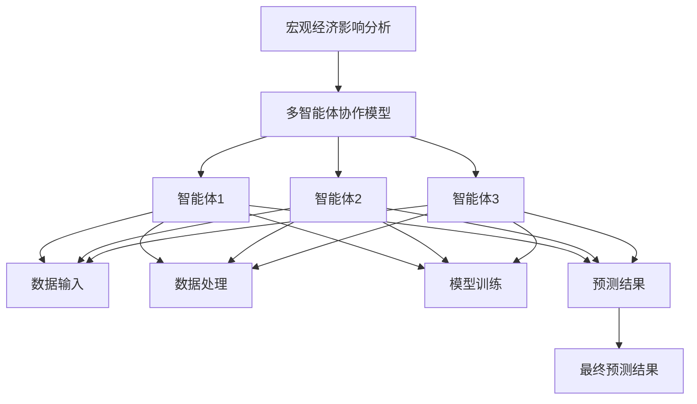
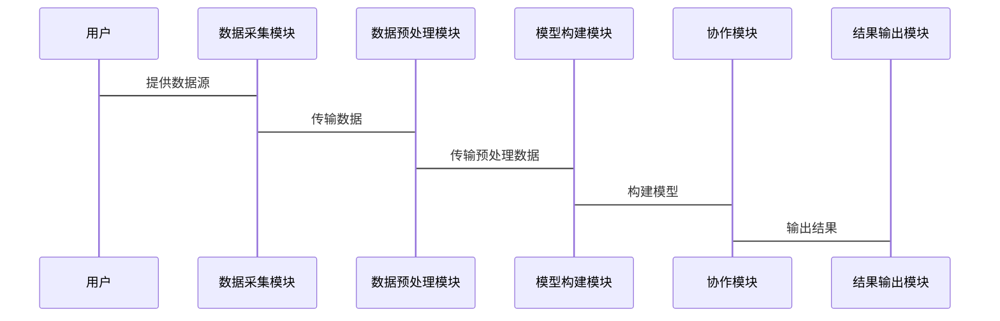

                 


# AI增强的宏观经济影响分析：多智能体协作模型

## 关键词：
- AI增强
- 宏观经济影响
- 多智能体协作模型
- 宏观经济预测
- 人工智能技术
- 经济系统模拟

## 摘要：
本文探讨了AI技术在宏观经济影响分析中的应用，重点介绍多智能体协作模型。文章从宏观经济分析的基本概念出发，详细阐述AI技术的优势，分析多智能体协作模型的构建要素，包括宏观经济指标、AI模型类型和协作机制。通过机器学习、深度学习和强化学习的对比，结合数学公式和代码示例，深入讲解算法原理。最后，通过系统架构设计和项目实战，展示如何构建AI增强的宏观经济影响分析系统，总结项目经验，并提供实践建议和拓展阅读。

---

# 第1章: AI增强的宏观经济影响分析基础

## 1.1 宏观经济影响分析概述

### 1.1.1 宏观经济的主要指标
- **国内生产总值（GDP）**：衡量一个国家或地区的经济规模。
- **失业率**：反映劳动力市场状况。
- **通货膨胀率**：衡量物价水平的变化。
- **货币政策与财政政策**：影响经济的主要工具。

### 1.1.2 宏观经济分析的目标与方法
- **目标**：预测经济走势，评估政策效果，优化资源配置。
- **方法**：统计分析、计量经济学模型、系统动力学模型。

### 1.1.3 宏观经济影响分析的复杂性
- 经济系统具有复杂性，变量之间相互关联，非线性关系普遍。
- 数据量大，数据来源多样，数据质量要求高。

## 1.2 AI技术在宏观经济分析中的作用

### 1.2.1 AI技术的基本概念
- **人工智能（AI）**：模拟人类智能的计算机系统，包括学习、推理和自适应能力。
- **机器学习（ML）**：AI的一个分支，通过数据训练模型，实现预测和分类。
- **深度学习（DL）**：ML的子领域，使用多层神经网络处理复杂数据。

### 1.2.2 AI在宏观经济预测中的优势
- **数据处理能力**：AI能够处理大量复杂数据，发现传统方法难以察觉的模式。
- **实时性**：AI模型可以实时更新，适应数据变化。
- **准确性**：通过多模型协作，提升预测的准确性。

### 1.2.3 多智能体协作模型的引入
- **多智能体系统**：由多个智能体组成的系统，每个智能体负责特定任务。
- **协作机制**：智能体之间通过通信和协调，共同完成复杂任务。
- **宏观经济中的应用**：模拟市场主体行为，分析经济政策效果。

---

# 第2章: AI增强的宏观经济影响分析核心概念

## 2.1 宏观经济影响分析的关键因素

### 2.1.1 经济政策的影响
- **货币政策**：中央银行通过调整利率和货币供应量影响经济。
- **财政政策**：政府通过调整税收和支出影响经济。

### 2.1.2 市场主体的行为
- **消费者行为**：消费决策影响市场需求。
- **企业行为**：投资决策影响供给。
- **政府行为**：政策制定影响整体经济。

### 2.1.3 经济系统的动态性
- 经济系统具有动态性，变量之间相互影响，系统呈现非线性特征。

## 2.2 AI模型在宏观经济分析中的应用

### 2.2.1 机器学习模型的基本类型
- **监督学习**：基于标记数据训练模型，用于预测。
- **无监督学习**：基于未标记数据发现模式。
- **半监督学习**：结合标记和未标记数据。

### 2.2.2 深度学习在宏观经济预测中的应用
- **神经网络模型**：处理非线性关系，捕捉复杂模式。
- **卷积神经网络（CNN）**：处理时间序列数据。
- **长短期记忆网络（LSTM）**：适合处理时间序列数据中的长期依赖关系。

### 2.2.3 强化学习在经济决策中的作用
- **强化学习**：通过试错机制，优化决策策略。
- **策略网络**：直接输出决策。
- **价值函数**：评估状态的价值，指导决策。

## 2.3 多智能体协作模型的构建要素

### 2.3.1 宏观经济指标的选择
- **GDP增长率**：衡量经济总体表现。
- **失业率**：反映劳动力市场状况。
- **通货膨胀率**：衡量物价水平。
- **国际贸易平衡**：反映对外经济状况。

### 2.3.2 AI模型类型
- **回归模型**：预测经济指标。
- **分类模型**：判断经济状态。
- **聚类模型**：识别经济模式。

### 2.3.3 协作机制
- **信息共享机制**：智能体之间共享数据和信息。
- **协调机制**：智能体之间通过协商，确定行动方案。
- **激励机制**：通过奖励机制，促进智能体协作。

---

## 图2.1: 宏观经济影响分析中的多智能体协作模型



---

# 第3章: AI增强的宏观经济影响分析系统架构设计

## 3.1 系统分析与架构设计方案

### 3.1.1 问题场景介绍
- **场景描述**：分析经济政策对GDP增长率的影响。
- **数据来源**：历史经济数据，政策文本。
- **目标**：预测政策实施后的GDP增长率。

### 3.1.2 系统功能设计
- **数据采集模块**：收集宏观经济数据和政策文本。
- **数据预处理模块**：清洗和转换数据，确保数据质量。
- **模型构建模块**：选择和训练AI模型。
- **协作模块**：协调多个AI模型，实现协作预测。
- **结果输出模块**：展示预测结果和分析报告。

### 3.1.3 系统架构设计


### 3.1.4 系统接口设计
- **输入接口**：接收宏观经济数据和政策文本。
- **输出接口**：展示预测结果和分析报告。
- **协作接口**：智能体之间共享数据和信息。

### 3.1.5 系统交互流程


---

## 3.2 项目实战

### 3.2.1 环境安装
- **Python**：安装Python 3.8及以上版本。
- **库安装**：使用pip安装numpy、pandas、tensorflow、keras、scikit-learn等库。

### 3.2.2 系统核心实现源代码
```python
import numpy as np
import pandas as pd
import tensorflow as tf
from tensorflow.keras import layers
from sklearn.model_selection import train_test_split
from sklearn.preprocessing import MinMaxScaler

# 数据预处理
data = pd.read_csv('macroeconomic_data.csv')
scaler = MinMaxScaler()
scaled_data = scaler.fit_transform(data)

# 划分训练集和测试集
train_data, test_data = train_test_split(scaled_data, test_size=0.2)

# 构建神经网络模型
model = tf.keras.Sequential([
    layers.Dense(64, activation='relu'),
    layers.Dropout(0.2),
    layers.Dense(32, activation='relu'),
    layers.Dropout(0.2),
    layers.Dense(1, activation='sigmoid')
])

model.compile(optimizer='adam', loss='binary_crossentropy', metrics=['accuracy'])

# 训练模型
model.fit(train_data, epochs=10, batch_size=32, validation_data=test_data)

# 预测结果
test_predictions = model.predict(test_data)
```

### 3.2.3 代码应用解读与分析
- **数据预处理**：使用MinMaxScaler归一化数据，确保模型输入标准化。
- **模型构建**：构建一个包含两个隐藏层的神经网络模型，使用ReLU激活函数和Dropout防止过拟合。
- **模型训练**：使用Adam优化器和二进制交叉熵损失函数，训练模型10个epochs。
- **模型预测**：对测试数据进行预测，生成最终结果。

### 3.2.4 实际案例分析
- **案例背景**：分析某国经济政策对GDP增长率的影响。
- **数据来源**：历史GDP数据和政策文本。
- **模型训练**：训练神经网络模型，预测政策实施后的GDP增长率。
- **结果分析**：模型预测结果与实际数据对比，评估模型准确性。

### 3.2.5 项目小结
- **项目总结**：AI增强的宏观经济影响分析系统能够有效预测经济指标，评估政策效果。
- **经验教训**：数据质量对模型性能影响重大，协作机制设计复杂，需要多次调整和优化。

---

# 第4章: 最佳实践与展望

## 4.1 最佳实践
- **数据质量**：确保数据准确、完整和及时更新。
- **模型选择**：根据具体问题选择合适的AI模型，避免过度复杂化。
- **协作机制**：设计合理的协作机制，提升系统整体性能。
- **持续优化**：定期更新模型和数据，适应经济环境变化。

## 4.2 小结
本文详细介绍了AI增强的宏观经济影响分析系统，从理论到实践，全面阐述了系统的构建过程和应用案例。通过多智能体协作模型，能够更准确地预测经济指标，评估政策效果。

## 4.3 注意事项
- **数据隐私**：处理敏感数据时，注意保护数据隐私。
- **模型解释性**：确保模型具有良好的可解释性，便于分析和决策。
- **系统稳定性**：设计稳定可靠的系统架构，避免系统崩溃。

## 4.4 拓展阅读
- **推荐书籍**：《机器学习实战》、《深度学习》。
- **推荐论文**：查阅相关领域的学术论文，了解最新研究成果。
- **推荐工具**：学习使用TensorFlow、PyTorch等深度学习框架，提升实践能力。

---

通过以上章节的详细阐述，本文为读者提供了从理论到实践的完整指南，帮助读者理解和应用AI增强的宏观经济影响分析系统。

