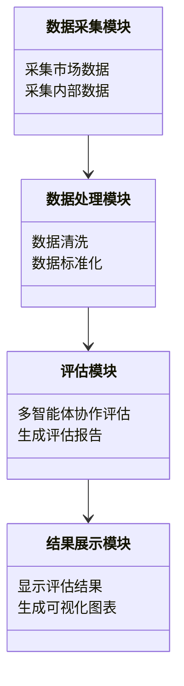

                 


# AI增强的护城河持久性评估：多智能体协作模型

> **关键词**：AI增强、护城河持久性评估、多智能体协作模型、算法原理、系统架构、项目实战

> **摘要**：本文探讨了如何利用人工智能技术，特别是多智能体协作模型，来增强企业护城河的持久性评估。通过详细分析多智能体协作模型的核心原理、算法实现、系统架构以及实际项目案例，本文为读者提供了一种新的思路，以提升企业在竞争环境中的长期优势。

---

# 第一章: 护城河持久性评估的背景与问题

## 1.1 护城河的定义与重要性

### 1.1.1 护城河的定义
护城河是一个企业相对于竞争对手的长期竞争优势。它可以是成本优势、技术壁垒、品牌影响力、网络效应等。

### 1.1.2 护城河的重要性
在竞争激烈的市场中，护城河决定了企业的生存和长期发展能力。一个强大的护城河能够抵御竞争对手的侵蚀，确保企业在市场中的领先地位。

## 1.2 多智能体协作模型的定义

### 1.2.1 多智能体系统的基本原理
多智能体系统由多个智能体组成，每个智能体都有自己的目标和行为，通过协作完成复杂任务。

### 1.2.2 多智能体协作模型的特点
- 分布式：每个智能体独立决策。
- 协作性：通过信息共享和协作完成共同目标。
- 自适应性：能够动态调整策略以应对变化。

## 1.3 护城河评估的传统方法及其局限性

### 1.3.1 传统方法
传统方法主要依赖于财务指标、市场份额等静态数据，难以捕捉动态变化的市场环境。

### 1.3.2 局限性
- 静态分析：无法应对市场的动态变化。
- 单一视角：难以全面评估多个因素的影响。

## 1.4 问题背景与挑战

### 1.4.1 护城河评估的复杂性
市场环境复杂多变，单一方法难以全面评估护城河的持久性。

### 1.4.2 数据量与实时性要求
现代市场要求评估方法能够处理大量数据，并实时更新评估结果。

## 1.5 本书的核心目标

### 1.5.1 提出AI增强的护城河评估模型
通过引入人工智能技术，提升护城河评估的准确性和实时性。

### 1.5.2 构建多智能体协作的评估框架
利用多智能体协作模型，实现对护城河的全面、动态评估。

## 1.6 本章小结

---

# 第二章: 多智能体协作模型的原理与结构

## 2.1 多智能体协作模型的原理

### 2.1.1 协作机制
- 信息共享：智能体之间共享关键信息。
- 分工合作：根据任务特点分工协作。
- 协调决策：通过协商达成一致的决策。

### 2.1.2 信息共享机制
- 信息传递：通过通信模块传递信息。
- 数据融合：整合多个智能体的信息，形成一致的评估结果。

## 2.2 多智能体协作模型的结构

### 2.2.1 智能体的组成与功能
- 感知层：感知环境信息。
- 决策层：基于感知信息做出决策。
- 执行层：执行决策并反馈结果。

### 2.2.2 协作网络的构建
- 网络拓扑结构：定义智能体之间的连接方式。
- 通信协议：规定信息传递的方式和格式。

## 2.3 多智能体协作模型与护城河评估的关系

### 2.3.1 护城河评估的核心要素
- 市场份额
- 技术创新
- 顾客忠诚度
- 成本优势

### 2.3.2 多智能体协作模型如何增强评估能力
- 通过信息共享，全面捕捉市场变化。
- 通过分工合作，提高评估效率和准确性。

## 2.4 核心概念对比分析

### 2.4.1 多智能体协作模型与传统评估模型的对比
| 特性                | 多智能体协作模型          | 传统评估模型          |
|---------------------|--------------------------|-----------------------|
| 数据处理能力        | 高，能够处理海量数据      | 低，依赖静态数据      |
| 实时性              | 高，能够实时更新评估结果  | 低，评估周期较长      |

### 2.4.2 不同协作机制的效果对比
| 协作机制            | 效果描述                  |
|---------------------|--------------------------|
| 分工合作            | 提高效率，降低冲突      |
| 协调决策            | 增强决策的准确性          |
| 信息共享            | 提供全面的市场信息        |

## 2.5 本章小结

---

# 第三章: AI增强的护城河评估模型

## 3.1 模型的设计目标

### 3.1.1 提高评估的准确性和实时性
通过引入AI技术，实时捕捉市场变化，提高评估结果的准确性。

### 3.1.2 增强模型的可扩展性
能够适应不同行业和不同规模企业的护城河评估需求。

## 3.2 模型的构建过程

### 3.2.1 数据采集
- 市场数据：竞争对手的市场份额、价格变动等。
- 公司内部数据：研发能力、成本结构等。

### 3.2.2 数据预处理
- 数据清洗：去除噪声数据。
- 数据标准化：统一数据格式。

## 3.3 算法实现

### 3.3.1 多智能体协作算法
```python
def multi_agent_collaboration(data):
    # 初始化各智能体
    agents = initialize_agents()
    # 信息共享
    shared_info = share_information(agents, data)
    # 协作决策
    decision = collaborate_decision(agents, shared_info)
    return decision
```

### 3.3.2 评估函数
$$
\text{评估值} = \sum_{i=1}^{n} w_i \cdot x_i
$$
其中，\( w_i \) 是权重，\( x_i \) 是各个因素的值。

## 3.4 模型的验证与优化

### 3.4.1 模型验证
- 使用历史数据进行回测，验证模型的准确性。
- 通过对比分析，评估模型的性能。

### 3.4.2 模型优化
- 调整权重参数，优化评估结果。
- 引入机器学习算法，提升模型的自适应能力。

## 3.5 本章小结

---

# 第四章: 系统分析与架构设计

## 4.1 项目背景介绍

### 4.1.1 项目目标
构建一个基于多智能体协作模型的护城河评估系统。

### 4.1.2 项目范围
适用于多个行业的企业护城河评估。

## 4.2 系统功能设计

### 4.2.1 功能模块
- 数据采集模块
- 数据处理模块
- 评估模块
- 结果展示模块

### 4.2.2 领域模型类图


## 4.3 系统架构设计

### 4.3.1 总体架构


### 4.3.2 接口设计
- 数据采集接口：负责接收外部数据。
- 评估接口：负责调用多智能体协作模型进行评估。
- 展示接口：负责将评估结果展示给用户。

## 4.4 本章小结

---

# 第五章: 项目实战

## 5.1 环境搭建

### 5.1.1 安装必要的库
- Python: 3.8+
- NumPy: >=1.20
- Pandas: >=1.3
- Matplotlib: >=3.3

### 5.1.2 安装框架
- Flask: 用于构建Web界面。
- TensorFlow: 用于机器学习模型的训练。

## 5.2 核心代码实现

### 5.2.1 数据处理代码
```python
import pandas as pd

def preprocess_data(data):
    # 数据清洗
    data = data.dropna()
    # 数据标准化
    data = (data - data.mean()) / data.std()
    return data
```

### 5.2.2 多智能体协作算法实现
```python
def multi_agent_collaboration(data):
    agents = initialize_agents()
    shared_info = share_information(agents, data)
    decision = collaborate_decision(agents, shared_info)
    return decision
```

## 5.3 项目案例分析

### 5.3.1 案例背景
假设我们评估一家科技公司的护城河，包括市场份额、技术创新、成本优势等。

### 5.3.2 数据分析
通过多智能体协作模型，分析各个因素对护城河的影响。

## 5.4 项目小结

---

# 第六章: 最佳实践与总结

## 6.1 关键点总结

### 6.1.1 多智能体协作模型的优势
- 高效性：能够快速处理大量数据。
- 准确性：通过协作提高评估结果的准确性。

### 6.1.2 AI技术的重要性
- 提高评估的实时性和准确性。

## 6.2 小结

### 6.2.1 项目总结
通过本项目，我们成功构建了一个基于多智能体协作模型的护城河评估系统。

### 6.2.2 经验总结
- 数据的准确性和完整性是关键。
- 系统架构设计要合理，确保各模块的高效协作。

## 6.3 注意事项

### 6.3.1 数据隐私问题
在处理企业数据时，需要注意数据隐私和安全。

### 6.3.2 系统稳定性
确保系统的稳定运行，避免因故障导致评估结果的偏差。

## 6.4 未来研究方向

### 6.4.1 模型优化
进一步优化多智能体协作模型，提高评估的准确性和效率。

### 6.4.2 应用场景扩展
探索模型在其他领域的应用，如金融、医疗等。

## 6.5 拓展阅读

### 6.5.1 推荐书籍
- 《多智能体系统》
- 《人工智能与机器学习》

### 6.5.2 推荐论文
- 多智能体协作模型在护城河评估中的应用。

## 6.6 本章小结

---

# 结语

通过本篇文章，我们详细探讨了AI增强的护城河持久性评估，特别是多智能体协作模型的应用。从理论到实践，我们展示了如何利用人工智能技术，提升企业的竞争优势。未来，随着技术的不断进步，护城河评估将更加精准和高效。

---

**致谢**：感谢读者的耐心阅读，希望本文对您在护城河评估和多智能体协作模型方面的研究有所帮助。

