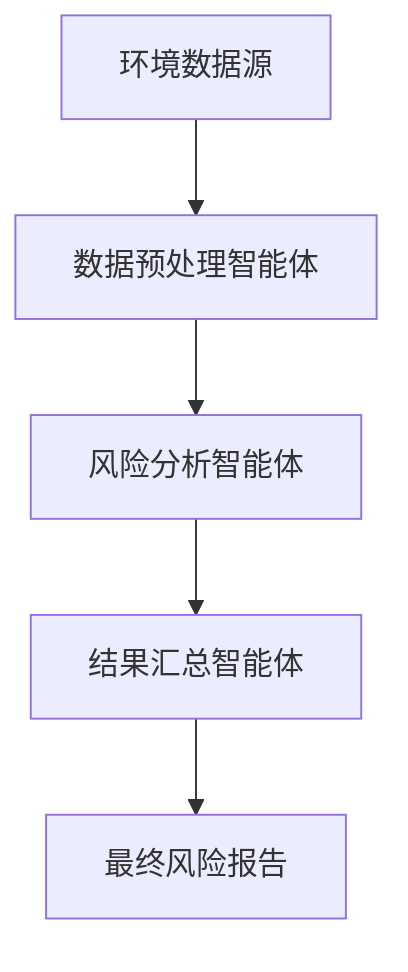
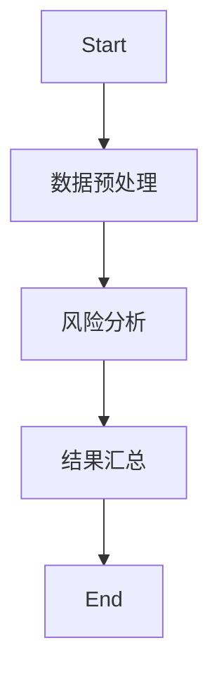
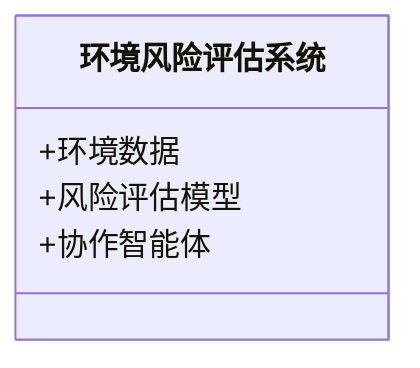
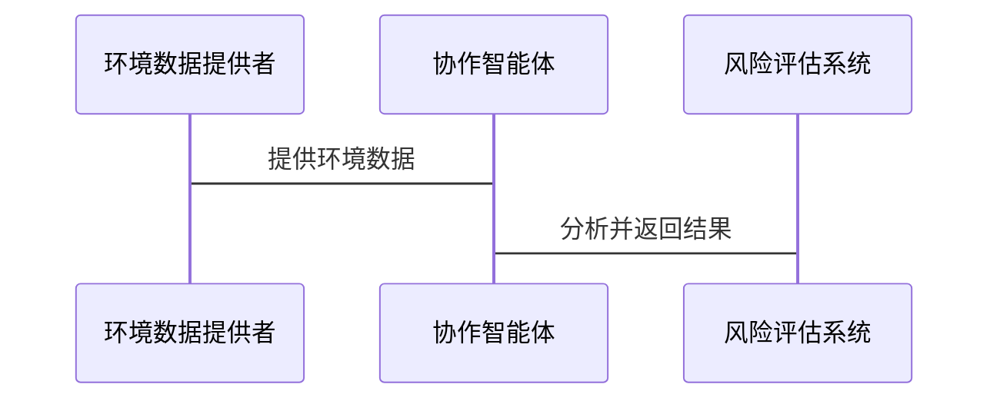

                 


# AI增强的环境风险评估：多智能体协作模型

## 关键词：AI增强，环境风险评估，多智能体协作模型，风险分析，协作算法，系统架构

## 摘要：本文探讨了利用AI技术中的多智能体协作模型来提升环境风险评估的效率和准确性。通过详细分析模型的原理、架构设计及实际应用案例，展示了如何通过协作智能体的分工与协同，实现对环境风险的精准评估与实时监控。

---

# 1. 背景与概述

## 1.1 环境风险评估的背景

### 1.1.1 环境风险评估的定义与重要性

环境风险评估是指对可能影响环境的因素进行识别、分析和预测，以制定有效的风险管理策略。随着工业化进程的加快，环境问题日益严重，传统的环境风险评估方法已难以应对复杂多变的环境问题。

### 1.1.2 当前环境风险评估的挑战

传统环境风险评估方法依赖于人工分析，存在效率低下、覆盖面有限、数据处理能力不足等问题。此外，环境风险通常涉及多个因素，如气候、地理、污染源等，需要综合考虑。

### 1.1.3 AI技术在环境风险评估中的应用潜力

人工智能技术的快速发展为环境风险评估提供了新的工具。AI能够快速处理大量数据，识别潜在风险，并提供实时监控。通过多智能体协作，可以更高效地完成复杂的环境风险评估任务。

---

## 1.2 多智能体协作模型的引入

### 1.2.1 多智能体协作模型的定义

多智能体协作模型是一种分布式人工智能系统，由多个智能体组成，每个智能体负责特定的任务，并通过协同工作完成整体目标。

### 1.2.2 多智能体协作模型在环境风险评估中的优势

与传统方法相比，多智能体协作模型具有以下优势：
- **分工明确**：每个智能体专注于特定任务，提高效率。
- **协同合作**：智能体之间可以共享信息，提供更全面的分析。
- **实时响应**：能够快速响应环境变化，提供实时监控。

### 1.2.3 本章小结

本章介绍了环境风险评估的背景、挑战以及多智能体协作模型的优势，为后续内容奠定了基础。

---

# 2. 核心概念与模型

## 2.1 多智能体协作模型的核心概念

### 2.1.1 多智能体协作模型的定义

多智能体协作模型由多个智能体组成，每个智能体负责特定任务，并通过通信协议协同工作。

### 2.1.2 多智能体协作模型的特点

- **分布性**：任务分布在多个智能体上。
- **协作性**：智能体之间协同完成任务。
- **适应性**：能够根据环境变化调整策略。

### 2.1.3 与其他协作模型的对比

以下表格展示了多智能体协作模型与其他模型的对比：

| 比较维度         | 多智能体协作模型           | 其他协作模型         |
|------------------|----------------------------|----------------------|
| 分布性           | 高                        | 中/低               |
| 协作性           | 高                        | 中                  |
| 适应性           | 高                        | 低                  |

---

## 2.2 环境风险评估中的多智能体协作架构

### 2.2.1 系统整体架构

以下是环境风险评估系统的整体架构图：



### 2.2.2 各智能体的功能与角色

- **数据预处理智能体**：负责收集和清洗环境数据。
- **风险分析智能体**：利用AI算法进行风险评估。
- **结果汇总智能体**：整合分析结果，生成最终报告。

### 2.2.3 实体关系图（ER图）展示

以下是一个简单的ER图：

```mermaid
erd
    环境风险评估系统
    + 环境数据
    + 风险评估模型
    + 协作智能体
```

---

# 3. 算法原理与数学模型

## 3.1 算法概述

### 3.1.1 算法的整体流程

以下是多智能体协作模型的流程图：



### 3.1.2 各步骤的详细说明

- **数据预处理**：收集和清洗环境数据，确保数据质量。
- **风险分析**：利用AI算法进行风险评估，生成初步结果。
- **结果汇总**：整合各智能体的分析结果，生成最终报告。

## 3.2 数学模型与公式

### 3.2.1 概率论基础

概率论是多智能体协作模型的重要基础。例如，贝叶斯定理可以用于计算条件概率：

$$ P(A|B) = \frac{P(B|A)P(A)}{P(B)} $$

### 3.2.2 贝叶斯网络模型

贝叶斯网络是一种有向无环图，用于表示变量之间的依赖关系。例如：

$$ P(E) = \prod_{i=1}^{n} P(E|P_i) $$

### 3.2.3 马尔可夫模型

马尔可夫模型用于描述系统在不同状态之间的转移概率：

$$ P(E) = \prod_{i=1}^{n} P(E|P_i) $$

---

# 4. 系统分析与架构设计

## 4.1 问题场景介绍

### 4.1.1 环境风险评估的典型场景

例如，评估某个工业园区对周边环境的影响。

### 4.1.2 多智能体协作的应用场景

例如，利用多个智能体分别监测空气、水、土壤等不同环境因素。

## 4.2 系统功能设计

### 4.2.1 领域模型类图

以下是领域模型类图：



## 4.3 系统架构设计

以下是系统架构图：


## 4.4 系统接口与交互设计

以下是系统交互图：



---

# 5. 项目实战

## 5.1 环境安装与配置

### 5.1.1 安装依赖

安装Python和相关库，如numpy、pandas、scikit-learn等。

### 5.1.2 配置开发环境

配置Jupyter Notebook或PyCharm作为开发环境。

## 5.2 核心代码实现

### 5.2.1 智能体协作代码

```python
class Agent:
    def __init__(self, name):
        self.name = name
        self.data = None

    def receive_data(self, data):
        self.data = data

    def process_data(self):
        # 具体处理逻辑
        pass
```

### 5.2.2 风险评估模型实现

```python
from sklearn import neighbors
import numpy as np

class RiskAssessmentModel:
    def __init__(self):
        self.model = neighbors.KNeighborsClassifier()

    def train(self, X, y):
        self.model.fit(X, y)

    def predict(self, X):
        return self.model.predict(X)
```

### 5.2.3 系统接口开发

```python
from flask import Flask
import json

app = Flask(__name__)

@app.route('/evaluate', methods=['POST'])
def evaluate():
    data = json.loads(request.get_data())
    # 调用风险评估模型
    result = model.predict(data)
    return json.dumps(result)
```

## 5.3 代码应用与分析

通过上述代码，我们可以实现一个多智能体协作的环境风险评估系统。数据预处理智能体负责收集和清洗数据，风险分析智能体利用机器学习模型进行评估，结果汇总智能体整合结果并生成报告。

---

# 6. 应用案例分析

## 6.1 案例介绍

以工业园区环境风险评估为例，利用多智能体协作模型，分别监测空气、水、土壤等环境因素。

## 6.2 数据分析与结果解读

通过模型分析，识别潜在风险点，并制定相应的风险管理策略。

---

# 7. 最佳实践与未来展望

## 7.1 最佳实践 tips

- 定期更新模型和数据，确保评估结果的准确性。
- 合理分配任务，提高协作效率。

## 7.2 小结

本文详细介绍了AI增强的环境风险评估方法，展示了多智能体协作模型的优势和应用场景。

## 7.3 注意事项

- 数据质量直接影响评估结果，需确保数据的准确性和完整性。
- 模型的选择和参数调优需根据具体场景进行。

## 7.4 拓展阅读

推荐阅读《分布式人工智能系统》和《机器学习在环境科学中的应用》。

---

# 结语

通过本文的介绍，读者可以了解如何利用AI技术中的多智能体协作模型来提升环境风险评估的效率和准确性。未来，随着AI技术的不断发展，环境风险评估将变得更加智能化和精准化。

--- 

感谢您的阅读！希望本文对您有所帮助。

