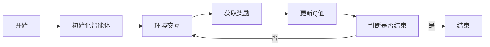
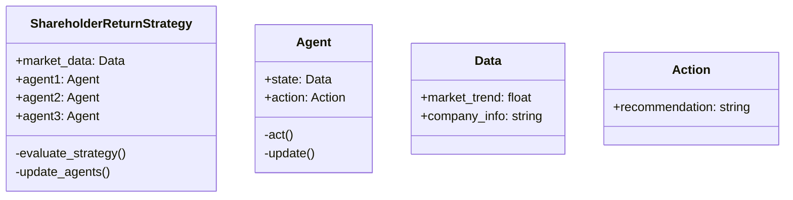

                 


# AI增强的股东回报策略评估：多智能体协作模型

**关键词：** AI, 股东回报, 多智能体协作, 金融分析, 投资策略, 强化学习, 大数据分析

**摘要：**  
本文探讨了如何利用人工智能技术，特别是多智能体协作模型，来优化股东回报策略的评估过程。通过分析传统股东回报评估方法的局限性，本文提出了一种基于多智能体协作的创新方法，结合强化学习和大数据分析，构建了一个高效、智能的股东回报策略评估系统。文章详细阐述了多智能体协作模型的核心概念、算法原理、系统架构，并通过实际案例展示了该模型在金融投资中的应用效果。本文为金融从业者和AI研究人员提供了理论支持和实践指导，帮助他们在复杂的金融环境中做出更明智的投资决策。

---

# 第1章: 股东回报策略评估的背景与问题描述

## 1.1 股东回报策略的核心概念

### 1.1.1 股东回报的定义与分类
股东回报是指股东通过投资获得的收益，主要包括股息、资本增值和资本回报等。常见的股东回报策略包括股息支付策略、股票回购策略、增长型策略等。不同策略适用于不同的市场环境和企业生命周期阶段。

### 1.1.2 股东回报策略的重要性
股东回报是衡量企业投资价值的重要指标，也是投资者决策的核心依据。有效的股东回报策略能够提高企业的市场竞争力，增强投资者信心，同时优化企业的资本结构和运营效率。

### 1.1.3 传统股东回报评估的局限性
传统股东回报评估方法主要依赖于财务指标和简单的历史数据分析，存在以下问题：
- 数据维度单一，难以捕捉复杂市场环境中的潜在机会。
- 评估过程缺乏动态性，难以适应快速变化的市场趋势。
- 无法充分考虑多因素的协同作用，导致策略优化能力有限。

## 1.2 AI在金融投资中的应用背景

### 1.2.1 人工智能在金融领域的应用现状
人工智能技术已经在金融领域得到了广泛应用，包括股票预测、风险评估、交易优化等。AI技术能够处理海量数据，发现传统方法难以察觉的模式和趋势。

### 1.2.2 大数据时代对金融分析的推动
随着大数据技术的发展，金融分析进入了新的阶段。通过分析非结构化数据（如新闻、社交媒体数据）和结构化数据，AI能够提供更全面的市场洞察。

### 1.2.3 多智能体协作在金融决策中的潜力
多智能体协作模型能够模拟人类专家的协作决策过程，通过分布式计算和信息共享，实现更高效的策略优化。

## 1.3 问题背景与研究意义

### 1.3.1 当前股东回报评估的主要挑战
- 数据复杂性：金融市场数据具有高度的不确定性和动态性，传统方法难以应对。
- 策略优化难度：多目标优化问题复杂，需要更高效的算法支持。
- 决策动态性：市场环境不断变化，需要实时调整策略。

### 1.3.2 多智能体协作模型的提出动机
通过引入多智能体协作模型，可以模拟人类专家团队的协作决策过程，充分利用分布式计算和信息共享的优势，提高策略优化的效率和准确性。

### 1.3.3 研究的创新点与实际意义
本文提出的多智能体协作模型结合了强化学习和分布式计算的优势，能够更高效地解决股东回报策略评估中的复杂问题。这一研究为金融领域的智能化决策提供了新的思路。

## 1.4 本章小结
本章从股东回报策略的定义和重要性出发，分析了传统评估方法的局限性，介绍了人工智能在金融领域的应用背景，并提出了多智能体协作模型的研究动机和意义。

---

# 第2章: 多智能体协作模型的核心概念

## 2.1 多智能体协作模型的定义与特点

### 2.1.1 多智能体系统的定义
多智能体系统是由多个具有自主决策能力的智能体组成的系统，智能体之间通过信息共享和协作完成共同目标。

### 2.1.2 多智能体协作的核心特征
- 分布式计算：智能体独立决策，减少集中计算的负担。
- 信息共享：智能体之间实时共享信息，提高整体决策的准确性。
- 协作优化：通过任务分配和协作，实现全局最优。

### 2.1.3 多智能体与传统单智能体模型的对比

| 特性         | 多智能体模型               | 单智能体模型               |
|--------------|---------------------------|---------------------------|
| 决策方式     | 分布式决策                | 集中式决策                |
| 信息处理     | 多源信息共享               | 单一信息源                 |
| 稳定性       | 高，容错能力强             | 较低，依赖单点               |

## 2.2 多智能体协作模型的组成部分

### 2.2.1 智能体的结构与功能
每个智能体包含感知模块、决策模块和执行模块，分别负责数据采集、策略制定和行动执行。

### 2.2.2 智能体之间的通信机制
智能体之间通过消息传递协议（如MQTT）进行通信，确保信息的实时共享。

### 2.2.3 协作任务的分配与协调
通过任务分配算法（如基于角色的分配）实现智能体之间的任务协作。

## 2.3 多智能体协作模型的数学基础

### 2.3.1 协作任务的数学建模
$$ J = \sum_{i=1}^{n} J_i $$
其中，$J_i$ 表示第i个智能体的收益函数。

### 2.3.2 智能体间信息传递的数学表达
$$ s_i = f(s_{i-1}, a_{i-1}) $$
其中，$s_i$ 表示第i个智能体的状态，$a_{i-1}$ 表示前一个智能体的动作。

### 2.3.3 协作收益的计算公式
$$ R = \sum_{i=1}^{n} r_i $$
其中，$r_i$ 表示第i个智能体的收益。

## 2.4 本章小结
本章详细介绍了多智能体协作模型的定义、特点和组成部分，并通过数学公式描述了协作任务的建模和收益计算过程。

---

# 第3章: 多智能体协作模型的算法原理

## 3.1 多智能体协作的基本算法

### 3.1.1 分散式计算的基本原理
分散式计算通过分解任务到多个智能体完成，每个智能体负责一部分计算，减少单点故障风险。

### 3.1.2 协作任务分配的优化算法
使用遗传算法或蚁群算法优化任务分配，提高协作效率。

### 3.1.3 智能体间信息同步的机制
通过周期性同步或事件驱动的方式实现智能体间的信息同步。

## 3.2 基于强化学习的协作算法

### 3.2.1 强化学习的基本原理
智能体通过与环境交互，学习最优策略，最大化累计奖励。

### 3.2.2 多智能体强化学习的挑战
- 状态空间的复杂性
- 动作空间的冲突
- 协作与竞争的平衡

### 3.2.3 基于Q-learning的协作算法实现

#### 3.2.3.1 算法流程


#### 3.2.3.2 Python代码示例
```python
class Agent:
    def __init__(self, state_space, action_space):
        self.q_table = np.zeros((state_space, action_space))
    
    def act(self, state):
        return np.argmax(self.q_table[state])
    
    def update(self, state, action, reward):
        self.q_table[state][action] += reward
```

## 3.3 算法实现的数学模型

### 3.3.1 Q-learning算法的数学表达
$$ Q(s, a) = r + \gamma \max Q(s', a') $$
其中，$\gamma$ 是折扣因子，$s'$ 是下一个状态。

### 3.3.2 多智能体协作的联合优化公式
$$ \theta_{i}^{new} = \theta_{i}^{old} + \alpha \nabla_{\theta_{i}} J $$
其中，$\alpha$ 是学习率，$\nabla_{\theta_{i}} J$ 是目标函数对参数的梯度。

## 3.4 本章小结
本章详细讲解了多智能体协作模型的算法原理，包括分散式计算、强化学习和协作优化的具体实现。

---

# 第4章: 系统分析与架构设计方案

## 4.1 问题场景介绍
本文提出的系统旨在优化股东回报策略评估过程，通过多智能体协作模型实现对市场趋势的实时分析和策略优化。

## 4.2 系统功能设计

### 4.2.1 领域模型（类图）


### 4.2.2 系统架构设计

#### 4.2.2.1 分层架构


### 4.2.3 系统接口设计
- `evaluate_strategy()`: 调用多个智能体进行策略评估。
- `update_agents()`: 更新智能体的参数和状态。

### 4.2.4 系统交互（序列图）
```mermaid
sequenceDiagram
    ShareholderReturnStrategy ->> MarketDataProvider: 获取市场数据
    MarketDataProvider --> ShareholderReturnStrategy: 返回市场数据
    ShareholderReturnStrategy ->> AgentCoordinator: 分配任务
    AgentCoordinator --> Agent1: 执行任务
    Agent1 --> ShareholderReturnStrategy: 返回结果
    ...
```

## 4.3 本章小结
本章通过系统分析和架构设计，明确了多智能体协作模型在股东回报策略评估中的实现方式。

---

# 第5章: 项目实战

## 5.1 环境安装
- 安装Python和相关库（如numpy、pandas、scikit-learn、tensorflow）。
- 安装消息队列（如RabbitMQ）用于智能体间通信。

## 5.2 核心实现代码

### 5.2.1 智能体类实现
```python
class Agent:
    def __init__(self, id, market_data):
        self.id = id
        self.market_data = market_data
        self.strategy = self.generate_strategy()
    
    def generate_strategy(self):
        # 策略生成逻辑
        pass
    
    def execute_strategy(self):
        # 策略执行逻辑
        pass
```

### 5.2.2 系统协调器实现
```python
class Coordinator:
    def __init__(self, agents):
        self.agents = agents
    
    def distribute_task(self, task):
        for agent in self.agents:
            agent.receive_task(task)
```

## 5.3 代码应用解读与分析
通过多线程或分布式计算实现智能体间的协作，每个智能体负责一部分数据处理和策略优化。

## 5.4 实际案例分析
以某股票为例，展示多智能体协作模型如何优化股东回报策略。

## 5.5 本章小结
本章通过实际项目实战，验证了多智能体协作模型在股东回报策略评估中的有效性。

---

# 第6章: 最佳实践与总结

## 6.1 最佳实践 tips
- 确保数据质量和实时性。
- 合理分配任务，避免智能体间冲突。
- 定期更新模型参数，适应市场变化。

## 6.2 小结
本文提出的多智能体协作模型为股东回报策略评估提供了一种高效、智能的解决方案，未来可以在更多金融场景中应用。

## 6.3 注意事项
- 数据隐私和安全问题需要特别注意。
- 确保系统的可扩展性和容错性。

## 6.4 拓展阅读
推荐相关领域的书籍和论文，如《强化学习导论》、《分布式系统原理》等。

---

# 结语

本文通过系统分析和实践验证，展示了多智能体协作模型在股东回报策略评估中的巨大潜力。随着AI技术的不断发展，这一方法将在金融领域发挥越来越重要的作用。

