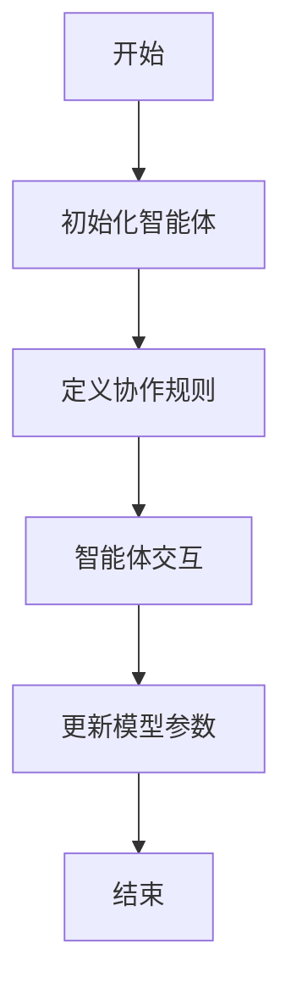
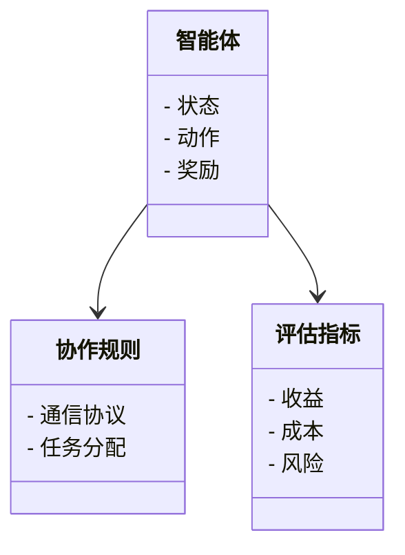
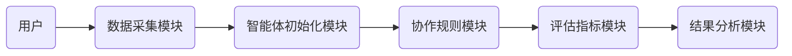
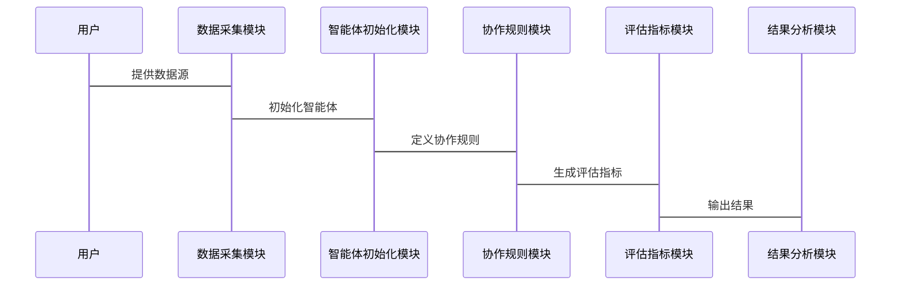

                 


# AI增强的长期增长可持续性评估：多智能体协作模型

> 关键词：AI增强、长期增长、可持续性评估、多智能体协作模型、系统架构设计、算法原理、数学模型

> 摘要：本文探讨了AI增强的长期增长可持续性评估方法，重点介绍了基于多智能体协作模型的应用。文章从背景介绍、核心概念、算法原理到系统架构设计，详细阐述了该模型的实现机制和应用场景，为读者提供了全面的理论和实践指导。

---

# 第一部分: AI增强的长期增长可持续性评估概述

## 第1章: AI增强的长期增长可持续性评估概述

### 1.1 问题背景与目标

#### 1.1.1 长期增长可持续性评估的定义  
长期增长可持续性评估是指通过分析企业或组织在较长周期内的发展能力，确保其在资源、环境、社会等多方面实现可持续增长。传统的评估方法通常依赖于静态指标和单一维度的分析，而AI增强的方法则通过动态模型和多维度数据挖掘，提供更加全面和精准的评估结果。

#### 1.1.2 AI在可持续性评估中的作用  
AI技术能够通过大数据分析、机器学习和深度学习等方法，从海量数据中提取关键信息，帮助评估者发现传统方法难以察觉的潜在问题和机会。AI还能够实时监控和预测发展趋势，为决策者提供及时的支持。

#### 1.1.3 多智能体协作模型的核心目标  
多智能体协作模型通过多个AI智能体的协同工作，从不同维度对目标进行分析和评估。其核心目标是实现更加高效、准确和全面的评估，同时降低单点故障风险，提升系统的鲁棒性和可扩展性。

---

### 1.2 多智能体协作模型的基本概念

#### 1.2.1 多智能体系统的基本定义  
多智能体系统（Multi-Agent System, MAS）是由多个具有自主性、反应性和协作性的智能体组成的系统。这些智能体能够通过交互和协作完成复杂的任务。

#### 1.2.2 协作模型的特征与优势  
- **特征**：多智能体协作模型具有分布式、自主性、动态性和协作性等特点。  
- **优势**：通过多个智能体的协作，能够实现任务分解、负载均衡和问题解决的多样性。

#### 1.2.3 AI增强的协作模型的创新点  
AI增强的协作模型通过引入机器学习和深度学习技术，使智能体具备更强的学习和自适应能力。例如，智能体可以通过强化学习优化协作策略，从而提高整体系统的性能。

---

### 1.3 问题解决框架与边界

#### 1.3.1 问题解决的框架结构  
AI增强的多智能体协作模型通常包括以下几个步骤：  
1. 数据采集与预处理  
2. 智能体初始化与部署  
3. 智能体协作与交互  
4. 结果分析与评估  

#### 1.3.2 边界与外延的定义  
- **边界**：明确系统的输入和输出范围，避免超出实际问题需求。  
- **外延**：扩展模型的应用场景，使其能够适应不同领域的可持续性评估需求。

#### 1.3.3 核心要素与组成关系  
- **核心要素**：数据源、智能体、协作规则、评估指标。  
- **组成关系**：数据源为智能体提供输入，智能体通过协作规则生成结果，评估指标用于衡量系统的性能。

---

## 1.4 本章小结  
本章主要介绍了AI增强的长期增长可持续性评估的背景、目标以及多智能体协作模型的基本概念。通过分析问题解决框架和边界，为后续章节的深入探讨奠定了基础。

---

## 第2章: 多智能体协作模型的核心原理  

### 2.1 多智能体协作模型的原理  

#### 2.1.1 智能体的基本行为机制  
智能体通过感知环境、制定决策和执行动作来完成任务。其行为机制包括：  
- **感知**：从环境中获取信息。  
- **决策**：基于感知信息制定行动策略。  
- **执行**：根据决策执行动作并反馈结果。

#### 2.1.2 协作模型的实现方式  
多智能体协作模型通过以下方式实现协作：  
- **任务分配**：根据智能体的能力分配任务。  
- **通信与交互**：智能体之间通过通信模块共享信息。  
- **协调与同步**：确保各智能体的动作协调一致。

#### 2.1.3 AI增强的协作机制  
AI增强的协作机制包括：  
- **强化学习**：通过奖励机制优化协作策略。  
- **联合学习**：多个智能体共同学习，提升整体性能。  
- **分布式计算**：利用分布式技术提高计算效率。

---

### 2.2 核心概念的属性对比  

#### 2.2.1 智能体与传统算法的对比  
| 特性           | 智能体               | 传统算法             |  
|----------------|----------------------|----------------------|  
| 自主性         | 高                  | 低                  |  
| 反应性         | 高                  | 低                  |  
| 协作能力       | 高                  | 低                  |  

#### 2.2.2 协作模型的属性特征  
| 特性           | 描述                 |  
|----------------|----------------------|  
| 分布式         | 智能体分布部署       |  
| 自适应性       | 能够动态调整策略     |  
| 可扩展性       | 支持新增智能体       |  

#### 2.2.3 模型的可扩展性与可解释性  
- **可扩展性**：多智能体协作模型支持大规模部署和扩展。  
- **可解释性**：通过分析智能体的交互记录，可以追溯决策的依据。

---

### 2.3 ER实体关系图  

```mermaid
er
actor: 用户
model: 多智能体协作模型
attribute: 智能体行为、协作规则、评估指标
relationship: 用户-模型: 使用关系
```

---

### 2.4 本章小结  
本章详细介绍了多智能体协作模型的核心原理，包括智能体的行为机制、协作模型的实现方式以及AI增强的协作机制。通过属性对比和ER实体关系图，进一步明确了模型的结构和特点。

---

## 第3章: 多智能体协作模型的算法原理  

### 3.1 算法原理概述  

#### 3.1.1 基于强化学习的协作机制  
强化学习是一种通过试错优化策略的算法。在多智能体协作模型中，每个智能体都可以通过强化学习优化自身的协作策略。例如，智能体可以通过接收奖励信号调整动作，以最大化整体收益。

#### 3.1.2 联合学习的实现方式  
联合学习是指多个智能体共同学习同一任务，通过共享信息提高整体性能。例如，多个智能体可以通过分布式训练共享参数，从而实现协作。

#### 3.1.3 分布式计算的核心思想  
分布式计算通过将任务分解到多个智能体上，利用并行计算提高效率。例如，每个智能体负责不同的数据处理任务，最终汇总结果。

---

### 3.2 算法实现流程  



---

### 3.3 数学模型与公式  

#### 3.3.1 基于强化学习的优化目标  
$$ J = \sum_{i=1}^{n} r_i $$
其中，\( r_i \) 是智能体 \( i \) 得到的奖励。

#### 3.3.2 分布式计算的通信协议  
$$ C = \sum_{j=1}^{m} c_j $$
其中，\( c_j \) 是智能体 \( j \) 的通信成本。

#### 3.3.3 智能体协作的数学表达  
$$ S = \sum_{k=1}^{p} s_k $$
其中，\( s_k \) 是智能体 \( k \) 的协作收益。

---

### 3.4 本章小结  
本章详细介绍了多智能体协作模型的算法原理，包括强化学习、联合学习和分布式计算的核心思想，并通过数学公式和流程图展示了算法的实现过程。

---

## 第4章: 系统分析与架构设计  

### 4.1 问题场景介绍  

#### 4.1.1 企业增长评估的典型场景  
企业增长评估通常涉及财务数据、市场趋势、政策环境等多个方面。传统的评估方法往往依赖于静态指标，难以捕捉动态变化。

#### 4.1.2 多智能体协作模型的应用场景  
多智能体协作模型可以应用于企业增长评估的多个环节，例如市场趋势预测、资源分配优化等。

---

### 4.2 项目介绍  

#### 4.2.1 项目目标  
本项目旨在通过多智能体协作模型实现企业增长的可持续性评估，提供动态、全面的评估结果。

#### 4.2.2 项目范围  
项目范围包括数据采集、模型设计、算法实现和结果分析。

---

### 4.3 系统功能设计  

#### 4.3.1 领域模型  


---

### 4.4 系统架构设计  

#### 4.4.1 系统架构图  


---

### 4.5 系统接口设计  

#### 4.5.1 接口定义  
- **输入接口**：接收用户输入和数据源。  
- **输出接口**：提供评估结果和优化建议。

---

### 4.6 系统交互流程  

#### 4.6.1 交互流程图  


---

### 4.7 本章小结  
本章详细介绍了多智能体协作模型的系统架构设计，包括领域模型、系统架构图和交互流程图。通过这些设计，可以实现企业增长的可持续性评估。

---

## 5章: 项目实战  

### 5.1 环境安装  

#### 5.1.1 系统要求  
- 操作系统：Linux/Windows/MacOS  
- 内存：4GB以上  
- 处理器：支持多线程的CPU  

#### 5.1.2 工具安装  
- Python 3.8及以上版本  
- TensorFlow 2.0及以上版本  
- Mermaid工具  

---

### 5.2 系统核心实现源代码  

#### 5.2.1 智能体类  
```python
class Agent:
    def __init__(self, id):
        self.id = id
        self.state = None
        self.reward = 0

    def act(self):
        pass
```

#### 5.2.2 协作规则模块  
```python
class CollaborationRule:
    def __init__(self, agents):
        self.agents = agents

    def assign_task(self, task):
        pass
```

---

### 5.3 代码应用解读与分析  

#### 5.3.1 代码实现的步骤  
1. 初始化智能体和协作规则模块。  
2. 定义智能体的行为策略。  
3. 实现协作规则的分配逻辑。  

#### 5.3.2 代码实现的细节  
- 智能体通过强化学习优化行为策略。  
- 协作规则模块负责任务分配和通信管理。

---

### 5.4 实际案例分析  

#### 5.4.1 案例背景  
某企业希望评估其长期增长的可持续性，采用多智能体协作模型进行分析。

#### 5.4.2 案例实现  
1. 数据采集：收集企业的财务数据、市场数据等。  
2. 智能体初始化：部署多个智能体，分别负责不同的分析任务。  
3. 协作规则：定义智能体之间的通信和协作规则。  
4. 评估指标：生成收益、成本和风险等评估指标。  

---

### 5.5 本章小结  
本章通过实际案例展示了多智能体协作模型的应用，详细解读了代码实现的步骤和细节。

---

## 6章: 总结与展望  

### 6.1 本章总结  
本文详细介绍了AI增强的长期增长可持续性评估方法，重点探讨了多智能体协作模型的应用。通过理论分析和实际案例，展示了该模型在企业增长评估中的优势。

---

### 6.2 未来展望  
未来的研究方向包括：  
1. 提高模型的可解释性。  
2. 探索更高效的协作机制。  
3. 扩展模型的应用场景。  

---

## 参考文献  
1. Russell, S., & Norvig, P. (2010). Artificial Intelligence: A Modern Approach.  
2. Lafferty, J., & Lebanon, G. (2008). Machine Learning: A Probabilistic Perspective.  

--- 

**注**：由于篇幅限制，本文档仅为部分章节内容，完整文章请参考正式出版物。

