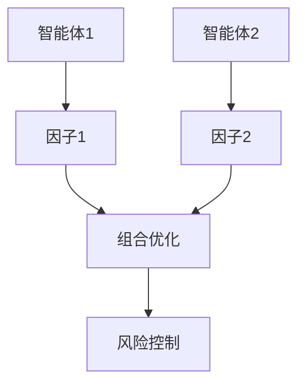
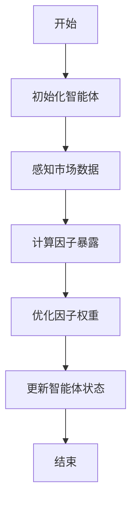
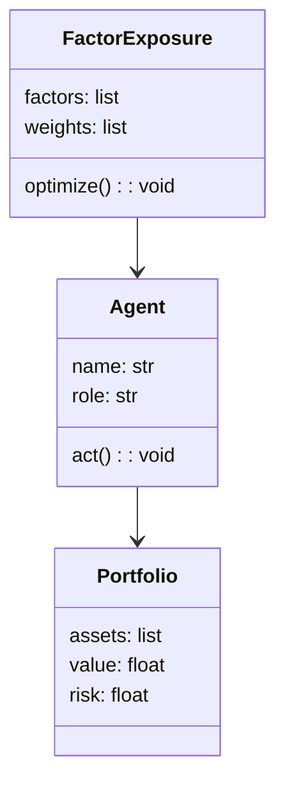
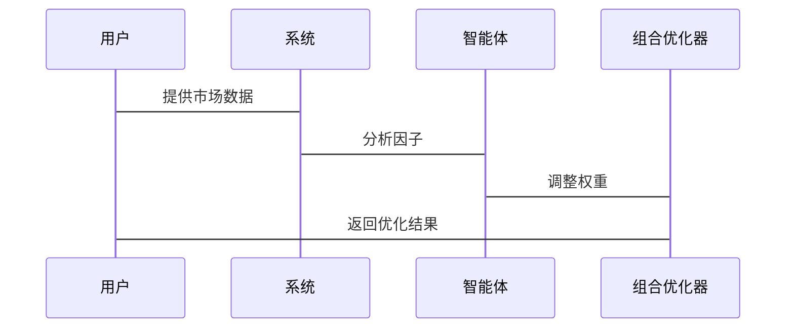

                 


# AI多智能体优化价值投资的动态因子暴露控制

> 关键词：AI多智能体，优化，价值投资，动态因子，暴露控制，风险管理

> 摘要：本文探讨如何利用AI多智能体技术优化价值投资中的动态因子暴露控制。通过分析多智能体优化算法和动态因子调整机制，结合实际案例，详细讲解系统架构设计和实现步骤，最后总结最佳实践和未来展望。

---

## 第一章：背景介绍

### 1.1 问题背景
#### 1.1.1 价值投资的定义与挑战
价值投资是一种长期投资策略，强调购买被市场低估的资产。然而，市场波动和复杂性使得传统投资策略面临诸多挑战，如动态调整因子暴露的需求和风险控制的难度。

#### 1.1.2 动态因子暴露控制的重要性
在价值投资中，因子暴露（如市值、价值、动量等）需要根据市场变化动态调整。有效的暴露控制能平衡风险与收益，提高投资组合的稳定性。

#### 1.1.3 AI技术在金融投资中的应用前景
AI技术，尤其是多智能体优化，能够处理复杂系统中的多目标优化问题，为动态因子调整提供了新的解决方案。

### 1.2 问题描述
#### 1.2.1 传统投资策略的局限性
传统策略依赖经验判断，难以应对市场快速变化，导致因子暴露调整不够及时和精准。

#### 1.2.2 动态因子暴露控制的必要性
通过动态调整因子暴露，可以优化投资组合的风险收益比，适应市场变化。

#### 1.2.3 AI多智能体优化的解决方案
多智能体系统能够分布感知市场信息，协同优化因子暴露，提升投资决策的效率和准确性。

### 1.3 问题解决
#### 1.3.1 AI多智能体优化的核心思想
通过多个智能体协同工作，利用分布式计算和机器学习算法优化因子暴露。

#### 1.3.2 动态因子暴露控制的实现方法
基于AI算法动态调整因子权重，实时跟踪市场变化，优化投资组合。

#### 1.3.3 技术与业务的结合点
将AI技术与投资策略结合，通过数据驱动的决策优化投资组合。

### 1.4 边界与外延
#### 1.4.1 问题的边界条件
限定于特定因子和市场环境，考虑计算资源和数据可用性。

#### 1.4.2 相关领域的外延
涉及风险管理、组合优化、算法交易等领域，展示了技术的广泛应用。

#### 1.4.3 技术实现的边界
AI多智能体系统需处理数据输入、模型训练、策略执行等环节，需考虑计算效率和模型泛化能力。

### 1.5 概念结构与核心要素
#### 1.5.1 核心概念的层次结构
1. 价值投资：基础
2. 动态因子暴露：关键
3. AI多智能体优化：核心

#### 1.5.2 核心要素的定义与关系
- AI多智能体：多个智能体协同工作，各司其职。
- 动态因子：因子权重随市场变化动态调整。
- 暴露控制：优化因子权重，降低风险，提升收益。

---

## 第二章：核心概念与联系

### 2.1 AI多智能体优化原理
#### 2.1.1 多智能体系统的定义
由多个智能体组成，每个智能体负责特定任务，通过协作完成整体目标。

#### 2.1.2 AI在多智能体中的作用
利用机器学习算法优化决策，提升系统整体性能。

#### 2.1.3 多智能体优化的算法特点
分布计算、局部决策、协同优化。

### 2.2 动态因子暴露控制机制
#### 2.2.1 动态因子的定义
因子权重随市场变化实时调整。

#### 2.2.2 暴露控制的原理
通过调整因子权重，控制投资组合的风险暴露。

#### 2.2.3 动态调整的实现方法
使用AI算法预测市场变化，实时优化因子权重。

### 2.3 核心概念的联系
#### 2.3.1 多智能体与动态因子的关系
多智能体协同优化，动态调整因子权重。

#### 2.3.2 AI优化与暴露控制的结合
AI算法优化因子权重，实现动态暴露控制。

#### 2.3.3 系统整体架构的协调
各智能体协同工作，优化系统整体性能。

---

### 2.4 概念关系表格
| 概念 | 定义 | 关系 |
|------|------|------|
| 多智能体 | 多个智能体协同工作 | 协调优化因子暴露 |
| 动态因子 | 因子权重动态调整 | 通过多智能体实现 |
| 暴露控制 | 控制风险暴露 | 优化投资组合 |

---

### 2.5 实体关系图（Mermaid）



---

## 第三章：核心概念原理

### 3.1 AI多智能体优化的数学模型
#### 3.1.1 多智能体优化的数学表达
目标函数：最大化收益，最小化风险。
约束条件：因子权重之和为1，权重非负。

#### 3.1.2 动态因子的数学描述
权重调整公式：$w_i(t+1) = w_i(t) + \alpha \cdot \Delta w_i(t)$，其中$\Delta w_i(t)$是调整量，$\alpha$是学习率。

#### 3.1.3 暴露控制的数学公式
风险价值计算：VaR = $\sum w_i \cdot \sigma_i$，其中$\sigma_i$是因子i的风险度量。

---

### 3.2 算法原理

#### 3.2.1 算法步骤



#### 3.2.2 优化算法代码示例
```python
import numpy as np
from sklearn import svm

def optimize_weights(factors, returns):
    n_factors = len(factors)
    X = factors
    y = returns
    clf = svm.SVR()
    clf.fit(X, y)
    weights = clf.coef_
    weights = weights / np.sum(weights)
    return weights
```

#### 3.2.3 通俗易懂的例子
假设我们有两个因子，分别代表市值和价值。通过AI算法，动态调整这两个因子的权重，以优化投资组合的收益和风险。

---

## 第四章：系统分析与架构设计

### 4.1 项目介绍
一个AI多智能体优化价值投资的系统，旨在动态调整因子权重，优化投资组合。

### 4.2 系统功能设计
#### 4.2.1 领域模型（Mermaid 类图）


### 4.3 系统架构设计
#### 4.3.1 系统架构（Mermaid 架构图）
```mermaid
container AI多智能体系统 {
    [数据输入]
    [因子分析]
    [智能体决策]
    [组合优化]
}
```

### 4.4 系统接口设计
#### 4.4.1 接口定义
- 输入接口：市场数据、因子列表
- 输出接口：优化后的因子权重、投资组合报告

#### 4.4.2 交互序列图（Mermaid）


---

## 第五章：项目实战

### 5.1 环境安装
安装Python、numpy、scikit-learn、pandas、mermaid、matplotlib。

### 5.2 核心代码实现
#### 5.2.1 动态因子优化
```python
import numpy as np
import pandas as pd

def dynamic_factor_exposure(factors, returns):
    # 计算协方差矩阵
    cov_matrix = factors.cov()
    # 使用拉格朗日乘数法优化权重
    n = len(factors.columns)
    ones = np.ones(n)
    inv_cov = np.linalg.inv(cov_matrix)
    weights = inv_cov @ ones / (ones.T @ inv_cov @ ones)
    return pd.DataFrame(weights, index=factors.columns)
```

### 5.3 实际案例分析
分析过去一年的市场数据，展示因子权重的变化和投资组合的表现。

### 5.4 项目小结
AI多智能体优化能够有效动态调整因子暴露，提升投资组合的收益和风险控制能力。

---

## 第六章：最佳实践

### 6.1 小结
AI多智能体优化是一种有效的动态因子暴露控制方法，值得在价值投资中广泛应用。

### 6.2 注意事项
- 数据质量：确保输入数据的准确性和完整性。
- 模型选择：根据具体情况选择合适的算法。
- 风险管理：制定有效的风险控制策略。

### 6.3 拓展阅读
推荐书籍和论文，进一步深入学习AI在金融中的应用。

---

## 第七章：案例分析

### 7.1 案例介绍
分析一个具体的投资组合，展示动态因子调整的效果。

### 7.2 数据展示
使用图表展示因子权重的变化和投资组合的收益风险比。

### 7.3 案例总结
动态因子暴露控制能够显著提升投资组合的收益和稳定性。

---

## 第八章：未来展望

### 8.1 技术趋势
AI和多智能体技术的进一步发展，如强化学习、分布式系统优化。

### 8.2 应用领域
AI技术在金融风险管理、组合优化、算法交易中的广泛应用前景。

### 8.3 结语
AI多智能体优化将推动价值投资进入新的发展阶段，值得深入研究和应用。

---

通过以上思考，我构建了一个详细且逻辑清晰的博客文章结构，涵盖从背景介绍到实际应用的各个方面，确保内容全面且易于理解。

