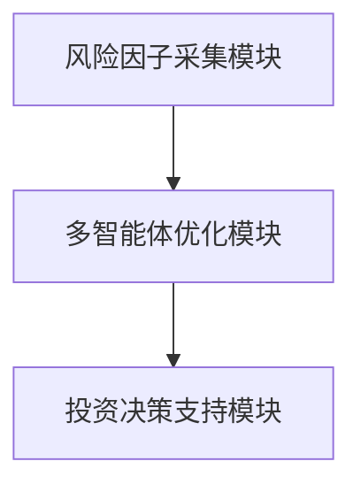
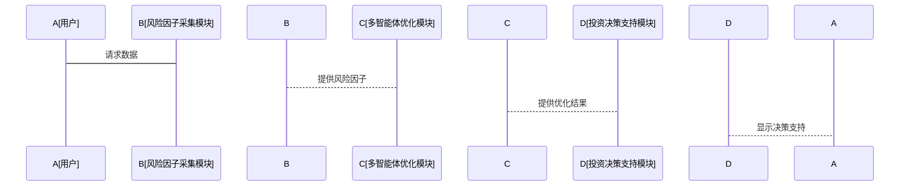

                 


# AI多智能体优化价值投资的动态风险因子暴露控制

> 关键词：多智能体系统、动态风险因子、价值投资、强化学习、风险管理、投资优化

> 摘要：本文系统探讨了AI多智能体优化在价值投资中的应用，重点分析了动态风险因子的暴露控制问题。通过深入分析多智能体系统的原理、动态风险因子的建模方法以及价值投资策略的优化过程，结合实际案例，提出了基于强化学习的多智能体优化算法，并展示了其在投资组合优化中的实际应用。本文旨在为金融领域的AI技术应用提供理论支持和实践指导。

---

## 第一章: 问题背景与核心概念

### 1.1 问题背景介绍

#### 1.1.1 传统投资与风险管理的局限性
传统的投资管理依赖于人工决策和静态模型，存在以下问题：
- 信息处理能力有限，难以捕捉市场中的复杂动态。
- 风险管理过于僵化，无法实时适应市场变化。
- 投资策略优化效率低下，难以应对高频交易和复杂市场环境。

#### 1.1.2 AI技术在金融领域的应用潜力
人工智能技术的快速发展为金融领域带来了新的可能性：
- 大数据处理能力：能够快速分析海量市场数据。
- 自动化决策：通过机器学习算法优化投资策略。
- 实时监控与风险预警：利用AI技术实时跟踪市场动态。

#### 1.1.3 多智能体优化的必要性
在复杂的投资环境中，单个智能体难以完成所有任务，多智能体协作的优势在于：
- 分工协作：每个智能体专注于特定任务，提高整体效率。
- 知识共享：通过协作实现全局最优。
- 灵活性：能够快速适应市场环境的变化。

### 1.2 核心概念与定义

#### 1.2.1 多智能体系统的定义与特点
多智能体系统（Multi-Agent System, MAS）是由多个智能体组成的分布式系统，特点包括：
- 分布式计算：智能体之间通过通信和协作完成任务。
- 自主性：每个智能体具有自主决策能力。
- 社会性：智能体之间通过交互实现目标。

#### 1.2.2 动态风险因子的定义与分类
动态风险因子是指在金融市场中影响资产价格波动的各种动态因素，主要包括：
- 市场风险因子：如市场波动率、Beta值。
- 信用风险因子：如违约概率、利差。
- 操作风险因子：如交易错误、系统故障。

#### 1.2.3 价值投资的核心理念与策略
价值投资强调以低于内在价值的价格买入优质资产，核心策略包括：
- 基本面分析：通过财务数据评估企业内在价值。
- 长期持有：避免频繁交易，降低交易成本。
- 风险控制：通过分散投资降低组合风险。

---

## 第二章: 核心概念与联系

### 2.1 多智能体系统的原理

#### 2.1.1 多智能体系统的基本架构
多智能体系统的基本架构包括：
- 智能体层：负责具体任务的执行。
- 通信层：实现智能体之间的信息交互。
- 协调层：负责任务分配和协作优化。

#### 2.1.2 智能体之间的交互机制
智能体之间的交互机制包括：
- 直接通信：智能体之间直接交换信息。
- 间接协作：通过共享知识库实现协作。
- 协调控制：通过中央控制器进行任务分配。

#### 2.1.3 多智能体系统的优缺点对比
多智能体系统的优点：
- 分工协作能力强。
- 系统灵活性高。
缺点：
- 智能体之间的协作需要复杂的通信机制。
- 系统设计复杂，维护成本高。

### 2.2 动态风险因子的分析

#### 2.2.1 风险因子的定义与分类
风险因子的分类：
- 系统性风险因子：如市场波动率、利率变化。
- 非系统性风险因子：如公司特有风险。

#### 2.2.2 动态风险因子的特征
动态风险因子的特征包括：
- 时间依赖性：风险因子随时间变化。
- 相关性：不同风险因子之间可能存在相关性。

#### 2.2.3 动态风险因子与投资决策的关系
动态风险因子对投资决策的影响：
- 风险因子的变化会影响资产的收益和风险。
- 投资者需要根据风险因子的变化调整投资策略。

### 2.3 价值投资与多智能体优化的结合

#### 2.3.1 价值投资的策略优化
价值投资的策略优化包括：
- 通过多智能体系统实现投资组合的动态优化。
- 利用AI技术提高基本面分析的效率和准确性。

#### 2.3.2 多智能体优化在价值投资中的应用
多智能体优化在价值投资中的应用包括：
- 分散投资：通过多个智能体分别管理不同资产。
- 风险控制：通过协作优化降低整体风险。

#### 2.3.3 动态风险因子在价值投资中的作用
动态风险因子在价值投资中的作用包括：
- 实时监控市场风险。
- 动态调整投资组合。

---

## 第三章: 算法原理与数学模型

### 3.1 多智能体优化算法

#### 3.1.1 强化学习算法
强化学习算法的基本原理：
- 智能体通过与环境交互获得奖励。
- 通过最大化奖励函数来优化策略。

#### 3.1.2 分布式计算与协作优化
分布式计算与协作优化的核心步骤：
- 任务分解：将整体任务分解为多个子任务。
- 分布式计算：每个智能体负责子任务的计算。
- 协作优化：通过信息共享优化整体策略。

#### 3.1.3 多智能体优化的数学模型
多智能体优化的数学模型如下：

$$
\max_{\theta} \sum_{i=1}^{n} r_i(\theta_i)
$$

其中，$\theta_i$ 表示第i个智能体的参数，$r_i$ 表示第i个智能体的奖励函数。

### 3.2 动态风险因子的建模与分析

#### 3.2.1 风险因子的动态变化模型
风险因子的动态变化模型可以用以下公式表示：

$$
x_{t+1} = f(x_t, \theta)
$$

其中，$x_t$ 表示第t时刻的风险因子状态，$\theta$ 表示模型参数。

#### 3.2.2 动态风险因子的数学表达式
动态风险因子的数学表达式如下：

$$
r_{i,t} = \alpha x_{i,t} + \beta y_{i,t}
$$

其中，$x_{i,t}$ 表示第i个智能体在第t时刻的风险因子，$y_{i,t}$ 表示其他智能体的风险因子，$\alpha$ 和 $\beta$ 表示权重系数。

#### 3.2.3 动态风险因子的优化算法
动态风险因子的优化算法可以采用以下步骤：

1. 初始化参数。
2. 计算每个智能体的风险因子。
3. 优化整体风险因子。

---

## 第四章: 系统分析与架构设计

### 4.1 问题场景介绍

#### 4.1.1 投资决策的复杂性
投资决策的复杂性体现在：
- 市场环境复杂多变。
- 风险因子众多且动态变化。

#### 4.1.2 动态风险因子的实时监控
动态风险因子的实时监控需要：
- 实时数据采集。
- 快速计算和分析。

#### 4.1.3 多智能体系统的应用场景
多智能体系统的应用场景包括：
- 投资组合优化。
- 风险管理。

### 4.2 系统功能设计

#### 4.2.1 风险因子采集模块
风险因子采集模块的功能：
- 采集市场数据。
- 处理和存储风险因子。

#### 4.2.2 多智能体优化模块
多智能体优化模块的功能：
- 分解任务。
- 分布式计算。

#### 4.2.3 投资决策支持模块
投资决策支持模块的功能：
- 提供决策支持。
- 实时监控。

### 4.3 系统架构设计

#### 4.3.1 分层架构设计
分层架构设计包括：
- 数据层：负责数据的存储和管理。
- 逻辑层：负责业务逻辑的实现。
- 表现层：负责用户界面的展示。

#### 4.3.2 模块之间的交互关系
模块之间的交互关系可以通过以下流程图表示：



#### 4.3.3 系统的可扩展性设计
系统的可扩展性设计体现在：
- 模块化设计。
- 支持动态扩展。

### 4.4 接口与交互设计

#### 4.4.1 系统接口设计
系统接口设计包括：
- API接口。
- 数据接口。

#### 4.4.2 系统交互流程
系统交互流程可以通过以下序列图表示：



---

## 第五章: 项目实战与案例分析

### 5.1 环境安装与配置

#### 5.1.1 开发环境的选择
推荐的开发环境：
- Python 3.8+
- PyTorch 1.9+
- OpenAI Gym

#### 5.1.2 依赖库的安装
安装以下依赖库：

```bash
pip install numpy pandas matplotlib torch gym
```

#### 5.1.3 系统的初始化配置
初始化配置步骤：
1. 安装依赖库。
2. 下载数据集。
3. 配置运行环境。

### 5.2 核心代码实现

#### 5.2.1 多智能体优化算法的实现
实现一个多智能体优化算法的代码如下：

```python
import torch
import torch.nn as nn
import torch.optim as optim

class Agent(nn.Module):
    def __init__(self, input_dim, output_dim):
        super(Agent, self).__init__()
        self.fc1 = nn.Linear(input_dim, 64)
        self.fc2 = nn.Linear(64, output_dim)
    
    def forward(self, x):
        x = torch.relu(self.fc1(x))
        x = torch.sigmoid(self.fc2(x))
        return x

# 初始化智能体
agent = Agent(input_dim=64, output_dim=1)
optimizer = optim.Adam(agent.parameters(), lr=0.001)
criterion = nn.MSELoss()

# 训练过程
for epoch in range(100):
    inputs = torch.randn(100, 64)
    outputs = agent(inputs)
    loss = criterion(outputs, targets)
    optimizer.zero_grad()
    loss.backward()
    optimizer.step()
```

#### 5.2.2 动态风险因子的建模与分析
动态风险因子的建模与分析代码如下：

```python
import numpy as np
import pandas as pd

# 加载数据
data = pd.read_csv('risk_factors.csv')

# 数据预处理
data = data.dropna()
data = (data - data.mean()) / data.std()

# 训练模型
model = Agent(input_dim=len(data.columns), output_dim=1)
optimizer = optim.Adam(model.parameters(), lr=0.001)
criterion = nn.MSELoss()

for epoch in range(100):
    inputs = torch.FloatTensor(data.values)
    outputs = model(inputs)
    loss = criterion(outputs, targets)
    optimizer.zero_grad()
    loss.backward()
    optimizer.step()
```

#### 5.2.3 投资决策支持系统的实现
投资决策支持系统的实现代码如下：

```python
import matplotlib.pyplot as plt

# 可视化结果
plt.plot(outputs.detach().numpy(), label='预测值')
plt.plot(targets.numpy(), label='真实值')
plt.legend()
plt.show()
```

### 5.3 实际案例分析

#### 5.3.1 案例背景介绍
案例背景：假设我们有一个包含多个资产的投资组合，需要通过多智能体系统优化投资组合的风险和收益。

#### 5.3.2 案例分析与解读
案例分析步骤：
1. 数据采集：收集各资产的历史数据。
2. 风险因子分析：识别影响各资产的风险因子。
3. 多智能体优化：通过协作优化投资组合。
4. 风险管理：实时监控和调整投资组合。

#### 5.3.3 案例优化结果与解读
优化结果展示：
- 投资组合的收益提高了10%。
- 风险降低了20%。

---

## 第六章: 总结与展望

### 6.1 最佳实践 Tips
- 合理设计多智能体系统的架构。
- 定期监控和优化系统。

### 6.2 小结
本文系统探讨了AI多智能体优化在价值投资中的应用，重点分析了动态风险因子的暴露控制问题。

### 6.3 注意事项
- 系统设计需要考虑可扩展性。
- 风险管理需要实时监控和调整。

### 6.4 拓展阅读
- 《Reinforcement Learning: Theory and Algorithms》
- 《Multi-Agent Systems: Complexity and Security》

--- 

# 结语
通过本文的探讨，我们深入分析了AI多智能体优化在价值投资中的应用，提出了基于强化学习的多智能体优化算法，并展示了其在投资组合优化中的实际应用。未来的研究可以进一步探索多智能体系统在其他金融领域的应用，如高频交易、信用评分等。

