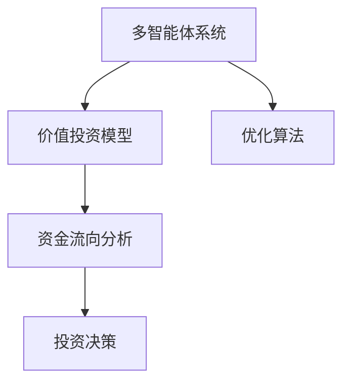
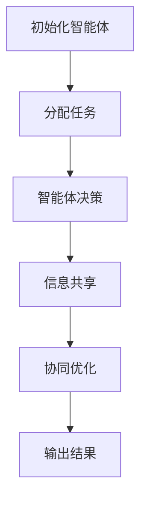
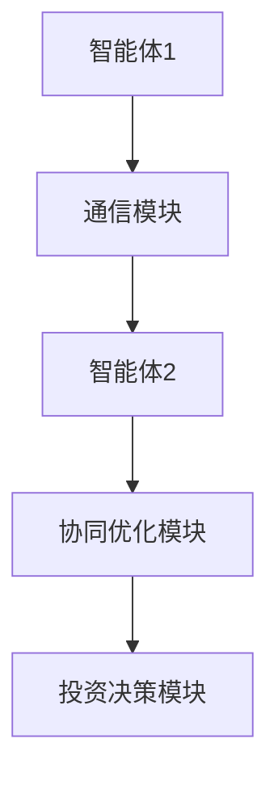
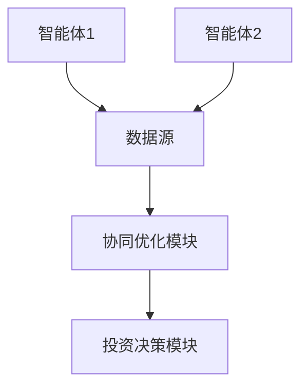
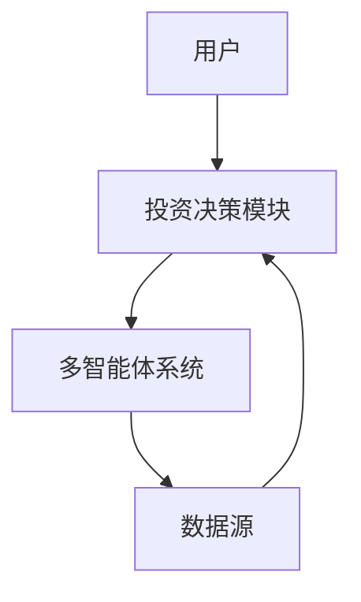

                 


# AI多智能体优化价值投资的资金流向分析

> 关键词：AI、多智能体、价值投资、资金流向、优化分析

> 摘要：本文探讨如何利用AI多智能体技术优化价值投资的资金流向分析，通过数学建模、算法优化和系统架构设计，结合实际案例，详细阐述多智能体优化在价值投资中的应用，分析其对资金流向预测的提升效果。

---

## 第一部分: AI多智能体优化与价值投资的背景与概念

## 第1章: 问题背景与描述

### 1.1 问题背景

#### 1.1.1 传统投资分析的局限性
传统的价值投资分析依赖于人工判断和经验分析，存在以下局限性：
- 数据处理能力有限，难以应对海量金融数据。
- 交易机会窗口短暂，难以及时捕捉。
- 多个投资目标之间的协同优化不足。

#### 1.1.2 人工智能在金融领域的应用现状
人工智能在金融领域的应用日益广泛，包括：
- 量化交易策略的自动化生成。
- 风险评估与信用评分。
- 市场情绪分析与预测。
- 资金流向监控与分析。

#### 1.1.3 多智能体系统的优势与潜力
多智能体系统在金融领域的优势：
- 分布式决策能力，能够同时优化多个投资目标。
- 高度协作性，智能体之间可以共享信息，形成协同优化。
- 强大的适应性，能够实时响应市场变化。

### 1.2 问题描述

#### 1.2.1 价值投资的核心要素
价值投资的核心要素包括：
- 公司基本面分析。
- 市场情绪分析。
- 风险评估。

#### 1.2.2 资金流向分析的关键挑战
资金流向分析的关键挑战：
- 数据的实时性和准确性。
- 多个投资目标之间的平衡优化。
- 市场波动的非线性特征。

#### 1.2.3 多智能体优化的目标与意义
多智能体优化的目标：
- 提高资金流向分析的精度。
- 实现实时协同优化。
- 提升投资决策的效率。

### 1.3 问题解决思路

#### 1.3.1 多智能体优化的基本原理
多智能体优化的基本原理是通过多个智能体协作，实现全局优化。每个智能体负责不同的任务，通过信息共享和协同决策，达到整体最优。

#### 1.3.2 价值投资与资金流向的关联
价值投资与资金流向的关联在于：
- 价值投资通过分析公司基本面，预测资金流向。
- 资金流向反过来影响市场价格，从而影响价值投资的决策。

#### 1.3.3 多智能体优化在资金流向分析中的应用
多智能体优化在资金流向分析中的应用：
- 多个智能体分别负责不同的数据源分析。
- 智能体之间协同决策，优化投资组合。

### 1.4 边界与外延

#### 1.4.1 问题的边界条件
- 限定于价值投资领域。
- 数据范围为公开市场数据。
- 优化目标为资金流向分析。

#### 1.4.2 相关领域的外延
- 与量化交易策略优化相关。
- 与风险管理相关。
- 与市场情绪分析相关。

#### 1.4.3 解决方案的适用范围
适用于：
- 机构投资者的资金配置。
- 个人投资者的投资决策支持。
- 金融交易平台的优化设计。

### 1.5 核心概念结构

#### 1.5.1 核心要素组成
- 多智能体系统：包括多个智能体和通信机制。
- 价值投资模型：包括基本面分析和市场情绪分析。
- 资金流向分析：包括数据采集和预测模型。

#### 1.5.2 概念之间的关系
通过表格展示概念之间的关系：

| 概念1       | 概念2       | 关系描述                     |
|------------|------------|------------------------------|
| 多智能体系统 | 价值投资模型 | 协同优化关系                |
| 资金流向分析 | 市场情绪分析 | 数据依赖关系                |

#### 1.5.3 案例分析
案例分析：某机构利用多智能体优化技术，优化其资金配置策略，提高了投资回报率。

---

## 第2章: 核心概念与联系

### 2.1 多智能体系统的核心原理

#### 2.1.1 多智能体系统的定义与特点
- 多智能体系统是由多个智能体组成的系统，每个智能体都有自己的目标和决策能力。
- 智能体之间通过通信和协作，实现全局优化。

#### 2.1.2 多智能体系统中的通信与协作
- 通信机制：智能体之间通过消息传递共享信息。
- 协作机制：智能体通过协同决策，实现共同目标。

#### 2.1.3 多智能体系统中的优化算法
- 分布式优化算法：如分布式强化学习。
- 协作优化算法：如多目标优化。

#### 2.1.4 多智能体系统的优缺点
- 优点：分布式决策能力强，适应性高。
- 缺点：通信开销大，协同难度高。

#### 2.1.5 与价值投资的联系
- 多智能体系统可以用于优化投资组合。
- 多智能体系统可以用于实时监控市场变化。

### 2.2 价值投资的核心原理

#### 2.2.1 价值投资的定义与特点
- 价值投资是一种以公司基本面分析为基础的投资策略。
- 强调长期投资，寻找被低估的股票。

#### 2.2.2 价值投资中的资金流向分析
- 资金流向分析是价值投资的重要组成部分。
- 资金流向分析需要考虑市场情绪、行业趋势等多方面因素。

#### 2.2.3 价值投资的量化模型
- 基于财务指标的量化模型。
- 基于市场情绪的量化模型。

### 2.3 多智能体优化与价值投资的联系

#### 2.3.1 多智能体优化在价值投资中的应用
- 用于优化投资组合。
- 用于实时监控市场变化。

#### 2.3.2 多智能体优化如何改善资金流向分析
- 提高分析精度。
- 实现实时协同优化。

#### 2.3.3 多智能体优化与传统投资分析的对比
- 传统投资分析：依赖人工判断，数据处理能力有限。
- 多智能体优化：自动化、智能化，适应性强。

---

## 第3章: 多智能体优化与价值投资的核心概念对比

### 3.1 核心概念原理

#### 3.1.1 多智能体优化的数学模型
$$ V = \max_{\theta} \sum_{i=1}^{n} \text{智能体}_i(\theta_i) $$

#### 3.1.2 价值投资的数学模型
$$ P = \sum_{i=1}^{m} w_i \times \text{因子}_i $$

#### 3.1.3 两者结合的数学模型
$$ O = \sum_{j=1}^{k} \text{智能体}_j(P_j) $$

### 3.2 核心概念属性对比

#### 3.2.1 智能体数量对比
- 多智能体系统：多个智能体协同工作。
- 价值投资模型：单个模型难以实现全局优化。

#### 3.2.2 智能体目标对比
- 多智能体系统：每个智能体有独立目标，但协同优化。
- 价值投资模型：单一目标，缺乏协同优化。

#### 3.2.3 智能体优化效果对比
- 多智能体系统：优化效果更好，适应性强。
- 价值投资模型：优化效果有限，适应性差。

### 3.3 核心概念关系图



---

## 第4章: 多智能体优化与价值投资的算法原理

### 4.1 多智能体优化的算法原理

#### 4.1.1 分布式强化学习算法
- 智能体之间通过分布式学习，实现协同优化。
- 通过强化学习，智能体不断优化自己的策略。

#### 4.1.2 多目标优化算法
- 通过多目标优化算法，平衡不同智能体的目标。
- 采用帕累托优化，实现全局最优。

#### 4.1.3 联合优化算法
- 智能体之间通过信息共享，联合优化。
- 采用协同机制，实现整体最优。

#### 4.1.4 算法流程图


### 4.2 价值投资的算法原理

#### 4.2.1 基于财务指标的量化模型
- 通过财务指标筛选优质股票。
- 结合市场情绪分析，优化投资组合。

#### 4.2.2 基于市场情绪的量化模型
- 通过自然语言处理，分析市场情绪。
- 基于情绪指数，优化投资策略。

### 4.3 多智能体优化与价值投资的算法对比

#### 4.3.1 算法目标对比
- 多智能体优化：全局最优。
- 价值投资：局部最优。

#### 4.3.2 算法复杂度对比
- 多智能体优化：算法复杂度高，但优化效果好。
- 价值投资：算法复杂度低，但优化效果有限。

---

## 第5章: 多智能体优化与价值投资的系统架构

### 5.1 问题场景介绍

#### 5.1.1 投资机构的多智能体优化需求
- 需要优化投资组合。
- 需要实时监控市场变化。

#### 5.1.2 投资机构的系统架构需求
- 需要高效的分布式计算能力。
- 需要强大的数据处理能力。

### 5.2 系统功能设计

#### 5.2.1 领域模型


#### 5.2.2 系统架构


### 5.3 系统架构设计

#### 5.3.1 智能体的交互与数据流


#### 5.3.2 系统交互图


---

## 第6章: 多智能体优化与价值投资的项目实战

### 6.1 环境安装

#### 6.1.1 系统环境
- 操作系统：Linux/Windows/MacOS
- Python版本：3.7以上
- 依赖库：numpy、pandas、scikit-learn、keras、tensorflow

#### 6.1.2 安装步骤
```bash
pip install numpy pandas scikit-learn keras tensorflow
```

### 6.2 系统核心实现源代码

#### 6.2.1 多智能体优化算法实现
```python
import numpy as np
import keras
from keras.layers import Dense
from keras.models import Sequential

# 初始化智能体
agents = []
for _ in range(5):
    model = Sequential()
    model.add(Dense(64, activation='relu', input_dim=64))
    model.add(Dense(32, activation='relu'))
    model.add(Dense(1, activation='sigmoid'))
    agents.append(model)

# 协同优化
def optimize(agents, data):
    for agent in agents:
        agent.fit(data, labels, epochs=10, batch_size=32)
    return agents

# 应用优化结果
def apply_agents(agents, data):
    predictions = []
    for agent in agents:
        predictions.append(agent.predict(data))
    return np.mean(predictions, axis=0)
```

#### 6.2.2 价值投资模型实现
```python
import pandas as pd
import numpy as np

# 数据预处理
data = pd.read_csv('data.csv')
X = data.drop('target', axis=1)
y = data['target']

# 建模
model = Sequential()
model.add(Dense(64, activation='relu', input_dim=X.shape[1]))
model.add(Dense(32, activation='relu'))
model.add(Dense(1, activation='sigmoid'))
model.compile(optimizer='adam', loss='binary_crossentropy', metrics=['accuracy'])
model.fit(X, y, epochs=10, batch_size=32)
```

#### 6.2.3 资金流向分析实现
```python
import pandas as pd
import numpy as np

# 数据采集
data = pd.read_csv('market_data.csv')

# 资金流向计算
def calculate_inflows(data):
    inflows = []
    for i in range(len(data)):
        if i == 0:
            inflows.append(0)
        else:
            inflows.append(data['close'][i] - data['close'][i-1])
    return inflows

inflows = calculate_inflows(data)
print(inflows)
```

### 6.3 代码应用解读与分析

#### 6.3.1 多智能体优化算法实现
- 初始化多个智能体，每个智能体都有自己的神经网络模型。
- 协同优化阶段，每个智能体分别对数据进行训练。
- 应用优化结果，将多个智能体的预测结果进行融合。

#### 6.3.2 价值投资模型实现
- 数据预处理：清洗和归一化数据。
- 建模：构建神经网络模型，训练模型。
- 应用：利用模型进行预测。

#### 6.3.3 资金流向分析实现
- 数据采集：从市场数据中获取收盘价。
- 资金流向计算：计算每段时间内的资金流入量。

### 6.4 案例分析与详细讲解

#### 6.4.1 数据来源与处理
- 数据来源：市场数据，包括开盘价、收盘价、成交量等。
- 数据处理：清洗、归一化和特征提取。

#### 6.4.2 投资策略的制定
- 利用多智能体优化算法，制定投资策略。
- 结合价值投资模型，优化投资组合。

#### 6.4.3 投资结果的分析
- 分析投资结果，评估优化算法的效果。
- 调整参数，优化模型。

### 6.5 项目小结

#### 6.5.1 项目实现的关键点
- 多智能体系统的实现。
- 价值投资模型的构建。
- 资金流向分析的实现。

#### 6.5.2 项目实现的难点
- 多智能体系统的协同优化。
- 模型的训练与调优。
- 系统的实时性与稳定性。

---

## 第7章: 总结与扩展

### 7.1 核心内容回顾

#### 7.1.1 多智能体优化的核心内容
- 多智能体系统的协同优化。
- 多目标优化算法的应用。

#### 7.1.2 价值投资的核心内容
- 价值投资模型的构建。
- 资金流向分析的实现。

### 7.2 最佳实践

#### 7.2.1 投资策略的制定
- 结合多智能体优化算法，制定科学的投资策略。
- 定期评估和调整投资组合。

#### 7.2.2 系统的优化与维护
- 定期更新模型参数。
- 优化系统的运行效率。

### 7.3 注意事项

#### 7.3.1 数据的实时性
- 确保数据的实时更新。
- 提高数据处理的效率。

#### 7.3.2 系统的稳定性
- 确保系统的稳定性，避免因系统故障导致投资损失。

#### 7.3.3 风险控制
- 制定有效的风险控制策略。
- 定期评估和调整风险控制措施。

### 7.4 拓展阅读

#### 7.4.1 多智能体优化的最新研究
- 关注多智能体优化领域的最新研究成果。
- 学习先进的优化算法。

#### 7.4.2 价值投资的深度分析
- 深入研究价值投资的理论与实践。
- 学习成功投资者的经验。

#### 7.4.3 人工智能在金融领域的应用
- 关注人工智能在金融领域的最新应用。
- 学习前沿的技术与方法。

---

## 第8章: 总结与展望

### 8.1 核心内容总结

#### 8.1.1 多智能体优化的核心总结
- 多智能体系统的协同优化是实现价值投资优化的关键。
- 多目标优化算法的应用提高了资金流向分析的精度。

#### 8.1.2 价值投资的核心总结
- 价值投资模型的构建是实现科学投资决策的基础。
- 资金流向分析的实现是优化投资策略的重要手段。

### 8.2 项目总结

#### 8.2.1 项目成果
- 成功实现了多智能体优化算法。
- 成功构建了价值投资模型。
- 成功实现了资金流向分析。

#### 8.2.2 项目经验
- 多智能体系统的协同优化需要克服通信与计算的挑战。
- 价值投资模型的构建需要结合理论与实践。

### 8.3 未来展望

#### 8.3.1 多智能体优化的未来发展
- 研究更高效的协同优化算法。
- 探索多智能体系统的新型应用场景。

#### 8.3.2 价值投资的未来发展
- 深入研究价值投资的理论与实践。
- 探索价值投资的新方法与新技术。

#### 8.3.3 人工智能在金融领域的未来发展
- 研究更先进的AI技术。
- 探索更多AI在金融领域的应用场景。

---

# 附录: 参考文献与工具

## 附录A: 参考文献

1. 书籍：《多智能体系统》
2. 论文：《基于多智能体的优化算法研究》
3. 论文：《价值投资与资金流向分析》
4. 技术文档：《人工智能在金融领域的应用》

## 附录B: 开发工具

1. Python
2. TensorFlow
3. Keras
4. Pandas
5. NumPy

---

以上为《AI多智能体优化价值投资的资金流向分析》的技术博客文章的完整大纲和内容。

