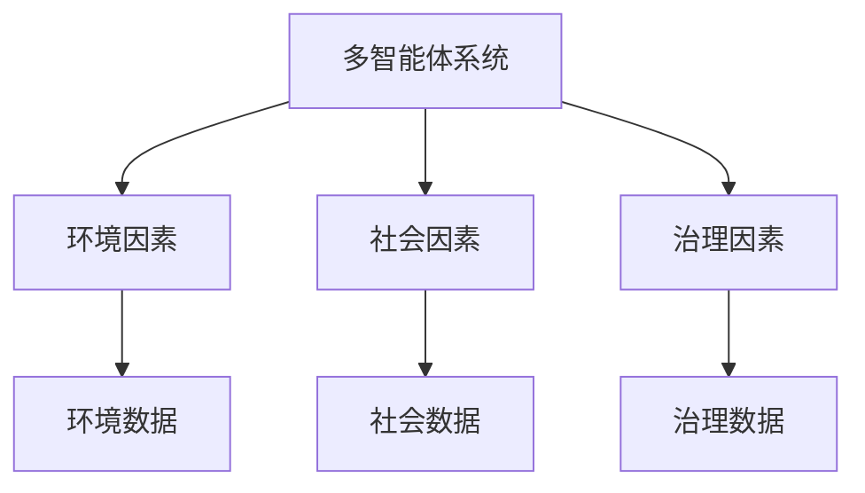
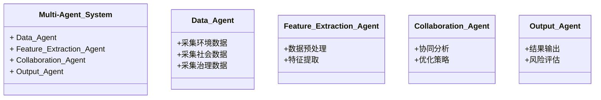
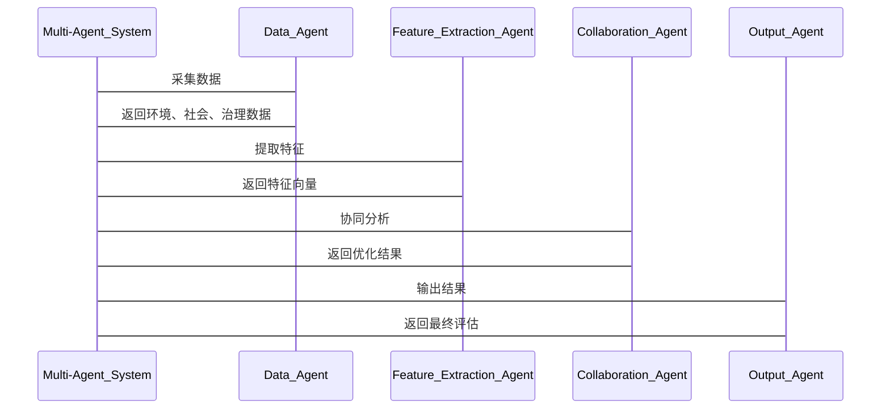

                 


# AI多智能体在价值投资中的ESG因素分析

---

## 关键词：
- AI多智能体
- ESG因素
- 价值投资
- 金融分析
- 可持续投资

---

## 摘要：
本文系统地探讨了AI多智能体技术在价值投资中的ESG因素分析中的应用。通过结合多智能体系统的协作性和ESG分析的深度，本文提出了基于AI多智能体的ESG因素分析框架，详细分析了多智能体系统在ESG数据采集、特征提取、协同分析等方面的优势。同时，本文通过实际案例展示了如何利用AI多智能体技术构建高效的ESG分析系统，并对未来的研究方向和应用场景进行了展望。

---

# 目录

---

## 第1章：AI多智能体与ESG分析的背景

### 1.1 多智能体系统概述
- 1.1.1 多智能体系统的定义与特点
- 1.1.2 多智能体系统的协作机制
- 1.1.3 多智能体系统与传统AI的区别

### 1.2 ESG因素分析概述
- 1.2.1 ESG的定义与内涵
- 1.2.2 ESG在金融投资中的重要性
- 1.2.3 ESG分析的挑战与难点

### 1.3 多智能体系统与ESG分析的结合
- 1.3.1 ESG分析中的多智能体应用场景
- 1.3.2 多智能体系统在ESG分析中的优势
- 1.3.3 ESG分析对多智能体系统的挑战

---

## 第2章：多智能体系统的核心概念与联系

### 2.1 多智能体系统的核心概念
- 2.1.1 实体与行为
- 2.1.2 协作与通信
- 2.1.3 环境与目标

### 2.2 ESG分析的核心概念
- 2.2.1 环境因素
- 2.2.2 社会因素
- 2.2.3 治理因素

### 2.3 多智能体与ESG分析的实体关系图
- 2.3.1 实体关系图的Mermaid流程图


---

## 第3章：ESG因素分析的算法原理

### 3.1 多智能体协同算法
- 3.1.1 多智能体协同的基本原理
- 3.1.2 基于强化学习的多智能体协同
- 3.1.3 多智能体协同的数学模型

### 3.2 ESG特征提取算法
- 3.2.1 文本特征提取
- 3.2.2 数据清洗与预处理
- 3.2.3 基于机器学习的特征提取

### 3.3 多智能体协同与ESG分析的结合算法
- 3.3.1 算法流程
- 3.3.2 算法实现的Python代码示例
```python
def multi_agent_collaboration(data):
    # 数据预处理
    processed_data = preprocess(data)
    # 特征提取
    features = extract_features(processed_data)
    # 多智能体协同
    result = collaborate_agents(features)
    return result
```

---

## 第4章：数学模型与优化策略

### 4.1 ESG分析的数学模型
- 4.1.1 收益与风险的评估模型
$$ \text{收益} = \sum_{i=1}^{n} w_i \cdot r_i $$
$$ \text{风险} = \sqrt{\sum_{i=1}^{n} w_i^2 \cdot \sigma_i^2} $$
- 4.1.2 多目标优化模型
$$ \max \ \alpha \cdot \text{收益} + (1-\alpha) \cdot \text{ESG得分} $$
$$ \text{subject to} \ \sum_{i=1}^{n} w_i = 1 $$

### 4.2 多智能体系统的优化策略
- 4.2.1 分布式优化策略
- 4.2.2 进化策略
- 4.2.3 近端与远端优化结合

---

## 第5章：系统架构与设计

### 5.1 系统功能设计
- 5.1.1 数据采集模块
- 5.1.2 特征提取模块
- 5.1.3 协同分析模块
- 5.1.4 结果输出模块

### 5.2 系统架构设计
- 5.2.1 系统架构的Mermaid类图


### 5.3 系统交互设计
- 5.3.1 系统交互的Mermaid序列图


---

## 第6章：项目实战与案例分析

### 6.1 项目背景与目标
- 6.1.1 项目背景
- 6.1.2 项目目标

### 6.2 数据集构建
- 6.2.1 数据来源
- 6.2.2 数据清洗与标注
- 6.2.3 数据集划分

### 6.3 系统实现
- 6.3.1 系统核心代码实现
```python
class Multi-Agent_System:
    def __init__(self):
        self.data_agent = Data_Agent()
        self.feature_agent = Feature_Extraction_Agent()
        self.collaboration_agent = Collaboration_Agent()
        self.output_agent = Output_Agent()

    def process_data(self, raw_data):
        processed_data = self.data_agent.preprocess(raw_data)
        features = self.feature_agent.extract_features(processed_data)
        result = self.collaboration_agent.collaborate(features)
        output = self.output_agent.generate_output(result)
        return output
```

### 6.4 案例分析与结果解读
- 6.4.1 案例背景
- 6.4.2 数据分析与结果
- 6.4.3 结果解读与策略优化

---

## 第7章：扩展与展望

### 7.1 当前研究的不足与改进方向
- 7.1.1 数据质量与多样性
- 7.1.2 模型的可解释性
- 7.1.3 系统的实时性与高效性

### 7.2 未来研究方向
- 7.2.1 更复杂的多智能体协同机制
- 7.2.2 结合其他AI技术（如大语言模型）
- 7.2.3 ESG分析的实时化与动态化

### 7.3 投资策略中的AI多智能体应用建议
- 7.3.1 优化现有投资组合
- 7.3.2 发掘新的投资机会
- 7.3.3 提升投资决策的可持续性

---

## 参考文献与进一步阅读

---

---

通过以上目录，本文将从背景、核心概念、算法原理、系统架构、项目实战等多个维度，全面、系统地探讨AI多智能体在价值投资中的ESG因素分析的应用，为读者提供深入的技术洞察和实践指导。

