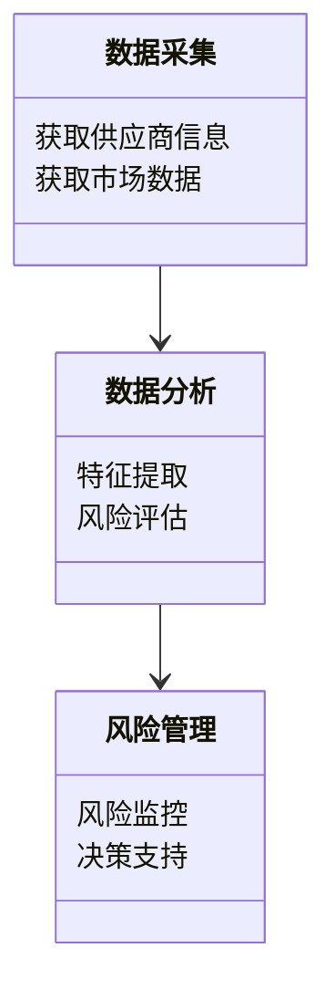
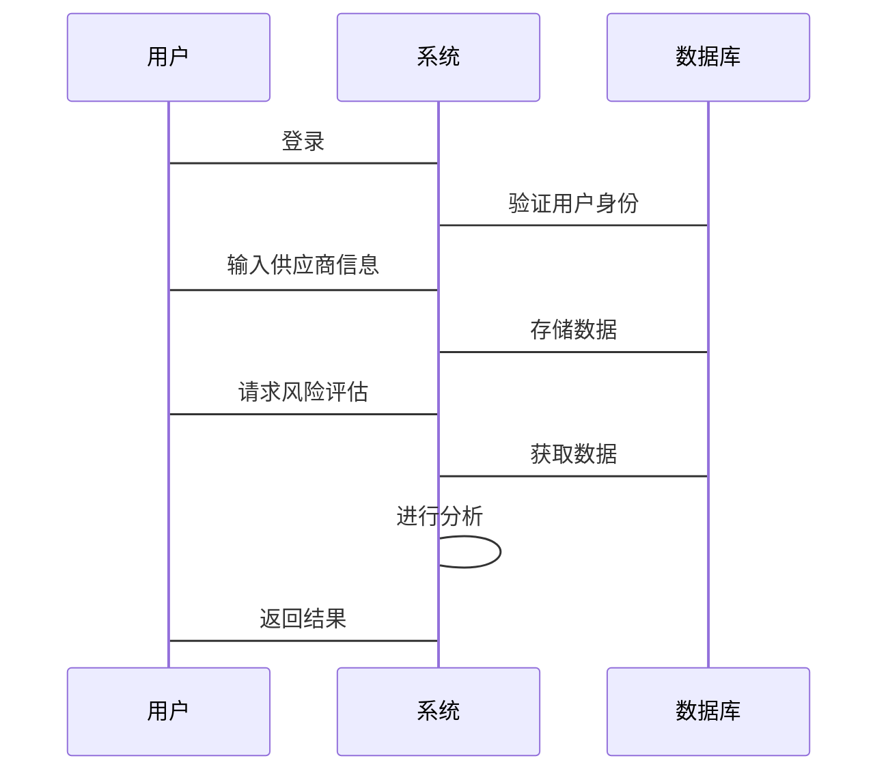

                 


# AI多智能体在价值投资中的供应商风险分析

> 关键词：多智能体系统，供应商风险，价值投资，风险管理，人工智能，金融

> 摘要：本文探讨了AI多智能体系统在价值投资中的应用，特别是在供应商风险分析方面。通过介绍多智能体系统的基本概念、分析供应商风险的核心要素，详细讲解了基于多智能体的算法原理和系统架构设计，最后通过实际案例展示了如何在项目中应用这些技术。

---

# 第1章: 供应商风险分析与价值投资概述

## 1.1 供应商风险分析的基本概念

### 1.1.1 供应商风险的定义与分类

供应商风险是指由于供应商的财务状况、供应链稳定性或管理问题，可能导致企业面临的风险。这些风险可以分为财务风险、供应链风险和管理风险。

- **财务风险**：供应商的财务状况不佳可能导致无法按时交付或提供服务。
- **供应链风险**：供应商的供应链问题可能导致交货延迟或质量不稳定。
- **管理风险**：供应商的管理问题可能导致合作中的沟通不畅或决策失误。

### 1.1.2 供应商风险在价值投资中的重要性

在价值投资中，供应商风险直接影响企业的运营稳定性和盈利能力。通过有效分析供应商风险，投资者可以识别潜在的风险点，优化投资组合，降低整体风险敞口。

### 1.1.3 供应商风险分析的边界与外延

供应商风险分析的边界包括供应商的基本信息、财务数据和供应链信息。外延则扩展到供应商的行业地位、市场环境和宏观经济因素。

## 1.2 多智能体系统的基本概念

### 1.2.1 多智能体系统的定义与特点

多智能体系统（Multi-Agent System, MAS）是由多个智能体组成的系统，这些智能体能够自主决策、协作和竞争。MAS的特点包括分布式性、协作性、反应性和适应性。

### 1.2.2 多智能体系统与单智能体系统的区别

单智能体系统依赖中心化决策，而多智能体系统通过去中心化实现协作。MAS在复杂环境中表现出更高的适应性和灵活性。

### 1.2.3 多智能体系统在金融领域的应用潜力

MAS在金融领域的应用包括风险管理、投资决策和市场分析。通过MAS，投资者可以更好地应对复杂市场环境。

## 1.3 价值投资中的风险管理

### 1.3.1 价值投资的核心理念

价值投资强调长期投资，寻找被市场低估的企业。核心理念包括深入分析企业基本面、关注长期价值和分散投资风险。

### 1.3.2 供应商风险对投资决策的影响

供应商风险直接影响企业的盈利能力和经营稳定性。在价值投资中，供应商风险分析是评估企业的重要环节。

### 1.3.3 价值投资中的风险管理策略

风险管理策略包括分散投资、深入分析和持续监控。通过MAS，投资者可以更高效地识别和管理供应商风险。

## 1.4 本章小结

本章介绍了供应商风险分析的基本概念、其在价值投资中的重要性，以及多智能体系统的定义和特点。MAS在金融领域的潜力和价值投资中的风险管理策略为后续章节奠定了基础。

---

# 第2章: AI多智能体系统的核心概念与联系

## 2.1 多智能体系统的原理与特点

### 2.1.1 多智能体系统的组成要素

多智能体系统由智能体、环境、通信机制和协作规则组成。每个智能体都有明确的目标和功能。

### 2.1.2 多智能体系统的通信机制

智能体之间的通信可以通过直接交互或通过中介进行。通信机制确保信息的有效传递和协作。

### 2.1.3 多智能体系统的协作与竞争关系

智能体在系统中可以协作完成任务，也可以竞争资源。协作与竞争关系影响系统的整体性能。

## 2.2 供应商风险分析的核心要素

### 2.2.1 供应商的基本信息分析

包括供应商的行业地位、市场声誉和管理团队稳定性。基本信息分析是供应商风险评估的基础。

### 2.2.2 供应商的财务风险分析

通过财务报表分析供应商的偿债能力、盈利能力和发展能力。财务风险是供应商风险的重要组成部分。

### 2.2.3 供应商的供应链风险分析

评估供应商的供应链稳定性，包括供应商的供应商、物流能力和库存管理。

## 2.3 多智能体系统与供应商风险分析的结合

### 2.3.1 多智能体系统在供应商风险分析中的优势

MAS能够处理复杂信息，提供全面的分析和实时监控。多个智能体协同工作，提高分析的准确性和效率。

### 2.3.2 多智能体系统与传统供应商风险分析的对比

传统分析方法依赖人工判断，MAS则通过数据驱动和自动化分析，提高分析效率和精度。

### 2.3.3 多智能体系统在价值投资中的应用架构

MAS的应用架构包括数据采集、分析处理和决策支持。智能体协同工作，提供实时的风险评估和投资建议。

## 2.4 本章小结

本章详细讲解了多智能体系统的原理和特点，并分析了其在供应商风险分析中的应用。MAS的优势和应用架构为后续的算法实现奠定了基础。

---

# 第3章: 多智能体系统在供应商风险分析中的算法原理

## 3.1 多智能体系统的算法基础

### 3.1.1 多智能体系统中的强化学习算法

强化学习通过智能体与环境的交互，学习最优策略。在供应商风险分析中，智能体通过历史数据学习风险评估模型。

### 3.1.2 多智能体系统中的博弈论模型

博弈论模型模拟智能体之间的互动，分析不同策略下的结果。在供应商风险分析中，博弈论用于评估供应商之间的竞争和合作。

### 3.1.3 多智能体系统中的分布式计算算法

分布式计算算法将任务分解到多个智能体，提高计算效率。在供应商风险分析中，分布式计算用于处理大规模数据。

## 3.2 供应商风险分析的算法实现

### 3.2.1 供应商风险的特征提取算法

特征提取算法从供应商的历史数据中提取关键特征，如财务指标和供应链稳定性。提取的特征用于构建风险评估模型。

### 3.2.2 供应商风险的分类与预测算法

分类算法如随机森林和神经网络用于供应商风险的分类和预测。预测模型通过历史数据预测未来的风险。

### 3.2.3 供应商风险的动态评估算法

动态评估算法实时更新风险评估结果，适应市场变化。动态评估模型通过实时数据调整风险等级。

## 3.3 基于多智能体系统的协同算法

### 3.3.1 多智能体系统的协同学习算法

协同学习算法通过智能体之间的协作，提高学习效果。在供应商风险分析中，协同学习用于优化风险评估模型。

### 3.3.2 多智能体系统的协同优化算法

协同优化算法通过协作优化资源分配，提高系统效率。在供应商风险分析中，协同优化用于降低风险敞口。

### 3.3.3 多智能体系统的协同决策算法

协同决策算法通过协作做出最优决策。在供应商风险分析中，协同决策用于选择最优供应商组合。

## 3.4 本章小结

本章详细讲解了多智能体系统在供应商风险分析中的算法实现。通过强化学习、博弈论模型和分布式计算算法，MAS能够高效地进行风险评估和优化决策。

---

# 第4章: 基于多智能体系统的供应商风险分析系统

## 4.1 系统功能设计

### 4.1.1 系统功能模型

系统功能模型包括数据采集、分析处理、风险评估和决策支持。功能模型通过Mermaid类图展示。



### 4.1.2 系统功能模块

系统功能模块包括数据采集模块、数据分析模块和风险管理模块。各模块协同工作，实现供应商风险分析。

## 4.2 系统架构设计

### 4.2.1 系统架构图

系统架构图展示系统的分层结构，包括数据层、业务逻辑层和用户界面层。

```mermaid
container 系统架构 {
    数据层
    业务逻辑层
    用户界面层
}
```

### 4.2.2 系统接口设计

系统接口包括数据接口和用户接口。数据接口负责数据的输入输出，用户接口提供友好的操作界面。

### 4.2.3 系统交互流程

系统交互流程展示用户与系统之间的交互步骤，包括登录、数据输入、分析处理和结果输出。



## 4.3 本章小结

本章详细讲解了基于多智能体系统的供应商风险分析系统的功能设计、架构设计和交互设计。系统架构图和交互流程图展示了系统的整体结构和操作流程。

---

# 第5章: 项目实战——多智能体供应商风险分析系统的实现

## 5.1 项目背景与目标

项目目标是开发一个基于多智能体系统的供应商风险分析系统，用于帮助投资者进行风险管理。项目背景包括当前金融市场的复杂性和价值投资的需求。

## 5.2 环境安装与配置

### 5.2.1 安装Python

安装Python 3.8及以上版本，确保环境配置正确。

### 5.2.2 安装相关库

安装必要的库，如numpy、pandas、scikit-learn和tensorflow。

## 5.3 核心代码实现

### 5.3.1 数据采集模块

代码实现从数据库中获取供应商信息。

```python
import pandas as pd

def get_supplier_data():
    # 数据库连接
    # 返回数据框
    pass
```

### 5.3.2 数据分析模块

实现特征提取和风险评估算法。

```python
from sklearn.ensemble import RandomForestClassifier

def risk_assessment(data):
    # 特征提取
    # 训练模型
    model = RandomForestClassifier()
    model.fit(X, y)
    return model.predict(new_data)
```

### 5.3.3 风险管理模块

实现风险监控和决策支持。

```python
import numpy as np

def risk_monitoring():
    # 实时数据获取
    # 风险评估
    # 决策支持
    pass
```

## 5.4 代码解读与分析

### 5.4.1 数据采集模块解读

数据采集模块负责从数据库中获取供应商信息，清洗数据并存储到数据框中。

### 5.4.2 数据分析模块解读

数据分析模块包括特征提取和风险评估。特征提取从数据中提取关键特征，风险评估使用随机森林算法进行分类。

### 5.4.3 风险管理模块解读

风险管理模块负责实时数据获取，进行风险评估，并提供决策支持。实时监控确保及时发现风险。

## 5.5 项目小结

本章通过实际项目展示了多智能体系统在供应商风险分析中的应用。代码实现和系统设计为投资者提供了有效的风险管理工具。

---

# 第6章: 最佳实践与小结

## 6.1 最佳实践

### 6.1.1 数据质量的重要性

确保数据的准确性和完整性，避免因数据问题导致分析错误。

### 6.1.2 模型的可解释性

选择可解释的模型，确保投资者能够理解分析结果。

### 6.1.3 持续优化

定期更新模型和系统，适应市场变化和新的数据。

## 6.2 小结

本文详细讲解了AI多智能体系统在价值投资中的应用，特别是在供应商风险分析方面。通过理论分析和项目实战，展示了MAS的优势和实际应用价值。

## 6.3 注意事项

投资者在使用MAS时，应关注数据隐私和模型的可解释性。同时，定期更新模型，确保系统的准确性和稳定性。

## 6.4 拓展阅读

推荐阅读相关书籍和论文，深入学习MAS和风险管理的知识。

---

# 结语

通过本文的学习，读者可以了解AI多智能体系统在价值投资中的应用，掌握供应商风险分析的核心概念和算法原理。希望本文能为投资者提供有价值的参考，帮助他们在复杂市场中做出明智的决策。

