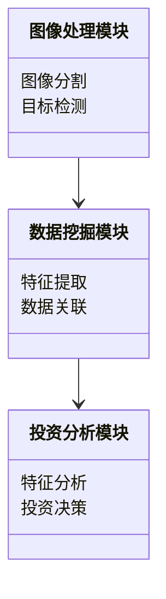
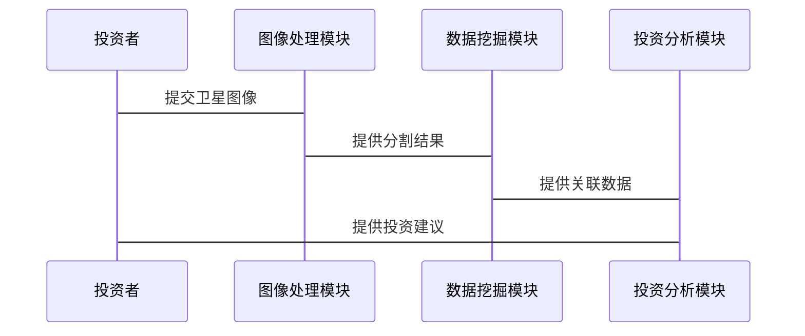

                 


# AI多智能体在价值投资中的卫星图像分析应用

> 关键词：AI多智能体，卫星图像，价值投资，图像分割，目标检测，强化学习

> 摘要：本文探讨了AI多智能体技术在价值投资中的应用，特别是通过卫星图像分析来辅助投资决策。文章从背景介绍、核心概念、算法原理、系统架构到项目实战，详细阐述了如何利用卫星图像数据进行价值投资分析，为投资决策提供了新的技术视角。

---

## 第1章: 背景介绍

### 1.1 问题背景
#### 1.1.1 卫星图像在金融分析中的潜力
卫星图像能够提供地理数据，反映经济活动的动态变化，如城市扩展、交通流量、建筑密度等。这些数据可以帮助投资者识别潜在的经济趋势和风险。

#### 1.1.2 价值投资中的数据需求
价值投资依赖于对公司基本面的深入分析，而卫星图像提供了传统数据之外的新视角，能够捕捉到影响企业价值的外部因素。

#### 1.1.3 多智能体技术的优势
多智能体系统能够协同工作，分工合作，从卫星图像中提取更多有价值的信息，提高分析效率和准确性。

### 1.2 问题描述
#### 1.2.1 卫星图像分析的挑战
卫星图像数据量大、分辨率高，且受天气和光照影响，分析难度大。

#### 1.2.2 多智能体在金融中的应用难点
多智能体系统需要协调多个智能体的行动，确保信息共享和决策一致，这对系统的复杂性和实时性提出了更高要求。

#### 1.2.3 价值投资与卫星图像的结合点
通过卫星图像分析，投资者可以获取企业周边环境的信息，如供应链布局、市场需求变化等，从而辅助投资决策。

### 1.3 问题解决
#### 1.3.1 多智能体系统的解决方案
利用多智能体系统分工协作，分别负责图像处理、特征提取和投资分析，提高整体效率。

#### 1.3.2 卫星图像处理的技术路径
采用图像分割、目标检测等技术，提取卫星图像中的关键信息，如建筑密度、交通流量等。

#### 1.3.3 价值投资中的数据驱动方法
通过卫星图像分析，构建数据驱动的评价体系，辅助价值投资决策。

### 1.4 边界与外延
#### 1.4.1 系统边界
本系统仅关注卫星图像分析，不涉及其他数据源，如财务数据、市场数据等。

#### 1.4.2 应用场景的外延
卫星图像分析可应用于房地产评估、供应链管理等领域，为投资决策提供更多数据支持。

#### 1.4.3 技术的局限性
卫星图像分辨率有限，分析结果可能存在误差；多智能体系统的复杂性可能导致维护成本较高。

### 1.5 概念结构与核心要素
#### 1.5.1 核心概念框架
卫星图像 → 多智能体分析 → 投资决策

#### 1.5.2 核心要素对比表
| 核心要素 | 定义 | 示例 |
|----------|------|------|
| 卫星图像 | 从卫星获取的地理数据 | 城市热图、交通网络 |
| 多智能体 | 协作的AI系统 | 图像处理智能体、数据挖掘智能体 |
| 价值投资 | 基于企业基本面的长期投资策略 | 股票价值评估、风险分析 |

#### 1.5.3 ER实体关系图
```mermaid
er
actor: 投资者
satellite_image: 卫星图像
multi_agent_system: 多智能体系统
investment_decision: 投资决策
```

## 第2章: 核心概念与联系

### 2.1 多智能体系统原理
#### 2.1.1 多智能体系统定义
多智能体系统是由多个智能体组成的分布式系统，各智能体能够自主决策并协同工作。

#### 2.1.2 多智能体的核心特征
| 特征 | 描述 |
|------|------|
| 分布式 | 各智能体独立运行 |
| 协作性 | 智能体之间协同完成任务 |
| 反应式 | 能够实时响应环境变化 |

#### 2.1.3 多智能体与传统AI的区别
| 方面 | 传统AI | 多智能体 |
|------|--------|----------|
| 结构 | 单一决策者 | 多个决策者 |
| 协作 | 无 | 有 |
| 环境 | 静态 | 动态 |

### 2.2 卫星图像分析技术
#### 2.2.1 卫星图像处理流程
1. 数据获取：从卫星获取原始图像。
2. 图像预处理：去噪、增强。
3. 图像分割：识别感兴趣区域。
4. 目标检测：检测特定目标（如建筑、车辆）。
5. 特征提取：提取图像特征。

#### 2.2.2 图像分割与目标检测
| 技术 | 方法 | 示例 |
|------|-------|------|
| 图像分割 | U-Net网络 | 城市区域分割 |
| 目标检测 | Faster R-CNN | 检测交通枢纽 |

#### 2.2.3 图像特征提取方法
- 基于CNN的特征提取网络。
- 使用预训练模型（如ResNet）提取高层特征。

### 2.3 价值投资与卫星图像的结合
#### 2.3.1 价值投资中的数据驱动决策
通过卫星图像分析，投资者可以获取企业的外部环境信息，如供应链布局、市场需求变化等。

#### 2.3.2 卫星图像在经济指标中的应用
- 建筑密度与企业扩张。
- 交通流量与市场需求。

#### 2.3.3 多智能体在投资决策中的角色
多智能体协同工作，分别负责图像处理、数据挖掘和投资分析，提高决策的准确性和效率。

---

## 第3章: 算法原理讲解

### 3.1 图像分割算法
#### 3.1.1 U-Net网络结构
U-Net是一种经典的图像分割模型，由编码器和解码器组成。

#### 3.1.2 模型训练流程
1. 数据预处理：归一化、数据增强。
2. 模型训练：使用交叉熵损失函数，Adam优化器。
3. 模型评估：使用IoU指标。

#### 3.1.3 分割结果评估
- IoU（交并比）：IoU = TP / (TP + FP + FN)。
- Dice系数：Dice = 2TP / (2TP + FP + FN)。

### 3.2 目标检测算法
#### 3.2.1 Faster R-CNN框架
Faster R-CNN由RPN（区域建议网络）和Fast R-CNN组成。

#### 3.2.2 检测器训练策略
1. 数据增强：翻转、裁剪、调整亮度。
2. 模型训练：使用交叉熵损失，SGD优化器。
3. 模型评估：使用mAP指标。

#### 3.2.3 检测结果分析
- mAP（平均精度）：mAP = Σ(max(0, IoU>0.5))。

### 3.3 强化学习算法
#### 3.3.1 DQN网络结构
DQN由编码器、Q网络和目标网络组成。

#### 3.3.2 策略训练流程
1. 环境交互：智能体与环境互动，获取状态和奖励。
2. 网络更新：基于经验回放和目标网络更新Q值。
3. 策略评估：通过测试集评估策略的稳定性。

---

## 第4章: 系统分析与架构设计方案

### 4.1 问题场景介绍
投资者希望通过卫星图像分析，获取企业周边环境信息，辅助价值投资决策。

### 4.2 项目介绍
本项目旨在构建一个基于多智能体的卫星图像分析系统，辅助投资者进行价值投资。

### 4.3 系统功能设计
#### 4.3.1 功能模块
- 图像处理模块：负责图像预处理和分割。
- 数据挖掘模块：提取图像特征，关联经济指标。
- 投资分析模块：基于特征进行投资决策。

#### 4.3.2 领域模型（类图）


#### 4.3.3 系统架构图


#### 4.3.4 系统接口设计
- 图像处理模块提供API：`/api/v1/image/segment`
- 数据挖掘模块提供API：`/api/v1/data/feature`

#### 4.3.5 系统交互流程


---

## 第5章: 项目实战

### 5.1 环境安装
- 安装Python、TensorFlow、Keras、OpenCV、Matplotlib。

### 5.2 系统核心实现源代码
#### 5.2.1 图像分割代码
```python
import tensorflow as tf
from tensorflow.keras import layers

def unet_model(input_shape):
    inputs = layers.Input(input_shape)
    encoder = layers.Conv2D(64, (3,3), activation='relu')(inputs)
    encoder = layers.MaxPooling2D((2,2))(encoder)
    encoder = layers.Conv2D(128, (3,3), activation='relu')(encoder)
    encoder = layers.MaxPooling2D((2,2))(encoder)
    encoder = layers.Conv2D(256, (3,3), activation='relu')(encoder)
    encoder = layers.MaxPooling2D((2,2))(encoder)
    
    decoder = layers.Conv2DTranspose(256, (2,2), strides=(2,2))(encoder)
    decoder = layers.Conv2D(128, (3,3), activation='relu')(decoder)
    decoder = layers.Conv2DTranspose(128, (2,2), strides=(2,2))(decoder)
    decoder = layers.Conv2D(64, (3,3), activation='relu')(decoder)
    decoder = layers.Conv2DTranspose(64, (2,2), strides=(2,2))(decoder)
    outputs = layers.Conv2D(1, (1,1), activation='sigmoid')(decoder)
    
    return tf.keras.Model(inputs=inputs, outputs=outputs)
```

#### 5.2.2 目标检测代码
```python
import tensorflow as tf
from tensorflow.keras import layers

def faster_rcnn_model(input_shape):
    inputs = layers.Input(input_shape)
    x = layers.Conv2D(64, (3,3), activation='relu')(inputs)
    x = layers.MaxPooling2D((2,2))(x)
    x = layers.Conv2D(128, (3,3), activation='relu')(x)
    x = layers.MaxPooling2D((2,2))(x)
    x = layers.Flatten()(x)
    x = layers.Dense(256, activation='relu')(x)
    outputs = layers.Dense(2, activation='softmax')(x)
    
    return tf.keras.Model(inputs=inputs, outputs=outputs)
```

### 5.3 代码应用解读与分析
- 图像分割代码实现了U-Net网络，用于分割卫星图像。
- 目标检测代码实现了Faster R-CNN网络，用于检测图像中的目标。

### 5.4 实际案例分析
假设我们有一组卫星图像，分别对应不同的城市区域。通过图像分割，我们可以识别出城市热图区域，进而分析企业的分布情况。

### 5.5 项目小结
通过本项目，我们展示了如何利用AI多智能体技术，结合卫星图像分析，辅助价值投资决策。

---

## 第6章: 总结与展望

### 6.1 总结
本文详细探讨了AI多智能体在价值投资中的应用，特别是通过卫星图像分析来辅助投资决策。通过背景介绍、核心概念、算法原理、系统架构到项目实战，我们展示了如何利用卫星图像数据进行价值投资分析。

### 6.2 展望
未来，随着卫星技术的进步和AI算法的优化，卫星图像分析在价值投资中的应用将更加广泛和深入。建议进一步研究如何结合多模态数据，提高分析的准确性和效率。

### 6.3 最佳实践 Tips
- 数据预处理是关键，需确保数据质量。
- 算法选择需结合具体场景，避免过度复杂化。
- 系统设计需注重模块化，便于维护和扩展。

---

以上是文章的完整目录和内容大纲，接下来我会根据这个大纲，逐步展开每一部分的内容，撰写一篇完整的技术博客文章。

