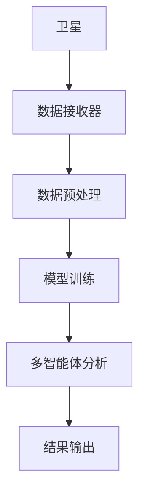
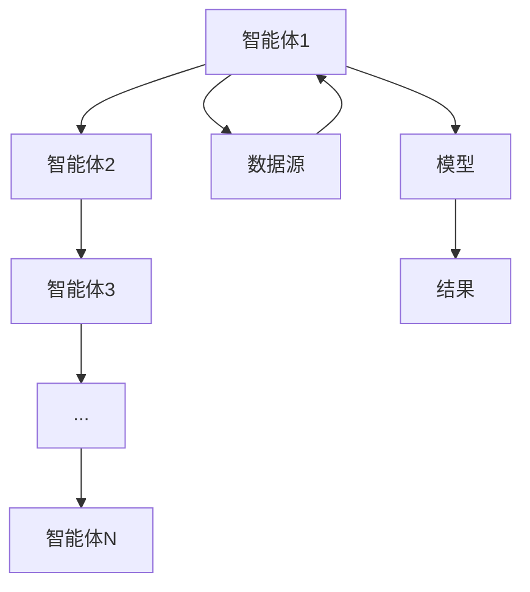
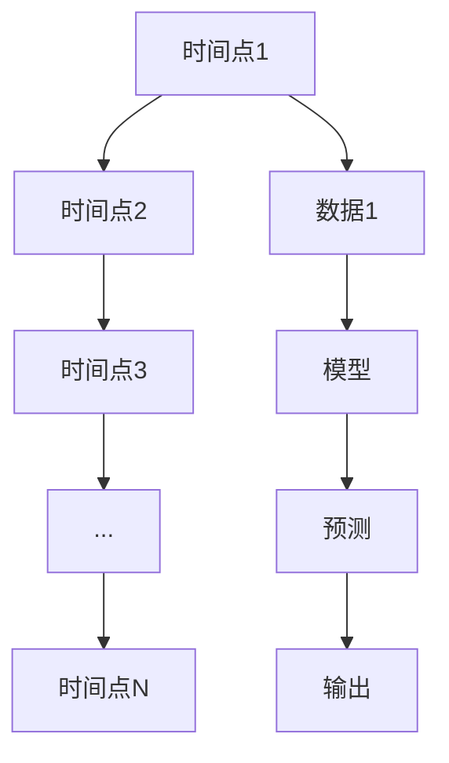
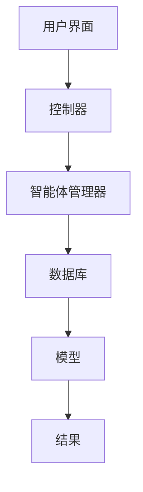
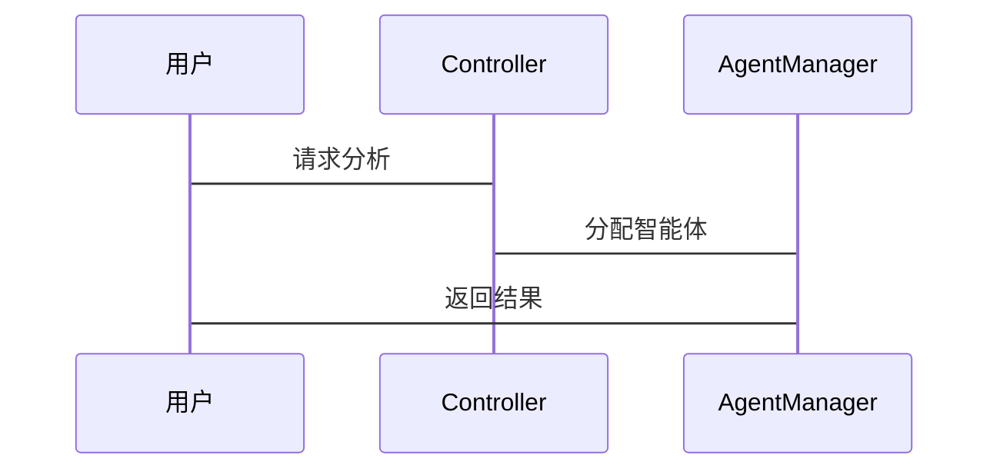

                 


# AI多智能体在价值投资中的卫星数据时间序列分析

> 关键词：AI多智能体，价值投资，卫星数据，时间序列分析，金融数据，多智能体协作，深度学习

> 摘要：本文探讨了AI多智能体在价值投资中的应用，重点分析了卫星数据的时间序列分析方法。通过多智能体协作，AI能够从卫星数据中提取有价值的信息，帮助投资者做出更明智的决策。文章详细介绍了相关算法、系统架构及实际案例，展示了AI技术在金融领域的强大潜力。

---

# 第一部分: 背景介绍

## 第1章: AI多智能体与价值投资

### 1.1 AI多智能体的基本概念

#### 1.1.1 多智能体系统的基本定义

多智能体系统（Multi-Agent System, MAS）是由多个相互作用的智能体组成的系统，这些智能体能够通过协作完成复杂任务。与单智能体系统相比，MAS在处理需要分布式决策和协作的问题时更具优势。

#### 1.1.2 AI多智能体的核心特点

AI多智能体结合了人工智能技术，具有以下核心特点：
- **自主性**：每个智能体都能独立感知环境并做出决策。
- **反应性**：智能体能够实时响应环境变化。
- **协作性**：多个智能体通过通信和协作完成共同目标。
- **学习能力**：智能体能够通过经验优化决策策略。

#### 1.1.3 多智能体与传统AI的区别

传统AI通常依赖于单一模型进行决策，而多智能体系统通过多个智能体的协作实现更复杂的任务。例如，在金融领域，多个智能体可以分别关注市场分析、数据处理和风险评估，从而提供更全面的投资建议。

### 1.2 价值投资的基本原理

#### 1.2.1 价值投资的定义与核心理念

价值投资是一种投资策略，强调以低于内在价值的价格购买优质资产。其核心理念是寻找市场中的低估资产，并长期持有，等待其价值回归。

#### 1.2.2 价值投资与技术分析的对比

- **价值投资**：注重基本面分析，寻找被市场低估的资产。
- **技术分析**：基于价格和成交量的历史数据预测未来走势。
- **AI多智能体的优势**：结合了基本面和技术分析，能够从多维度进行分析。

#### 1.2.3 价值投资在现代金融中的应用

随着数据量的增加和计算能力的提升，价值投资逐渐从传统的人工分析转向量化分析。AI多智能体能够处理海量数据，发现传统方法难以察觉的投资机会。

### 1.3 卫星数据在金融分析中的应用

#### 1.3.1 卫星数据的定义与分类

卫星数据是指通过卫星技术收集的各种数据，包括图像、气象数据等。在金融领域，卫星数据可以用于分析经济活动、企业运营情况等。

#### 1.3.2 卫星数据在金融中的独特价值

卫星数据能够提供地理和环境信息，帮助分析企业的实际运营情况。例如，卫星图像可以用于监测企业的库存水平或工厂的生产情况。

#### 1.3.3 卫星数据的采集与处理挑战

- **数据量大**：卫星数据通常以PB级计算，处理起来非常困难。
- **数据质量**：卫星数据可能受到天气、卫星轨道等因素的影响，导致数据不完整。
- **数据解读**：需要专业的图像处理技术才能提取有用信息。

---

## 第2章: 时间序列分析在价值投资中的作用

### 2.1 时间序列分析的基本概念

#### 2.1.1 时间序列的定义与特征

时间序列是指按时间顺序排列的数据，通常用于分析随时间变化的变量。其特征包括趋势、周期性、随机波动等。

#### 2.1.2 时间序列分析的常见方法

- **ARIMA模型**：广泛应用于时间序列预测。
- **LSTM网络**：在处理长期依赖关系时表现优异。
- **GARCH模型**：用于分析金融时间序列中的波动性。

#### 2.1.3 时间序列分析在金融中的应用

时间序列分析常用于股票价格预测、经济指标分析等领域。AI多智能体能够通过时间序列分析发现市场中的潜在规律。

### 2.2 卫星数据时间序列分析的特殊性

#### 2.2.1 卫星数据的时间序列特点

卫星数据的时间序列通常具有以下特点：
- **高维性**：数据维度高，处理复杂。
- **稀疏性**：数据可能存在缺失或不完整。
- **非线性**：变量之间的关系可能高度非线性。

#### 2.2.2 卫星数据时间序列分析的难点

- **数据预处理**：需要进行去噪、填充缺失值等处理。
- **模型选择**：需要选择适合高维数据的模型。
- **计算复杂度**：处理海量数据需要高效的算法和计算资源。

#### 2.2.3 卫星数据时间序列分析的创新点

结合AI多智能体和深度学习技术，通过协作学习和分布式计算提高分析效率和准确性。

### 2.3 AI多智能体在时间序列分析中的优势

#### 2.3.1 多智能体协作的优势

- **分布式计算**：多个智能体可以同时处理不同部分的数据，提高计算效率。
- **协同学习**：通过协作，智能体能够共享信息，提高整体预测精度。

#### 2.3.2 多智能体在时间序列分析中的具体应用

- **异常检测**：通过多智能体协作，及时发现数据中的异常点。
- **趋势预测**：多个智能体分别分析不同维度的数据，综合预测市场趋势。

#### 2.3.3 多智能体时间序列分析的未来趋势

随着AI技术的进步，多智能体时间序列分析将更加智能化和自动化，能够处理更复杂的数据和场景。

---

# 第二部分: 卫星数据时间序列分析的核心概念与联系

## 第3章: 卫星数据与时间序列分析的核心概念

### 3.1 卫星数据的特征与分类

#### 3.1.1 卫星数据的特征分析

- **空间分辨率**：决定了图像的清晰度。
- **时间分辨率**：决定了数据的更新频率。
- **光谱分辨率**：决定了能够识别的波长范围。

#### 3.1.2 卫星数据的分类方法

- **光学影像**：基于可见光和近红外波段的图像。
- **雷达影像**：利用雷达波进行观测，不受天气影响。
- **热红外影像**：用于测量地表温度。

#### 3.1.3 卫星数据的预处理步骤

- **辐射校正**：消除传感器噪声。
- **几何校正**：纠正影像的几何畸变。
- **分类处理**：将影像分割成不同类别。

### 3.2 时间序列分析的数学模型

#### 3.2.1 时间序列的常见模型

- **ARIMA模型**：自回归积分滑动模型，适用于线性时间序列。
- **LSTM网络**：循环神经网络，适合处理长序列依赖。
- **GARCH模型**：广义自回归条件异方差模型，用于分析波动性。

#### 3.2.2 时间序列分析的数学基础

时间序列分析涉及概率论、统计学、线性代数等数学知识。例如，ARIMA模型的数学表达式如下：

$$ ARIMA(p, d, q) = y_t = \phi_1 y_{t-1} + \dots + \phi_p y_{t-p} + \theta_1 \epsilon_{t-1} + \dots + \theta_q \epsilon_{t-q} + \epsilon_t $$

#### 3.2.3 时间序列分析的评价指标

常用的评价指标包括均方误差（MSE）、平均绝对误差（MAE）和R平方值（R²）。

### 3.3 AI多智能体协作的原理

#### 3.3.1 多智能体协作的基本原理

多智能体通过通信和协作，共同完成复杂任务。每个智能体负责一部分数据或任务，然后将结果汇总。

#### 3.3.2 多智能体协作的通信机制

- **分布式通信**：智能体之间通过分布式网络进行通信。
- **集中式通信**：所有智能体通过中心节点进行通信。

#### 3.3.3 多智能体协作的学习机制

- **分布式学习**：每个智能体独立学习，然后共享模型参数。
- **联合学习**：多个智能体联合训练模型，共享数据和信息。

---

## 第4章: 卫星数据与时间序列分析的实体关系图

### 4.1 实体关系图

通过mermaid图展示卫星数据、时间序列分析、AI多智能体之间的关系。

```mermaid
erDiagram
    customer[C投资者] 
    company[I企业]
    satellite_data[卫星数据]
    time_series[时间序列数据]
    ai_agents[AI多智能体]
    prediction[预测结果]
    customer --> satellite_data : 获取
    company --> satellite_data : 提供
    satellite_data --> time_series : 转换为
    time_series --> ai_agents : 分析
    ai_agents --> prediction : 生成
    prediction --> customer : 提供
```

### 4.2 数据流图

展示数据从卫星收集到AI分析的整个流程。



---

## 第5章: AI多智能体与时间序列分析的流程

### 5.1 多智能体协作的流程



### 5.2 时间序列分析的流程



---

# 第三部分: 算法原理讲解

## 第6章: 时间序列分析的算法实现

### 6.1 LSTM网络的实现

```python
import numpy as np
from keras.models import Sequential
from keras.layers import LSTM, Dense

# 创建模型
model = Sequential()
model.add(LSTM(128, input_shape=(timesteps, features)))
model.add(Dense(1))
model.compile(optimizer='adam', loss='mean_squared_error')
```

### 6.2 多智能体协作的实现

```python
class Agent:
    def __init__(self, id, model):
        self.id = id
        self.model = model
        self.communication_channel = []

    def receive(self, message):
        self.communication_channel.append(message)

    def send(self, message):
        # 发送消息到通信频道
        pass
```

---

## 第7章: 数学模型与公式

### 7.1 ARIMA模型的数学表达式

$$ ARIMA(p, d, q) = y_t = \phi_1 y_{t-1} + \dots + \phi_p y_{t-p} + \theta_1 \epsilon_{t-1} + \dots + \theta_q \epsilon_{t-q} + \epsilon_t $$

### 7.2 LSTM网络的结构方程

$$ f(t) = \sigma(W_f \cdot [h_{t-1}, x_t] + b_f) $$
$$ i(t) = \sigma(W_i \cdot [h_{t-1}, x_t] + b_i) $$
$$ o(t) = \sigma(W_o \cdot [h_{t-1}, x_t] + b_o) $$
$$ c(t) = c_{t-1} \cdot f(t) + i(t) \cdot x_t $$
$$ h(t) = o(t) \cdot \tanh(c(t)) $$

---

# 第四部分: 系统分析与架构设计方案

## 第8章: 系统架构设计

### 8.1 系统架构图



### 8.2 接口设计

- **API接口**：提供数据接口、模型调用接口。
- **通信接口**：智能体之间的通信接口。

### 8.3 交互流程图



---

## 第9章: 项目实战

### 9.1 环境安装

- **Python**：安装Anaconda或Miniconda。
- **深度学习框架**：安装TensorFlow或Keras。
- **卫星数据处理库**：安装GDAL、Pillow等。

### 9.2 核心实现代码

```python
import numpy as np
from keras.models import Model
from keras.layers import Input, LSTM, Dense

# 定义输入层
input_layer = Input(shape=(timesteps, features))
# 定义LSTM层
lstm_layer = LSTM(128)(input_layer)
# 定义输出层
output_layer = Dense(1)(lstm_layer)
# 创建模型
model = Model(inputs=input_layer, outputs=output_layer)
model.compile(optimizer='adam', loss='mean_squared_error')
```

### 9.3 应用解读

通过上述代码，可以构建一个基于LSTM的时间序列预测模型。训练完成后，可以将模型部署到实际应用中，实时分析卫星数据，提供投资建议。

---

## 第10章: 结语与展望

### 10.1 结语

本文详细介绍了AI多智能体在价值投资中的应用，展示了如何利用卫星数据进行时间序列分析，帮助投资者做出更明智的决策。

### 10.2 未来展望

随着技术的进步，AI多智能体在金融领域的应用将更加广泛，可能涉及更多复杂场景的分析和预测。

---

通过以上内容，希望本文能够为读者提供有价值的信息，帮助理解AI多智能体在价值投资中的潜力和应用。

