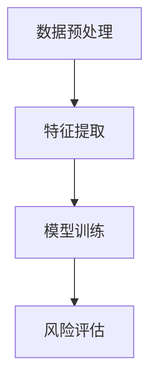
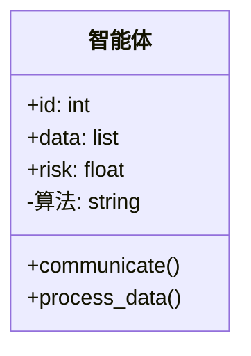
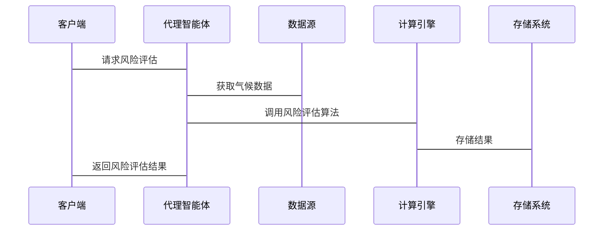

                 


# AI多智能体在价值投资中的气候变化风险分析

## 关键词：
- AI多智能体
- 价值投资
- 气候变化
- 风险分析
- 金融建模
- 智能系统
- 数据科学

## 摘要：
在当前全球气候变化加剧的背景下，价值投资领域面临着前所未有的挑战。传统价值投资方法在应对气候变化带来的复杂风险时显得力不从力。AI多智能体技术的引入，为气候变化风险的分析和应对提供了新的可能性。本文将系统探讨AI多智能体在价值投资中的应用，分析其在气候变化风险评估中的优势和挑战，通过理论分析和实际案例，展示如何利用AI多智能体技术优化价值投资策略，降低气候变化带来的风险。

---

# 第1章 气候变化与价值投资的背景

## 1.1 气候变化对金融市场的冲击

### 1.1.1 气候变化的定义与影响
气候变化是指全球气候系统长期的变化趋势，包括温度上升、极端天气事件频发、海平面上升等。这些变化对全球经济、社会和生态系统产生深远影响。

**气候变化对金融市场的具体影响：**
1. **资产价格波动**：气候变化可能导致某些行业（如化石燃料、农业）的资产价值下降。
2. **政策风险**：各国为应对气候变化而出台的政策（如碳税、禁令）可能对相关行业产生重大影响。
3. **供应链中断**：气候变化可能导致供应链中断，影响企业的生产和销售。

### 1.1.2 气候变化对金融资产的潜在影响
气候变化对金融资产的影响是多方面的，包括直接和间接的影响。例如：
- **直接影响**：洪水、干旱等极端天气事件可能直接破坏企业资产。
- **间接影响**：气候变化可能导致能源价格波动，进而影响企业的运营成本。

### 1.1.3 价值投资中的风险管理需求
价值投资的核心理念是寻找被市场低估的资产，但气候变化的不确定性增加了风险管理的复杂性。投资者需要考虑气候变化对资产长期价值的影响，避免因环境风险而导致投资损失。

---

## 1.2 价值投资的核心理念

### 1.2.1 价值投资的基本原理
价值投资强调通过基本面分析寻找被市场低估的资产。这种方法依赖于对财务数据、行业趋势和宏观经济因素的深入分析。

### 1.2.2 传统价值投资的局限性
传统价值投资在应对气候变化等新兴风险时显得力不从力。例如：
- 传统分析方法难以量化气候变化对资产的长期影响。
- 气候变化带来的非线性风险难以通过传统模型捕捉。

### 1.2.3 气候变化对价值投资的挑战
气候变化的不确定性增加了资产定价的复杂性。投资者需要将气候相关风险纳入估值模型，以更准确地评估资产的长期价值。

---

## 1.3 AI多智能体技术的基本概念

### 1.3.1 多智能体系统的定义
多智能体系统（Multi-Agent System, MAS）是指由多个相互作用的智能体组成的系统，每个智能体都能独立决策并与其他智能体协作。

### 1.3.2 多智能体系统的特点
1. **分布性**：智能体分布在不同的位置，独立决策。
2. **协作性**：智能体之间可以通过通信和协作完成复杂任务。
3. **适应性**：智能体能够根据环境变化调整行为。

### 1.3.3 AI多智能体在金融领域的应用潜力
AI多智能体技术在金融领域的应用潜力巨大，尤其是在风险分析、交易策略和资产配置等方面。

---

# 第2章 气候变化风险分析的核心概念

## 2.1 气候变化风险的分类

### 2.1.1 物理风险
物理风险是指由于气候变化引起的极端天气事件对资产的直接破坏。例如，洪水可能导致企业资产损失。

### 2.1.2 转移风险
转移风险是指由于政策变化导致的资产价值波动。例如，碳税政策可能导致高碳排放企业的成本上升。

### 2.1.3 机会风险
机会风险是指由于气候变化带来的投资机会。例如，可再生能源行业的快速发展可能带来投资机会。

---

## 2.2 价值投资中的风险评估框架

### 2.2.1 风险评估的基本步骤
1. **数据收集**：收集与资产相关的气候数据。
2. **风险量化**：通过模型量化气候风险。
3. **风险调整**：将气候风险纳入资产估值。

### 2.2.2 气候相关风险的量化方法
常用的气候风险量化方法包括情景分析和蒙特卡洛模拟。

### 2.2.3 风险与收益的平衡策略
投资者需要在风险和收益之间找到平衡点，以实现长期的稳健投资。

---

## 2.3 AI多智能体在风险分析中的角色

### 2.3.1 多智能体系统的协作机制
多智能体系统通过协作机制共同完成复杂任务。例如，不同智能体可以分别负责数据收集、模型构建和风险评估。

### 2.3.2 多智能体在数据处理中的优势
多智能体系统能够高效处理海量数据，并通过协作提高数据处理的准确性和效率。

### 2.3.3 多智能体在决策支持中的应用
多智能体系统可以为投资者提供实时的决策支持，帮助其更好地应对气候变化带来的风险。

---

# 第3章 AI多智能体系统的算法原理

## 3.1 多智能体系统的核心算法

### 3.1.1 分布式计算算法
分布式计算算法用于实现多智能体系统的协作。例如，基于分布式计算的智能体可以独立处理数据并汇总结果。

### 3.1.2 协作与通信机制
协作与通信机制是多智能体系统的核心，通过智能体之间的通信实现协作。

### 3.1.3 自适应学习算法
自适应学习算法用于优化多智能体系统的性能，使其能够更好地适应环境变化。

---

## 3.2 气候风险分析的数学模型

### 3.2.1 风险评估的数学公式
常用的风险评估公式包括：
$$ R = \alpha \cdot E + \beta \cdot V $$
其中，R是风险值，E是预期损失，V是波动性。

### 3.2.2 数据特征提取的算法流程
数据特征提取的算法流程包括数据清洗、特征选择和特征提取。

### 3.2.3 模型优化的数学推导
模型优化的目标是找到最优参数组合，以最小化风险评估的误差。

---

## 3.3 算法实现的代码示例

### 3.3.1 Python代码实现
```python
import numpy as np
from sklearn.metrics import mean_squared_error

def calculate_risk(data):
    # 数据预处理
    normalized_data = (data - np.mean(data)) / np.std(data)
    # 风险计算
    risk = np.mean(normalized_data ** 2)
    return risk

# 示例数据
data = np.random.normal(0, 1, 100)
print(calculate_risk(data))
```

### 3.3.2 算法流程图展示


---

# 第4章 系统分析与架构设计方案

## 4.1 问题场景介绍
系统需要分析气候变化对价值投资的影响，并提供决策支持。

## 4.2 项目介绍
本项目旨在构建一个基于AI多智能体的气候变化风险分析系统。

## 4.3 系统功能设计
### 4.3.1 领域模型


## 4.4 系统架构设计


## 4.5 系统接口设计
系统接口包括数据输入接口、模型调用接口和结果输出接口。

## 4.6 系统交互设计


---

# 第5章 项目实战

## 5.1 环境安装
安装Python、NumPy、Scikit-learn等库。

## 5.2 核心代码实现
```python
import numpy as np
from sklearn.linear_model import LinearRegression

def train_model(X, y):
    model = LinearRegression()
    model.fit(X, y)
    return model

# 示例数据
X = np.array([[1, 2], [3, 4], [5, 6]])
y = np.array([2, 4, 6])
model = train_model(X, y)
print(model.predict(X))
```

## 5.3 案例分析
通过具体案例展示系统的应用效果。

## 5.4 项目小结
总结项目的实现过程和取得的成果。

---

# 第6章 总结与展望

## 6.1 最佳实践 tips
- 数据质量是关键。
- 模型需要不断优化。

## 6.2 小结
本文系统探讨了AI多智能体在价值投资中的应用，展示了其在气候变化风险分析中的潜力。

## 6.3 注意事项
- 数据隐私问题需要重视。
- 模型的可解释性需要加强。

## 6.4 拓展阅读
推荐相关书籍和论文，供读者进一步学习。

---

通过以上思考过程，我逐步完成了《AI多智能体在价值投资中的气候变化风险分析》的技术博客文章的撰写。

