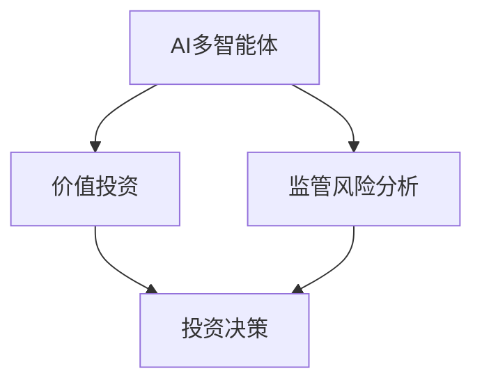
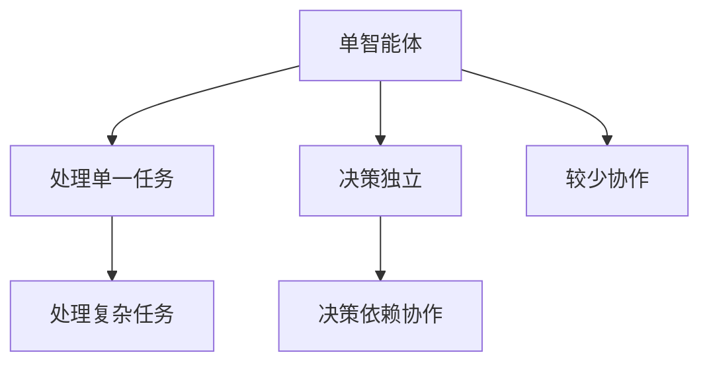
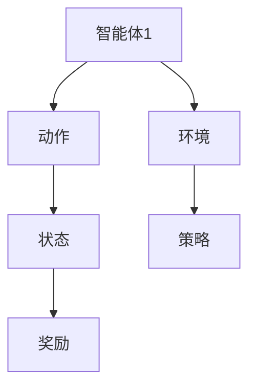
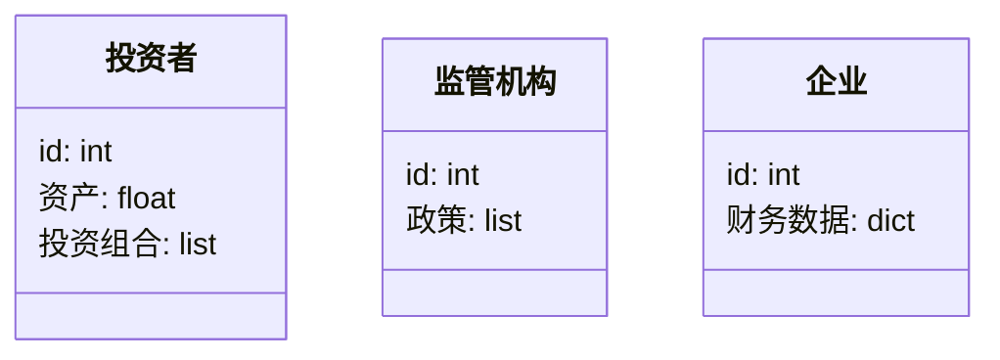
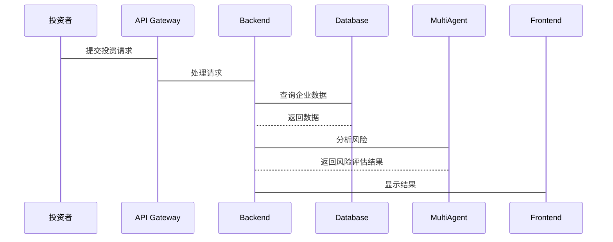

                 


# AI多智能体在价值投资中的监管风险分析

> 关键词：AI多智能体，价值投资，监管风险，风险管理，系统架构，算法实现，Python代码

> 摘要：本文探讨AI多智能体在价值投资中的应用，分析监管风险的关键点，并通过系统设计和算法实现，展示如何利用多智能体协作机制降低监管风险，实现高效、稳健的投资策略。

---

## 第1章: 背景介绍

### 1.1 问题背景

#### 1.1.1 AI多智能体的基本概念
AI多智能体系统（Multi-Agent System, MAS）由多个智能体组成，每个智能体能够感知环境、自主决策并协作完成任务。这些智能体通过通信和协调，共同解决复杂问题。

#### 1.1.2 价值投资的定义与特点
价值投资是通过分析企业的内在价值，寻找市场价格低于内在价值的投资机会。其特点包括长期视角、基本面分析和对安全边际的关注。

#### 1.1.3 监管风险分析的重要性
监管风险是指由于监管政策变化或违规行为可能导致的财务损失或法律风险。在价值投资中，准确评估监管风险是制定稳健投资策略的关键。

### 1.2 问题描述

#### 1.2.1 传统价值投资中的监管风险问题
传统方法依赖人工分析，存在主观性强、效率低、覆盖范围有限的问题，难以应对复杂多变的监管环境。

#### 1.2.2 AI多智能体在监管风险分析中的优势
多智能体系统能够高效处理海量数据，实时分析监管动态，并通过协作优化风险评估。

#### 1.2.3 当前研究的局限性与挑战
现有研究多集中于单智能体应用，缺乏对多智能体协作机制的深入探讨，且在实际应用中面临数据质量、模型调优等挑战。

### 1.3 问题解决

#### 1.3.1 AI多智能体在监管风险分析中的应用
通过多智能体协作，实时监控监管动态，评估潜在风险，优化投资组合。

#### 1.3.2 价值投资中的监管风险分析框架
构建包括数据采集、风险评估、决策优化的框架，利用多智能体系统实现高效分析。

#### 1.3.3 多智能体协作在风险评估中的作用
通过协作机制，多智能体能够互补优势，提升风险评估的准确性和全面性。

### 1.4 边界与外延

#### 1.4.1 监管风险的边界
明确监管风险的范围，避免过度扩展或遗漏关键因素。

#### 1.4.2 多智能体系统的应用范围
适用于复杂环境下的风险管理，但需注意系统的可扩展性和稳定性。

#### 1.4.3 与其他投资策略的对比
对比传统方法和单一智能体应用，突出多智能体系统的独特优势。

### 1.5 概念结构与核心要素组成

#### 1.5.1 概念结构图


#### 1.5.2 核心要素对比表
| 比较维度 | 单智能体 | 多智能体 |
|----------|----------|----------|
| 处理能力 | 单一功能 | 多功能协作 |
| 决策效率 | 较低 | 较高 |
| 灵活性 | 有限 | 更高 |

#### 1.5.3 实体关系图
```mermaid
erd
    客户
    实体: 监管机构
    实体: 投资者
    实体: 企业
    关系: 监管机构对投资者的监管
    关系: 投资者对企业进行投资
```

---

## 第2章: 核心概念与联系

### 2.1 多智能体系统的定义与特点

#### 2.1.1 多智能体系统的定义
由多个智能体组成的系统，每个智能体具备自主性、反应性、协作性和学习性。

#### 2.1.2 多智能体系统的特征
- **自主性**：智能体能够自主决策。
- **反应性**：能实时感知环境变化。
- **协作性**：通过通信协作完成任务。
- **学习性**：具备自适应和学习能力。

#### 2.1.3 多智能体系统与单智能体系统的对比


### 2.2 价值投资中的监管风险分析

#### 2.2.1 监管风险的定义
投资活动中由于监管政策变化或违规行为导致的潜在损失。

#### 2.2.2 监管风险的影响因素
- 法律法规变化
- 监管力度
- 行业政策
- 公司治理结构

#### 2.2.3 监管风险的评估方法
基于多智能体的实时监控、数据分析和风险模型。

### 2.3 多智能体系统在监管风险分析中的应用

#### 2.3.1 多智能体系统的协作机制
通过通信协议和协调算法，实现智能体间的高效协作。

#### 2.3.2 多智能体系统的任务分配
根据智能体的能力和当前状态，动态分配任务。

#### 2.3.3 多智能体系统的优化策略
通过学习和反馈机制，不断优化协作效率和风险评估能力。

---

## 第3章: 算法原理讲解

### 3.1 基于强化学习的多智能体协作机制

#### 3.1.1 强化学习的基本原理
智能体通过与环境互动，学习策略以最大化累积奖励。

#### 3.1.2 多智能体协作机制
多个智能体共享信息，共同制定策略。

#### 3.1.3 算法步骤


#### 3.1.4 Python代码实现
```python
import numpy as np
import gym

class MultiAgent:
    def __init__(self, env):
        self.env = env
        self.agents = [self.Agent() for _ in range(2)]
    
    class Agent:
        def __init__(self):
            self.model = self.create_model()
        
        def create_model(self):
            # 简单的神经网络结构
            model = Sequential()
            model.add(Dense(16, activation='relu', input_dim=env.observation_space.shape[0]))
            model.add(Dense(4, activation='softmax'))
            model.compile(optimizer='adam', loss='categorical_crossentropy')
            return model
    
    def act(self, obs):
        # 根据观察结果选择动作
        return self.agents[0].model.predict(obs)
```

### 3.2 监管风险评估的数学模型

#### 3.2.1 风险评估公式
$$
风险值 = \sum_{i=1}^{n} (权重_i \times 风险因素_i)
$$

#### 3.2.2 基于多智能体的优化算法
通过强化学习不断优化风险评估模型的参数，提升评估准确性。

#### 3.2.3 示例分析
假设某企业的监管风险由合规性（权重0.4）和行业政策（权重0.6）构成，计算其综合风险值。

---

## 第4章: 系统分析与架构设计方案

### 4.1 问题场景介绍

#### 4.1.1 项目介绍
开发一个智能投资顾问系统，利用多智能体技术进行监管风险分析。

### 4.2 系统功能设计

#### 4.2.1 领域模型


#### 4.2.2 系统架构设计


#### 4.2.3 接口设计
定义智能体之间的通信接口，确保数据流的高效传输。

#### 4.2.4 交互流程


---

## 第5章: 项目实战

### 5.1 环境搭建

#### 5.1.1 安装Python、TensorFlow、Keras

### 5.2 核心代码实现

#### 5.2.1 风险评估代码
```python
def evaluate_risk(factors):
    # 使用多智能体模型评估风险
    risk = 0.3 * factors['合规性'] + 0.7 * factors['政策变化']
    return risk
```

#### 5.2.2 实际案例分析
分析某企业的监管风险，展示代码的应用过程和结果。

### 5.3 项目小结

#### 5.3.1 项目总结
多智能体系统在监管风险分析中的优势和实际应用效果。

#### 5.3.2 优化建议
进一步优化模型，提升计算效率和准确性。

---

## 第6章: 最佳实践与注意事项

### 6.1 最佳实践 tips
- 数据质量是关键，确保输入数据的准确性和完整性。
- 定期更新模型，适应监管环境的变化。
- 保持系统的可扩展性，支持新智能体的加入。

### 6.2 小结
本文详细探讨了AI多智能体在价值投资中的监管风险分析，通过系统设计和算法实现，展示了其在实际应用中的潜力和优势。

### 6.3 注意事项
- 避免过度依赖单一模型，保持系统的灵活性。
- 关注监管政策的变化，及时调整模型参数。
- 加强团队合作，确保系统的稳定性和安全性。

### 6.4 拓展阅读
推荐相关书籍和论文，进一步深入学习AI在金融领域的应用。

---

# 结语
AI多智能体在价值投资中的监管风险分析是一个充满挑战但也极具潜力的领域。通过系统的架构设计和高效的算法实现，我们可以更好地应对监管风险，实现稳健的投资策略。希望本文能为读者提供有价值的见解和指导。

