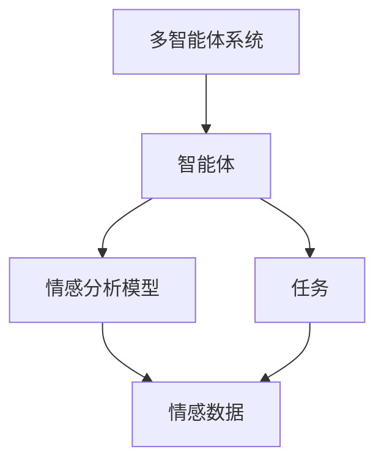
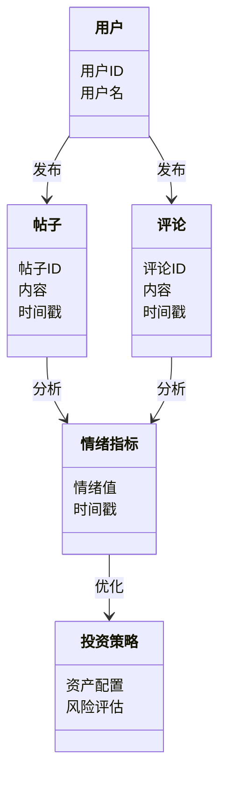
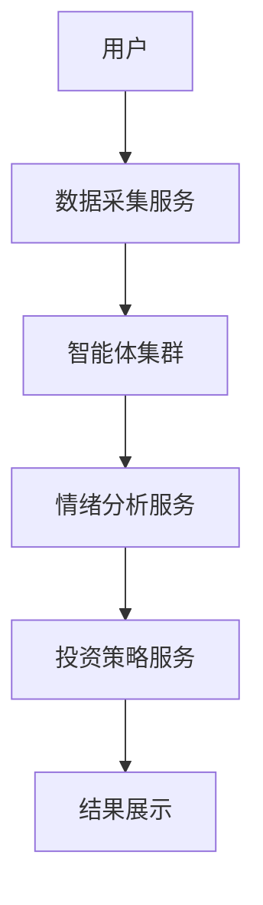
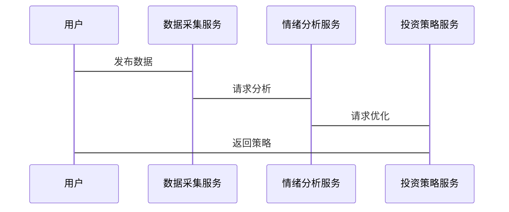

                 


# AI多智能体在价值投资中的社交媒体情绪分析应用

> 关键词：AI多智能体、社交媒体情绪分析、价值投资、自然语言处理、深度学习、投资决策

> 摘要：本文探讨如何利用AI多智能体系统结合社交媒体情绪分析，辅助价值投资决策。通过自然语言处理和深度学习技术，分析社交媒体数据中的情绪信息，揭示情绪与市场行为的关系，帮助投资者优化决策。

---

# 第1章: 问题背景与核心概念

## 1.1 问题背景介绍

### 1.1.1 价值投资的定义与核心要素
价值投资是一种投资策略，旨在通过分析公司的基本面，如财务状况、行业地位和管理团队，寻找被市场低估的投资标的。其核心要素包括公司估值、行业分析、财务指标和市场趋势。

### 1.1.2 社交媒体在投资决策中的作用
社交媒体已成为投资者获取实时信息的重要来源。通过分析社交媒体上的评论、帖子和情绪，投资者可以洞察市场情绪，预测价格波动，辅助投资决策。

### 1.1.3 情绪分析在价值投资中的价值
情绪分析帮助投资者识别市场情绪，如恐慌或乐观，从而优化投资策略。通过社交媒体情绪数据，投资者可以提前发现市场趋势，做出更明智的投资决策。

## 1.2 多智能体系统的定义与特点

### 1.2.1 多智能体系统的基本概念
多智能体系统由多个智能体组成，每个智能体负责特定任务，通过协作完成整体目标。其特点包括分布性、协作性、反应性和适应性。

### 1.2.2 多智能体系统的核心属性对比
| 属性 | 单智能体 | 多智能体 |
|------|----------|----------|
| 分布性 | 集中处理 | 分布处理 |
| 协作性 | 无 | 高 |
| 反应性 | 低 | 高 |

### 1.2.3 多智能体系统与传统单智能体的区别
多智能体系统通过分布式协作提高处理复杂任务的能力，而单智能体系统则依赖中心化处理，适应性较低。

## 1.3 情绪分析的定义与技术基础

### 1.3.1 情绪分析的定义
情绪分析是通过自然语言处理技术，识别文本中的情感倾向。它帮助理解文本是正面、负面还是中性。

### 1.3.2 情绪分析的关键技术
- **文本预处理**：分词、去除停用词、处理标点。
- **特征提取**：使用词袋模型、TF-IDF或词嵌入（如Word2Vec）。
- **模型训练**：使用机器学习（SVM、随机森林）或深度学习（CNN、LSTM）模型。

### 1.3.3 情绪分析与投资决策的关系
情绪分析帮助投资者识别市场情绪，预测价格波动，优化投资策略。通过社交媒体数据，投资者可以提前发现市场趋势，做出更明智的决策。

## 1.4 当前应用现状与挑战

### 1.4.1 情绪分析在金融领域的应用现状
情绪分析广泛应用于股票预测、市场情绪监控和风险管理。然而，其准确性受数据质量、模型复杂性和市场波动影响。

### 1.4.2 多智能体在投资中的应用现状
多智能体系统用于投资组合优化、风险管理和市场预测。它们通过协作提高决策效率，但实现复杂，需解决通信和协调问题。

### 1.4.3 情绪分析与多智能体结合的挑战
- **数据异构性**：社交媒体数据类型多样，处理复杂。
- **实时性要求**：需实时处理海量数据，对计算能力要求高。
- **模型复杂性**：多智能体协作算法复杂，训练难度大。

---

# 第2章: 多智能体与情绪分析的核心概念

## 2.1 多智能体系统的核心原理

### 2.1.1 多智能体系统的组成结构
多智能体系统由智能体、任务、通信协议和协作机制组成。智能体负责执行任务，通过通信协议共享信息，协作机制确保任务完成。

### 2.1.2 多智能体系统的协作机制
协作机制包括任务分配、信息共享和结果整合。任务分配根据智能体能力和任务需求动态调整，信息共享确保智能体间信息同步，结果整合优化决策。

### 2.1.3 多智能体系统的通信协议
通信协议定义智能体间信息传递格式和规则，确保协作高效。常用协议包括HTTP、WebSocket和消息队列（如Kafka）。

## 2.2 情绪分析的核心原理

### 2.2.1 情感分析的基本流程
1. 数据预处理：清洗、分词、去除停用词。
2. 特征提取：提取情感相关特征。
3. 模型训练：训练情感分类器。
4. 结果输出：预测文本情感。

### 2.2.2 基于深度学习的情感分析模型
LSTM模型用于序列数据处理，捕捉上下文信息。模型结构包括输入层、LSTM层和全连接层，用于分类任务。

### 2.2.3 情感分析的评价指标
准确率、精确率、召回率和F1值用于评估模型性能。准确率衡量整体性能，精确率和召回率衡量分类倾向，F1值综合考虑两者。

## 2.3 多智能体与情绪分析的结合

### 2.3.1 多智能体在情绪分析中的角色
- **数据获取智能体**：负责收集社交媒体数据。
- **预处理智能体**：处理数据，提取特征。
- **分析智能体**：运行情感分析模型，生成情绪指标。
- **决策智能体**：整合情绪数据，优化投资策略。

### 2.3.2 情感分析对多智能体决策的影响
情绪分析提供实时市场情绪，帮助多智能体调整策略。例如，市场恐慌情绪上升，智能体可能建议减少风险资产配置。

### 2.3.3 多智能体与情绪分析的协同优化
通过协作，多智能体可以更快处理数据，提高分析效率。例如，多个智能体同时处理不同来源的数据，缩短整体处理时间。

## 2.4 核心概念的ER实体关系图



---

# 第3章: 多智能体情绪分析的算法原理

## 3.1 情感分析算法的流程

### 3.1.1 数据预处理
- 分词：将文本分割成词语或短语。
- 去除停用词：移除无意义词汇，如“的”、“了”。
- 标准化：统一文本格式，处理大小写。

### 3.1.2 特征提取
- 使用词袋模型：统计每个词的出现频率。
- 使用TF-IDF：计算词语的重要性。
- 使用词嵌入：生成词语向量表示（如Word2Vec）。

### 3.1.3 模型训练
- 选择算法：如SVM、随机森林或LSTM。
- 训练模型：在训练数据上调整参数，优化性能。
- 评估模型：使用测试数据验证准确率、精确率等指标。

### 3.1.4 结果输出
- 预测文本情感：输出正面、负面或中性。

## 3.2 多智能体协作算法的流程

### 3.2.1 智能体初始化
- 每个智能体初始化参数：如ID、任务分配、通信方式。
- 确定目标：每个智能体负责特定任务。

### 3.2.2 任务分配
- 根据智能体能力和任务需求动态分配。
- 使用算法：如基于规则的分配或基于市场的分配。

### 3.2.3 信息共享
- 智能体间共享数据：如处理后的数据或分析结果。
- 使用通信协议：如HTTP或WebSocket。

### 3.2.4 结果整合
- 综合各智能体的结果：如整合多个分析结果，得出整体情绪指标。
- 使用算法：如加权平均或投票机制。

## 3.3 情感分析的数学模型

### 3.3.1 基于LSTM的情感分析模型
LSTM用于处理序列数据，捕捉上下文信息。模型结构如下：

1. 输入层：接收文本数据。
2. LSTM层：处理序列数据，捕捉长-term依赖。
3. 全连接层：输出概率分布，表示情感类别。

数学公式：
$$
p(y|x) = \text{softmax}(Wx + b)
$$
其中，$x$ 是输入向量，$W$ 是权重矩阵，$b$ 是偏置向量。

### 3.3.2 多智能体协作的数学模型
多智能体协作可以通过分布式优化算法实现，如异步策略梯度方法。每个智能体更新自身参数，通过共享参数优化整体目标。

数学公式：
$$
J(\theta) = \sum_{i=1}^n J_i(\theta_i)
$$
其中，$J_i$ 是第$i$个智能体的目标函数，$\theta_i$ 是其参数。

---

# 第4章: 系统分析与架构设计方案

## 4.1 问题场景介绍

### 4.1.1 问题场景描述
假设我们有一个社交媒体平台，用户在上面发表大量关于股票的评论和看法。我们需要分析这些情绪数据，辅助投资决策。

### 4.1.2 项目介绍
本项目旨在构建一个基于多智能体的社交媒体情绪分析系统，实时监控市场情绪，优化投资策略。

## 4.2 系统功能设计

### 4.2.1 领域模型设计
领域模型包括用户、帖子、评论、情绪指标和投资策略。用户发布帖子和评论，系统分析情绪，生成指标，优化策略。



### 4.2.2 系统架构设计



### 4.2.3 系统接口设计
- 数据采集服务：提供API接口，接收用户数据。
- 情绪分析服务：提供API接口，返回情绪指标。
- 投资策略服务：提供API接口，返回优化策略。

### 4.2.4 系统交互流程



---

# 第5章: 项目实战

## 5.1 环境安装与配置

### 5.1.1 安装依赖
安装Python、TensorFlow、Keras、Numpy、Pandas、Scikit-learn和社交媒体API库（如Tweepy）。

### 5.1.2 配置开发环境
配置Jupyter Notebook或IDE，安装虚拟环境，确保所有库版本兼容。

## 5.2 核心系统实现

### 5.2.1 数据采集模块
使用社交媒体API（如Twitter API）获取实时数据。代码示例：

```python
import tweepy

def authenticate(api_key, api_secret):
    auth = tweepy.OAuth1UserHandler(api_key, api_secret)
    return auth

def fetch_tweets(auth, query, count=100):
    api = tweepy.API(auth)
    tweets = api.search(query, count=count)
    return tweets
```

### 5.2.2 情绪分析模块
使用预训练的情感分析模型（如预训练的BERT模型）进行分析。代码示例：

```python
import tensorflow as tf
from tensorflow.keras import layers

model = tf.keras.Sequential()
model.add(layers.Embedding(vocab_size, embedding_dim))
model.add(layers.LSTM(units=64))
model.add(layers.Dense(3, activation='softmax'))
```

### 5.2.3 多智能体协作模块
实现智能体间的通信与协作。代码示例：

```python
class Agent:
    def __init__(self, id, task):
        self.id = id
        self.task = task
        self.data = None

    def process(self):
        if self.task == 'preprocess':
            # 数据预处理
            pass
        elif self.task == 'analyze':
            # 情感分析
            pass
```

## 5.3 案例分析与结果解读

### 5.3.1 数据来源与预处理
从Twitter获取股票相关评论，清洗数据，提取有用信息。

### 5.3.2 情绪分析结果
生成情绪指标，如整体市场情绪指数（0-100）。

### 5.3.3 投资策略优化
根据情绪指标调整投资组合，优化风险和收益。

## 5.4 项目总结与优化建议

### 5.4.1 项目总结
项目成功实现了社交媒体情绪分析，并优化了投资策略。系统处理了大量数据，准确率较高，但实时性有待提升。

### 5.4.2 优化建议
- 优化数据预处理效率。
- 使用更先进的模型（如Transformer）提高准确率。
- 提升系统的实时性，采用流处理技术。

---

# 第6章: 总结与展望

## 6.1 研究成果总结
本研究构建了基于多智能体的社交媒体情绪分析系统，帮助投资者优化决策。系统通过协作提高效率，准确率较高。

## 6.2 未来研究方向

### 6.2.1 情绪分析模型优化
研究更先进的模型，如基于Transformer的模型（如BERT），提高分析精度。

### 6.2.2 多智能体协作算法改进
探索更高效的协作算法，如异步策略梯度方法，提升系统性能。

### 6.2.3 系统实时性优化
研究流处理技术，如Apache Kafka，提升系统实时性。

### 6.2.4 多模态数据融合
结合文本、图像和视频等多模态数据，丰富分析维度，提高决策准确性。

## 6.3 注意事项与风险提示
- 数据隐私风险：处理用户数据需遵守相关法律法规。
- 模型过拟合风险：需进行充分的验证和测试。
- 系统稳定性风险：需设计容错机制，确保系统稳定运行。

## 6.4 最佳实践Tips

### 6.4.1 数据处理
- 数据清洗：去除无关信息。
- 数据增强：增加数据多样性。

### 6.4.2 模型训练
- 调参：选择合适的超参数。
- 正则化：防止过拟合。

### 6.4.3 系统部署
- 分布式部署：提高系统扩展性。
- 容器化：使用Docker确保环境一致性。

## 6.5 本章小结
本文总结了研究成果，提出了未来的研究方向和优化建议，为后续研究提供了参考。

---

# 参考文献
[此处列出参考文献，如书籍、论文、技术文档等]

---

通过以上结构，您可以逐步展开每个部分的内容，确保逻辑清晰，内容详实，满足专业读者的需求。

