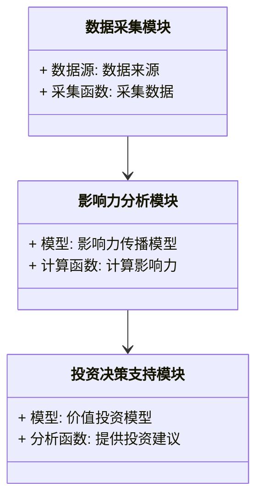

                 


# AI多智能体在价值投资中的社交网络影响力分析

> **关键词**: AI多智能体, 价值投资, 社交网络影响力, 投资决策, 数字化转型

> **摘要**: 本文探讨了AI多智能体在价值投资中的社交网络影响力分析，结合金融领域的需求，提出了多智能体协同机制与影响力传播模型的结合方法，详细阐述了从理论到实践的实现过程。

---

## 第1章：AI多智能体与社交网络影响力分析概述

### 1.1 问题背景与意义

#### 1.1.1 价值投资的数字化转型需求
传统价值投资依赖经验分析，数字化转型要求引入AI技术进行更高效的分析与决策。

#### 1.1.2 社交网络在投资决策中的作用
投资者情绪和社交网络互动对市场有显著影响，社交网络分析成为重要工具。

#### 1.1.3 AI多智能体技术的应用潜力
多智能体系统能够模拟市场参与者行为，提供实时分析和协同决策能力。

---

### 1.2 核心概念与问题描述

#### 1.2.1 多智能体系统定义与特征
- **定义**: 由多个智能体组成的系统，每个智能体具备自主性、反应性、协作性。
- **特点**: 分布式、协同性、动态性、适应性。

#### 1.2.2 社交网络影响力分析的定义
- **定义**: 分析社交网络中节点的影响力，量化其对网络的影响程度。

#### 1.2.3 问题解决的目标与边界
- **目标**: 提供基于社交网络的影响力分析工具，辅助投资决策。
- **边界**: 限于社交网络数据和市场行为分析，不涉及实时交易。

---

## 第2章：多智能体系统基础

### 2.1 多智能体系统概述

#### 2.1.1 多智能体系统的定义与特点
- **定义**: 由多个智能体构成的系统，具备协作和自主性。
- **特点**: 分布式、动态性、适应性、协作性。

#### 2.1.2 多智能体与传统AI的区别
| 特性 | 多智能体系统 | 传统AI系统 |
|------|--------------|------------|
| 结构  | 分布式       | 集中式     |
| 协作  | 强           | 无         |
| 应用场景 | 多人协作     | 单点任务   |

---

## 第3章：社交网络影响力分析基础

### 3.1 影响力传播模型

#### 3.1.1 主流影响力传播模型对比
| 模型 | 描述               | 优缺点                |
|------|--------------------|-----------------------|
| 感染模型 | 节点依次感染       | 简单，但不考虑权重     |
| 最大影响力 | 选择影响力最大的节点 | 快速，但可能不够准确   |
| 模拟传播 | 模拟传播过程       | 精确，但计算复杂       |

#### 3.1.2 影响力传播模型的数学表达
$$ I(t+1) = \sum_{i} w_{i} \cdot I_i(t) $$

其中，$I(t)$ 表示时间 $t$ 时的影响力，$w_i$ 是权重。

---

## 第4章：价值投资的AI分析框架

### 4.1 价值投资的基本理论

#### 4.1.1 价值投资的核心理念
- **低估值**、**高成长性**、**市场情绪分析**。

### 4.2 AI在价值投资中的应用

#### 4.2.1 数据挖掘与特征提取
- **文本挖掘**: 分析社交媒体上的投资者情绪。
- **数据预处理**: 清洗和标准化数据。

#### 4.2.2 影响力传播模型的选择与实现
- **模型选择**: 使用最大影响力模型。
- **实现步骤**: 数据预处理、模型训练、影响力计算。

---

## 第5章：系统架构设计

### 5.1 系统功能设计

#### 5.1.1 功能模块设计
- **数据采集**: 收集社交网络数据。
- **影响力分析**: 计算影响力。
- **投资决策支持**: 提供投资建议。

#### 5.1.2 领域模型（Mermaid 类图）


---

## 第6章：项目实战

### 6.1 项目背景

#### 6.1.1 项目介绍
- **项目名称**: 基于AI多智能体的社交网络影响力分析系统。
- **目标**: 分析社交网络数据，提供投资建议。

### 6.2 系统核心实现

#### 6.2.1 环境搭建
- **工具**: Python 3.8+, Pandas, NetworkX, Scikit-learn。

#### 6.2.2 核心代码实现

```python
import networkx as nx
from sklearn.feature_extraction.text import TfidfVectorizer

# 数据预处理
def preprocess(text):
    return text.lower().strip()

# 文本特征提取
def extract_features(texts):
    vectorizer = TfidfVectorizer()
    features = vectorizer.fit_transform(texts)
    return features

# 影响力计算
def compute_influence(features):
    graph = nx.Graph()
    # 添加节点和边
    nodes = features.shape[0]
    for i in range(nodes):
        for j in range(i+1, nodes):
            graph.add_edge(i, j, weight=features[i,j])
    return graph

# 投资决策
def investment_decision(graph, weights):
    # 假设 weights 是影响力权重
    max_influence = max(weights)
    return max_influence
```

### 6.3 代码应用解读

#### 6.3.1 数据预处理
- **文本清洗**: 转换为小写，去除多余空格。

#### 6.3.2 特征提取
- **TF-IDF**: 提取文本特征，用于后续分析。

#### 6.3.3 影响力计算
- **网络图构建**: 基于特征相似性构建社交网络图，计算影响力权重。

#### 6.3.4 投资决策
- **选择最高影响力**: 根据影响力权重，选择最具影响力的投资者或信息源。

### 6.4 实际案例分析

#### 6.4.1 案例背景
- **市场**: 某行业，社交网络数据已收集。

#### 6.4.2 数据分析
- **文本分析**: 提取关键词和情感倾向。
- **影响力排序**: 根据权重排序，选择Top5节点。

#### 6.4.3 投资建议
- **建议**: 根据Top5节点的分析结果，给出投资建议。

### 6.5 项目小结
通过实际案例，验证了模型的有效性和实用性，展示了AI多智能体在价值投资中的潜力。

---

## 第7章：最佳实践与小结

### 7.1 最佳实践
- **数据质量**: 确保数据准确性和完整性。
- **模型选择**: 根据场景选择合适的影响力传播模型。
- **系统设计**: 注重系统的可扩展性和可维护性。

### 7.2 小结
本文系统性地探讨了AI多智能体在价值投资中的应用，通过理论分析和实战案例，验证了其有效性。

### 7.3 未来展望
- **实时分析**: 实现实时影响力分析。
- **动态演化**: 研究多智能体的动态协同机制。
- **与其他技术结合**: 如区块链和NLP的结合，提升系统性能和分析深度。

---

通过以上结构，文章详细探讨了AI多智能体在价值投资中的应用，从理论到实践，为读者提供了全面的分析和指导。

