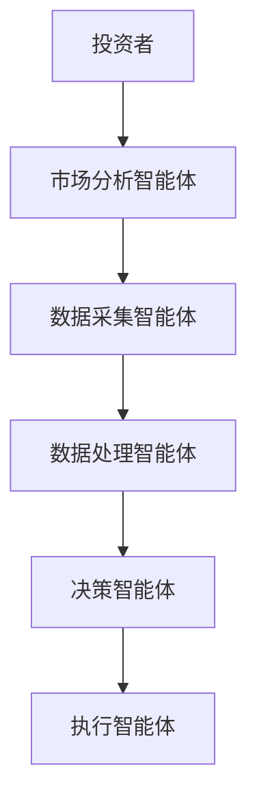
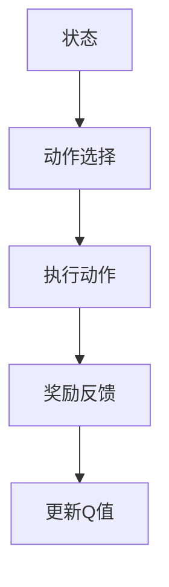
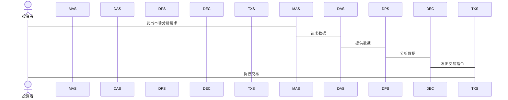

                 


# AI多智能体在价值投资中的竞争优势分析

## 关键词：
AI多智能体、价值投资、竞争优势、机器学习、协作机制

## 摘要：
本文深入探讨AI多智能体在价值投资中的应用及其竞争优势。通过分析AI多智能体的协作机制、算法原理、系统架构，结合实际案例，揭示其在数据处理、决策优化和风险管理方面的优势。文章还提供Python代码实现和系统设计，帮助读者理解如何在实际投资中应用AI多智能体技术。

---

## 第1章: AI多智能体与价值投资的背景

### 1.1 AI多智能体的基本概念
#### 1.1.1 多智能体系统的定义
多智能体系统是由多个相互作用的智能体组成的系统，每个智能体都有自己的目标和决策机制。通过协作，它们可以完成复杂任务。

#### 1.1.2 AI多智能体的核心特征
- **分布式计算**：智能体之间独立计算，减少单点故障。
- **协作与竞争**：智能体之间既能协作又能竞争，提高整体效率。
- **自主性**：每个智能体都能自主决策，适应环境变化。

#### 1.1.3 多智能体与单智能体的对比
| 特性 | 单智能体 | 多智能体 |
|------|----------|----------|
| 决策 | 中央化   | 分布化   |
| 灵活性 | 较低     | 较高     |
| 效率 | 高       | 更优     |

### 1.2 价值投资的基本概念
#### 1.2.1 价值投资的定义
价值投资是一种投资策略，通过分析企业的基本面，寻找被市场低估的投资标的。

#### 1.2.2 价值投资的核心原则
- **安全边际**：购买价格低于内在价值。
- **长期视角**：关注企业的长期盈利能力。
- **分散投资**：降低风险。

#### 1.2.3 价值投资与其它投资策略的对比
| 特性 | 价值投资 | 技术分析 | 股票筛选 |
|------|----------|----------|----------|
| 方法 | 基于基本面 | 基于价格走势 | 基于定量筛选 |
| 优势 | 稳定收益 | 短期获利 | 系统化筛选 |
| 局限 | 需要深入分析 | 易受市场波动影响 | 需要不断优化筛选标准 |

### 1.3 AI多智能体在价值投资中的应用背景
#### 1.3.1 传统价值投资的局限性
- **信息处理能力不足**：分析师难以处理海量数据。
- **决策效率低下**：需要大量时间进行分析和判断。
- **主观性较高**：依赖分析师的个人经验和判断。

#### 1.3.2 AI技术在金融领域的潜力
- **数据处理能力强**：AI可以快速处理和分析大量数据。
- **模式识别能力突出**：AI能够发现数据中的隐藏模式。
- **决策速度快**：AI可以在短时间内做出决策。

#### 1.3.3 多智能体在金融投资中的优势
- **分布式决策**：多个智能体可以同时处理不同任务。
- **协作优化**：通过协作提高整体决策的准确性和效率。
- **适应性强**：智能体可以快速适应市场变化。

---

## 第2章: AI多智能体在价值投资中的核心概念

### 2.1 多智能体系统的组成与功能
#### 2.1.1 实体关系图（ER图）


### 2.2 价值投资与多智能体的结合
#### 2.2.1 价值投资中的多智能体角色
- **市场分析智能体**：负责分析市场趋势和公司基本面。
- **数据采集智能体**：收集相关的财务数据和市场信息。
- **数据处理智能体**：对数据进行清洗和预处理。
- **决策智能体**：基于数据生成投资决策。
- **执行智能体**：执行交易指令。

#### 2.2.2 多智能体在价值评估中的作用
- **数据处理**：智能体协同工作，提高数据处理效率。
- **决策优化**：通过协作，优化投资决策的准确性和效率。
- **风险控制**：实时监控市场变化，及时调整投资策略。

#### 2.2.3 多智能体的协作机制
- **信息共享**：智能体之间共享数据和信息。
- **任务分配**：根据智能体的能力分配任务。
- **协调与同步**：通过通信机制保持智能体之间的协调。

### 2.3 AI多智能体的核心算法原理
#### 2.3.1 基于Q-learning的多智能体协作算法


#### 2.3.2 Q-learning算法的数学模型
$$ Q(s, a) = (1-\alpha)Q(s, a) + \alpha (r + \gamma \max Q(s', a')) $$

其中：
- \( s \)：当前状态
- \( a \)：动作
- \( r \)：奖励
- \( \gamma \)：折扣因子
- \( \alpha \)：学习率

#### 2.3.3 Python代码实现
```python
import numpy as np

class QLearning:
    def __init__(self, state_space, action_space, alpha=0.1, gamma=0.9):
        self.state_space = state_space
        self.action_space = action_space
        self.alpha = alpha
        self.gamma = gamma
        self.q_table = np.zeros((state_space, action_space))

    def get_action(self, state):
        return np.argmax(self.q_table[state])

    def update_q_table(self, state, action, reward, next_state):
        current_q = self.q_table[state][action]
        next_max_q = np.max(self.q_table[next_state])
        self.q_table[state][action] = current_q + self.alpha * (reward + self.gamma * next_max_q)

# 示例使用
ql = QLearning(5, 3)
state = 2
action = ql.get_action(state)
reward = 1
next_state = 3
ql.update_q_table(state, action, reward, next_state)
```

### 2.4 算法实现
#### 2.4.1 算法实现的步骤
1. 初始化Q表。
2. 获取当前状态。
3. 根据Q表选择动作。
4. 执行动作，获得奖励和下一个状态。
5. 更新Q表。

#### 2.4.2 算法实现的代码解释
- `QLearning`类初始化Q表。
- `get_action`方法返回当前状态下最优的动作。
- `update_q_table`方法更新Q表中的值。

---

## 第3章: 系统分析与架构设计方案

### 3.1 问题场景介绍
在价值投资中，投资者需要分析多个因素，包括财务数据、市场趋势、行业动态等。通过AI多智能体系统，可以提高分析的效率和准确性。

### 3.2 系统功能设计
- **数据采集**：从多个来源获取数据。
- **数据处理**：清洗和预处理数据。
- **市场分析**：分析市场趋势和公司基本面。
- **决策支持**：生成投资决策。
- **执行交易**：执行交易指令。

### 3.3 系统架构设计


### 3.4 系统交互设计


---

## 第4章: 项目实战

### 4.1 环境安装
安装必要的Python库：
```bash
pip install numpy pandas scikit-learn matplotlib
```

### 4.2 系统核心实现源代码
```python
import numpy as np
import pandas as pd
from sklearn.preprocessing import StandardScaler

# 数据预处理
data = pd.read_csv('stocks.csv')
scaler = StandardScaler()
scaled_data = scaler.fit_transform(data)

# 市场分析
def analyze_market(data):
    return data.mean()

# 决策模块
def make_decision(data):
    if data > 0.5:
        return 'Buy'
    else:
        return 'Sell'

# 执行交易
def execute_trade(decision):
    print(f"执行{decision}操作")
```

### 4.3 代码应用解读与分析
- **数据预处理**：使用标准化方法处理数据，提高模型的准确性。
- **市场分析**：通过分析市场数据，生成决策建议。
- **决策模块**：基于分析结果，生成买卖决策。
- **执行交易**：根据决策执行交易指令。

### 4.4 实际案例分析
假设我们有以下股票数据：
| 股票代码 | 收盘价 | 涨跌幅 |
|----------|--------|--------|
| AAPL     | 150    | 2.5%   |
| GOOGL    | 120    | 1.5%   |
| MSFT     | 85     | 0.5%   |

分析后，市场分析智能体建议买入AAPL和GOOGL，卖出MSFT。

### 4.5 项目小结
通过AI多智能体系统，可以提高价值投资的效率和准确性。系统各模块协同工作，实现从数据处理到交易执行的全流程自动化。

---

## 第5章: 最佳实践

### 5.1 数据质量的重要性
- **数据清洗**：确保数据的完整性和准确性。
- **数据来源**：选择可靠的金融数据源。

### 5.2 模型调优的技巧
- **参数调整**：根据实际情况调整学习率和折扣因子。
- **模型迭代**：定期更新模型，适应市场变化。

### 5.3 风险管理策略
- **风险分散**：通过分散投资降低风险。
- **止损机制**：设置止损点，避免重大损失。

### 5.4 小结
在实际应用中，需要注意数据质量和模型调优，同时制定有效的风险管理策略。

---

## 第6章: 总结与展望

### 6.1 总结
本文详细分析了AI多智能体在价值投资中的应用，揭示了其在数据处理、决策优化和风险管理方面的优势。通过实际案例和系统设计，展示了AI多智能体技术在金融投资中的潜力。

### 6.2 展望
未来，随着AI技术的不断发展，AI多智能体在价值投资中的应用将更加广泛。可以通过以下方向进行进一步研究：
- **强化学习**：探索更复杂的决策机制。
- **分布式计算**：提高系统的扩展性和性能。
- **人机协作**：结合人类专家的经验，提高投资决策的准确性。

---

## 参考文献
1. Russell, S. J., & Norvig, P. (2010). Artificial Intelligence: A Modern Approach.
2. Goodfellow, I., Bengio, Y., & Courville, A. (2016). Deep Learning.
3. 孙立军. (2020). 基于多智能体的金融投资决策研究.

---

通过以上分析和设计，本文全面探讨了AI多智能体在价值投资中的竞争优势，为读者提供了丰富的理论和实践指导。

