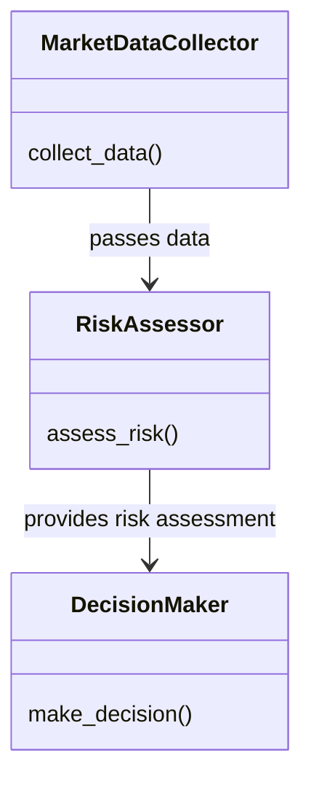
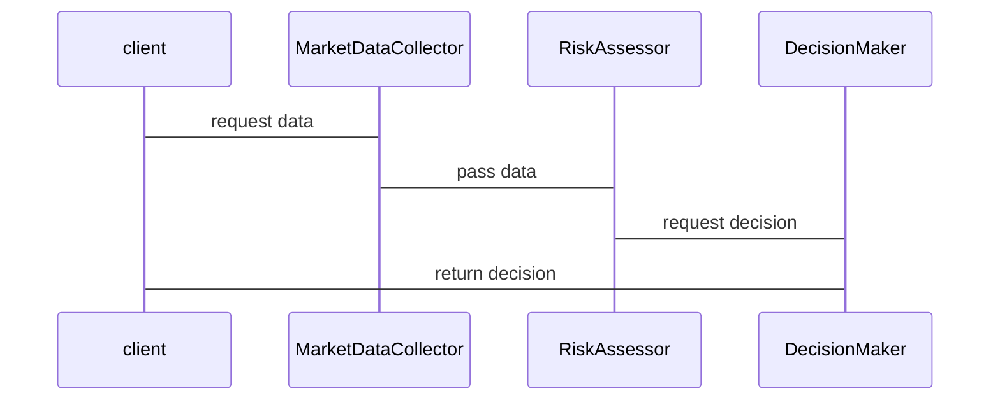

                 


# AI多智能体在价值投资中的风险管理和控制

**关键词：** AI多智能体，风险管理，价值投资，系统架构，算法原理

**摘要：** 本文探讨了AI多智能体在价值投资中的风险管理与控制的应用。通过分析多智能体系统的核心概念、算法原理和系统架构，结合实际案例，展示了如何利用AI技术优化风险管理过程，降低投资风险，提升投资收益。

---

## 第1章: AI多智能体与价值投资概述

### 1.1 问题背景

#### 1.1.1 价值投资中的风险管理问题
- **问题描述：** 价值投资依赖于对市场、公司和经济环境的深入分析，但市场波动和不确定性使得风险管理成为一项挑战。
- **传统方法的局限性：** 传统方法依赖于历史数据和专家经验，难以实时适应市场变化。
- **数据复杂性：** 市场数据多样且复杂，传统模型难以捕捉所有风险因素。

#### 1.1.2 AI多智能体技术的应用潜力
- **多智能体的优势：** 分布式计算、协作决策、实时响应。
- **风险管理中的应用：** 实时监控、风险预警、策略优化。

#### 1.1.3 传统风险管理方法的局限性
- **单一决策模型：** 无法应对多变的市场环境。
- **计算能力限制：** 难以处理海量数据。
- **反应速度：** 传统方法难以实现实时调整。

### 1.2 AI多智能体系统的定义与特点

#### 1.2.1 多智能体系统的定义
- **分布式智能：** 多个智能体协作完成任务。
- **协作与通信：** 智能体之间通过通信协调行动。
- **自主性：** 每个智能体能够自主决策。

#### 1.2.2 AI多智能体的核心特征
- **智能体多样性：** 每个智能体专注于特定任务。
- **协作机制：** 智能体之间通过协议进行协作。
- **动态适应性：** 系统能够根据环境变化实时调整。

#### 1.2.3 多智能体与传统单智能体的对比
- **传统单智能体：** 单一决策中心，计算复杂度高。
- **多智能体：** 分布式决策，计算效率高，适应性强。

### 1.3 价值投资中的风险管理目标

#### 1.3.1 风险识别与评估
- **风险识别：** 识别潜在的市场风险因素。
- **风险评估：** 量化风险的影响程度。

#### 1.3.2 风险控制与优化
- **风险控制：** 制定风险应对策略。
- **风险优化：** 通过调整投资组合降低风险。

#### 1.3.3 风险管理的量化指标
- **VaR（在险价值）：** 量化潜在损失。
- **CVaR（条件在险价值）：** 考虑极端情况下的风险。

---

## 第2章: AI多智能体在风险管理中的核心概念与联系

### 2.1 多智能体系统的原理

#### 2.1.1 分布式智能与协作机制
- **分布式计算：** 任务分解到多个智能体。
- **协作机制：** 智能体之间通过通信和协调完成任务。

#### 2.1.2 多智能体的通信与协调
- **通信协议：** 定义智能体之间的信息交换方式。
- **协调算法：** 如一致性协议、共识机制。

#### 2.1.3 多智能体的决策模型
- **个体决策：** 每个智能体基于自身信息做出决策。
- **群体决策：** 综合个体决策得出最优方案。

### 2.2 风险管理的核心概念

#### 2.2.1 风险的定义与分类
- **风险定义：** 投资可能面临的损失或收益下降。
- **风险分类：** 市场风险、信用风险、流动性风险。

#### 2.2.2 风险评估的指标体系
- **VaR：** 估计潜在损失。
- **波动率：** 衡量资产价格波动。

#### 2.2.3 风险控制的策略与方法
- **分散投资：** 降低单一资产风险。
- **对冲策略：** 利用衍生品对冲风险。

### 2.3 多智能体与风险管理的关系

#### 2.3.1 多智能体在风险管理中的角色
- **数据采集：** 收集市场数据。
- **风险评估：** 分析潜在风险。
- **决策制定：** 制定风险控制策略。

#### 2.3.2 多智能体如何优化风险管理过程
- **实时监控：** 实时跟踪市场变化。
- **协作决策：** 集体智慧降低误判风险。

#### 2.3.3 多智能体与风险管理的协同效应
- **信息共享：** 提高信息利用效率。
- **快速响应：** 实时调整策略。

---

## 第3章: AI多智能体的风险管理算法原理

### 3.1 多智能体系统的算法原理

#### 3.1.1 一致性协议
- **一致性协议：** 确保多个智能体达成共识。
- **算法步骤：**
  1. 初始化：每个智能体初始化本地值。
  2. 通信：智能体之间交换信息。
  3. 更新：根据信息更新本地值。
  4. 重复步骤2-3直到收敛。

#### 3.1.2 共识机制
- **共识机制：** 如RAFT、PAXOS等。
- **应用场景：** 确保智能体之间达成一致。

### 3.2 风险评估算法

#### 3.2.1 风险评估模型
- **模型选择：** 如线性回归、神经网络。
- **模型训练：** 使用历史数据训练模型。

#### 3.2.2 风险评估算法流程
1. 数据预处理：清洗和归一化数据。
2. 模型训练：使用训练数据训练模型。
3. 模型评估：测试模型的准确性和稳定性。
4. 风险预测：输入实时数据，输出风险评估结果。

#### 3.2.3 算法实现
```python
def risk_assessment_algorithm(data):
    # 数据预处理
    processed_data = preprocess(data)
    # 模型训练
    model = train_model(processed_data)
    # 风险评估
    risk_score = model.predict(processed_data)
    return risk_score
```

### 3.3 风险管理的优化算法

#### 3.3.1 风险对冲算法
- **对冲策略：** 利用衍生品对冲风险。
- **算法实现：**
  ```python
  def hedge_strategy(prices):
      # 计算波动率
      volatility = calculate_volatility(prices)
      # 判断是否需要对冲
      if volatility > threshold:
          return " hedge"
      else:
          return " no hedge"
  ```

#### 3.3.2 风险分散算法
- **分散投资：** 优化投资组合。
- **数学模型：**
  $$ \text{Minimize} \sum_{i=1}^{n} w_i^2 $$
  $$ \text{Subject to} \sum_{i=1}^{n} w_i = 1 $$

---

## 第4章: 系统分析与架构设计方案

### 4.1 项目背景与目标

#### 4.1.1 项目背景
- **项目目标：** 构建一个基于AI多智能体的價值投资风险管理系统。
- **项目范围：** 包括数据采集、风险评估、决策制定等模块。

### 4.2 系统功能设计

#### 4.2.1 功能模块划分
- **数据采集模块：** 采集市场数据。
- **风险评估模块：** 分析潜在风险。
- **决策制定模块：** 制定风险控制策略。

#### 4.2.2 领域模型（Mermaid 类图）


### 4.3 系统架构设计

#### 4.3.1 系统架构（Mermaid 架构图）


#### 4.3.2 系统接口设计
- **API接口：** 提供数据采集、风险评估、决策制定等接口。
- **通信协议：** 使用RESTful API进行通信。

#### 4.3.3 系统交互流程（Mermaid 序列图）


---

## 第5章: 项目实战

### 5.1 环境安装

#### 5.1.1 安装依赖
- **Python：** 3.8+
- **库：** numpy, pandas, scikit-learn, flask

```bash
pip install numpy pandas scikit-learn flask
```

### 5.2 系统核心实现

#### 5.2.1 数据采集模块实现
```python
import requests

def collect_data():
    response = requests.get("https://api.example.com/market-data")
    return response.json()
```

#### 5.2.2 风险评估模块实现
```python
from sklearn.linear_model import LinearRegression

def assess_risk(data):
    model = LinearRegression()
    model.fit(data[['price', 'volume']], data['returns'])
    return model.predict(data[['price', 'volume']])
```

#### 5.2.3 决策制定模块实现
```python
def make_decision(risk_scores):
    if max(risk_scores) > threshold:
        return "hedge"
    else:
        return "no hedge"
```

### 5.3 案例分析与解读

#### 5.3.1 案例分析
- **案例背景：** 某股票市场数据。
- **数据处理：** 清洗和归一化。
- **风险评估：** 使用线性回归模型预测风险。
- **决策制定：** 根据风险评估结果制定对冲策略。

#### 5.3.2 代码实现
```python
import pandas as pd

# 数据采集
data = collect_data()

# 数据处理
data_processed = preprocess(data)

# 风险评估
risk_scores = assess_risk(data_processed)

# 决策制定
decision = make_decision(risk_scores)
```

### 5.4 项目小结

#### 5.4.1 成功经验
- **模块化设计：** 明确功能模块，便于维护。
- **协作机制：** 多智能体协作提升效率。

#### 5.4.2 可能的问题
- **数据质量：** 数据清洗和处理需要仔细。
- **模型选择：** 需要根据实际情况选择合适的模型。

---

## 第6章: 最佳实践与总结

### 6.1 最佳实践 tips

#### 6.1.1 数据质量管理
- **数据清洗：** 去除异常值。
- **数据归一化：** 确保数据一致性。

#### 6.1.2 模型优化
- **模型选择：** 根据任务选择合适的算法。
- **超参数调优：** 提高模型性能。

### 6.2 总结

#### 6.2.1 核心内容回顾
- **多智能体系统：** 分布式计算、协作决策。
- **风险管理：** 量化、实时监控、对冲策略。

#### 6.2.2 未来展望
- **技术进步：** 更多AI技术应用于风险管理。
- **数据融合：** 结合多源数据提升准确性。

### 6.3 注意事项

#### 6.3.1 数据隐私
- **数据加密：** 保护敏感数据。
- **合规性：** 符合相关法律法规。

#### 6.3.2 系统维护
- **定期更新：** 适应市场变化。
- **错误处理：** 建立完善的错误处理机制。

---

## 结语

通过本文的探讨，我们了解了AI多智能体在价值投资中的风险管理与控制的应用。从算法原理到系统架构，从项目实战到最佳实践，我们展示了如何利用AI技术优化风险管理过程，降低投资风险，提升投资收益。未来，随着AI技术的不断发展，相信在价值投资中的风险管理将更加智能化、高效化。

--- 

**（全文完）**

