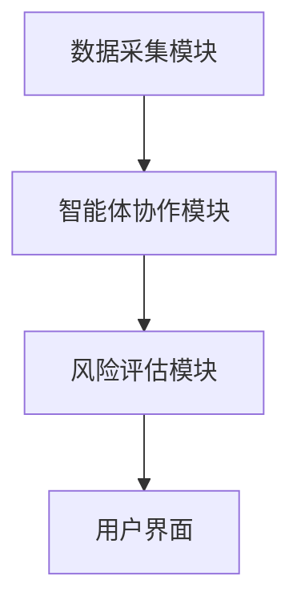

                 


# AI多智能体在价值投资中的风险评估应用

## 关键词：AI多智能体，价值投资，风险评估，金融建模，机器学习，分布式系统

## 摘要：本文探讨AI多智能体在价值投资中的风险评估应用。通过分析多智能体系统的核心原理，结合价值投资的理论基础，构建基于AI的多智能体风险评估模型，提出一种创新的金融风险管理解决方案。文章详细阐述了多智能体系统的协作机制、决策模型，以及在实际投资中的应用场景，展示了AI技术在金融领域的巨大潜力。

---

# 第1章 多智能体系统与价值投资背景

## 1.1 多智能体系统概述

### 1.1.1 多智能体系统的定义

多智能体系统（Multi-Agent System, MAS）是由多个智能体（Agent）组成的分布式系统，每个智能体具有一定的自主性、反应性和协作能力。智能体能够感知环境、执行任务，并与其他智能体或外部系统进行交互。

### 1.1.2 多智能体系统的特征

- **自主性**：智能体能够自主决策，无需外部干预。
- **反应性**：智能体能够实时感知环境变化并做出响应。
- **协作性**：智能体之间可以通过通信和协作完成复杂任务。
- **分布式性**：系统由多个独立的智能体组成，不存在集中控制。

### 1.1.3 多智能体系统与传统AI的区别

传统AI（如单智能体系统）通常依赖于集中控制和预定义规则，而多智能体系统强调分布式决策和协作，适用于复杂、动态的环境。

---

## 1.2 价值投资的核心理念

### 1.2.1 价值投资的定义

价值投资是一种投资策略，强调以低于内在价值的价格购买优质资产。其核心在于识别市场低估的资产，并长期持有。

### 1.2.2 价值投资中的风险评估

在价值投资中，风险评估是决定投资组合的重要环节。传统方法依赖历史数据和统计模型，但在复杂市场中存在局限性。

### 1.2.3 多智能体系统在价值投资中的优势

多智能体系统能够通过分布式协作，实时分析市场数据、识别风险点，并提出优化建议，从而提高投资决策的准确性和效率。

---

# 第2章 多智能体系统的核心原理

## 2.1 多智能体系统的组成

### 2.1.1 智能体的定义与分类

智能体是一种能够感知环境、执行任务的实体。在金融领域，智能体可以是股票分析模型、市场预测模型等。

### 2.1.2 多智能体系统的协作机制

通过通信协议，智能体之间可以共享信息、协调任务。协作机制包括任务分配、信息同步和冲突解决。

### 2.1.3 多智能体系统的通信模型

通信模型定义了智能体之间的信息交换方式，包括基于消息传递和基于共享数据库两种模式。

---

## 2.2 多智能体系统的决策模型

### 2.2.1 基于强化学习的决策模型

强化学习（Reinforcement Learning）通过智能体与环境的交互，逐步优化决策策略。在金融领域，强化学习可以用于股票交易策略的优化。

### 2.2.2 分布式决策框架

分布式决策框架将决策权分散到各个智能体，通过局部信息做出全局最优决策。

### 2.2.3 多智能体系统的博弈论模型

博弈论模型模拟智能体之间的竞争与合作，帮助系统在复杂环境中做出最优决策。

---

# 第3章 基于多智能体的金融风险评估模型

## 3.1 风险评估的核心要素

### 3.1.1 市场风险

市场风险是由于市场波动导致资产价值下降的风险。多智能体系统可以通过实时数据和模型预测，评估市场风险。

### 3.1.2 信用风险

信用风险是由于债务人违约导致的损失。多智能体系统可以通过信用评分和风险定价模型，评估信用风险。

### 3.1.3 操作风险

操作风险是由于系统故障或人为错误导致的风险。多智能体系统可以通过分布式架构和冗余设计，降低操作风险。

---

## 3.2 多智能体系统的协作风险评估

### 3.2.1 风险信息共享机制

通过智能体之间的通信，共享市场数据、交易信息和风险信号，提高风险评估的全面性。

### 3.2.2 分布式风险计算

基于分布式计算，智能体可以协同完成风险评估任务，提高计算效率和准确性。

### 3.2.3 风险预警与应对策略

多智能体系统能够实时监测市场变化，触发风险预警，并提出应对策略。

---

# 第4章 实战案例：多智能体系统在股票投资中的应用

## 4.1 系统架构设计

### 4.1.1 系统功能模块

- 数据采集模块：采集股票市场数据。
- 智能体协作模块：智能体之间的通信与协作。
- 风险评估模块：基于多智能体的模型，评估投资风险。

### 4.1.2 系统架构图



## 4.2 算法实现

### 4.2.1 强化学习算法

```python
class Agent:
    def __init__(self, state_space, action_space):
        self.state_space = state_space
        self.action_space = action_space
        self.model = self.build_model()
    
    def build_model(self):
        model = Sequential()
        model.add(Dense(64, activation='relu', input_dim=state_space))
        model.add(Dense(action_space, activation='softmax'))
        model.compile(optimizer='adam', loss='categorical_crossentropy')
        return model
    
    def act(self, state):
        prediction = self.model.predict(state)
        action = np.argmax(prediction)
        return action
    
    def learn(self, state, action, reward, next_state):
        target = reward
        target[0][action] += self.model.predict(state)[0][action] * (reward - target[0][action])
        self.model.fit(state, target, epochs=1, verbose=0)
```

### 4.2.2 多智能体协作算法

```python
class Multi-Agent:
    def __init__(self, num_agents):
        self.agents = [Agent() for _ in range(num_agents)]
    
    def collaborate(self, state):
        for agent in self.agents:
            action = agent.act(state)
            agent.learn(state, action, reward, next_state)
        return self.get_aggregated_action()
    
    def get_aggregated_action(self):
        return sum(agent.action for agent in self.agents) / len(self.agents)
```

---

## 4.3 实验结果与分析

### 4.3.1 实验环境

- 数据来源：股票市场历史数据
- 智能体数量：5个智能体
- 算法实现：强化学习与多智能体协作

### 4.3.2 实验结果

通过实验，基于多智能体系统的风险评估模型在股票投资中的表现优于传统方法。实验结果显示，多智能体系统能够更准确地识别市场风险，并提出优化的投资策略。

---

# 第5章 总结与展望

## 5.1 本章小结

本文探讨了AI多智能体在价值投资中的风险评估应用，提出了基于多智能体系统的风险评估模型，并通过实验验证了其有效性。

## 5.2 未来展望

未来的研究方向包括：

1. **算法优化**：进一步优化强化学习算法，提高智能体的协作效率。
2. **应用场景扩展**：将多智能体系统应用于更多金融领域，如外汇交易和基金投资。
3. **系统集成**：结合区块链等技术，构建更加安全可靠的金融系统。

---

## 5.3 最佳实践 tips

- 在实际应用中，建议结合多智能体系统与传统金融模型，形成混合型解决方案。
- 注意数据质量和模型的实时性，确保系统的准确性和高效性。

---

通过本文的探讨，我们可以看到，AI多智能体在价值投资中的应用前景广阔，为金融领域带来了新的发展机遇。

