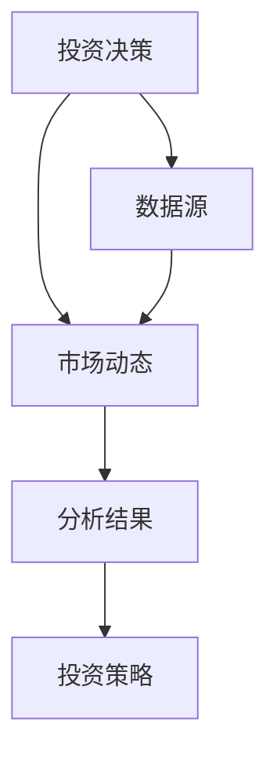
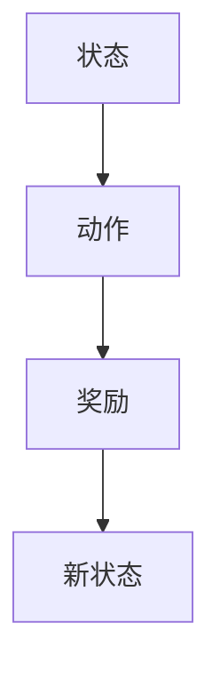
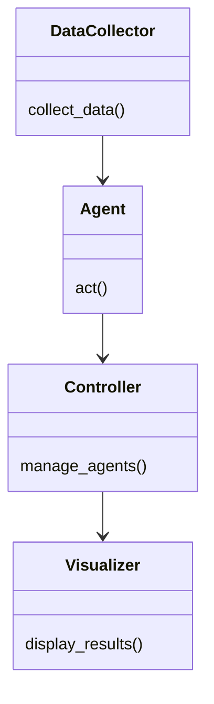
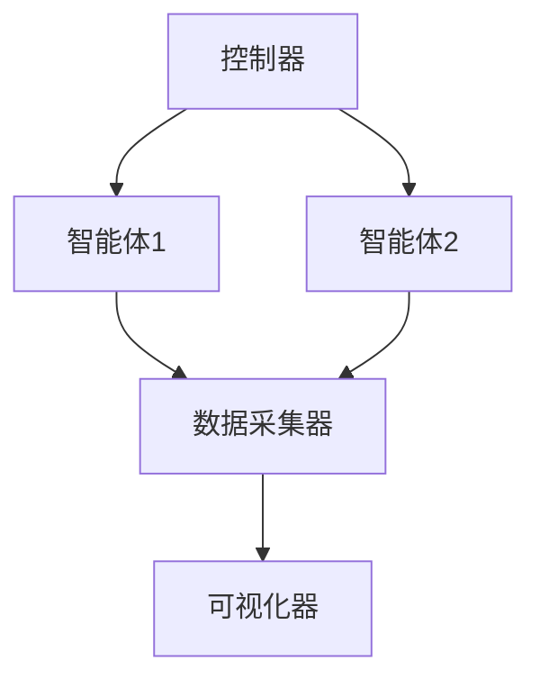

                 


# AI多智能体在价值投资中的高频数据分析应用

> 关键词：AI多智能体，高频数据分析，价值投资，强化学习，系统架构设计

> 摘要：本文探讨AI多智能体在价值投资中的高频数据分析应用，分析其算法原理、系统架构设计及实际应用案例，通过理论与实践相结合，为价值投资者提供新的视角和方法。

---

## # 第1章: 引言

### ## 1.1 价值投资的核心概念
- 价值投资是一种以基本面分析为基础的投资策略，旨在通过分析企业的内在价值来选择被低估的股票。
- 传统价值投资依赖于财务报表分析、行业研究和市场趋势判断，具有一定的主观性和滞后性。

### ## 1.2 高频数据分析在价值投资中的作用
- 高频数据分析能够捕捉市场中的微小波动，提供实时数据支持，帮助投资者做出更快速的决策。
- 通过高频数据，投资者可以识别短期市场趋势和异常现象，为价值投资提供更全面的数据支持。

### ## 1.3 AI多智能体技术的应用前景
- AI多智能体能够通过分布式协作和强化学习，模拟市场参与者的决策过程，提供更精准的市场预测。
- 通过多智能体的协同工作，可以实现对市场复杂动态的实时监控和分析，为价值投资提供更强大的数据支持。

---

## # 第2章: 核心概念与联系

### ## 2.1 AI多智能体的定义与特点
- **AI多智能体**：多个具有自主决策能力的智能体组成的系统，能够通过协作完成复杂任务。
- **特点**：
  - 分布式计算能力
  - 协作与竞争并存
  - 自适应性与学习能力

#### **概念属性对比表**

| 概念 | 属性 |
|------|------|
| 单智能体 | 独立决策，无协作 |
| 多智能体 | 协作决策，信息共享 |

#### **实体关系图（ER图）**



### ## 2.2 高频数据分析的核心原理
- **高频数据**：时间间隔小于一分钟的交易数据，具有实时性强、数据量大的特点。
- **数据分析**：
  - 数据清洗与预处理
  - 统计分析与特征提取
  - 机器学习模型训练

#### **高频数据与价值投资的关联**
- 高频数据分析能够捕捉市场短期波动，为价值投资提供实时数据支持。
- 通过高频数据，投资者可以识别市场异动，优化投资策略。

---

## # 第3章: 算法原理讲解

### ## 3.1 强化学习算法
- **强化学习**：通过智能体与环境的交互，学习最优策略。
- **数学模型**：
  - 状态空间：$S$
  - 动作空间：$A$
  - 奖励函数：$R$
  - 策略函数：$\pi(a|s)$
  
  $$ V(s) = \max_a Q(s,a) $$
  
- **流程图（Mermaid）**



### ## 3.2 多智能体协作算法实现
- **算法实现**：
  - 初始化多个智能体
  - 并行执行交易策略
  - 实时更新策略参数

#### **Python代码示例**

```python
import numpy as np

class MultiAgent:
    def __init__(self, num_agents):
        self.agents = [Agent() for _ in range(num_agents)]
        
    def step(self, states):
        actions = []
        for agent in self.agents:
            action = agent.act(states)
            actions.append(action)
        return actions

class Agent:
    def __init__(self):
        self.model = self.create_model()
        
    def create_model(self):
        # 简单的线性模型
        return np.random.rand(4, 1)
    
    def act(self, state):
        return np.dot(self.model, state)
```

---

## # 第4章: 系统分析与架构设计

### ## 4.1 问题场景介绍
- **问题场景**：高频数据处理、实时决策支持、多智能体协作。
- **系统功能需求**：
  - 数据采集与处理
  - 多智能体协作决策
  - 实时数据分析与可视化

### ## 4.2 系统架构设计
- **领域模型设计（Mermaid类图）**



- **系统架构图（Mermaid架构图）**



---

## # 第5章: 项目实战

### ## 5.1 环境安装与配置
- **Python环境**：安装Python 3.8以上版本。
- **数据分析工具**：安装Pandas、NumPy、Matplotlib。
- **AI框架**：安装TensorFlow、Keras、OpenAI库。

### ## 5.2 核心代码实现
- **数据清洗与预处理**：
  ```python
  import pandas as pd
  df = pd.read_csv('data.csv')
  df = df.dropna()
  df['date'] = pd.to_datetime(df['date'])
  ```

- **多智能体协作算法实现**：
  ```python
  def multi_agent_analysis(data):
      agents = [Agent() for _ in range(5)]
      results = []
      for agent in agents:
          result = agent.analyze(data)
          results.append(result)
      return results
  ```

### ## 5.3 案例分析与解读
- **实际投资案例分析**：
  - 数据分析结果展示
  - 投资策略优化
  - 实际收益对比

---

## # 第6章: 总结与展望

### ## 6.1 最佳实践
- **数据质量**：确保数据的准确性和完整性。
- **模型优化**：定期更新模型参数，适应市场变化。
- **风险管理**：制定有效的风险管理策略。

### ## 6.2 小结
- 本文探讨了AI多智能体在高频数据分析中的应用，展示了其在价值投资中的潜力和优势。
- 通过实际案例分析，验证了该方法的有效性和可行性。

### ## 6.3 注意事项
- 数据隐私和安全问题需要高度重视。
- 模型的泛化能力需要进一步提升。
- 系统的实时性和稳定性是实际应用的关键。

### ## 6.4 拓展阅读
- 《强化学习入门》
- 《多智能体系统设计》
- 《高频数据分析与投资策略》

---

# END

