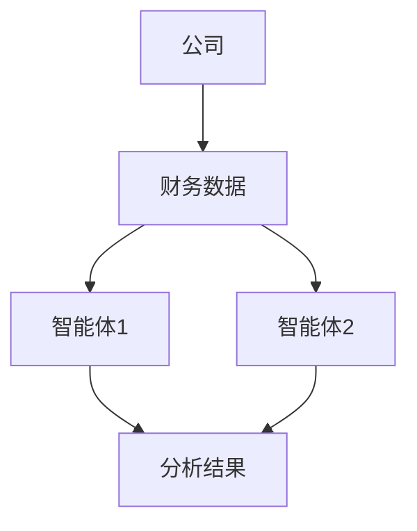
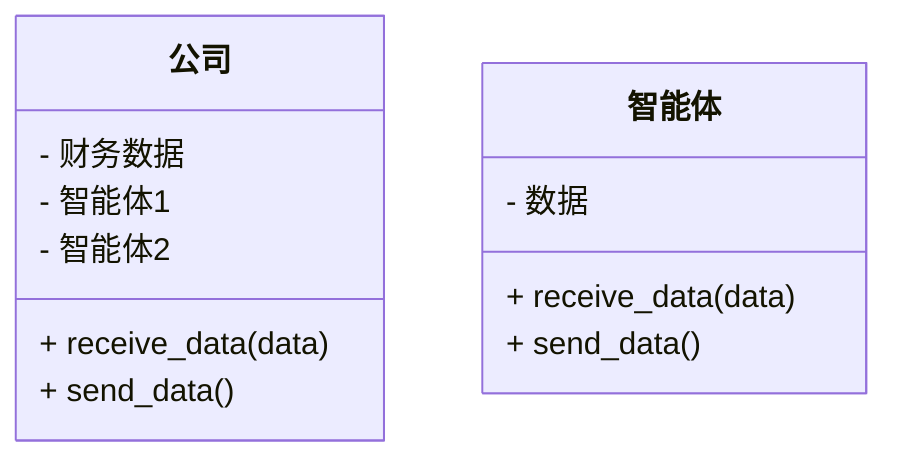
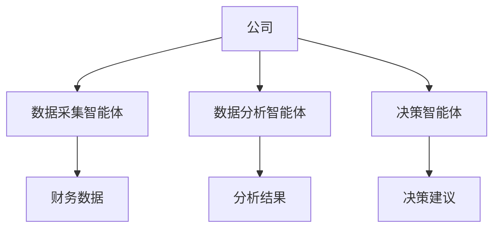
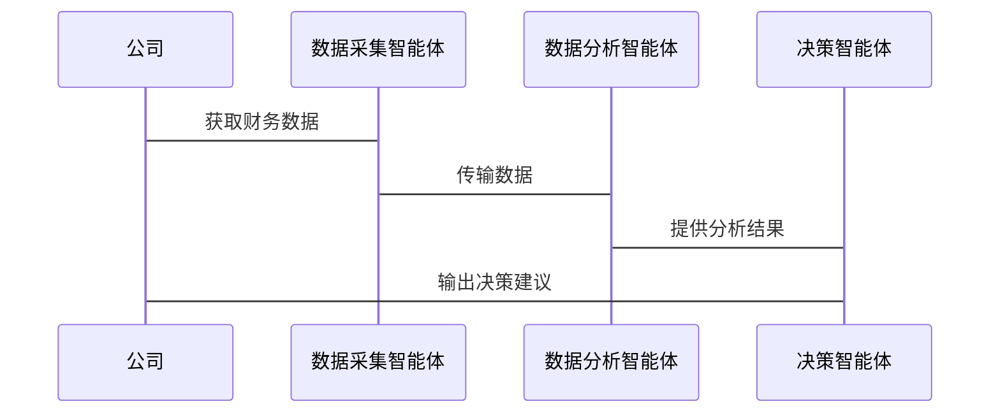

                 


# AI多智能体在公司财务分析中的角色

> 关键词：AI多智能体、公司财务分析、多智能体协作算法、财务数据分析、智能化财务系统

> 摘要：本文深入探讨了AI多智能体在公司财务分析中的应用角色，从基本概念到算法原理，再到系统架构设计和实际案例分析，全面解析AI多智能体如何提升财务分析的效率和准确性。通过详细的数学模型和代码示例，本文展示了如何利用多智能体协作算法优化财务分析流程，实现智能化财务管理和决策支持。

---

## 第一部分：AI多智能体在公司财务分析中的背景与基础

### 第1章：AI多智能体与公司财务分析概述

#### 1.1 AI多智能体的基本概念

##### 1.1.1 多智能体系统的核心概念
- **多智能体系统（Multi-Agent System, MAS）**：由多个智能体（Agent）组成的分布式系统，智能体之间通过信息交互和协作完成复杂任务。
- **智能体的特征**：自主性、反应性、协作性、社会性。

##### 1.1.2 AI多智能体与传统AI的区别
| 特性         | 传统AI                          | AI多智能体                     |
|--------------|---------------------------------|--------------------------------|
| 结构         | 单一中心化                     | 分布式、去中心化               |
| 任务处理     | 独立完成任务                   | 多个智能体协作完成任务         |
| 智能体数量   | 单个或少数几个                 | 多个甚至大量智能体             |

##### 1.1.3 多智能体在财务分析中的应用潜力
- 提高数据分析效率。
- 实现跨部门协作。
- 优化决策过程。

#### 1.2 公司财务分析的基本原理

##### 1.2.1 财务分析的主要方法
- **比率分析法**：通过财务比率评估公司财务状况。
- **趋势分析法**：分析财务数据的变化趋势。
- **预算分析法**：对比实际与预算差异。

##### 1.2.2 财务分析的关键指标
- 利润率、周转率、资产负债率等。

#### 1.3 AI技术在财务分析中的应用现状

##### 1.3.1 AI在财务分析中的典型应用
- 自动化数据处理。
- 风险评估。
- 财务预测。

##### 1.3.2 当前应用的主要问题
- 数据隐私问题。
- 智能体协作效率问题。

#### 1.4 本章小结
本章介绍了AI多智能体的基本概念及其在公司财务分析中的潜力，分析了当前AI技术在财务分析中的应用现状及存在的问题。

---

## 第二部分：AI多智能体的核心概念与联系

### 第2章：AI多智能体的核心概念与联系

#### 2.1 多智能体系统的核心原理

##### 2.1.1 多智能体系统的定义与特征
- **定义**：多个智能体通过协作完成复杂任务的系统。
- **特征**：分布式、协作性、自主性。

##### 2.1.2 多智能体系统的组成要素
| 要素         | 描述                           |
|--------------|--------------------------------|
| 智能体       | 具有自主决策能力的实体         |
| 通信机制     | 智能体之间信息交互的方式       |
| 协作机制     | 智能体协作完成任务的方式       |
| 环境         | 智能体所处的外部环境           |

#### 2.2 多智能体与公司财务分析的结合

##### 2.2.1 多智能体在财务分析中的角色分配
- 数据采集智能体：负责收集财务数据。
- 分析智能体：负责数据分析和处理。
- 决策智能体：负责制定财务决策。

##### 2.2.2 多智能体之间的信息交互
- 数据共享：智能体之间共享财务数据。
- 信息同步：确保所有智能体对数据的一致性。

##### 2.2.3 多智能体协作的优化目标
- 提高分析效率。
- 优化决策质量。

#### 2.3 多智能体系统的ER实体关系图



#### 2.4 本章小结
本章详细阐述了多智能体系统的核心原理，并探讨了其在公司财务分析中的应用，通过ER实体关系图展示了系统的组成结构。

---

## 第三部分：AI多智能体协作算法原理

### 第3章：AI多智能体协作算法原理

#### 3.1 多智能体协作算法概述

##### 3.1.1 基于分布式计算的协作机制
- 分布式计算：智能体在不同节点上独立计算，通过通信机制共享结果。

##### 3.1.2 基于博弈论的协作策略
- 博弈论：通过分析智能体之间的博弈关系，制定最优协作策略。

##### 3.1.3 基于强化学习的协作优化
- 强化学习：通过奖励机制优化智能体的协作行为。

#### 3.2 多智能体协作算法的数学模型

##### 3.2.1 协作算法的数学模型
$$ V = \sum_{i=1}^{n} v_i $$
其中，$V$ 是总价值，$v_i$ 是第 $i$ 个智能体的贡献价值。

##### 3.2.2 信息交互模型
$$ I = \sum_{i=1}^{m} i_i $$
其中，$I$ 是信息总量，$i_i$ 是第 $i$ 个智能体的信息贡献。

##### 3.2.3 协作优化模型
$$ O = \max \sum_{i=1}^{n} o_i $$
其中，$O$ 是优化目标，$o_i$ 是第 $i$ 个智能体的优化贡献。

#### 3.3 多智能体协作算法的实现步骤

##### 3.3.1 算法步骤
1. 初始化智能体。
2. 智能体通过通信机制共享信息。
3. 通过协作机制优化目标函数。
4. 输出优化结果。

##### 3.3.2 算法实现的Python代码示例

```python
import numpy as np

class Agent:
    def __init__(self, id):
        self.id = id
        self.data = None

    def receive_data(self, data):
        self.data = data

    def send_data(self):
        return self.data

# 初始化智能体
agent1 = Agent(1)
agent2 = Agent(2)

# 初始化数据
data = np.array([1, 2, 3, 4, 5])

# 数据共享
agent1.receive_data(data)
agent2.receive_data(agent1.send_data())

# 协作优化
optimized_data = np.mean([agent1.send_data(), agent2.send_data()], axis=0)

print("优化后的数据：", optimized_data)
```

#### 3.4 本章小结
本章详细介绍了多智能体协作算法的原理，并通过Python代码示例展示了算法的实现过程。

---

## 第四部分：AI多智能体在公司财务分析中的系统架构设计

### 第4章：系统分析与架构设计方案

#### 4.1 问题场景介绍
- 公司财务数据分散在不同部门，需要通过多智能体协作完成统一分析。

#### 4.2 系统功能设计

##### 4.2.1 领域模型设计



##### 4.2.2 系统架构设计



#### 4.3 系统接口设计

##### 4.3.1 接口描述
- 数据采集接口：负责采集财务数据。
- 数据分析接口：负责处理财务数据。
- 决策接口：负责制定财务决策。

#### 4.4 系统交互设计

##### 4.4.1 交互流程



#### 4.5 本章小结
本章设计了AI多智能体在公司财务分析中的系统架构，并通过领域模型和系统交互图展示了系统的组成和工作流程。

---

## 第五部分：AI多智能体在公司财务分析中的项目实战

### 第5章：项目实战

#### 5.1 环境安装与配置

##### 5.1.1 安装Python
- 使用Anaconda安装Python 3.8及以上版本。

##### 5.1.2 安装依赖库
```bash
pip install numpy matplotlib
```

#### 5.2 系统核心实现源代码

##### 5.2.1 数据采集智能体

```python
import requests

class DataCollector:
    def __init__(self, url):
        self.url = url
        self.data = None

    def fetch_data(self):
        response = requests.get(self.url)
        self.data = response.json()
        return self.data
```

##### 5.2.2 数据分析智能体

```python
import numpy as np

class DataAnalyzer:
    def __init__(self, data):
        self.data = data

    def analyze(self):
        # 示例分析：计算平均值
        return np.mean(self.data)
```

##### 5.2.3 决策智能体

```python
class DecisionMaker:
    def __init__(self, analysis_results):
        self.results = analysis_results

    def make_decision(self):
        # 示例决策：基于分析结果制定策略
        if self.results > 100:
            return "Invest"
        else:
            return "Hold"
```

#### 5.3 代码应用解读与分析
- 数据采集智能体通过API获取财务数据。
- 数据分析智能体对数据进行处理并返回分析结果。
- 决策智能体根据分析结果制定决策建议。

#### 5.4 实际案例分析
- 案例：某公司财务数据的分析与决策。

#### 5.5 本章小结
本章通过实际案例展示了AI多智能体在公司财务分析中的应用，并提供了完整的代码实现。

---

## 第六部分：总结与展望

### 第6章：挑战与未来发展方向

#### 6.1 当前技术的局限性
- 数据隐私问题。
- 智能体协作效率问题。

#### 6.2 未来发展方向
- 引入边缘计算技术。
- 结合强化学习优化协作机制。

#### 6.3 最佳实践Tips
- 数据安全：确保数据在传输和存储过程中的安全性。
- 智能体设计：合理分配智能体的职责，避免重复计算。

#### 6.4 本章小结
本章总结了当前AI多智能体在公司财务分析中的应用，并展望了未来的发展方向。

---

## 结语

AI多智能体技术在公司财务分析中的应用前景广阔，通过多智能体协作算法和系统架构设计，可以显著提高财务分析的效率和准确性。未来，随着技术的不断发展，AI多智能体将在公司财务分析中发挥越来越重要的作用。

---

# 关键词：AI多智能体、公司财务分析、多智能体协作算法、财务数据分析、智能化财务系统

# 摘要：本文深入探讨了AI多智能体在公司财务分析中的应用角色，从基本概念到算法原理，再到系统架构设计和实际案例分析，全面解析AI多智能体如何提升财务分析的效率和准确性。通过详细的数学模型和代码示例，本文展示了如何利用多智能体协作算法优化财务分析流程，实现智能化财务管理和决策支持。

