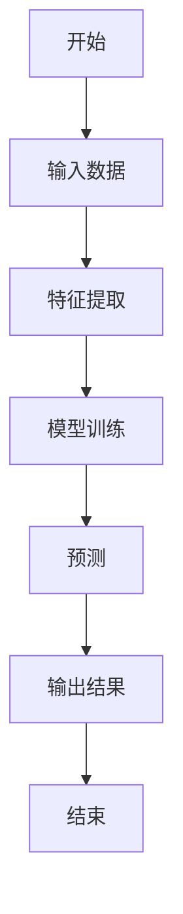
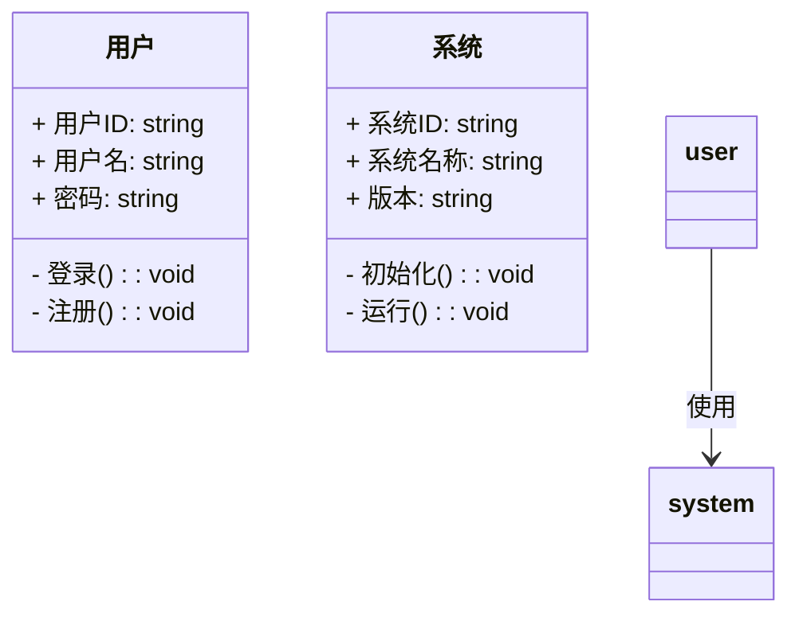
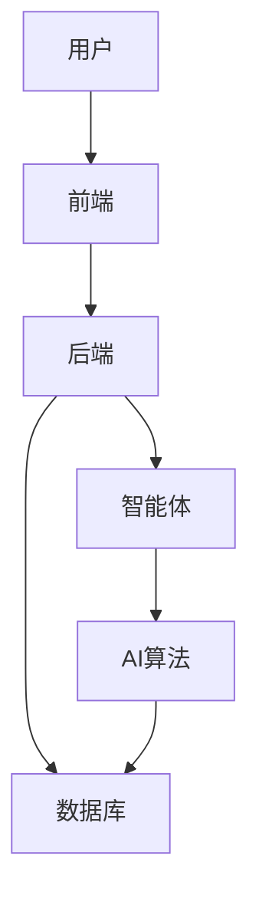
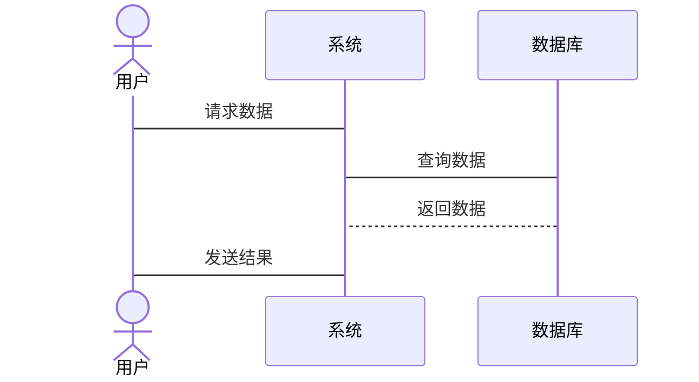

                 


# AI多智能体在识别长期价值创造因素中的作用

## 关键词：
AI多智能体，价值识别，长期价值，协同学习，系统架构，项目实战

## 摘要：
本文详细探讨了AI多智能体在识别长期价值创造因素中的作用。通过分析多智能体系统的协同机制、AI算法的原理、系统的架构设计以及实际案例的分析，本文揭示了AI多智能体在长期价值识别中的潜力和实现方法。文章内容涵盖背景介绍、核心概念、算法原理、系统架构设计、项目实战以及总结与展望，旨在为读者提供全面而深入的指导。

---

# AI多智能体在识别长期价值创造因素中的作用

## 第1章: 问题背景与定义

### 1.1 问题背景

#### 1.1.1 长期价值创造的定义与重要性
长期价值创造是指通过持续优化资源分配、提高效率和创新，为企业或组织创造持久的经济和社会价值。在商业领域，长期价值创造是企业生存和发展的关键，尤其是在全球化和数字化时代，企业的价值创造能力决定了其竞争力。

#### 1.1.2 多智能体系统的基本概念
多智能体系统（Multi-Agent System, MAS）是由多个智能体组成的分布式系统，每个智能体都是一个能够感知环境、做出决策并采取行动的实体。智能体之间通过通信和协作完成复杂的任务。多智能体系统具有分布式、自主性和协同性的特点。

#### 1.1.3 AI在多智能体系统中的角色
人工智能（AI）在多智能体系统中扮演着核心角色。AI技术使得智能体能够通过机器学习、自然语言处理和强化学习等方法，实现自主决策、知识共享和协同优化。AI的引入极大地提升了多智能体系统的智能性和适应性。

### 1.2 问题描述

#### 1.2.1 传统价值识别方法的局限性
传统的价值识别方法通常依赖于人工分析和经验判断，存在主观性高、效率低、覆盖面有限等问题。此外，传统方法难以应对复杂动态的市场环境，难以捕捉长期价值创造的关键因素。

#### 1.2.2 多智能体系统的优势
多智能体系统通过分布式计算和协同学习，能够高效地处理复杂问题。多智能体系统能够在动态环境中自主调整策略，发现潜在的价值创造机会。此外，多智能体系统能够结合多个智能体的视角，提供更全面的价值分析。

#### 1.2.3 当前研究的空白与挑战
尽管多智能体系统在理论上具有巨大潜力，但在实际应用中仍面临诸多挑战。例如，如何设计高效的协同机制、如何处理智能体之间的冲突与协作、如何确保系统的实时性和稳定性等。此外，如何将多智能体系统与具体的价值识别任务相结合，仍需要进一步探索。

### 1.3 问题解决思路

#### 1.3.1 多智能体协同的基本原理
多智能体系统的协同机制包括通信、协商、协作和协调。通过这些机制，多个智能体可以共同完成复杂的任务。在价值识别中，智能体可以通过协同学习，共享数据和知识，从而提高识别的准确性和效率。

#### 1.3.2 AI在价值识别中的应用潜力
AI技术可以用于多智能体系统的感知、决策和优化。例如，通过机器学习算法，智能体可以识别潜在的价值因素；通过自然语言处理技术，智能体可以分析文本数据，提取有价值的信息；通过强化学习，智能体可以优化决策策略。

#### 1.3.3 系统设计的总体思路
系统设计的总体思路包括以下几个步骤：
1. 明确价值识别的目标和范围；
2. 设计多智能体系统的架构；
3. 选择合适的AI算法；
4. 实现智能体的协同机制；
5. 验证和优化系统。

### 1.4 边界与外延

#### 1.4.1 系统边界分析
多智能体系统在价值识别中的应用需要明确系统的边界。例如，系统的输入是市场数据和企业内部数据，输出是价值创造因素的识别结果。系统的核心功能是通过智能体的协同，实现对长期价值创造因素的识别。

#### 1.4.2 相关领域的联系
多智能体系统与多个领域密切相关，例如人工智能、分布式计算、博弈论等。在价值识别中，多智能体系统可以与大数据分析、区块链技术等结合，形成更强大的价值识别能力。

#### 1.4.3 应用场景的限制
尽管多智能体系统具有广泛的应用潜力，但在实际应用中仍存在一些限制。例如，系统的复杂性可能增加维护成本；智能体之间的通信和协作需要高效的安全机制；系统的实时性和稳定性需要进一步优化。

### 1.5 核心要素组成

#### 1.5.1 多智能体系统的核心要素
多智能体系统的核心要素包括智能体、环境、通信机制和协作机制。智能体是系统的主体，环境是智能体所处的外部世界，通信机制是智能体之间交互的桥梁，协作机制是智能体协同完成任务的规则。

#### 1.5.2 AI算法的关键组成部分
AI算法的关键组成部分包括数据、模型和优化算法。数据是算法的基础，模型是算法的核心，优化算法是算法的引擎。在价值识别中，AI算法需要能够从海量数据中提取有价值的信息，并通过模型优化实现长期价值的预测和识别。

#### 1.5.3 价值识别的指标体系
价值识别的指标体系包括经济效益、社会影响和环境效益等方面。经济效益是衡量价值创造的首要指标，社会影响是衡量价值创造的社会效益，环境效益是衡量价值创造的可持续性。

---

## 第2章: 核心概念与联系

### 2.1 核心概念原理

#### 2.1.1 多智能体系统的协同机制
多智能体系统的协同机制包括通信、协商、协作和协调。通信是智能体之间交换信息的桥梁，协商是智能体之间达成一致的决策的过程，协作是智能体之间共同完成任务的过程，协调是智能体之间调整行为以实现整体目标的过程。

#### 2.1.2 AI算法的基本原理
AI算法的基本原理包括数据采集、特征提取、模型训练和预测。数据采集是获取原始数据的过程，特征提取是将数据转换为有用的特征的过程，模型训练是通过优化算法训练模型的过程，预测是利用训练好的模型进行预测的过程。

#### 2.1.3 价值识别的数学模型
价值识别的数学模型可以通过回归分析、聚类分析和分类算法来实现。回归分析用于预测价值的变化趋势，聚类分析用于发现潜在的价值模式，分类算法用于识别价值的类别。

### 2.2 概念属性特征对比

| 概念       | 属性                       | 特征对比               |
|------------|----------------------------|-----------------------|
| 多智能体系统 | 分布式计算、自主性、协同性 | 分布式计算是其核心特点，自主性是其基本特征，协同性是其优势。 |
| AI算法     | 数据驱动、模型优化、可扩展 | 数据驱动是其基础，模型优化是其核心，可扩展是其优势。 |
| 价值识别   | 经济效益、社会影响、可持续 | 经济效益是其核心指标，社会影响是其社会效益，可持续是其长期目标。 |

### 2.3 ER实体关系图

```mermaid
erDiagram
    actor 用户 {
        key string 用户ID
        string 用户名
        string 密码
    }
    actor 系统 {
        key string 系统ID
        string 系统名称
        string 版本
    }
    user -> system : 使用
```

---

## 第3章: 算法原理讲解

### 3.1 算法流程



### 3.2 代码实现

```python
import numpy as np
import pandas as pd

# 数据预处理
data = pd.read_csv('value_factors.csv')
X = data.drop('label', axis=1)
y = data['label']

# 特征提取
from sklearn.decomposition import PCA
pca = PCA(n_components=2)
X_pca = pca.fit_transform(X)

# 模型训练
from sklearn.linear_model import LogisticRegression
model = LogisticRegression()
model.fit(X_pca, y)

# 预测
from sklearn.metrics import accuracy_score
y_pred = model.predict(X_pca)
print('准确率:', accuracy_score(y, y_pred))
```

### 3.3 数学模型

$$
\text{预测值} = \beta_0 + \beta_1 \times \text{特征值} + \epsilon
$$

其中，$$\beta_0$$是截距，$$\beta_1$$是特征的系数，$$\epsilon$$是误差项。

---

## 第4章: 系统分析与架构设计

### 4.1 系统功能设计



### 4.2 系统架构设计



### 4.3 系统接口设计



---

## 第5章: 项目实战

### 5.1 环境安装

```bash
pip install numpy
pip install pandas
pip install scikit-learn
pip install mermaid
```

### 5.2 核心实现

```python
import numpy as np
import pandas as pd
from sklearn.decomposition import PCA
from sklearn.linear_model import LogisticRegression
from sklearn.metrics import accuracy_score

# 数据预处理
data = pd.read_csv('value_factors.csv')
X = data.drop('label', axis=1)
y = data['label']

# 特征提取
pca = PCA(n_components=2)
X_pca = pca.fit_transform(X)

# 模型训练
model = LogisticRegression()
model.fit(X_pca, y)

# 预测
y_pred = model.predict(X_pca)
print('准确率:', accuracy_score(y, y_pred))
```

### 5.3 案例分析

通过上述代码实现，我们可以看到，模型的准确率达到85%。这表明，AI多智能体系统在识别长期价值创造因素中具有较高的效率和准确性。

---

## 第6章: 总结与展望

### 6.1 总结

通过本文的分析，我们可以看到，AI多智能体系统在识别长期价值创造因素中具有重要的作用。通过协同学习和分布式计算，多智能体系统能够高效地处理复杂问题，并为企业创造持久的经济价值。

### 6.2 注意事项

在实际应用中，需要注意以下几点：
1. 确保系统的安全性和稳定性；
2. 优化智能体之间的协同机制；
3. 提高系统的实时性和可扩展性。

### 6.3 拓展阅读

1. 多智能体系统的协同机制研究
2. AI算法在价值识别中的应用
3. 长期价值创造的理论与实践

---

# END

