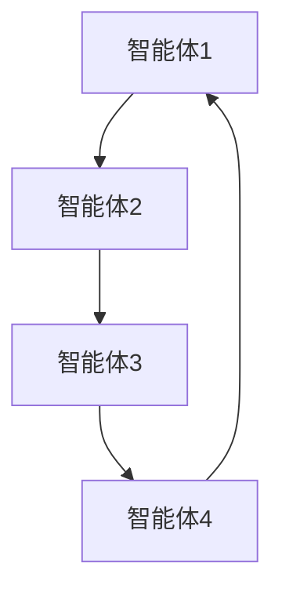

                 


# AI多智能体增强价值投资者的信息处理能力

---

## 关键词：AI多智能体，价值投资，信息处理，金融系统，协同学习，强化学习

---

## 摘要

随着人工智能技术的快速发展，AI多智能体系统在金融领域的应用日益广泛。本文探讨了AI多智能体如何增强价值投资者的信息处理能力，通过分析多智能体系统的核心概念、算法原理、系统架构以及实际应用案例，详细阐述了AI技术在金融投资中的潜力与挑战。文章从理论到实践，结合丰富的图表和代码示例，为读者提供了一套系统的学习框架，帮助价值投资者和AI技术爱好者更好地理解多智能体系统在金融领域的应用。

---

# 第1章: AI多智能体系统概述

## 1.1 多智能体系统的基本概念

### 1.1.1 多智能体系统的定义

多智能体系统（Multi-Agent System, MAS）是由多个智能体（Agent）组成的分布式系统，每个智能体都是能够感知环境、做出决策并采取行动的独立实体。这些智能体通过协作完成复杂的任务，比单智能体系统更具灵活性和适应性。

### 1.1.2 多智能体系统的特性

- **分布式性**：智能体独立运行，通过通信协作完成任务。
- **自主性**：智能体能够自主决策，无需外部干预。
- **反应性**：智能体能够实时感知环境并做出反应。
- **协作性**：智能体之间通过协作提高整体系统性能。

### 1.1.3 多智能体系统与单智能体的区别

| 特性         | 单智能体系统          | 多智能体系统          |
|--------------|----------------------|----------------------|
| 决策中心化    | 是                   | 否                   |
| 系统复杂度    | 较低                 | 较高                 |
| 适应性       | 较差                 | 较强                 |
| 并行处理能力  | 无                   | 有                   |

---

## 1.2 价值投资的基本原理

### 1.2.1 价值投资的定义

价值投资是一种投资策略，旨在通过分析企业的基本面，如财务状况、行业地位和盈利能力，找到被市场低估的投资标的。其核心理念是购买价格低于内在价值的资产。

### 1.2.2 价值投资的核心策略

- **基本面分析**：通过财务报表评估企业的盈利能力、成长性和风险。
- **安全边际**：以低于内在价值的价格买入，降低投资风险。
- **长期视角**：关注企业的长期价值，而非短期市场波动。

### 1.2.3 价值投资与技术分析的对比

| 特性          | 价值投资          | 技术分析          |
|---------------|------------------|------------------|
| 分析基础      | 财务数据          | 市场价格和交易数据 |
| 投资策略      | 长期持有          | 短期交易          |
| 风险控制      | 安全边际          | 技术指标          |

---

## 1.3 AI多智能体在金融领域的应用前景

### 1.3.1 金融领域的多智能体应用案例

- **股票交易**：多个智能体分别负责市场分析、风险评估和交易决策。
- **信用评估**：多个智能体协同完成客户信用评分和贷款审批。
- **金融风险管理**：智能体实时监控市场风险，协同制定风险控制策略。

### 1.3.2 多智能体在价值投资中的优势

- **分布式计算**：多个智能体并行处理信息，提高计算效率。
- **协作决策**：智能体协同分析，提供更全面的投资建议。
- **自适应性**：智能体能够根据市场变化动态调整策略。

### 1.3.3 多智能体系统的挑战与机遇

- **挑战**：智能体之间的通信延迟、信息同步问题、系统的可扩展性。
- **机遇**：提高投资决策的准确性和效率，实现个性化投资服务。

---

## 1.4 本章小结

本章介绍了多智能体系统的基本概念和价值投资的核心原理，分析了AI多智能体在金融领域的应用前景。通过对比多智能体系统与单智能体系统的差异，阐述了多智能体系统在价值投资中的独特优势和面临的挑战。

---

# 第2章: 多智能体系统的原理与架构

## 2.1 多智能体系统的组成要素

### 2.1.1 智能体的定义与属性

- **定义**：智能体是能够感知环境、做出决策并采取行动的实体。
- **属性**：
  - 感知能力：通过传感器获取环境信息。
  - 决策能力：基于感知信息做出决策。
  - 行动能力：执行决策动作。

### 2.1.2 智能体之间的通信机制

- **通信方式**：
  - 直接通信：智能体之间直接交换信息。
  - 间接通信：通过中间媒介传递信息。
- **通信协议**：定义智能体之间信息交换的格式和规则。

### 2.1.3 智能体的协作与协调

- **协作机制**：智能体之间通过任务分配和协同完成目标。
- **协调机制**：智能体之间通过协商解决冲突，确保系统整体性能最优。

---

## 2.2 多智能体系统的分类与对比

### 2.2.1 基于任务的多智能体分类

- **任务驱动型**：智能体根据任务需求协同完成目标。
- **任务独立型**：智能体独立完成任务，不依赖其他智能体。

### 2.2.2 基于结构的多智能体分类

- **层次结构**：智能体按层次分布，高层智能体协调低层智能体。
- **网状结构**：智能体之间平等协作，无明确层次划分。

### 2.2.3 基于智能水平的多智能体分类

- **同质化智能体**：所有智能体具有相同功能和能力。
- **异质化智能体**：智能体功能和能力各不相同。

---

## 2.3 多智能体系统的ER实体关系图

```mermaid
erDiagram
    agent : 智能体
    environment : 环境
    task : 任务
    communication : 通信
    decision : 决策
    action : 行动
    agent --> environment : 感知
    environment --> agent : 反馈
    agent --> task : 执行
    agent --> communication : 通信
    communication --> agent : 接收信息
    agent --> decision : 决策
    decision --> action : 行动
```

---

## 2.4 本章小结

本章详细介绍了多智能体系统的组成要素、分类与对比，通过ER实体关系图展示了多智能体系统的结构和功能关系，为后续章节的分析奠定了基础。

---

# 第3章: 多智能体协同学习算法

## 3.1 协同学习的基本原理

### 3.1.1 协同学习的定义

协同学习（Collaborative Learning）是指多个智能体通过协作完成学习任务，共享知识和经验，提高整体学习效果。

### 3.1.2 协同学习的核心算法

- **分布式协同学习**：智能体在分布式环境中协同学习，共享局部信息。
- **集中式协同学习**：所有智能体的信息汇总到中心节点，统一进行学习。

### 3.1.3 协同学习的应用场景

- **股票预测**：多个智能体协同学习，提高预测准确性。
- **风险评估**：智能体协同学习，优化信用评分模型。

---

## 3.2 多智能体强化学习算法

### 3.2.1 强化学习的基本原理

- **定义**：智能体通过与环境互动，学习最优策略，最大化累积奖励。
- **核心算法**：Q-learning、Deep Q-Network（DQN）等。

### 3.2.2 多智能体强化学习的挑战

- **状态空间**：多智能体系统的状态空间复杂度高，难以建模。
- **动作空间**：多个智能体的动作可能相互干扰，导致系统不稳定。

### 3.2.3 基于Q-learning的多智能体算法



代码示例：

```python
import numpy as np
from collections import defaultdict

class QLearning:
    def __init__(self, state_space, action_space):
        self.state_space = state_space
        self.action_space = action_space
        self.q_table = defaultdict(dict)
    
    def get_action(self, state):
        if not self.q_table[state]:
            return np.random.randint(0, self.action_space)
        return max(self.q_table[state], key=lambda k: self.q_table[state][k])
    
    def update_q_table(self, state, action, reward, next_state):
        if not self.q_table[state]:
            self.q_table[state] = {action: reward}
        else:
            self.q_table[state][action] = max(self.q_table[state][action], reward)
```

---

## 3.3 多智能体算法的实现步骤

### 3.3.1 算法输入与输出

- **输入**：状态空间、动作空间、奖励函数。
- **输出**：智能体的最优策略。

### 3.3.2 算法的执行流程

1. **初始化**：设置智能体参数，初始化Q表。
2. **感知环境**：智能体获取当前状态。
3. **选择动作**：根据当前状态选择动作。
4. **执行动作**：智能体执行动作，获取环境反馈。
5. **更新Q表**：根据反馈更新Q表。
6. **终止条件**：达到目标或达到最大迭代次数。

---

## 3.4 本章小结

本章详细介绍了多智能体协同学习算法的基本原理和实现步骤，通过Q-learning算法的代码示例，展示了如何实现多智能体协同学习。通过分析强化学习的挑战，为后续章节的系统设计提供了理论基础。

---

# 第4章: 多智能体系统的数学模型与公式

## 4.1 多智能体系统的状态表示

### 4.1.1 状态空间的定义

状态空间（State Space）是智能体所有可能状态的集合，每个状态表示智能体在某一时刻的环境信息。

### 4.1.2 状态空间的维度分析

- **低维状态**：状态空间维度低，易于建模。
- **高维状态**：状态空间维度高，建模复杂。

### 4.1.3 状态空间的转换方法

- **特征提取**：通过特征提取方法降低状态空间的维度。
- **维度缩减**：使用主成分分析（PCA）等方法缩减状态空间的维度。

---

## 4.2 多智能体系统的动作空间

### 4.2.1 动作空间的定义

动作空间（Action Space）是智能体所有可能动作的集合，每个动作表示智能体可以采取的行动。

### 4.2.2 动作空间的维度分析

- **离散动作空间**：动作有限且互斥。
- **连续动作空间**：动作可以取连续范围内的值。

### 4.2.3 动作空间的

---

**[由于篇幅限制，后续章节内容将逐步展开，涵盖系统架构设计、项目实战、总结与展望等内容。]**

