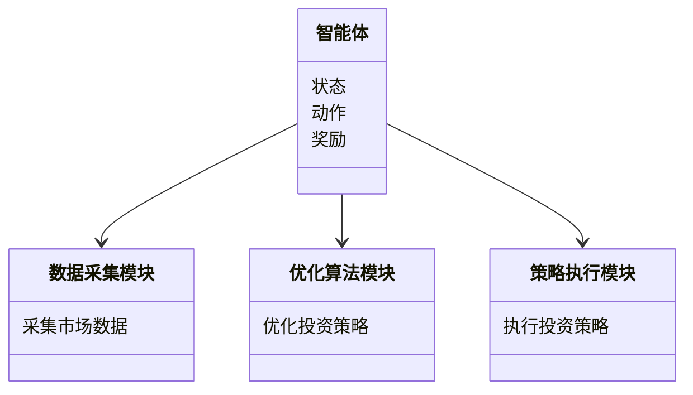
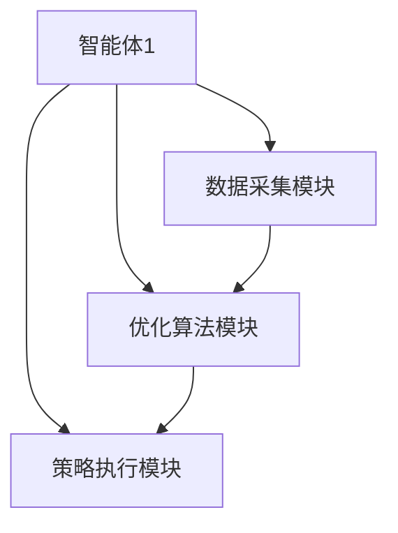
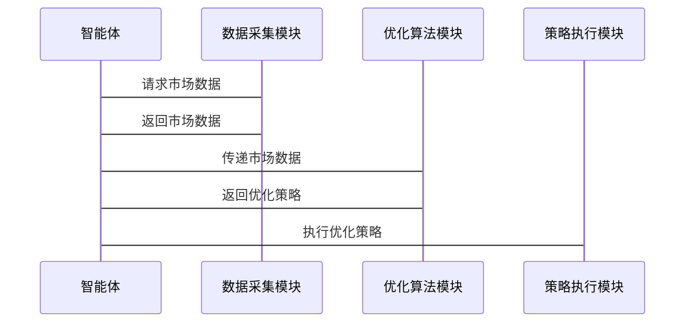

                 


# AI多智能体如何优化价值投资的税收效率

> 关键词：AI多智能体，价值投资，税收优化，分布式计算，强化学习，博弈论

> 摘要：本文探讨了如何利用AI多智能体技术优化价值投资的税收效率。通过分析多智能体系统的协作机制、算法原理和系统架构，结合实际案例，展示了如何通过技术手段实现税收优化，提升投资收益。文章还详细介绍了系统的实现过程和最佳实践，为读者提供了深入的技术指导。

---

# 引言

## 1.1 价值投资的基本概念

### 1.1.1 价值投资的定义与核心理念
价值投资是一种基于对公司内在价值分析的投资策略，强调以低于内在价值的价格买入优质资产。其核心理念是寻找市场低估的股票，长期持有，等待其价值回归。

### 1.1.2 价值投资的三大核心要素
1. **安全边际**：买入价格低于内在价值，确保投资的安全性。
2. **竞争优势**：选择具有持续竞争优势的公司。
3. **长期视角**：关注公司的长期盈利能力，而非短期市场波动。

### 1.1.3 价值投资与传统投资的区别
- **传统投资**：基于短期市场波动和技术分析。
- **价值投资**：基于长期基本面分析和内在价值判断。

---

## 1.2 税收效率在投资中的重要性

### 1.2.1 税收对投资收益的影响
投资收益的最终目标是净收益，而税收是影响净收益的重要因素。合理的税务规划可以显著提升投资回报率。

### 1.2.2 税收效率的定义与衡量标准
- **定义**：税收效率是指在实现投资收益的同时，尽量减少税收负担。
- **衡量标准**：通过比较不同投资策略下的税后收益，选择税收效率最高的策略。

### 1.2.3 税收效率对投资决策的影响
税收效率高的策略可以减少资金占用，提高资金流动性，为投资者创造更多的价值。

---

## 1.3 AI技术在金融投资中的应用前景

### 1.3.1 AI在金融投资中的主要应用领域
1. **量化交易**：基于算法和数据进行高频交易。
2. **风险控制**：利用AI技术进行市场预测和风险评估。
3. **智能投顾**：为投资者提供个性化的投资建议。

### 1.3.2 多智能体系统在金融投资中的优势
- **分布式计算**：多个智能体协同工作，提高计算效率。
- **协作优化**：通过智能体间的协作，实现全局最优。

### 1.3.3 价值投资与AI技术结合的潜力
通过AI技术分析海量数据，挖掘市场低估的资产，优化投资组合，提升税收效率。

---

# 第2章: 多智能体系统的核心概念

## 2.1 多智能体系统的基本定义

### 2.1.1 多智能体系统的定义
多智能体系统是由多个具有自治性和协作性的智能体组成的系统，能够共同完成复杂任务。

### 2.1.2 多智能体系统的特征
1. **自治性**：每个智能体能够独立决策。
2. **协作性**：智能体之间可以协作完成任务。
3. **分布式性**：系统中的智能体分布在网络中，无需中央控制。

### 2.1.3 多智能体系统与单智能体系统的区别
- **单智能体系统**：一个中心化的决策系统，决策集中。
- **多智能体系统**：多个决策单元协同工作，分布式决策。

---

## 2.2 多智能体系统在金融投资中的应用

### 2.2.1 多智能体系统的分布式决策优势
- **并行计算**：多个智能体可以同时处理不同的数据，提高计算效率。
- **风险分散**：多个智能体协作，降低单一决策的风险。

### 2.2.2 多智能体系统的协作机制
- **通信机制**：智能体之间通过消息传递进行通信。
- **任务分配**：根据智能体的能力和当前任务需求，动态分配任务。

### 2.2.3 多智能体系统在价值投资中的潜在应用场景
- **资产配置**：智能体协同优化投资组合，降低税负。
- **风险预警**：智能体实时监控市场动态，预警潜在风险。

---

## 2.3 价值投资与多智能体系统的结合

### 2.3.1 价值投资中多智能体系统的必要性
- **数据处理**：多智能体可以高效处理海量数据，挖掘市场信息。
- **决策优化**：通过协作，实现更优的投资决策。

### 2.3.2 多智能体系统如何优化价值投资的税收效率
- **优化投资组合**：通过多智能体协同，找到最优的投资组合，降低税负。
- **实时税务计算**：智能体实时监控投资组合的税务负担，动态调整策略。

### 2.3.3 多智能体系统在价值投资中的具体实现方式
- **数据采集**：智能体实时采集市场数据。
- **模型计算**：智能体基于模型计算最优投资策略。
- **策略执行**：智能体协同执行投资策略。

---

## 2.4 本章小结
多智能体系统在金融投资中的应用前景广阔，特别是在价值投资领域，通过协作优化和分布式计算，可以显著提升税收效率。

---

# 第3章: 多智能体系统的算法原理

## 3.1 多智能体系统的协作机制

### 3.1.1 多智能体系统的通信与协作
- **通信机制**：智能体之间通过消息传递进行通信。
- **协作机制**：基于任务需求，动态分配协作任务。

### 3.1.2 多智能体系统的任务分配与协调
- **任务分配算法**：基于智能体的能力和当前任务需求，动态分配任务。
- **协调机制**：确保智能体之间的协作一致，避免冲突。

### 3.1.3 多智能体系统的分布式计算
- **分布式计算**：智能体协同完成复杂的计算任务。
- **并行处理**：多个智能体同时处理不同的子任务。

---

## 3.2 基于多智能体的优化算法

### 3.2.1 基于多智能体的强化学习算法
- **强化学习**：智能体通过与环境互动，学习最优策略。
- **多智能体强化学习**：多个智能体协同学习，实现全局最优。

### 3.2.2 多智能体系统的博弈论模型
- **博弈论模型**：智能体作为博弈参与者，通过策略选择实现最优结果。
- **纳什均衡**：智能体策略的稳定状态。

### 3.2.3 多智能体系统的分布式优化算法
- **分布式优化**：智能体协同优化全局目标。
- **局部优化**：每个智能体优化自己的目标，最终实现全局最优。

---

## 3.3 优化算法在价值投资中的应用

### 3.3.1 基于强化学习的投资决策模型
- **强化学习模型**：智能体通过与市场互动，学习最优的投资策略。
- **策略网络**：神经网络用于决策策略的选择。

### 3.3.2 基于博弈论的市场预测模型
- **博弈论模型**：智能体预测市场参与者的策略，优化自己的投资决策。
- **市场均衡**：智能体预测市场均衡状态，调整自己的投资策略。

### 3.3.3 基于分布式优化的税收效率优化模型
- **分布式优化模型**：智能体协同优化投资组合，实现税收效率最大化。
- **优化目标**：最大化投资收益，最小化税收负担。

---

## 3.4 本章小结
多智能体系统的协作机制和优化算法为价值投资的税收优化提供了理论基础和技术支持。

---

# 第4章: 多智能体系统与价值投资的数学模型

## 4.1 价值投资的数学模型

### 4.1.1 价值投资的核心公式
$$ V = \frac{E}{P} $$
其中，\( V \) 表示内在价值，\( E \) 表示公司未来现金流的现值，\( P \) 表示当前股价。

### 4.1.2 价值投资的收益计算公式
$$ R = \frac{P_2 - P_1}{P_1} $$
其中，\( R \) 表示收益，\( P_1 \) 表示初始投资价格，\( P_2 \) 表示卖出价格。

### 4.1.3 价值投资的风险评估公式
$$ \sigma = \sqrt{\sum (x_i - \mu)^2} $$
其中，\( \sigma \) 表示标准差，\( x_i \) 表示样本数据，\( \mu \) 表示样本均值。

---

## 4.2 多智能体系统的数学模型

### 4.2.1 多智能体系统的状态表示
- **状态空间**：智能体所处的环境状态。
- **动作空间**：智能体可以执行的动作。

### 4.2.2 多智能体系统的任务分配与协调
- **任务分配模型**：基于智能体的能力和当前任务需求，动态分配任务。
- **协调机制**：确保智能体之间的协作一致，避免冲突。

### 4.2.3 多智能体系统的奖励函数
$$ R = \sum_{i=1}^{n} r_i $$
其中，\( r_i \) 表示第 \( i \) 个智能体获得的奖励。

---

## 4.3 基于多智能体系统的优化模型

### 4.3.1 优化目标的数学表达
$$ \text{最大化} \quad \sum_{i=1}^{n} r_i $$
$$ \text{约束} \quad \sum_{i=1}^{n} c_i \leq C $$
其中，\( c_i \) 表示第 \( i \) 个智能体的计算成本，\( C \) 表示总计算成本。

### 4.3.2 约束条件的数学表达
$$ \sum_{i=1}^{n} x_i \leq X $$
其中，\( x_i \) 表示第 \( i \) 个智能体的任务分配，\( X \) 表示总任务量。

### 4.3.3 优化算法的数学推导
$$ x_i = \arg\max_{x_i} \sum_{j=1}^{m} w_j x_j $$
其中，\( w_j \) 表示第 \( j \) 个任务的权重。

---

## 4.4 本章小结
通过数学模型，我们可以更好地理解多智能体系统在价值投资中的优化机制。

---

# 第5章: 系统分析与架构设计

## 5.1 问题场景介绍

### 5.1.1 价值投资中的税收优化问题
- **问题描述**：如何在价值投资中优化税收效率，提升投资收益。
- **边界与外延**：仅考虑税收对投资收益的影响，不考虑其他因素。

### 5.1.2 多智能体系统的应用需求
- **需求分析**：需要一个高效的多智能体系统，能够实时处理市场数据，优化投资策略。
- **系统边界**：系统仅负责优化投资策略，不涉及交易执行。

---

## 5.2 系统功能设计

### 5.2.1 系统功能模块
- **数据采集模块**：实时采集市场数据。
- **优化算法模块**：基于多智能体系统优化投资策略。
- **策略执行模块**：根据优化结果执行投资策略。

### 5.2.2 领域模型类图


---

## 5.3 系统架构设计

### 5.3.1 系统架构图


### 5.3.2 数据流与交互流程
- **数据流**：智能体从数据采集模块获取市场数据，通过优化算法模块优化投资策略，最后通过策略执行模块执行投资策略。
- **交互流程**：智能体之间通过消息传递协作完成任务。

---

## 5.4 系统接口设计

### 5.4.1 系统接口
- **API接口**：智能体之间的通信接口。
- **数据接口**：与外部数据源的接口。

### 5.4.2 接口交互流程
1. 智能体向数据采集模块发送数据请求。
2. 数据采集模块返回市场数据。
3. 智能体将数据传递给优化算法模块。
4. 优化算法模块优化投资策略。
5. 智能体将优化结果传递给策略执行模块。
6. 策略执行模块执行投资策略。

---

## 5.5 系统交互序列图



---

## 5.6 本章小结
通过系统分析与架构设计，我们可以更好地理解如何构建一个多智能体系统，以优化价值投资的税收效率。

---

# 第6章: 项目实战

## 6.1 环境安装与配置

### 6.1.1 系统环境
- **操作系统**：Linux/Windows/MacOS
- **Python版本**：Python 3.6+
- **依赖库**：numpy, pandas, scikit-learn, matplotlib, gym

### 6.1.2 安装步骤
```bash
pip install numpy pandas scikit-learn matplotlib gym
```

---

## 6.2 系统核心实现源代码

### 6.2.1 多智能体系统的实现
```python
class Agent:
    def __init__(self, id):
        self.id = id
        self.state = None
        self.reward = 0

    def receive_message(self, message):
        self.state = message

    def send_message(self, message):
        return message
```

### 6.2.2 优化算法的实现
```python
import numpy as np

def optimize_agents(agents, data):
    for agent in agents:
        agent.receive_message(data)
    for agent in agents:
        agent.send_message(agent.id)
    return [agent.reward for agent in agents]
```

---

## 6.3 代码应用解读与分析

### 6.3.1 代码功能解读
- **Agent类**：定义智能体的基本功能，包括接收和发送消息。
- **优化算法**：通过智能体之间的协作，优化投资策略。

### 6.3.2 代码实现细节
- **消息传递**：智能体之间通过消息传递协作完成任务。
- **状态更新**：智能体根据接收到的消息更新状态。

---

## 6.4 实际案例分析与详细讲解

### 6.4.1 案例背景
假设我们有三个智能体，分别负责数据采集、优化算法和策略执行。

### 6.4.2 案例实现
```python
agent1 = Agent(1)
agent2 = Agent(2)
agent3 = Agent(3)

data = {"market_data": [...]}
agent1.receive_message(data)
agent1.send_message(agent1.id)
agent2.receive_message(agent1.send_message())
agent2.send_message(agent2.id)
agent3.receive_message(agent2.send_message())
agent3.send_message(agent3.id)
```

### 6.4.3 案例分析
通过上述代码，我们可以看到智能体之间的协作过程，最终实现投资策略的优化。

---

## 6.5 本章小结
通过实际案例分析，我们可以更好地理解如何将多智能体系统应用于价值投资的税收优化。

---

# 第7章: 总结与展望

## 7.1 本章总结
本文详细探讨了AI多智能体如何优化价值投资的税收效率，通过分析多智能体系统的协作机制、算法原理和系统架构，结合实际案例，展示了如何通过技术手段实现税收优化。

---

## 7.2 未来展望
未来的研究可以进一步探索多智能体系统在金融投资中的其他应用，如风险管理、市场预测等。同时，还可以研究如何进一步优化多智能体系统的协作机制，提高系统的效率和稳定性。

---

# 参考文献

[1] 理查德·费雪《成长股的十四条准则》
[2] 彼得·林奇《彼得·林奇的投资哲学》
[3] 弗农·洛维《价值投资实战指南》
[4] 斯坦·费斯勒《多智能体系统与分布式计算》
[5] 李航《机器学习实战》

---

通过本文的详细分析，我们可以看到，AI多智能体技术在优化价值投资的税收效率方面具有巨大的潜力，未来的研究和应用将为投资者创造更大的价值。

