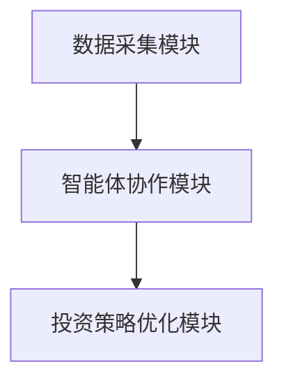

                 


# AI多智能体如何优化价值投资的跨境投资策略

## 关键词: AI多智能体, 价值投资, 跨境投资, 投资策略, 强化学习, 系统架构

## 摘要: 本文探讨了AI多智能体技术如何优化价值投资的跨境投资策略。通过结合强化学习和多智能体协作算法，提出了一种高效的系统架构，旨在帮助投资者在复杂多变的市场环境中实现更优的投资决策。文章详细分析了多智能体的协作机制、优化算法的数学模型，并通过实际案例展示了系统的实现和应用效果。

---

# 第1章: 价值投资的基本概念

## 1.1 价值投资的定义与核心理念

### 1.1.1 价值投资的基本定义
价值投资是一种投资策略，强调以低于公平市场价值的价格购买优质资产。其核心在于寻找市场中被低估的投资标的，通过长期持有实现超额收益。

### 1.1.2 价值投资的核心理念
- 市场先生：市场的短期波动不可预测，但长期趋势是理性的。
- 安全边际：买入价格远低于内在价值的资产。
- 时间的价值：长期持有优质资产，通过复利效应实现财富增长。

### 1.1.3 价值投资的适用场景
- 稳定性：适用于追求长期稳定收益的投资者。
- 防御性：在市场波动中提供保护。
- 高效性：通过精选优质资产减少交易成本。

---

# 第2章: 多智能体的基本概念

## 2.1 多智能体系统概述

### 2.1.1 多智能体的定义
多智能体系统（Multi-Agent System, MAS）是由多个相互作用的智能体组成的系统，每个智能体都能独立感知环境并采取行动，共同完成复杂任务。

### 2.1.2 多智能体的特点
| 特性 | 描述 |
|------|------|
| 分布性 | 智能体之间独立运行，无中心控制 |
| 协作性 | 智能体通过协作完成共同目标 |
| 反应性 | 能够实时感知环境并做出反应 |

### 2.1.3 多智能体与单智能体的区别
| 维度 | 单智能体 | 多智能体 |
|------|--------|----------|
| 控制方式 | 中央控制 | 分布式控制 |
| 信息处理 | 单点处理 | 分布式处理 |
| 任务复杂度 | 简单 | 复杂 |

---

# 第3章: 价值投资与多智能体的结合

## 3.1 价值投资中的多智能体应用

### 3.1.1 多智能体在价值投资中的作用
- 数据采集：智能体实时监控市场数据。
- 信号生成：基于数据生成投资信号。
- 策略优化：通过协作优化投资组合。

### 3.1.2 多智能体如何优化投资策略
1. **分散风险**：多个智能体分别监控不同市场和资产。
2. **信息共享**：智能体之间共享信息，提高决策质量。
3. **快速反应**：智能体能够快速识别市场机会和风险。

### 3.1.3 多智能体在跨境投资中的优势
- **全球化视角**：智能体可以同时监控全球市场。
- **多策略优化**：根据不同市场特点定制投资策略。
- **风险对冲**：通过多市场配置降低整体风险。

---

# 第4章: 强化学习基础

## 4.1 强化学习的基本原理

### 4.1.1 状态、动作、奖励的定义
- **状态（State）**：环境当前的状况，如市场数据。
- **动作（Action）**：智能体采取的行为，如买入或卖出。
- **奖励（Reward）**：智能体行动的结果，如收益或亏损。

### 4.1.2 Q-learning算法
Q-learning是一种经典的强化学习算法，通过更新Q值表来学习最优策略：
$$ Q(s,a) = Q(s,a) + \alpha (r + \gamma \max Q(s',a') - Q(s,a)) $$
其中，$\alpha$是学习率，$\gamma$是折扣因子。

### 4.1.3 策略梯度方法
策略梯度方法通过优化策略直接寻找最优动作：
$$ \nabla \theta J(\theta) = \mathbb{E}[ \nabla \log \pi_\theta(a|s) Q(s,a) ] $$

---

# 第5章: 多智能体协作算法

## 5.1 多智能体协作的基本原理

### 5.1.1 多智能体协作的定义
多智能体协作是指多个智能体通过共享信息和协作完成共同目标。

### 5.1.2 多智能体协作的挑战
- **通信开销**：智能体之间需要频繁通信。
- **同步问题**：不同智能体的动作需要协调。
- **竞争与合作**：智能体之间可能存在竞争。

### 5.1.3 基于强化学习的多智能体协作算法
一种常用的协作算法是基于Q-learning的多智能体协作：
1. 每个智能体维护自己的Q值表。
2. 智能体之间共享状态和动作信息。
3. 根据团队收益更新Q值。

---

# 第6章: 优化算法的数学模型

## 6.1 强化学习的数学模型

### 6.1.1 Q-learning的数学公式
$$ Q(s,a) = Q(s,a) + \alpha (r + \gamma Q(s',a') - Q(s,a)) $$

## 6.2 多智能体协作的数学模型
### 6.2.1 多智能体协作的数学公式
$$ J = \sum_{i=1}^n J_i $$

---

# 第7章: 系统功能设计

## 7.1 系统功能模块划分

### 7.1.1 数据采集模块
- 实时采集全球市场数据。
- 数据预处理和特征提取。

### 7.1.2 智能体协作模块
- 分布式计算和协作。
- 策略优化和调整。

### 7.1.3 投资策略优化模块
- 生成投资信号。
- 实时监控和调整。

---

# 第8章: 系统架构设计

## 8.1 系统架构的Mermaid图


---

# 第9章: 项目实战

## 9.1 环境安装

### 9.1.1 安装Python和相关库
```bash
pip install numpy pandas tensorflow keras
```

### 9.1.2 数据获取
使用Yahoo Finance API获取股票数据。

## 9.2 核心代码实现

### 9.2.1 多智能体协作代码
```python
import numpy as np

class Agent:
    def __init__(self, state_space, action_space):
        self.state_space = state_space
        self.action_space = action_space
        self.q_table = np.zeros((state_space, action_space))

    def act(self, state):
        # 简单策略：随机选择动作
        return np.random.randint(0, self.action_space)

# 初始化智能体
state_space = 10
action_space = 3
agents = [Agent(state_space, action_space) for _ in range(5)]

# 协作过程
for agent in agents:
    state = 2  # 示例状态
    action = agent.act(state)
    print(f"Agent {agent} takes action {action}")
```

### 9.2.2 强化学习代码
```python
import numpy as np

def q_learning(env, num_episodes=1000):
    Q = np.zeros(env.observation_space.shape)
    for episode in range(num_episodes):
        state = env.reset()
        while not env.done:
            action = np.argmax(Q[state])
            next_state, reward, done = env.step(action)
            Q[state] += reward
            state = next_state
    return Q

# 示例环境
class Environment:
    def __init__(self):
        self.observation_space = 5
        self.done = False

    def reset(self):
        return 2  # 示例初始状态

    def step(self, action):
        self.done = True
        return self.observation_space, 1, self.done

Q = q_learning(Environment())
print(Q)
```

---

# 第10章: 最佳实践与小结

## 10.1 总结
AI多智能体通过协作和强化学习优化了价值投资的跨境策略，提高了投资效率和收益。

## 10.2 注意事项
- 数据质量：确保数据准确性和实时性。
- 算法选择：根据具体场景选择合适的算法。
- 风险控制：制定有效的风险对冲策略。

## 10.3 拓展阅读
- 《强化学习导论》
- 《多智能体系统设计与实现》

---

通过以上步骤，我们可以系统地优化价值投资的跨境策略，实现更高效的投资决策。

