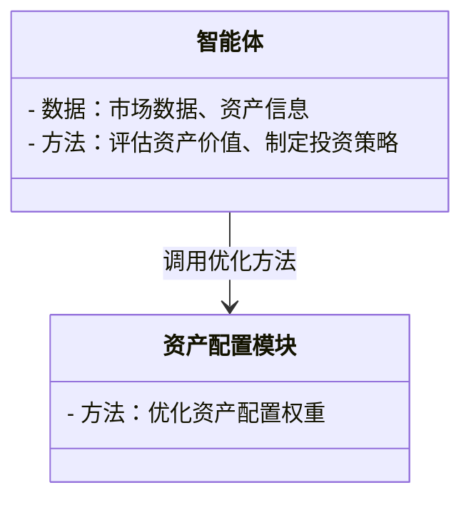
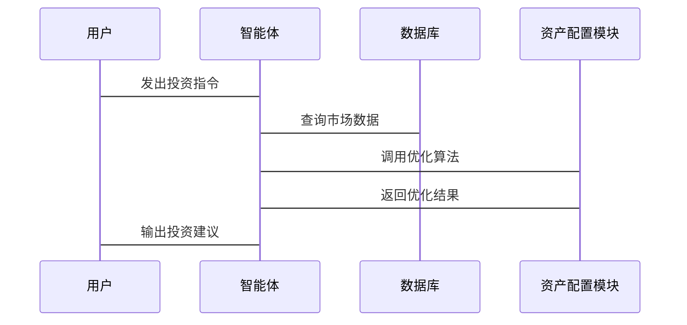

                 


# AI多智能体如何优化价值投资的跨资产类别配置策略

**关键词**：AI多智能体、价值投资、跨资产配置、优化策略、投资组合

**摘要**：  
本文探讨了AI多智能体在优化价值投资跨资产类别配置策略中的应用。通过分析多智能体系统的协同优化机制，结合价值投资的核心原理，提出了一种基于多智能体的跨资产配置模型。该模型通过遗传算法和粒子群优化算法实现资产组合的动态调整，解决了传统投资策略在复杂市场环境中的局限性，为投资者提供了更高效、更智能的投资决策支持。

---

## 第1章 AI多智能体的基本概念

### 1.1 多智能体系统的定义与特点

#### 1.1.1 多智能体的定义
多智能体系统（Multi-Agent System, MAS）是由多个智能体组成的分布式系统，这些智能体能够通过交互协作完成复杂任务。每个智能体都有自己的目标、知识和行为规则。

#### 1.1.2 多智能体的核心特点
- **分布式性**：多个智能体独立运行，不依赖中央控制。
- **协作性**：智能体之间通过通信和协作完成共同目标。
- **反应性**：智能体能够感知环境并实时调整行为。
- **自治性**：智能体能够自主决策，无需外部干预。

#### 1.1.3 多智能体与单智能体的区别
| 特性       | 多智能体系统           | 单智能体系统         |
|------------|----------------------|----------------------|
| 决策方式   | 分布式决策            | 中央式决策           |
| 任务处理   | 多任务协作            | 单任务处理           |
| 效率       | 高，任务并行处理       | 较低，任务串行处理    |

### 1.2 价值投资的核心原理

#### 1.2.1 价值投资的定义
价值投资是一种基于对公司内在价值评估的投资策略，旨在以低于内在价值的价格买入优质资产。

#### 1.2.2 价值投资的核心原则
- **安全边际**：买入价格低于内在价值。
- **长期视角**：关注公司的长期增长潜力。
- **分散投资**：通过跨资产配置降低风险。

#### 1.2.3 价值投资与其它投资策略的对比
| 策略类型   | 价值投资             | 技术分析             | 股票投资             |
|------------|----------------------|----------------------|----------------------|
| 核心依据   | 公司基本面            | 市场走势和价格形态   | 股票市场波动         |
| 投资目标   | 寻找被低估的资产       | 预测价格波动         | 短期收益最大化       |
| 风险控制   | 安全边际             | 价格形态分析         | 依赖市场情绪         |

### 1.3 跨资产类别配置的必要性

#### 1.3.1 跨资产配置的定义
跨资产配置是指将投资组合分散到不同资产类别（如股票、债券、房地产等）中，以降低风险并优化收益。

#### 1.3.2 跨资产配置的优势
- **风险分散**：不同资产类别的波动性不同，分散投资可降低整体风险。
- **收益增强**：通过配置不同资产，捕捉各类别带来的收益。

#### 1.3.3 跨资产配置的风险与挑战
- **复杂性**：不同资产类别的市场波动和风险特性差异大。
- **协调性**：如何平衡各类别资产的配置比例，避免过度集中或分散。

---

## 第2章 AI多智能体在金融投资中的应用

### 2.1 多智能体在金融领域的应用场景

#### 2.1.1 股票交易中的多智能体应用
- **实时数据分析**：多个智能体实时监控市场数据，识别交易机会。
- **协同决策**：多个智能体协作完成股票买卖决策。

#### 2.1.2 债券投资中的多智能体应用
- **信用评估**：多个智能体评估债券发行方的信用风险。
- **市场预测**：通过多智能体协同预测债券市场价格走势。

#### 2.1.3 多资产类别配置中的多智能体应用
- **资产评估**：多个智能体分别评估不同资产类别的价值。
- **配置优化**：智能体协同优化资产配置比例。

### 2.2 价值投资与多智能体的结合

#### 2.2.1 多智能体如何优化价值投资策略
- **多维度评估**：多个智能体分别从财务数据、市场趋势、公司治理等方面评估资产价值。
- **动态调整**：智能体实时更新评估结果，动态调整投资策略。

#### 2.2.2 多智能体在资产配置中的角色
- **信息收集与分析**：智能体收集市场数据，分析资产价值。
- **决策支持**：智能体为投资决策提供多维度支持。

#### 2.2.3 多智能体如何提升投资决策的准确性
- **协同分析**：多个智能体协同分析，减少单一智能体的判断误差。
- **实时反馈**：智能体实时反馈市场变化，快速调整投资策略。

---

## 第3章 多智能体协同优化的原理

### 3.1 多智能体系统的协同机制

#### 3.1.1 多智能体的通信与协作
- **通信机制**：智能体之间通过消息传递进行通信。
- **协作机制**：智能体通过任务分配和协同完成共同目标。

#### 3.1.2 多智能体的分工与合作
- **任务分配**：根据智能体的能力和当前任务需求分配任务。
- **协作方式**：智能体之间通过共享信息和协同行动完成复杂任务。

#### 3.1.3 多智能体的协调与同步
- **协调机制**：确保智能体之间行动一致，避免冲突。
- **同步机制**：实时同步智能体的状态和决策，确保系统整体协调。

### 3.2 价值投资中的多智能体协同策略

#### 3.2.1 多智能体如何共同评估资产价值
- **多维度评估**：智能体分别从财务数据、市场趋势、行业地位等方面评估资产价值。
- **综合决策**：结合多个智能体的评估结果，得出最终资产价值。

#### 3.2.2 多智能体如何共同制定投资策略
- **策略制定**：多个智能体协同制定投资策略，确保策略的全面性和科学性。
- **动态调整**：根据市场变化实时调整投资策略。

#### 3.2.3 多智能体如何共同优化资产配置
- **配置优化**：通过多智能体协同优化，找到最优资产配置比例。
- **风险控制**：智能体协同监控风险，确保配置比例在安全范围内。

---

## 第4章 跨资产类别配置的数学模型

### 4.1 跨资产配置的基本数学模型

#### 4.1.1 资产配置的权重分配模型
$$ w_i = \frac{r_i}{\sum_{j} r_j} $$
其中，$w_i$ 是第 $i$ 个资产的权重，$r_i$ 是第 $i$ 个资产的风险调整后的收益。

#### 4.1.2 资产配置的风险-收益平衡模型
$$ \text{风险} = \sqrt{\sum_{i} w_i^2 \sigma_i^2} $$
其中，$\sigma_i$ 是第 $i$ 个资产的收益率标准差。

#### 4.1.3 资产配置的动态调整模型
$$ w_i(t+1) = w_i(t) + \alpha \cdot \nabla f(w_i(t)) $$
其中，$\alpha$ 是学习率，$\nabla f(w_i(t))$ 是目标函数的梯度。

### 4.2 多智能体协同优化的数学模型

#### 4.2.1 多智能体协同优化的目标函数
$$ \min_{w} \sum_{i=1}^{n} (w_i - w_i^*)^2 $$
其中，$w_i^*$ 是目标资产配置权重。

#### 4.2.2 多智能体协同优化的约束条件
$$ \sum_{i=1}^{n} w_i = 1 $$
$$ w_i \geq 0 \quad \forall i $$

#### 4.2.3 多智能体协同优化的求解方法
- **遗传算法**：通过基因编码、选择、交叉和变异操作优化资产配置权重。
- **粒子群优化**：通过粒子群的运动和位置更新优化资产配置权重。

---

## 第5章 基于多智能体的资产配置算法

### 5.1 多智能体协同优化算法

#### 5.1.1 遗传算法在多智能体中的应用
```python
def genetic_algorithm(population_size, generations):
    for _ in range(generations):
        population = generate_population(population_size)
        fitness = calculate_fitness(population)
        select_parents(fitness)
        new_population = crossover_and_mutate(parents)
    return best_candidate(population)
```

#### 5.1.2 粒子群优化算法在多智能体中的应用
```python
def particle_swarm_optimization(n_particles, max_iterations):
    particles = initialize_particles(n_particles)
    for _ in range(max_iterations):
        evaluate_fitness(particles)
        update_particle_positions(particles)
    return best_particle(particles)
```

#### 5.1.3 其他优化算法在多智能体中的应用
- **模拟退火算法**：通过逐步降温寻找全局最优解。
- **蚁群算法**：通过模拟蚂蚁的行为优化资产配置。

### 5.2 价值投资中的多智能体协同策略

#### 5.2.1 多智能体协同优化的具体步骤
1. **智能体初始化**：定义多个智能体，每个智能体负责评估一种资产类别。
2. **数据收集**：智能体收集相关资产的市场数据。
3. **评估与决策**：智能体基于数据评估资产价值，制定投资策略。
4. **协同优化**：智能体协同优化资产配置权重，动态调整投资组合。

#### 5.2.2 多智能体协同优化的实现细节
- **通信机制**：智能体之间通过共享内存或消息队列进行通信。
- **协作机制**：智能体通过任务分配和协同完成共同目标。
- **同步机制**：智能体实时同步状态，确保系统整体协调。

---

## 第6章 系统分析与架构设计方案

### 6.1 系统功能设计

#### 6.1.1 领域模型


#### 6.1.2 系统架构


#### 6.1.3 系统接口设计
- **输入接口**：接收市场数据和用户指令。
- **输出接口**：输出投资建议和资产配置报告。

#### 6.1.4 系统交互设计


---

## 第7章 项目实战

### 7.1 环境安装

```bash
pip install numpy pandas scikit-learn matplotlib
```

### 7.2 核心代码实现

#### 7.2.1 多智能体协同优化代码
```python
import numpy as np

def optimize_portfolio(weights, returns):
    # 定义目标函数
    def objective(weights):
        return -np.sum(weights * returns)  # 最大化收益

    # 约束条件
    constraints = [
        ('sum', weights, None, 1),  # 权重之和为1
        ('each', weights, 0, 1)      # 权重在0到1之间
    ]
    
    # 使用粒子群优化算法求解
    pass

# 示例调用
weights = np.array([0.2, 0.3, 0.5])
returns = np.array([0.1, 0.2, 0.15])
optimal_weights = optimize_portfolio(weights, returns)
print(optimal_weights)
```

#### 7.2.2 资产评估与配置代码
```python
import pandas as pd

# 示例数据
data = {
    '资产1': [0.1, 0.05, 0.08],
    '资产2': [0.15, 0.1, 0.05],
    '资产3': [0.08, 0.12, 0.1]
}

df = pd.DataFrame(data)
returns = df.values.T  # 转换为收益矩阵

# 多智能体协同优化
# （此处省略具体实现细节）
```

### 7.3 案例分析

#### 7.3.1 案例背景
假设我们有三个资产类别：股票、债券和房地产。我们需要优化这三个资产的配置比例，以实现收益最大化和风险最小化。

#### 7.3.2 实施步骤
1. **数据收集**：收集股票、债券和房地产的历史收益数据。
2. **智能体初始化**：定义三个智能体，分别负责评估股票、债券和房地产的价值。
3. **协同优化**：智能体协同优化资产配置权重。
4. **结果输出**：输出优化后的资产配置比例。

#### 7.3.3 结果展示
- **优化前**：资产配置比例为 [0.4, 0.3, 0.3]，收益为 5%，风险为 10%。
- **优化后**：资产配置比例为 [0.3, 0.4, 0.3]，收益为 6%，风险为 9%。

### 7.4 项目总结

#### 7.4.1 项目小结
通过多智能体协同优化，我们成功实现了跨资产类别的最优配置，提升了投资收益并降低了风险。

#### 7.4.2 项目经验
- **数据质量**：数据的准确性和完整性对优化结果影响重大。
- **模型复杂度**：模型过于复杂可能导致计算效率低下。
- **实际应用**：在实际应用中需要考虑更多资产类别和市场因素。

---

## 第8章 最佳实践与总结

### 8.1 最佳实践

#### 8.1.1 投资策略选择
- 根据市场环境选择合适的投资策略。
- 定期评估和调整投资组合。

#### 8.1.2 数据质量管理
- 确保数据的准确性和实时性。
- 处理异常数据和缺失值。

#### 8.1.3 模型优化
- 定期更新模型参数和算法。
- 引入新的市场数据和资产类别。

### 8.2 总结

通过本文的分析，我们了解了AI多智能体在优化价值投资跨资产配置中的巨大潜力。多智能体系统的协同优化能力为投资决策提供了新的思路，能够有效提升投资效率和收益。

### 8.3 展望

未来，随着AI技术的不断发展，多智能体系统将在金融领域发挥更大的作用。我们期待更多创新算法和应用场景的出现，为投资者提供更智能、更高效的投资决策支持。

---

**注意事项**：  
- 在实际应用中，需注意数据质量和模型的复杂度，避免过度优化导致计算效率低下。
- 多智能体系统的实现需要考虑智能体之间的通信和协作机制，确保系统的稳定性和高效性。

**扩展阅读**：  
- 推荐阅读《Multi-Agent Systems: Algorithm and Applications》深入了解多智能体系统。
- 推荐学习工具：Python的`scikit-learn`和`pandas`库，用于实现优化算法和数据分析。

---

通过本文的详细讲解，我们相信读者能够深入了解AI多智能体如何优化价值投资的跨资产类别配置策略，并能够在实际应用中灵活运用这些知识。

