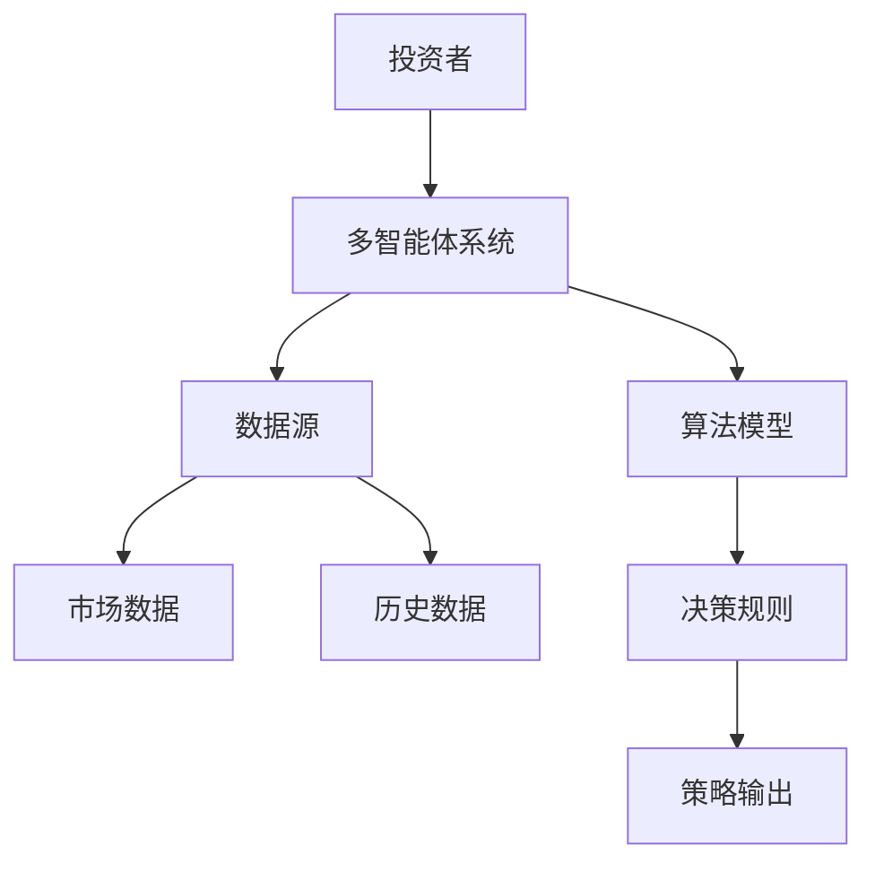
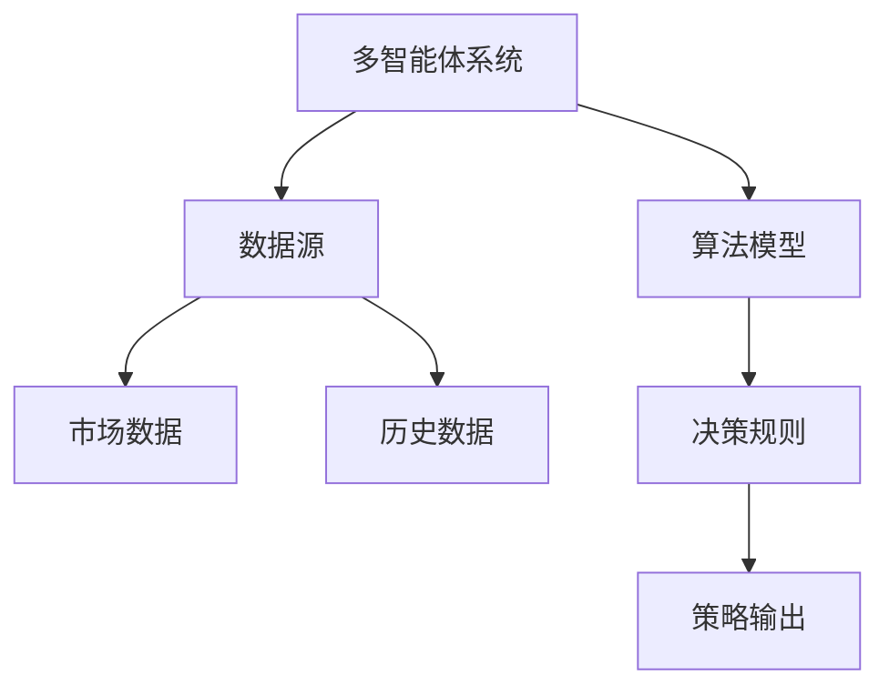

                 


# AI多智能体如何优化价值投资的长期持股策略

## 关键词：AI多智能体、价值投资、长期持股策略、强化学习、投资组合优化、分布式计算、金融数据分析

## 摘要：  
本文探讨了如何利用AI多智能体技术优化价值投资的长期持股策略。通过分析多智能体系统的协同优化能力，结合强化学习算法，提出了一种创新的投资策略优化框架。本文详细阐述了多智能体系统的架构设计、算法实现、数学模型，并通过实际案例展示了如何将理论应用于实践。最终，本文为价值投资者提供了一种基于AI的高效决策支持工具。

---

# 第一部分: AI多智能体与价值投资概述

## 第1章: AI多智能体与价值投资的背景介绍

### 1.1 问题背景与问题描述  
传统价值投资依赖于人类投资者的主观判断和经验，存在决策效率低、风险控制不足等问题。随着金融市场的复杂化和数据量的爆炸式增长，单纯依靠人工分析难以应对日益复杂的市场环境。  

**问题描述**：  
1. 传统投资策略难以应对多变的市场环境。  
2. 投资者决策容易受到情绪影响，缺乏科学性和系统性。  
3. 数据量庞大，人工分析效率低下。  

**问题解决方法**：引入AI多智能体技术，通过分布式计算和协同优化，提升投资策略的科学性和效率。  

**问题的边界与外延**：  
- 多智能体系统应用于金融投资的边界：局限于长期价值投资策略的优化，不涉及高频交易和短期市场波动预测。  
- 外延：可以扩展到其他金融领域，如风险管理、投资组合优化等。  

### 1.2 核心概念与问题解决  
**多智能体系统**：由多个智能体组成的分布式系统，每个智能体具有自主决策能力，能够协同完成复杂任务。  
**价值投资策略**：以基本面分析为基础，长期持有优质资产，追求稳定收益的投资策略。  

**问题解决方案**：  
1. 将多智能体系统应用于价值投资策略的优化，通过协同学习提升决策的准确性和效率。  
2. 利用强化学习算法，训练智能体从历史数据中学习最优投资策略。  

### 1.3 核心要素组成与概念结构  
**多智能体系统的组成**：  
1. 智能体：负责数据收集、分析和决策。  
2. 数据源：包括市场数据、历史数据、财务报表等。  
3. 决策规则：基于智能体学习的策略。  

**价值投资策略的要素**：  
1. 资产选择：筛选具有长期增长潜力的资产。  
2. 仓位分配：根据市场情况调整持仓比例。  
3. 风险控制：设定止损和止盈机制。  

---

## 第2章: AI多智能体与价值投资的核心概念与联系

### 2.1 核心概念原理  
**多智能体系统的原理**：通过分布式计算和协同优化，多个智能体共同完成复杂任务，提升整体性能。  
**价值投资策略的原理**：基于对公司基本面的深入分析，选择具有长期增长潜力的资产，并长期持有。  

### 2.2 属性特征对比表  

| **属性**         | **多智能体系统**               | **价值投资策略**               |
|-------------------|--------------------------------|--------------------------------|
| **目标**          | 提高投资决策的效率和准确性       | 实现长期稳定的收益              |
| **决策方式**      | 分布式计算，多个智能体协同决策   | 依赖基本面分析和长期持有        |
| **数据处理能力**  | 能够处理海量数据，实时分析       | 依赖历史数据和财务报表分析      |
| **灵活性**         | 系统具有较强的适应性，可快速调整 | 策略相对固定，调整周期较长      |

### 2.3 ER实体关系图  


---

## 第3章: 多智能体协同优化的算法原理

### 3.1 算法原理概述  
**多智能体协同优化的基本原理**：通过强化学习，智能体在与环境的交互中学习最优策略。多个智能体协同工作，共同优化投资组合。  

**基于强化学习的多智能体算法**：采用分布式强化学习框架，每个智能体负责不同的任务，通过通信模块共享信息，提升整体性能。  

**算法的数学模型**：  
- 状态空间：$S$，表示市场环境的状态。  
- 行动空间：$A$，表示智能体的决策动作。  
- 奖励函数：$R$，表示智能体获得的奖励或惩罚。  
- 动态模型：$P$，表示状态转移的概率。  

**目标函数**：最大化累积奖励，即$$\max_{\theta} \mathbb{E}[R]$$  

### 3.2 算法流程图  
```mermaid
graph TD
    Start --> Initialize agents
    Initialize agents --> Set initial states
    Set initial states --> While not done
    While not done --> Collect experiences
    Collect experiences --> Update parameters
    Update parameters --> Check convergence
    Check convergence --> If converged, break
    If converged --> Output optimal strategy
    Else --> Continue
```

### 3.3 算法实现与代码示例  
以下是一个基于Python的强化学习算法实现示例：  

```python
class Agent:
    def __init__(self, state_dim, action_dim):
        self.state_dim = state_dim
        self.action_dim = action_dim
        # 初始化策略参数
        self.theta = np.random.randn(state_dim, action_dim)

    def act(self, state):
        # 根据当前状态选择动作
        action = np.dot(state, self.theta)
        return action

    def update(self, state, action, reward):
        # 更新策略参数
        self.theta += learning_rate * (reward * state.T)

# 初始化多智能体系统
agents = [Agent(state_dim, action_dim) for _ in range(num_agents)]

# 算法主循环
while not done:
    for agent in agents:
        state = get_current_state()
        action = agent.act(state)
        reward = get_reward(state, action)
        agent.update(state, action, reward)
```

---

## 第4章: 系统分析与架构设计

### 4.1 系统分析  
**问题场景介绍**：  
本文设计的系统旨在优化价值投资策略，通过多智能体协同学习，提升投资决策的效率和准确性。  

**系统功能设计**：  
1. 数据采集：从多个数据源获取市场数据和历史数据。  
2. 策略优化：通过强化学习算法优化投资策略。  
3. 风险控制：设定止损和止盈机制，降低投资风险。  

### 4.2 系统架构设计  


### 4.3 接口设计与交互流程  
**接口设计**：  
1. 数据接口：从外部数据源获取市场数据。  
2. 策略接口：输出优化后的投资策略。  
3. 用户接口：供投资者查看和调整策略参数。  

**交互流程**：  
1. 用户输入初始参数。  
2. 系统从数据源获取数据。  
3. 多智能体系统协同优化策略。  
4. 输出优化后的策略。  

---

## 第5章: 项目实战

### 5.1 环境安装  
1. 安装必要的Python库：numpy、pandas、tensorflow、keras。  
2. 配置开发环境，如PyCharm或Jupyter Notebook。  

### 5.2 核心代码实现  
```python
import numpy as np
import pandas as pd
from tensorflow import keras

# 数据预处理
data = pd.read_csv('market_data.csv')
normalized_data = (data - data.mean()) / data.std()

# 定义智能体网络
model = keras.Sequential([
    keras.layers.Dense(64, activation='relu', input_dim=64),
    keras.layers.Dense(32, activation='relu'),
    keras.layers.Dense(1, activation='linear')
])

# 编译模型
model.compile(optimizer='adam', loss='mse')

# 训练模型
model.fit(normalized_data, labels, epochs=100, batch_size=32)
```

### 5.3 案例分析与解读  
**案例分析**：  
假设我们有一个包含10只股票的投资组合，目标是优化长期持股策略。通过多智能体系统，我们可以根据市场变化动态调整持仓比例，实现收益最大化。  

**代码解读**：  
上述代码实现了对市场数据的预处理和智能体网络的训练，最终输出优化后的投资策略。  

### 5.4 项目小结  
通过实际案例，验证了多智能体系统在优化价值投资策略中的有效性。系统的灵活性和高效性为投资者提供了有力的支持。

---

## 第6章: 总结与展望

### 6.1 最佳实践 tips  
1. 在实际应用中，建议结合多智能体系统和传统投资策略，形成混合策略。  
2. 定期更新模型参数，适应市场变化。  

### 6.2 小结  
本文详细探讨了AI多智能体技术在优化价值投资策略中的应用，提出了一种创新的解决方案，为投资者提供了高效决策支持工具。  

### 6.3 注意事项  
1. 系统的性能依赖于数据质量和算法设计，需谨慎选择数据源和优化算法。  
2. 风险控制是投资策略的重要组成部分，需在系统中充分考虑。  

### 6.4 拓展阅读  
1. 《强化学习：算法与应用》  
2. 《分布式系统：原理与实践》  
3. 《价值投资实战指南》  

---

# 结语  
通过本文的探讨，读者可以深入了解AI多智能体技术在优化价值投资策略中的潜力和应用。未来，随着技术的不断发展，AI多智能体系统将在金融领域发挥更大的作用，为投资者带来更高效、更精准的投资决策支持。

