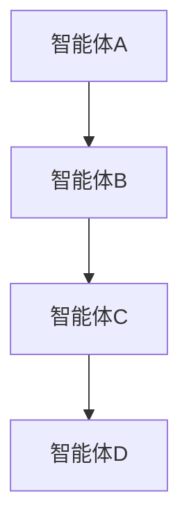
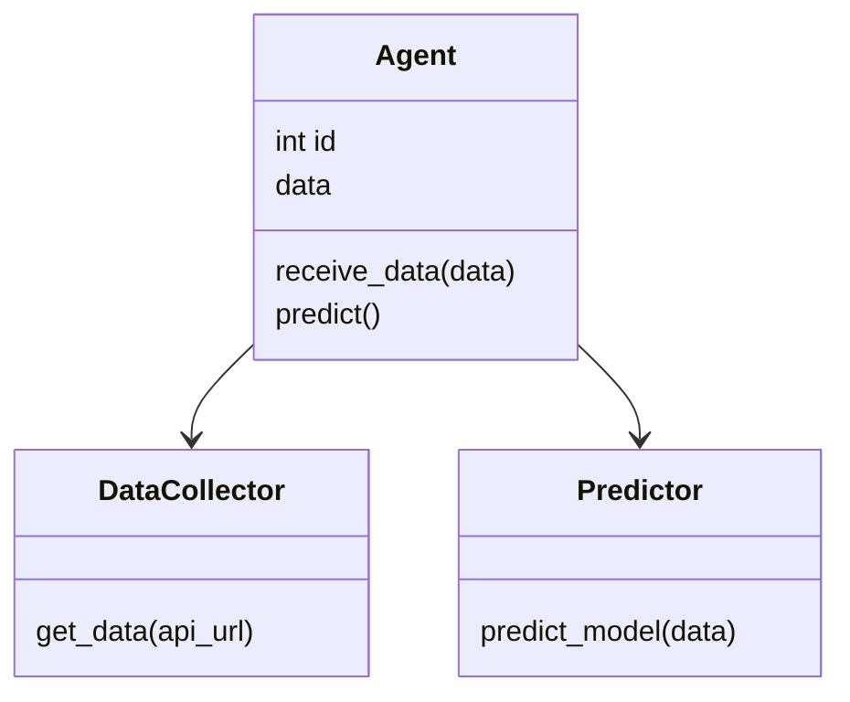

                 


# AI多智能体如何提升对公司未来现金流的预测准确性

## 关键词：AI多智能体、现金流预测、预测模型、时间序列、协作机制

## 摘要：  
本文探讨了AI多智能体技术如何提升公司未来现金流预测的准确性。通过分析多智能体系统的协作机制、预测模型的构建以及实际应用场景，本文揭示了AI多智能体在现金流预测中的优势，并提供了具体的实现方法和案例分析。文章旨在为财务分析师、数据科学家以及企业决策者提供理论支持和实践指导。

---

# 第一部分：背景介绍

## 第1章：AI多智能体与现金流预测概述

### 1.1 AI多智能体的基本概念

#### 1.1.1 多智能体系统的定义与特点

多智能体系统（Multi-Agent System, MAS）是由多个相互作用的智能体组成的分布式系统，每个智能体都有自己的目标、知识和行为规则。与传统的单智能体系统相比，MAS具有以下特点：

- **分布式性**：智能体之间分布式的知识和任务分配。
- **协作性**：智能体通过协作完成共同目标。
- **自主性**：每个智能体能够自主决策和行动。
- **动态性**：系统能够适应环境的变化。

#### 1.1.2 AI多智能体的核心要素

AI多智能体系统的核心要素包括：

1. **智能体**：具有感知环境、推理和行动能力的实体。
2. **通信机制**：智能体之间交换信息的渠道。
3. **协作协议**：智能体协作的规则和策略。
4. **环境模型**：描述智能体所处环境的模型。

#### 1.1.3 多智能体与传统预测模型的对比

传统的预测模型通常基于单一智能体的算法，例如ARIMA、LSTM等。而多智能体系统通过多个智能体的协作，能够更好地捕捉数据中的复杂关系，提高预测的准确性。

### 1.2 现金流预测的背景与重要性

#### 1.2.1 现金流预测的基本概念

现金流预测是指通过历史数据和相关因素，预测未来一段时间内公司的现金流情况。现金流是企业财务健康的重要指标，直接影响企业的投资决策和风险管理。

#### 1.2.2 现金流预测在企业中的作用

现金流预测在企业中的作用包括：

1. **投资决策支持**：帮助企业评估投资项目的风险和收益。
2. **风险管理**：识别现金流波动中的潜在风险。
3. **财务规划**：优化资金分配，确保企业运营的稳定性。

#### 1.2.3 现金流预测的挑战与现状

现金流预测的挑战包括：

1. **数据的复杂性**：现金流受多种因素影响，如市场波动、政策变化等。
2. **模型的局限性**：传统预测模型在处理复杂关系时表现有限。
3. **数据的实时性**：需要实时更新数据以提高预测的准确性。

### 1.3 AI多智能体在现金流预测中的应用

#### 1.3.1 多智能体预测的优势

AI多智能体在现金流预测中的优势包括：

1. **分布式计算能力**：通过多个智能体协作，提高计算效率。
2. **复杂关系捕捉**：多个智能体能够从不同角度分析数据，捕捉复杂关系。
3. **自适应性**：系统能够根据环境变化自动调整预测模型。

#### 1.3.2 多智能体预测的流程与框架

多智能体预测的流程包括以下几个步骤：

1. **数据采集**：从多个来源收集相关数据。
2. **智能体协作**：多个智能体协同工作，分析数据并生成预测结果。
3. **结果整合**：将多个智能体的预测结果进行整合，得到最终的预测结果。

#### 1.3.3 应用案例分析

通过一个实际案例，说明AI多智能体在现金流预测中的应用。例如，某公司利用多个智能体分别分析市场趋势、政策变化等因素，最终生成准确的现金流预测结果。

---

# 第二部分：核心概念与理论基础

## 第2章：AI多智能体系统的核心原理

### 2.1 多智能体系统的基本结构

#### 2.1.1 实体与行为的定义

在多智能体系统中，每个智能体都有明确的实体和行为定义。例如，智能体A负责分析市场趋势，智能体B负责分析政策变化。

#### 2.1.2 通信与协作机制

智能体之间的通信与协作机制是多智能体系统的核心。通过通信机制，智能体可以交换信息并协同工作。

#### 2.1.3 分布式计算与协调

多智能体系统的分布式计算能力使其能够高效地处理复杂任务。

### 2.2 现金流预测模型的构建

#### 2.2.1 数据特征提取

从历史数据中提取影响现金流的关键特征，例如收入、支出、市场趋势等。

#### 2.2.2 时间序列预测模型

时间序列预测模型是现金流预测的核心工具之一，例如ARIMA、LSTM等。

#### 2.2.3 组合预测方法

通过组合多个预测模型的结果，提高预测的准确性。

## 第3章：AI多智能体与现金流预测的结合

### 3.1 多智能体预测的理论基础

#### 3.1.1 博弈论与预测协作

博弈论为多智能体的协作提供了理论基础，帮助智能体在预测过程中做出最优决策。

#### 3.1.2 分布式预测的优势

分布式预测能够充分利用多个智能体的优势，提高预测的准确性和鲁棒性。

#### 3.1.3 多智能体预测的数学模型

通过数学模型描述多智能体协作的过程，例如：

$$
P(t) = \sum_{i=1}^{n} w_i \cdot P_i(t)
$$

其中，$P(t)$ 表示最终预测结果，$P_i(t)$ 表示第i个智能体的预测结果，$w_i$ 表示权重。

### 3.2 现金流预测的多智能体架构

#### 3.2.1 分层架构设计

将系统分为多个层次，每个层次由不同的智能体负责。

#### 3.2.2 智能体角色分配

根据任务需求，为每个智能体分配不同的角色，例如数据采集、模型训练等。

#### 3.2.3 协作机制设计

设计智能体之间的协作机制，确保预测过程高效有序。

---

# 第三部分：算法原理与实现

## 第4章：AI多智能体预测现金流的算法原理

### 4.1 多智能体协作机制

#### 4.1.1 信息共享与协作流程

通过mermaid流程图展示多智能体协作的流程。



#### 4.1.2 分布式预测算法

通过Python代码实现一个简单的分布式预测算法。

```python
import numpy as np

def distributed_prediction(data, num_agents):
    agents = []
    for i in range(num_agents):
        agent = Agent(i)
        agents.append(agent)
    for agent in agents:
        agent.receive_data(data)
    results = [agent.predict() for agent in agents]
    return np.mean(results)
```

### 4.2 现金流预测模型的优化

#### 4.2.1 神经网络模型的构建

通过神经网络模型优化现金流预测。

```python
import tensorflow as tf

model = tf.keras.Sequential([
    tf.keras.layers.Dense(64, activation='relu'),
    tf.keras.layers.Dense(1)
])
model.compile(optimizer='adam', loss='mean_squared_error')
```

#### 4.2.2 超参数优化

通过超参数优化提高模型的预测精度。

---

## 第5章：AI多智能体现金流预测系统的实现

### 5.1 系统功能设计

#### 5.1.1 数据采集模块

通过API接口采集历史数据和实时数据。

```python
import requests

def get_data(api_url):
    response = requests.get(api_url)
    return response.json()
```

#### 5.1.2 智能体协作模块

实现多个智能体的协作，完成数据的分析和预测。

```python
class Agent:
    def __init__(self, id):
        self.id = id
        self.data = None

    def receive_data(self, data):
        self.data = data

    def predict(self):
        # 具体预测逻辑
        pass
```

### 5.2 系统架构设计

#### 5.2.1 分层架构设计

通过mermaid类图展示系统架构。



---

## 第6章：项目实战与案例分析

### 6.1 项目环境安装

安装必要的Python库，例如TensorFlow、Keras、requests等。

```bash
pip install tensorflow keras requests
```

### 6.2 核心代码实现

实现一个多智能体协作的现金流预测系统。

```python
import requests
import tensorflow as tf
import numpy as np

class Agent:
    def __init__(self, id):
        self.id = id
        self.model = self.build_model()
        self.data = None

    def build_model(self):
        model = tf.keras.Sequential([
            tf.keras.layers.Dense(64, activation='relu'),
            tf.keras.layers.Dense(1)
        ])
        model.compile(optimizer='adam', loss='mean_squared_error')
        return model

    def receive_data(self, data):
        self.data = data

    def predict(self):
        if self.data is None:
            return 0
        # 假设data是一个numpy数组
        prediction = self.model.predict(self.data)
        return prediction[0][0]

def main():
    num_agents = 3
    agents = [Agent(i) for i in range(num_agents)]
    data = np.random.randn(100, 1)
    for agent in agents:
        agent.receive_data(data)
    results = [agent.predict() for agent in agents]
    final_prediction = np.mean(results)
    print(f"Final prediction: {final_prediction}")

if __name__ == "__main__":
    main()
```

### 6.3 案例分析

通过一个实际案例，分析AI多智能体在现金流预测中的应用效果。

---

## 第7章：总结与展望

### 7.1 总结

本文详细介绍了AI多智能体在现金流预测中的应用，通过理论分析和实际案例，展示了其在提高预测准确性方面的优势。

### 7.2 展望

未来，随着AI技术的不断发展，多智能体系统在现金流预测中的应用将更加广泛，预测的准确性和效率也将进一步提高。

### 7.3 最佳实践 tips

- 在实际应用中，建议结合具体业务需求，选择合适的智能体数量和协作机制。
- 定期更新模型和数据，确保预测结果的准确性。

---

# 结语

通过本文的介绍，读者可以深入了解AI多智能体在现金流预测中的应用，并通过实际案例和代码实现，掌握如何将这些技术应用到实际业务中。希望本文能够为相关领域的从业者提供有价值的参考和指导。

