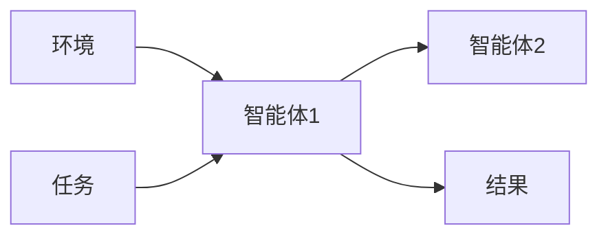
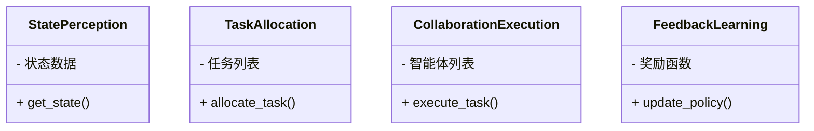
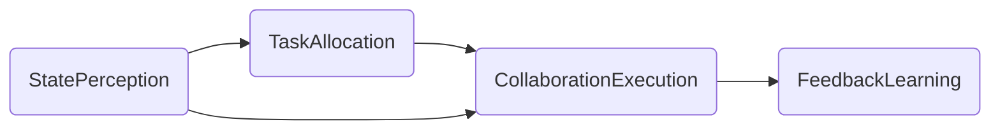
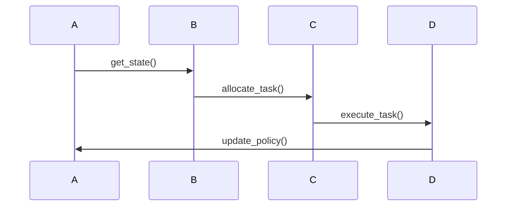

                 


# AI多智能体如何提升对公司长期战略执行力的评估

> 关键词：AI多智能体，战略执行力，公司战略，系统架构，强化学习，协作算法，数学模型

> 摘要：本文探讨了AI多智能体在提升公司长期战略执行力中的应用。通过分析多智能体系统的协作机制和算法原理，结合实际案例，展示了如何利用AI多智能体技术优化战略执行过程，提高评估效率和准确性。文章从概念、原理到实践，全面解析了AI多智能体在公司战略执行中的重要作用。

---

## 第1章 AI多智能体与公司战略执行概述

### 1.1 AI多智能体的基本概念

#### 1.1.1 多智能体系统的基本定义
多智能体系统（Multi-Agent System, MAS）是由多个相互作用的智能体组成的系统，每个智能体都有一定的自主性、反应性和协作能力。AI多智能体结合人工智能技术，使得这些智能体能够通过数据驱动和学习优化其行为。

#### 1.1.2 AI多智能体的核心特点
- **分布式**：智能体分布在不同的节点，独立决策。
- **协作性**：通过通信和协作完成共同目标。
- **适应性**：能够根据环境变化调整策略。
- **自主性**：智能体具备自主决策的能力。

#### 1.1.3 多智能体与传统单智能体的区别
| 属性         | 多智能体                   | 单智能体                 |
|--------------|---------------------------|--------------------------|
| 系统结构     | 分布式网络结构             | 集中式结构               |
| 决策方式     | 去中心化决策               | 中心化决策               |
| 协作能力     | 强调协作                   | 单一决策点               |

### 1.2 公司战略执行力的定义与评估

#### 1.2.1 战略执行力的定义
战略执行力是指公司执行战略目标的能力，涉及战略分解、资源分配、过程监控和结果评估。

#### 1.2.2 战略执行力的评估维度
- **目标达成度**：是否按时完成战略目标。
- **资源利用效率**：资源分配是否合理。
- **过程控制**：执行过程中的问题解决能力。
- **团队协作**：部门间协作是否高效。

#### 1.2.3 提升战略执行力的重要性
- 提高企业竞争力。
- 实现战略目标。
- 优化资源配置，降低成本。

### 1.3 AI多智能体在公司战略执行中的作用

#### 1.3.1 多智能体协作的优势
- **分布式决策**：避免单点故障。
- **快速响应**：各智能体独立决策，提高效率。
- **协作优化**：通过协作提升整体执行效果。

#### 1.3.2 AI多智能体如何优化战略执行
AI多智能体通过分布式协作和自主学习，优化资源分配和任务执行，提升战略执行的效率和准确性。

#### 1.3.3 多智能体在战略执行中的具体应用
- **战略分解**：智能体分解战略目标，分配任务。
- **资源分配**：智能体根据数据优化资源配置。
- **过程监控**：实时监控执行过程，及时调整。

---

## 第2章 AI多智能体的核心概念与联系

### 2.1 AI多智能体的核心原理

#### 2.1.1 多智能体系统的协作机制
协作机制包括通信协议、任务分配、协调同步和冲突解决。通过这些机制，智能体能够高效协作。

#### 2.1.2 AI在多智能体中的应用
AI技术如强化学习和博弈论，帮助智能体优化决策和协作策略。

### 2.2 多智能体系统与公司战略执行的关系

#### 2.2.1 多智能体系统的结构与公司战略的对应关系
多智能体系统结构与公司组织结构相似，各智能体对应公司各部门，协作完成战略目标。

#### 2.2.2 多智能体协作如何提升战略执行力
通过协作优化资源分配和任务执行，提升战略执行效率和质量。

### 2.3 多智能体系统的核心要素对比

#### 2.3.1 不同多智能体框架的对比分析
| 框架       | MADDPG       | MACE        |
|------------|--------------|-------------|
| 特点       | 基于策略网络 | 基于价值函数|
| 场景       | 多智能体协作 | 协作与竞争  |

#### 2.3.2 多智能体与传统单智能体的对比表格
| 属性         | 多智能体                   | 单智能体                 |
|--------------|---------------------------|--------------------------|
| 决策方式     | 分布式决策                 | 集中式决策               |
| 可扩展性     | 高                        | 低                      |
| 协作能力     | 强                        | 弱                      |

### 2.4 多智能体系统的ER实体关系图

#### 2.4.1 多智能体系统中的实体关系
```mermaid
er
actor(智能体) -[通信协议]-> environment(环境)
actor -[任务分配]-> task(任务)
environment --> goal(目标)
```

---

## 第3章 AI多智能体的算法原理讲解

### 3.1 多智能体协作算法的基本原理

#### 3.1.1 多智能体协作的基本流程
1. 状态感知：智能体感知环境状态。
2. 任务分配：根据状态分配任务。
3. 协作执行：智能体协作完成任务。
4. 反馈学习：根据结果优化策略。

#### 3.1.2 基于强化学习的多智能体协作
智能体通过强化学习优化协作策略，最大化整体奖励。

### 3.2 多智能体协作的数学模型

#### 3.2.1 多智能体协作的数学公式
$$ V = \sum_{i=1}^{n} v_i $$
其中，$v_i$ 表示第i个智能体的贡献值。

#### 3.2.2 协作过程中的博弈论模型
智能体之间的协作可以用纳什均衡模型描述：
$$ \text{Nash Equilibrium} = (x^*, y^*) $$

### 3.3 多智能体协作算法的实现

#### 3.3.1 基于MADDPG算法的实现
MADDPG算法通过多个智能体学习策略，优化协作过程。

#### 3.3.2 算法的Mermaid流程图


### 3.4 算法实现的Python源代码

```python
import numpy as np

class Agent:
    def __init__(self, state_space, action_space):
        self.state_space = state_space
        self.action_space = action_space
        self.model = self.build_model()

    def build_model(self):
        # 网络结构
        pass

    def act(self, state):
        # 选择动作
        pass

    def train(self, state, action, reward, next_state):
        # 训练模型
        pass

# 初始化环境
env = Environment()

# 初始化智能体
agents = [Agent(state_space, action_space) for _ in range(n_agents)]

# 执行任务
while not done:
    state = env.get_state()
    actions = [agent.act(state) for agent in agents]
    next_state, reward, done = env.step(actions)
    [agent.train(state, action, reward, next_state) for agent in agents]
```

---

## 第4章 AI多智能体的系统分析与架构设计

### 4.1 问题场景介绍

#### 4.1.1 战略执行中的问题分析
战略执行中常见的问题包括资源分配不合理、部门协作低效、过程监控不及时。

### 4.2 系统功能设计

#### 4.2.1 系统功能模块划分
- 状态感知模块：感知环境状态。
- 任务分配模块：分配任务。
- 协作执行模块：协作完成任务。
- 反馈学习模块：优化策略。

#### 4.2.2 功能模块的Mermaid类图


### 4.3 系统架构设计

#### 4.3.1 系统架构的Mermaid架构图


### 4.4 系统接口设计

#### 4.4.1 系统接口的定义
- `get_state()`：获取环境状态。
- `allocate_task()`：分配任务。
- `execute_task()`：执行任务。
- `update_policy()`：更新策略。

### 4.5 系统交互设计

#### 4.5.1 系统交互的Mermaid序列图


---

## 第5章 AI多智能体的项目实战

### 5.1 环境安装与配置

#### 5.1.1 开发环境的搭建
安装Python、TensorFlow、Keras等库。

### 5.2 系统核心实现

#### 5.2.1 多智能体协作的核心代码实现
```python
import numpy as np
import tensorflow as tf

class MADDPGAgent:
    def __init__(self, state_dim, action_dim):
        self.actor = self.build_actor_network(state_dim, action_dim)
        self.critic = self.build_critic_network(state_dim, action_dim)

    def build_actor_network(self, state_dim, action_dim):
        # 网络结构
        pass

    def build_critic_network(self, state_dim, action_dim):
        # 网络结构
        pass

    def act(self, state):
        # 选择动作
        pass

    def train(self, state, action, reward, next_state):
        # 训练网络
        pass
```

### 5.3 项目案例分析

#### 5.3.1 案例背景介绍
某公司希望通过AI多智能体优化战略执行，提升资源配置效率。

#### 5.3.2 案例的具体分析
智能体分解战略目标，优化资源分配，实时监控执行过程，及时调整策略。

### 5.4 总结与展望

#### 5.4.1 最佳实践 tips
- 合理设计协作机制。
- 选择合适的AI框架。
- 定期优化模型。

#### 5.4.2 小结
AI多智能体在公司战略执行中具有重要作用，能够提升效率和准确性。

#### 5.4.3 注意事项
- 确保数据质量。
- 处理智能体间的冲突。
- 保护系统安全。

#### 5.4.4 拓展阅读
推荐阅读相关论文和书籍，深入了解多智能体系统的优化方法。

---

## 第6章 总结与展望

### 6.1 小结
AI多智能体通过协作优化战略执行，提升公司竞争力。

### 6.2 未来展望
未来，随着技术进步，AI多智能体会在更多领域发挥重要作用，推动公司战略执行的智能化和高效化。

---

通过以上结构，文章全面解析了AI多智能体在公司战略执行中的应用，从概念、原理到实践，帮助读者深入了解如何利用AI技术提升战略执行力。

