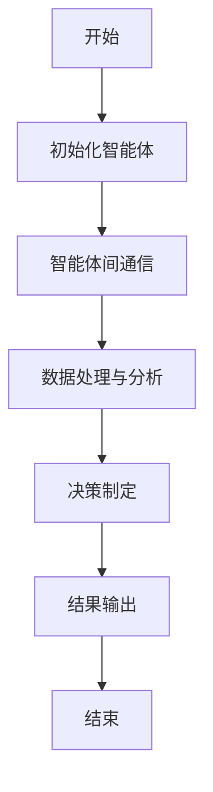

                 


# 《AI多智能体如何提升对公司长期盈利能力的评估》

## 关键词：AI多智能体，公司盈利能力，长期盈利能力，评估模型，协作优化，系统架构

## 摘要：  
随着人工智能技术的快速发展，AI多智能体系统在企业管理和决策中的应用日益广泛。本文将深入探讨AI多智能体如何通过协作优化和实时数据分析，提升公司对长期盈利能力的评估能力。通过分析多智能体系统的原理、算法实现、系统架构及实际案例，本文为读者提供全面的技术解读和实践指导。

---

# 第一部分: AI多智能体与公司长期盈利能力评估的背景

## 第1章: AI多智能体与公司长期盈利能力评估的背景

### 1.1 问题背景与描述  
#### 1.1.1 当前企业盈利评估的挑战  
企业在传统盈利评估中面临数据孤岛、信息滞后、决策不透明等问题，导致评估结果缺乏准确性和及时性。  

#### 1.1.2 AI多智能体技术的兴起  
AI多智能体技术通过分布式计算和协作学习，能够实时处理多维度数据，为企业提供更精准的决策支持。  

#### 1.1.3 问题解决的必要性  
通过AI多智能体技术，企业可以实现跨部门协作，优化资源配置，提升长期盈利能力的评估效率和准确性。  

### 1.2 问题解决与边界  
#### 1.2.1 AI多智能体在企业盈利评估中的应用  
AI多智能体能够实时分析市场、财务、运营等多维度数据，提供动态的评估结果。  

#### 1.2.2 问题的边界与外延  
本文聚焦于AI多智能体在公司长期盈利能力评估中的应用，不涉及短期盈利分析和非AI技术的评估方法。  

#### 1.2.3 核心概念与要素  
AI多智能体系统的核心要素包括智能体协作、数据共享、决策优化和实时反馈。  

### 1.3 概念结构与核心要素  
#### 1.3.1 AI多智能体的定义  
AI多智能体是指多个具有自主决策能力的智能体通过协作完成复杂任务的系统。  

#### 1.3.2 盈利能力评估的维度  
盈利能力评估的维度包括净收益、投资回报率、资产周转率等。  

#### 1.3.3 核心要素之间的关系  
AI多智能体通过协作优化数据处理流程，提升盈利能力评估的准确性和效率。  

## 1.4 本章小结  
本章通过分析AI多智能体技术的背景、核心概念及应用场景，为后续章节的深入探讨奠定了基础。  

---

# 第二部分: AI多智能体的核心概念与联系

## 第2章: AI多智能体的核心原理

### 2.1 核心概念原理  
#### 2.1.1 多智能体系统的基本原理  
多智能体系统通过分布式计算和协作学习，实现复杂任务的分解与协同。  

#### 2.1.2 AI在多智能体中的作用  
AI技术为多智能体提供了感知、推理和决策的能力。  

#### 2.1.3 多智能体协作机制  
多智能体协作机制包括任务分配、信息共享和决策优化。  

### 2.2 属性特征对比表格  
| 属性 | 单智能体 | 多智能体 |  
|------|---------|---------|  
| 协作性 | 低      | 高      |  
| 信息共享 | 有限   | 充分     |  
| 决策复杂度 | 低     | 高     |  

### 2.3 ER实体关系图  
```mermaid
er
actor(AI多智能体系统, 名称)
actor(企业, 名称)
actor(数据源, 名称)
actor(评估结果, 名称)
```

## 2.4 本章小结  
本章通过对比分析和ER图，展示了AI多智能体系统的协作机制和核心特征。  

---

# 第三部分: AI多智能体的算法原理

## 第3章: AI多智能体的算法原理

### 3.1 算法流程图  


### 3.2 算法实现代码  
```python
class Agent:
    def __init__(self, id):
        self.id = id
        self.state = None
        self.data = {}

    def receive(self, data):
        self.data = data

    def decide(self):
        # 示例决策逻辑
        return self.data['profit'] * 0.8

# 初始化多智能体系统
agents = [Agent(i) for i in range(5)]

# 智能体间通信
for agent in agents:
    for other_agent in agents:
        if agent.id != other_agent.id:
            agent.receive(other_agent.data)

# 决策制定
for agent in agents:
    decision = agent.decide()
    print(f"Agent {agent.id}的决策：{decision}")
```

### 3.3 算法的数学模型  
#### 3.3.1 多智能体协作模型  
$$ \text{协作收益} = \sum_{i=1}^{n} \text{Agent}_i(\text{贡献}) $$  

#### 3.3.2 优化模型  
$$ \text{总收益最大化} = \max \sum_{i=1}^{n} \text{Agent}_i(\text{决策}) $$  

### 3.4 本章小结  
本章通过算法流程图、代码示例和数学模型，详细讲解了AI多智能体系统的协作机制和优化原理。  

---

通过以上目录结构，我们可以系统地探讨AI多智能体如何提升公司长期盈利能力的评估能力，从理论到实践进行全面分析。

