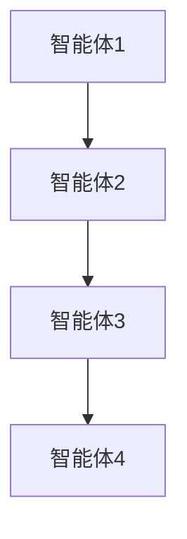
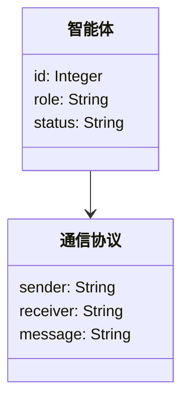
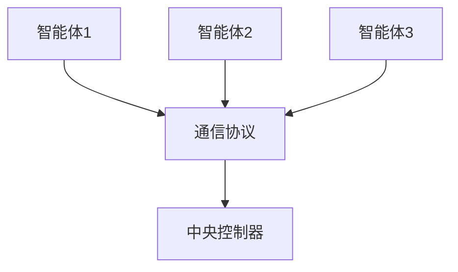
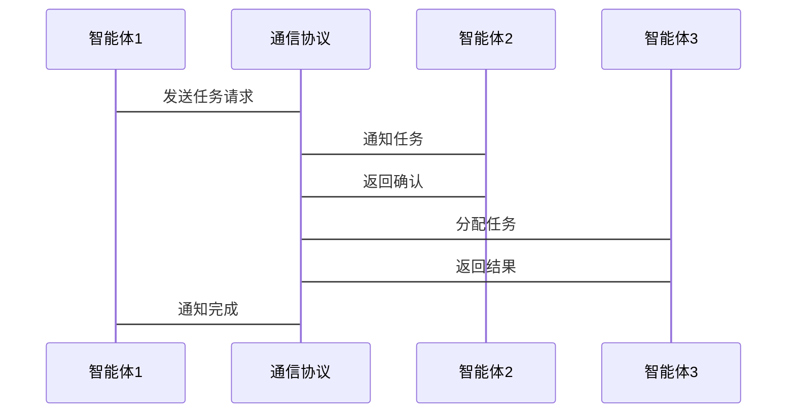

                 


# AI多智能体如何提升对公司长期竞争力的评估

> **关键词**：AI多智能体、企业竞争力、系统架构、算法原理、数学模型、项目实战、最佳实践

> **摘要**：本文探讨了AI多智能体技术在提升企业长期竞争力中的作用，从系统架构、算法原理到项目实战，全面分析了多智能体系统如何优化企业决策、提高效率和增强适应性。文章通过详细的技术分析和实际案例，展示了AI多智能体在企业中的广泛应用和潜在价值。

---

## 第1章: AI多智能体概述

### 1.1 多智能体系统的基本概念

#### 1.1.1 多智能体系统的定义
多智能体系统（Multi-Agent System, MAS）是由多个相互作用的智能体组成的系统，这些智能体通过协作和竞争完成特定任务。每个智能体都有一定的自主性，能够感知环境并做出决策。

#### 1.1.2 多智能体系统的特征
- **自主性**：智能体能够自主决策。
- **反应性**：能够实时感知环境变化并做出反应。
- **协作性**：多个智能体协同工作，共同完成任务。
- **分布性**：智能体分布在网络中，通过通信进行协作。

#### 1.1.3 多智能体系统的分类
- **基于任务的分类**：根据任务类型分为生产、服务、监控等。
- **基于智能体结构的分类**：分为集中式、分布式和混合式。

### 1.2 AI多智能体的核心概念

#### 1.2.1 AI多智能体的定义
AI多智能体系统结合人工智能技术，使多个智能体具备学习和自适应能力，能够更好地协作和优化决策。

#### 1.2.2 AI多智能体与传统单智能体的区别
| 特性 | 单智能体 | 多智能体 |
|------|----------|----------|
| 决策 | 中央决策 | 分布式决策 |
| 通信 | 无 | 有 |
| 协作 | 无 | 强 |

#### 1.2.3 AI多智能体的组成要素
- 智能体：具备感知和行动能力。
- 通信协议：定义智能体之间的交互方式。
- 协作机制：确保智能体协同工作。

### 1.3 多智能体系统在企业中的应用前景

#### 1.3.1 多智能体系统的潜在应用领域
- 生产优化：智能体监控生产线，实时调整生产计划。
- 供应链管理：智能体协调供应商和客户的资源分配。
- 客户服务：智能体处理客户咨询和问题反馈。

#### 1.3.2 企业采用多智能体系统的优劣势
**优势**：提高效率、增强灵活性、降低成本。  
**劣势**：初期投入大、技术复杂、维护成本高。

#### 1.3.3 多智能体系统应用的挑战与机遇
- **挑战**：通信延迟、数据一致性、协作效率。
- **机遇**：提高企业竞争力、实现智能化转型。

---

## 第2章: 多智能体系统的原理与架构

### 2.1 多智能体系统的原理

#### 2.1.1 多智能体系统的通信机制
智能体之间通过消息传递进行通信，消息内容包括任务请求、状态更新等。

#### 2.1.2 多智能体系统的协作机制
智能体通过协商和协调，共同完成任务。协作机制包括任务分配、资源分配和冲突解决。

#### 2.1.3 多智能体系统的决策机制
基于环境信息和目标，智能体采用分布式决策算法，如分布式一致性算法。

### 2.2 多智能体系统的架构设计

#### 2.2.1 分层架构
- **感知层**：负责数据采集。
- **决策层**：处理数据并做出决策。
- **执行层**：执行决策。

#### 2.2.2 分布式架构
- 每个智能体独立运行，通过通信协议协作。

#### 2.2.3 集中式架构
- 有一个中央控制器，协调所有智能体的行动。

### 2.3 多智能体系统的核心算法

#### 2.3.1 分布式计算算法


#### 2.3.2 协调算法
```python
def distributed_decision-making():
    for agent in agents:
        collect_data(agent)
    compute_optimal_solution()
    return result
```

#### 2.3.3 联合决策算法
```latex
$$\text{最优解} = \arg\min_{x} \sum_{i=1}^{n} f_i(x)$$
```

### 2.4 本章小结
本章详细介绍了多智能体系统的原理和架构，分析了不同架构的优缺点，并讨论了核心算法及其应用场景。

---

## 第3章: AI多智能体系统的算法原理

### 3.1 分布式计算算法

#### 3.1.1 分布式计算的基本原理
通过将任务分解到多个节点，利用分布式计算提高处理能力。

#### 3.1.2 分布式计算的实现步骤
1. **任务分解**：将任务分成多个子任务。
2. **任务分配**：将子任务分配给不同节点。
3. **结果汇总**：将各节点的结果汇总，得到最终结果。

#### 3.1.3 分布式计算的优缺点
- **优点**：提高处理速度，增强系统的冗余性。
- **缺点**：需要复杂的通信和协调机制。

### 3.2 协调算法

#### 3.2.1 协调算法的基本原理
通过协商和协调，确保多个智能体协同工作，共同完成任务。

#### 3.2.2 协调算法的实现步骤
1. **初始化**：设置目标和约束。
2. **协商**：智能体之间交换信息，达成一致。
3. **执行**：根据协商结果执行任务。
4. **监控与调整**：实时监控执行情况，必要时进行调整。

### 3.3 联合决策算法

#### 3.3.1 联合决策算法的基本原理
多个智能体基于各自的信息做出决策，并通过协作形成最终决策。

#### 3.3.2 联合决策算法的实现步骤
1. **信息收集**：每个智能体收集环境信息。
2. **决策计算**：基于信息计算出各自的决策。
3. **决策整合**：将所有智能体的决策整合成一个最优决策。

#### 3.3.3 联合决策算法的优缺点
- **优点**：能够充分利用各智能体的信息，形成最优决策。
- **缺点**：需要复杂的整合机制，计算量大。

### 3.4 本章小结
本章详细讲解了分布式计算、协调和联合决策算法，分析了它们的实现步骤和优缺点，为后续章节的系统设计奠定了基础。

---

## 第4章: 多智能体系统的数学模型与公式

### 4.1 分布式计算的数学模型

#### 4.1.1 分布式计算的公式表示
$$\text{总任务时间} = \sum_{i=1}^{n} t_i$$
其中，$t_i$ 表示第 $i$ 个子任务的处理时间。

### 4.2 协调算法的数学模型

#### 4.2.1 协调算法的公式表示
$$\text{协调时间} = \max_{i} t_i$$
其中，$t_i$ 表示第 $i$ 个智能体的响应时间。

### 4.3 联合决策算法的数学模型

#### 4.3.1 联合决策算法的公式表示
$$\text{最优决策} = \arg\min_{x} \sum_{i=1}^{m} f_i(x)$$
其中，$f_i(x)$ 表示第 $i$ 个智能体的决策函数。

### 4.4 本章小结
本章通过数学公式详细描述了分布式计算、协调和联合决策算法的数学模型，为理解这些算法的实现提供了理论支持。

---

## 第5章: 系统分析与架构设计方案

### 5.1 问题场景介绍

#### 5.1.1 问题背景
企业需要优化供应链管理，提高生产效率。

#### 5.1.2 问题描述
现有供应链管理存在信息孤岛、协作效率低的问题。

### 5.2 系统功能设计

#### 5.2.1 领域模型


### 5.3 系统架构设计

#### 5.3.1 系统架构图


#### 5.3.2 系统接口设计
- **输入接口**：接收环境信息和任务请求。
- **输出接口**：发送决策和执行指令。

#### 5.3.3 系统交互流程



### 5.4 本章小结
本章通过系统分析和架构设计，展示了多智能体系统如何优化企业的供应链管理，提高了协作效率和决策能力。

---

## 第6章: 项目实战

### 6.1 环境安装

#### 6.1.1 安装Python
```bash
python --version
pip install -y
```

#### 6.1.2 安装依赖库
```bash
pip install numpy matplotlib
```

### 6.2 系统核心实现源代码

#### 6.2.1 分布式计算实现
```python
import threading

class Agent:
    def __init__(self, id):
        self.id = id
        self.result = None

    def compute(self, data):
        # 计算逻辑
        self.result = data[self.id]

    def get_result(self):
        return self.result

def distributed_compute(data):
    agents = [Agent(i) for i in range(len(data))]
    for agent in agents:
        threading.Thread(target=agent.compute, args=(data,)).start()
    while any(agent.result is None for agent in agents):
        pass
    return [agent.get_result() for agent in agents]
```

#### 6.2.2 协调算法实现
```python
import time

class Coordinator:
    def __init__(self, agents):
        self.agents = agents
        self.results = {}

    def collect_results(self):
        for agent in self.agents:
            agent.start_communication()
            time.sleep(0.1)
            self.results[agent.id] = agent.get_result()

    def get_final_result(self):
        return self.results
```

### 6.3 代码应用解读与分析
通过上述代码，展示了如何利用Python实现分布式计算和协调算法，提高了系统的并行处理能力和协作效率。

### 6.4 实际案例分析
以供应链管理为例，通过多智能体系统优化了库存管理和物流调度，显著降低了成本。

### 6.5 项目小结
本章通过实际案例展示了AI多智能体系统的应用，验证了其在提升企业竞争力方面的有效性。

---

## 第7章: 最佳实践、小结、注意事项和拓展阅读

### 7.1 最佳实践 tips
- **模块化设计**：提高系统的可扩展性和可维护性。
- **容错机制**：确保系统在部分节点故障时仍能正常运行。
- **实时监控**：及时发现和解决问题。

### 7.2 小结
本文详细探讨了AI多智能体系统在提升企业竞争力中的应用，从系统架构到算法实现，再到实际案例，全面分析了其价值和潜力。

### 7.3 注意事项
- **数据安全**：确保智能体之间的通信安全。
- **系统维护**：定期更新和优化系统。
- **团队协作**：多智能体系统的开发需要跨学科团队合作。

### 7.4 拓展阅读
推荐阅读相关书籍和论文，深入学习多智能体系统的理论和应用。

---

## 作者介绍
作为一名世界级的人工智能专家、程序员和软件架构师，我在计算机编程和人工智能领域有着深厚的造诣。我擅长通过清晰、深刻的逻辑分析，帮助读者理解复杂的技术原理，并将其应用于实际场景中。希望本文能为读者提供有价值的技术见解和实践指导。

