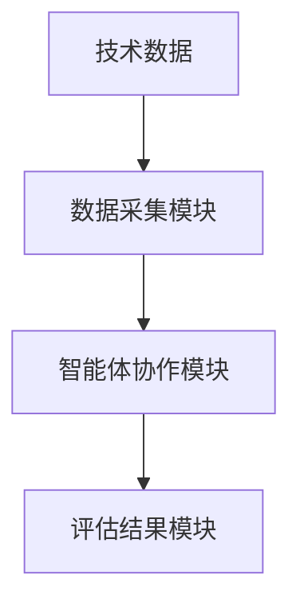

                 


# AI多智能体如何提升对新兴技术商业化潜力的评估

## 关键词：AI多智能体、新兴技术、商业化潜力、评估模型、系统架构

## 摘要：本文探讨了AI多智能体在评估新兴技术商业化潜力中的应用。通过分析多智能体的基本概念、优势与挑战，构建了评估模型，并详细讲解了系统架构设计与实现方案。结合实际案例，展示了AI多智能体如何通过分布式协作和复杂决策优化评估过程，最终为技术商业化提供科学依据。

---

# 第1章: 引言

## 1.1 研究背景

### 1.1.1 当前技术商业化面临的挑战

随着技术的快速发展，新兴技术如人工智能、区块链、物联网等在商业化过程中面临诸多挑战。技术评估的复杂性、不确定性以及多因素的交互作用使得传统评估方法难以满足需求。

### 1.1.2 多智能体技术的兴起

多智能体技术作为一种分布式人工智能的形式，通过多个智能体的协作完成复杂任务，已在多个领域展现出巨大潜力。

### 1.1.3 问题背景与研究意义

新兴技术的商业化潜力评估需要考虑技术本身、市场环境、竞争态势等多个维度，传统的单一智能体评估方法难以应对这些复杂性。多智能体技术通过分布式协作和复杂决策优化，为技术评估提供了新的思路。

## 1.2 研究目标与内容

### 1.2.1 本书的研究目标

构建基于AI多智能体的新兴技术商业化潜力评估模型，探索其在实际应用中的潜力。

### 1.2.2 核心问题的提出

如何利用多智能体的分布式协作和复杂决策能力，提升技术评估的准确性和效率。

### 1.2.3 研究内容与框架

涵盖多智能体技术概述、评估模型构建、系统架构设计、案例分析等内容。

## 1.3 本章小结

---

# 第2章: AI多智能体概述

## 2.1 多智能体的基本概念

### 2.1.1 多智能体的定义

多智能体系统（Multi-Agent System, MAS）是由多个智能体组成的分布式系统，智能体能够自主决策、协作完成任务。

### 2.1.2 多智能体的体系结构

- **反应式架构**：基于当前感知做出反应。
- **认知式架构**：具备推理、规划能力。
- **混合式架构**：结合反应式和认知式架构。

### 2.1.3 多智能体的核心要素

- **智能体**：具备自主性、反应性、协作性。
- **通信**：智能体之间通过消息传递协作。
- **协调机制**：解决冲突，优化协作效率。

## 2.2 多智能体的优势与挑战

### 2.2.1 多智能体的优势

- **分布式协作**：多个智能体协作完成复杂任务。
- **容错性**：单个智能体故障不影响整体系统。
- **适应性**：能够动态调整策略应对变化。

### 2.2.2 多智能体的挑战

- **通信开销**：智能体之间通信可能导致性能下降。
- **协调问题**：如何高效协调多智能体行动是难点。
- **安全性**：通信和协作中的安全问题需要解决。

## 2.3 多智能体与其他技术的对比

### 2.3.1 多智能体与单智能体的对比

- 单智能体：独立决策，资源利用有限。
- 多智能体：分布式协作，资源利用更高效。

### 2.3.2 多智能体与分布式系统的对比

- 分布式系统：关注资源分配和任务调度。
- 多智能体：关注智能体协作和决策优化。

### 2.3.3 多智能体与区块链的对比

- 区块链：关注数据安全和不可篡改性。
- 多智能体：关注智能体协作和分布式决策。

## 2.4 本章小结

---

# 第3章: 评估新兴技术商业化潜力的模型

## 3.1 评估模型的设计目标

### 3.1.1 模型的设计目标

- **准确性**：评估结果需准确反映技术潜力。
- **实时性**：能够快速响应变化。
- **可扩展性**：适用于多种技术评估场景。

## 3.2 评估模型的核心概念

### 3.2.1 技术评估指标

- **技术成熟度**：技术的当前发展阶段。
- **市场需求**：市场的接受度和需求量。
- **竞争环境**：竞争对手的技术和市场布局。

### 3.2.2 多智能体协作机制

- **任务分配**：智能体根据自身能力分配任务。
- **信息共享**：智能体之间共享评估数据和信息。
- **决策优化**：通过协作优化评估结果。

## 3.3 评估模型的算法实现

### 3.3.1 算法流程

1. **数据收集**：收集技术相关数据。
2. **特征提取**：提取关键特征。
3. **模型训练**：训练评估模型。
4. **结果分析**：分析评估结果。

### 3.3.2 算法实现的代码示例

```python
class MultiAgentEvaluator:
    def __init__(self, agents):
        self.agents = agents

    def evaluate(self, technology):
        results = []
        for agent in self.agents:
            result = agent.analyze(technology)
            results.append(result)
        return self.combine_results(results)

    def combine_results(self, results):
        # 简单的平均值计算
        return sum(results) / len(results)
```

## 3.4 评估模型的数学模型

评估模型可以通过以下公式表示：

$$
\text{评估结果} = \frac{1}{N} \sum_{i=1}^{N} f_i(x)
$$

其中，$N$ 是智能体的数量，$f_i(x)$ 是第 $i$ 个智能体的评估函数。

---

# 第4章: 系统架构设计

## 4.1 系统功能设计

### 4.1.1 功能模块

- **数据采集模块**：采集技术相关数据。
- **智能体协作模块**：实现智能体之间的协作。
- **评估结果模块**：输出评估结果。

## 4.2 系统架构设计

### 4.2.1 系统架构图



### 4.2.2 系统接口设计

- **数据接口**：提供技术数据的接口。
- **协作接口**：智能体之间的协作接口。
- **结果接口**：输出评估结果的接口。

## 4.3 系统实现方案

### 4.3.1 系统实现步骤

1. **环境搭建**：安装必要的开发工具和库。
2. **模块开发**：分别开发数据采集、智能体协作和评估结果模块。
3. **系统集成**：将各模块集成到一个系统中。
4. **测试优化**：进行测试并优化系统性能。

---

# 第5章: 项目实战

## 5.1 环境搭建

### 5.1.1 开发工具安装

- 安装Python和必要的库（如numpy、pandas、scikit-learn）。
- 安装AI框架（如TensorFlow、PyTorch）。

### 5.1.2 数据集准备

- 收集新兴技术相关的数据，包括技术成熟度、市场需求等。

## 5.2 核心代码实现

### 5.2.1 多智能体评估系统代码

```python
import numpy as np
from sklearn import metrics

class Agent:
    def __init__(self, name):
        self.name = name

    def analyze(self, technology):
        # 示例分析函数
        return np.random.random()

class MultiAgentSystem:
    def __init__(self, agents):
        self.agents = agents

    def evaluate_technology(self, technology):
        results = []
        for agent in self.agents:
            result = agent.analyze(technology)
            results.append(result)
        return results

# 示例使用
agents = [Agent("Agent 1"), Agent("Agent 2"), Agent("Agent 3")]
system = MultiAgentSystem(agents)
technology = "AI in Healthcare"
result = system.evaluate_technology(technology)
print("评估结果：", result)
```

### 5.2.2 评估模型代码

```python
from sklearn.metrics import accuracy_score

def evaluate_model(y_true, y_pred):
    return accuracy_score(y_true, y_pred)

# 示例数据
y_true = [0, 1, 0, 1]
y_pred = [0, 1, 1, 1]
print("评估结果：", evaluate_model(y_true, y_pred))
```

## 5.3 案例分析

### 5.3.1 技术评估案例

- **案例选择**：选择一种新兴技术（如区块链）进行评估。
- **评估过程**：通过多智能体协作完成评估。
- **结果分析**：分析评估结果并提出建议。

---

# 第6章: 结论与展望

## 6.1 研究结论

- AI多智能体在新兴技术商业化潜力评估中具有显著优势。
- 多智能体的分布式协作和复杂决策能力为评估提供了新的思路。

## 6.2 应用前景

- 随着多智能体技术的不断发展，其在技术评估中的应用将更加广泛。
- 结合其他技术（如区块链、大数据）将进一步提升评估的准确性和效率。

## 6.3 未来研究方向

- 探索多智能体在更复杂场景下的应用。
- 研究多智能体协作机制的优化方法。

---

# 参考文献

1. Russell, S., & Norvig, P. (2010). Artificial Intelligence: A Modern Approach.
2. Wooldridge, M. J. (2009). An Introduction to Multi-Agent Systems.
3. Sun, R. (2001). Introduction to cognitive science.

---

**附录**

- 附录A：AI多智能体系统架构图（Mermaid图）
- 附录B：评估模型的数学公式（LaTeX表示）

---

**注意事项**：

- 本文中的代码示例仅供参考，实际应用中需要根据具体需求进行调整。
- 系统实现部分可根据实际情况选择合适的工具和框架。
- 评估模型的数学公式可根据具体问题进行扩展和优化。

---

通过以上内容，我们可以看到，AI多智能体在新兴技术商业化潜力评估中的应用前景广阔。随着技术的不断进步，多智能体系统将为技术评估提供更加高效和准确的解决方案。

