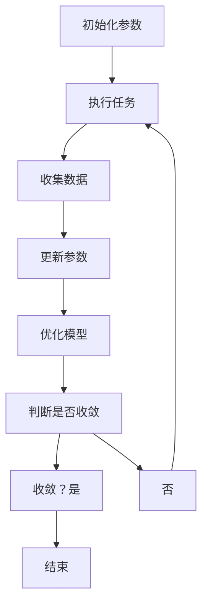
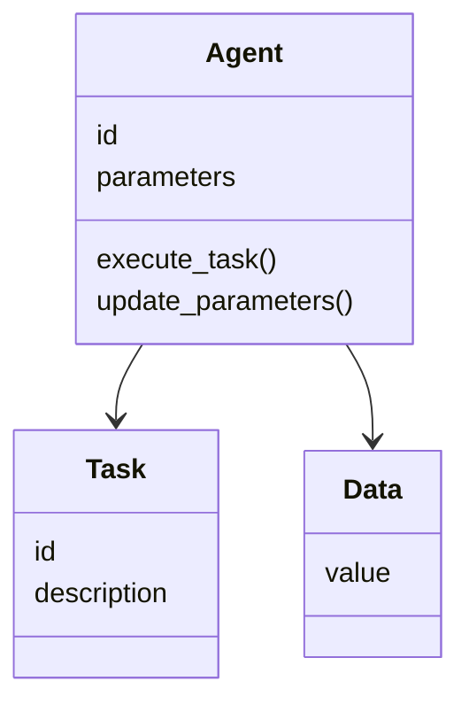

                 


# AI多智能体如何提升对新兴行业价值链的分析

> 关键词：AI多智能体, 多智能体系统, 价值链分析, 新兴行业, 算法实现

> 摘要：本文探讨了AI多智能体技术在新兴行业价值链分析中的应用，通过详细分析多智能体系统的协作机制、学习机制，以及在实际场景中的算法实现，展示了AI多智能体如何提升行业价值链的分析效率和优化能力。

---

## 第1章：AI多智能体的定义与背景

### 1.1 AI多智能体的基本概念

#### 1.1.1 多智能体系统（MAS）的定义
多智能体系统（Multi-Agent System, MAS）是由多个智能体组成的分布式系统，每个智能体能够独立感知环境、自主决策，并通过协作完成复杂的任务。智能体之间通过通信和协作机制，实现信息共享和协同行动。

#### 1.1.2 AI多智能体的核心特点
AI多智能体结合了人工智能技术，具备以下特点：
1. **自主性**：每个智能体能够独立决策。
2. **协作性**：智能体之间通过通信协作完成任务。
3. **分布式计算**：任务分布在多个智能体之间，避免了单点故障。
4. **适应性**：能够根据环境变化自适应调整策略。

#### 1.1.3 多智能体与单智能体的对比
| 对比维度 | 多智能体 | 单智能体 |
|----------|----------|----------|
| 系统复杂度 | 高 | 低 |
| 并行处理能力 | 强 | 弱 |
| 故障容错性 | 高 | 低 |

### 1.2 新兴行业价值链分析的背景

#### 1.2.1 新兴行业的定义与特点
新兴行业是指近年来快速发展的新兴产业，例如人工智能、区块链、物联网等。这些行业通常具有高技术含量、高增长性和高不确定性。

#### 1.2.2 价值链分析的必要性
价值链分析是理解行业结构、优化资源配置、提升竞争力的重要工具。通过分析价值链的各个环节，企业可以识别瓶颈、降低成本、提高效率。

#### 1.2.3 AI多智能体在价值链分析中的优势
AI多智能体能够通过分布式计算和协作学习，快速分析和优化复杂的价值链结构，提升决策效率和准确性。

---

## 第2章：AI多智能体在新兴行业中的应用背景

### 2.1 新兴行业的价值链结构

#### 2.1.1 价值链的构成要素
新兴行业价值链通常包括研发、生产、销售、服务等多个环节。例如，在人工智能行业，价值链包括算法开发、数据处理、模型训练、产品部署等。

#### 2.1.2 价值链的优化目标
优化目标包括提高效率、降低成本、增强灵活性和提升用户体验。

#### 2.1.3 新兴行业价值链的复杂性
新兴行业价值链往往涉及多个参与者和复杂的关系，传统的线性分析方法难以捕捉其动态变化。

### 2.2 AI多智能体在价值链分析中的作用

#### 2.2.1 提高分析效率
AI多智能体能够同时处理多个信息源，快速生成分析结果，显著提高分析效率。

#### 2.2.2 增强决策能力
通过协作学习和强化学习，AI多智能体能够从经验中不断优化决策策略，提升决策的准确性和科学性。

#### 2.2.3 优化资源分配
AI多智能体能够根据实时数据和市场变化，动态调整资源分配，确保最优资源配置。

---

## 第3章：AI多智能体的核心概念

### 3.1 多智能体系统的协作机制

#### 3.1.1 通信机制
智能体之间通过消息传递、共享数据库等方式进行信息交流。

#### 3.1.2 协作机制
智能体根据任务需求，动态分配角色和责任，确保协作效率。

#### 3.1.3 决策机制
每个智能体根据自身信息和全局信息，采用分布式算法进行决策。

### 3.2 AI多智能体的学习机制

#### 3.2.1 强化学习
通过奖励机制，智能体学习最优策略，提升决策能力。

#### 3.2.2 联合学习
多个智能体协作学习，共享知识，提高整体学习效果。

#### 3.2.3 迁移学习
将已有的知识和经验迁移到新任务中，加快学习速度。

---

## 第4章：AI多智能体的协作与学习原理

### 4.1 多智能体协作的数学模型

#### 4.1.1 协作目标函数
$$ \text{目标函数} = \sum_{i=1}^{n} w_i x_i $$
其中，\( w_i \) 是权重，\( x_i \) 是变量。

#### 4.1.2 协作约束条件
$$ \sum_{i=1}^{n} x_i \leq C $$
其中，\( C \) 是约束常数。

#### 4.1.3 协作收益模型
$$ R = \sum_{i=1}^{n} r_i x_i $$
其中，\( r_i \) 是收益系数。

### 4.2 多智能体学习的算法流程

#### 4.2.1 算法步骤
1. 初始化智能体参数。
2. 智能体执行任务，收集数据。
3. 更新参数，优化模型。
4. 重复步骤，直到收敛。

#### 4.2.2 算法收敛性分析
使用mermaid流程图展示算法流程：



---

## 第5章：AI多智能体的算法实现与代码解析

### 5.1 算法实现

#### 5.1.1 Python代码实现
```python
class Agent:
    def __init__(self, id):
        self.id = id
        self.parameters = {}  # 初始化参数

    def execute_task(self, task):
        # 执行任务并返回结果
        return result

    def update_parameters(self, data):
        # 更新参数
        pass

# 初始化多个智能体
agents = [Agent(i) for i in range(5)]

# 算法主循环
while not converged:
    for agent in agents:
        data = agent.execute_task(task)
        agent.update_parameters(data)
```

#### 5.1.2 代码解析
每个智能体都有自己的参数和任务执行方法，通过循环迭代更新参数，直到收敛。

---

## 第6章：AI多智能体的系统架构设计

### 6.1 系统功能设计

#### 6.1.1 领域模型
使用mermaid类图展示系统结构：



### 6.2 系统架构设计

#### 6.2.1 系统架构图
使用mermaid架构图展示系统架构：


---

## 第7章：AI多智能体的项目实战与应用案例

### 7.1 项目实战

#### 7.1.1 环境安装
安装Python和相关库，例如`numpy`、`scipy`、`matplotlib`等。

#### 7.1.2 核心代码实现
实现一个多智能体协作算法，用于优化新兴行业的价值链。

### 7.2 应用案例

#### 7.2.1 案例分析
以人工智能行业为例，分析AI多智能体如何优化算法开发、数据处理和模型训练环节。

---

## 第8章：总结与展望

### 8.1 总结
本文详细探讨了AI多智能体在新兴行业价值链分析中的应用，通过理论分析和实际案例，展示了其强大的分析和优化能力。

### 8.2 展望
未来，AI多智能体将在更多新兴行业得到广泛应用，推动行业价值链的进一步优化和创新。

---

以上是《AI多智能体如何提升对新兴行业价值链的分析》的技术博客文章大纲和内容，涵盖了从基本概念到实际应用的各个方面，帮助读者全面理解AI多智能体在新兴行业中的价值和应用。

