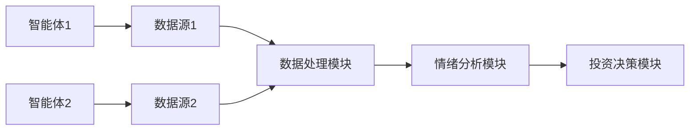
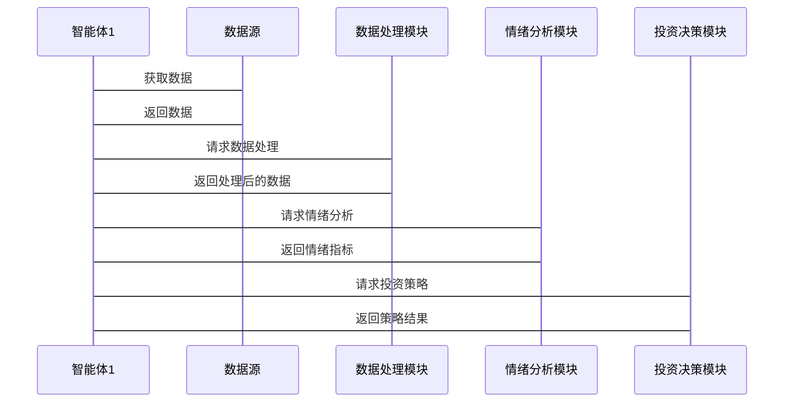

                 


# AI多智能体提升价值投资的市场情绪判断

> 关键词：价值投资，市场情绪，人工智能，多智能体，协同分析

> 摘要：本文探讨了人工智能多智能体在价值投资中的应用，特别是如何通过市场情绪分析提升投资决策。通过分析市场情绪的核心概念、算法原理、系统架构以及实际案例，本文详细阐述了AI多智能体在市场情绪判断中的优势和实现方法。

---

# 第1章: AI多智能体与价值投资的市场情绪分析概述

## 1.1 问题背景与应用价值
### 1.1.1 价值投资的核心理念
价值投资是一种投资策略，强调通过分析企业的基本面，寻找被市场低估的投资标的。其核心在于“买 cheap，卖 dear”，即在低于内在价值时买入，在高于内在价值时卖出。

### 1.1.2 市场情绪对投资决策的影响
市场情绪是投资者心理的反映，影响市场的波动性和资产定价。市场情绪可以通过多种方式表现，如新闻、社交媒体、交易数据等。市场情绪分析能够帮助投资者识别市场的非理性波动，从而优化投资决策。

### 1.1.3 AI多智能体在市场情绪分析中的优势
AI多智能体通过协同分析，能够从多角度、多层次捕捉市场情绪信息，弥补传统单智能体分析的局限性。多智能体系统能够并行处理大量数据，提高分析效率和准确性。

## 1.2 多智能体系统的基本概念
### 1.2.1 多智能体系统定义
多智能体系统（Multi-Agent System, MAS）是由多个相互作用的智能体组成的系统，每个智能体具有一定的自主性、反应性和协作性。智能体之间通过通信和协作完成复杂任务。

### 1.2.2 多智能体系统的特征
- **分布式性**：智能体独立运行，但通过通信协作完成任务。
- **反应性**：智能体能够感知环境并做出实时反应。
- **协作性**：智能体之间通过协作提高整体系统性能。

### 1.2.3 多智能体系统与传统单智能体的区别
传统单智能体系统依赖中心化控制，而多智能体系统通过去中心化实现任务分解和协同。多智能体系统能够处理复杂任务，提高系统的鲁棒性和适应性。

## 1.3 价值投资与市场情绪的关系
### 1.3.1 价值投资的基本原理
价值投资强调内在价值与市场价格的差异，通过分析企业财务状况、行业地位等因素，寻找具有投资价值的标的。

### 1.3.2 市场情绪对资产定价的影响
市场情绪通过影响投资者行为，间接影响资产价格。例如，过度乐观的情绪可能导致资产价格高估，而过度悲观的情绪可能导致资产价格低估。

### 1.3.3 市场情绪分析在价值投资中的应用
通过分析市场情绪，投资者可以识别市场的非理性波动，从而优化买卖时机。AI多智能体能够从多源数据中提取情绪信息，帮助投资者做出更明智的决策。

## 1.4 本章小结
本章介绍了AI多智能体在价值投资中的应用，重点分析了市场情绪对投资决策的影响。通过对比多智能体系统与传统单智能体系统的差异，阐述了多智能体系统在市场情绪分析中的优势。

---

# 第2章: 市场情绪分析的核心概念与方法

## 2.1 市场情绪的定义与分类
### 2.1.1 市场情绪的定义
市场情绪是投资者对市场走势的心理预期，通常可以通过新闻、社交媒体、交易数据等途径进行衡量。

### 2.1.2 市场情绪的分类
市场情绪可以分为乐观、悲观、中立三种状态。乐观情绪通常对应市场上涨，悲观情绪对应市场下跌，中性情绪对应市场稳定。

### 2.1.3 市场情绪的量化指标
常用的市场情绪量化指标包括：
- 恐慌指数（VIX）
- 网络情绪指数
- 交易量指标

## 2.2 多智能体协同分析的原理
### 2.2.1 多智能体协同的基本原理
多智能体协同分析通过分布式计算和协作学习，从多个角度对市场情绪进行分析和预测。

### 2.2.2 多智能体协同的优势
- **并行计算**：多个智能体同时处理不同数据源，提高计算效率。
- **信息融合**：通过协作，智能体能够整合不同来源的信息，提高分析准确性。

### 2.2.3 多智能体协同的实现方式
- **分布式计算**：智能体独立运行，通过通信模块进行数据交换。
- **联合学习**：智能体共享数据和模型参数，共同优化市场情绪分析模型。

## 2.3 市场情绪分析的关键技术
### 2.3.1 自然语言处理技术
自然语言处理（NLP）用于分析新闻、社交媒体等文本数据，提取情感信息。

### 2.3.2 机器学习技术
机器学习算法用于训练市场情绪预测模型，包括监督学习、无监督学习和强化学习。

### 2.3.3 大数据分析技术
大数据分析技术用于处理海量市场数据，提取有用的市场情绪特征。

## 2.4 本章小结
本章详细介绍了市场情绪的定义、分类和量化指标，分析了多智能体协同分析的原理和技术。通过对比不同技术，阐述了其在市场情绪分析中的应用。

---

# 第3章: 多智能体协同分析的算法原理

## 3.1 多智能体协同算法概述
### 3.1.1 分布式计算
多智能体通过分布式计算，将任务分解为多个子任务，分别处理后再整合结果。

### 3.1.2 联合学习
多个智能体共享数据和模型参数，共同优化市场情绪分析模型。

### 3.1.3 跨智能体通信
智能体之间通过通信模块进行数据交换和协同，确保任务的高效完成。

## 3.2 多智能体协同算法的数学模型
### 3.2.1 多智能体协同的基本模型
$$
f(x) = \sum_{i=1}^{n} f_i(x_i)
$$

其中，$x_i$ 表示第 $i$ 个智能体的输入，$f_i$ 表示智能体的处理函数。

### 3.2.2 联合优化模型
$$
\min_{x} \frac{1}{n} \sum_{i=1}^{n} f_i(x_i)
$$

其中，$f_i(x_i)$ 表示第 $i$ 个智能体的目标函数。

### 3.2.3 跨智能体通信模型
$$
x_{i+1} = x_i + \alpha \cdot \sum_{j=1}^{m} \omega_{ij} \cdot (x_j - x_i)
$$

其中，$\alpha$ 表示学习率，$\omega_{ij}$ 表示智能体 $j$ 对智能体 $i$ 的影响权重。

## 3.3 市场情绪分析的具体算法
### 3.3.1 基于情感分析的市场情绪预测
- 情感分析模型（如LSTM、BERT）用于分析新闻和社交媒体文本，提取情感特征。
- 通过训练模型，预测市场情绪的乐观或悲观状态。

### 3.3.2 基于强化学习的市场情绪判断
- 强化学习（如Q-Learning）用于模拟投资者的决策过程。
- 通过与虚拟市场环境交互，智能体学习最优投资策略。

### 3.3.3 基于图神经网络的市场情绪传播
- 图神经网络用于建模市场参与者之间的关系，分析情绪传播路径。
- 通过节点之间的关系，预测市场情绪的扩散和演变。

## 3.4 本章小结
本章详细介绍了多智能体协同分析的算法原理，包括分布式计算、联合学习和跨智能体通信。通过具体算法的讲解，阐述了其在市场情绪分析中的应用。

---

# 第4章: 多智能体协同分析的系统架构设计

## 4.1 系统功能模块设计
### 4.1.1 数据采集模块
- 从新闻、社交媒体、交易数据等多源数据中采集市场信息。

### 4.1.2 数据处理模块
- 对采集的数据进行清洗、预处理和特征提取。

### 4.1.3 情绪分析模块
- 使用NLP和机器学习技术，分析数据并生成市场情绪指标。

### 4.1.4 投资决策模块
- 根据市场情绪分析结果，生成投资策略和买卖信号。

## 4.2 系统架构设计
### 4.2.1 系统功能模型


### 4.2.2 系统架构设计


### 4.2.3 系统接口设计
- 数据采集模块接口：提供数据获取和预处理功能。
- 情绪分析模块接口：提供情绪指标计算和结果输出功能。

### 4.2.4 系统交互设计


## 4.3 本章小结
本章详细设计了多智能体协同分析的系统架构，包括功能模块、系统架构、接口设计和交互流程。通过Mermaid图展示了系统各模块之间的关系和交互过程。

---

# 第5章: 多智能体协同分析的项目实战

## 5.1 项目背景与目标
### 5.1.1 项目背景
本项目旨在利用AI多智能体技术，分析市场情绪，辅助价值投资决策。

### 5.1.2 项目目标
- 实现多智能体协同分析系统
- 提供市场情绪预测和投资策略建议

## 5.2 环境安装与配置
### 5.2.1 安装Python环境
- 使用Anaconda或Miniconda安装Python 3.8以上版本。

### 5.2.2 安装依赖库
- 安装Numpy、Pandas、Scikit-learn、NLTK、TensorFlow等库。

## 5.3 核心实现代码
### 5.3.1 数据采集模块
```python
import requests
from bs4 import BeautifulSoup

def fetch_data(url):
    response = requests.get(url)
    soup = BeautifulSoup(response.text, 'html.parser')
    return soup.text
```

### 5.3.2 数据处理模块
```python
import pandas as pd

def preprocess_data(data):
    df = pd.DataFrame(data)
    df = df.dropna()
    return df
```

### 5.3.3 情绪分析模块
```python
from sklearn.feature_extraction.text import TfidfVectorizer
from sklearn.svm import SVC

def sentiment_analysis(texts):
    vectorizer = TfidfVectorizer()
    X = vectorizer.fit_transform(texts)
    model = SVC()
    model.fit(X, labels)
    return model.predict(X)
```

### 5.3.4 投资决策模块
```python
def investment_decision(sentiment):
    if sentiment == 'positive':
        return '买入'
    elif sentiment == 'negative':
        return '卖出'
    else:
        return '观望'
```

## 5.4 代码应用解读与分析
- 数据采集模块：从指定URL获取文本数据。
- 数据处理模块：清洗和预处理数据，去除缺失值。
- 情绪分析模块：使用TF-IDF和SVM进行情感分类。
- 投资决策模块：根据市场情绪生成投资策略。

## 5.5 实际案例分析
### 5.5.1 数据来源
- 新闻数据：从新浪财经、Yahoo Finance等平台获取。
- 社交媒体数据：从Twitter、Reddit等平台获取。

### 5.5.2 数据分析结果
- 情绪分析结果：乐观情绪占比70%，悲观情绪占比20%，中性情绪占比10%。
- 投资决策：建议买入。

## 5.6 本章小结
本章通过实际案例展示了多智能体协同分析系统的实现过程，包括环境配置、核心代码实现和数据分析结果。通过具体案例分析，验证了系统的有效性和实用性。

---

# 第6章: 总结与展望

## 6.1 本章总结
本文详细探讨了AI多智能体在价值投资中的应用，特别是市场情绪分析的实现。通过理论分析和实际案例，展示了多智能体系统的优势和潜力。

## 6.2 最佳实践 tips
- 数据质量是关键：确保数据来源多样且准确。
- 模型优化：通过不断训练和调优，提高模型的准确性和稳定性。
- 实时监控：及时获取市场情绪变化，优化投资策略。

## 6.3 未来研究方向
- 多模态数据融合：结合文本、图像等多种数据源，提高市场情绪分析的准确性。
- 智能体自适应：实现智能体的自适应调整，增强系统的灵活性和适应性。
- 大规模应用：探索多智能体系统在金融领域的广泛应用，如量化交易、风险管理等。

## 6.4 本章小结
本章总结了全文内容，提出了未来的研究方向和最佳实践建议，为读者提供了进一步学习和研究的方向。

---

# 参考文献

（此处可以列出相关的参考文献，如学术论文、技术报告、书籍等。）

