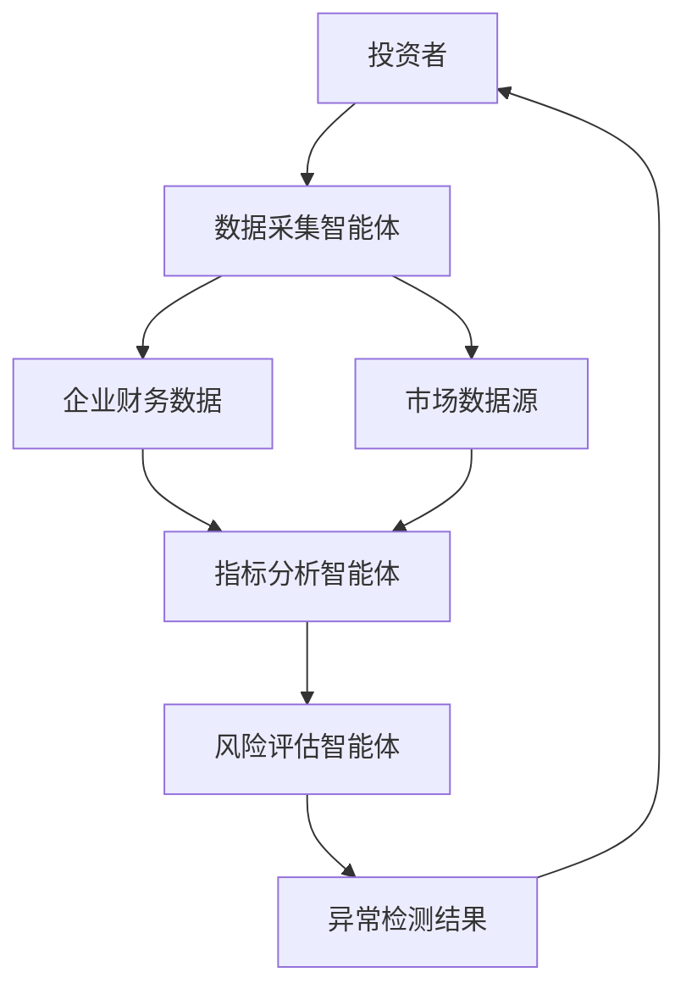
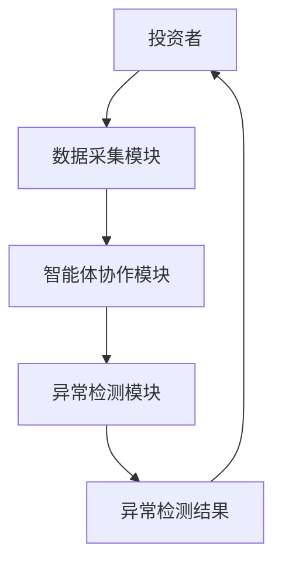

                 


# AI多智能体提升价值投资的财务指标异常检测

> 关键词：价值投资，AI多智能体，财务指标，异常检测，系统设计

> 摘要：本文探讨了如何利用AI多智能体技术提升价值投资中的财务指标异常检测能力。通过分析传统方法的局限性，提出了一种基于多智能体的分布式检测框架，并详细阐述了其实现原理、系统架构和应用案例。本文旨在为投资者提供一种高效、可靠的异常检测解决方案，帮助他们在复杂多变的金融市场中做出更明智的投资决策。

---

# 第1章 价值投资与财务指标的背景介绍

## 1.1 价值投资的基本概念

### 1.1.1 价值投资的定义与核心理念
价值投资是一种基于对公司内在价值评估的投资策略，强调以低于内在价值的价格买入优质资产。其核心理念包括：
- **长期视角**：关注企业的长期价值，而非短期市场波动。
- **安全边际**：买入价格低于内在价值，以降低风险。
- **竞争优势**：选择具有持续竞争优势的企业。

### 1.1.2 财务指标在价值投资中的重要性
财务指标是评估企业内在价值的核心工具，主要包括：
- **盈利能力**：如净利润率、ROE（净资产收益率）。
- **成长能力**：如收入增长率、净利润增长率。
- **财务健康状况**：如资产负债率、流动比率。
- **估值指标**：如市盈率、市净率。

### 1.1.3 传统财务指标分析的局限性
传统财务指标分析存在以下问题：
- 数据孤立：单个指标无法全面反映企业的真实状况。
- 人工误判：人为判断可能导致主观偏差。
- 动态变化：市场环境和企业经营状况的动态变化难以及时捕捉。

---

## 1.2 AI多智能体的基本概念

### 1.2.1 多智能体系统的特点
多智能体系统（Multi-Agent System, MAS）由多个具有自主性、反应性和协作性的智能体组成，具有以下特点：
- **分布式计算**：智能体独立决策，降低单点故障风险。
- **协作性**：智能体之间通过通信和协作完成复杂任务。
- **适应性**：能够根据环境变化动态调整行为。

### 1.2.2 多智能体与传统AI的区别
与传统AI相比，多智能体系统的优势在于：
- **分布式决策**：多个智能体独立决策，而非单一中心化控制。
- **协作与竞争**：智能体之间可以协作或竞争，模拟真实世界的复杂关系。
- **动态适应**：能够实时响应环境变化。

### 1.2.3 多智能体在金融领域的应用前景
多智能体技术在金融领域的应用前景广阔，特别是在以下场景：
- **高频交易**：多个智能体协同完成复杂交易策略。
- **风险控制**：通过分布式检测发现潜在风险。
- **智能投顾**：为投资者提供个性化的投资建议。

---

## 1.3 财务指标异常检测的背景与意义

### 1.3.1 财务指标异常检测的定义
财务指标异常检测是指通过分析企业的财务数据，识别出与正常情况显著不同的指标，帮助投资者发现潜在风险或机会。

### 1.3.2 异常检测在价值投资中的作用
异常检测在价值投资中的作用包括：
- **识别潜在风险**：及时发现企业财务状况恶化的情况。
- **发现投资机会**：通过异常指标发现被市场低估的企业。
- **提高决策效率**：通过自动化检测减少人工判断的主观性。

### 1.3.3 多智能体在异常检测中的优势
多智能体在异常检测中的优势体现在：
- **分布式计算**：多个智能体同时分析不同财务指标，提高效率。
- **协作与互补**：智能体之间可以协作，覆盖更多维度的异常检测。
- **动态调整**：根据市场变化实时调整检测策略。

---

## 1.4 本章小结
本章介绍了价值投资的基本概念、财务指标的重要性以及传统分析方法的局限性。同时，详细阐述了AI多智能体的基本概念及其在金融领域的应用前景。最后，探讨了财务指标异常检测的背景与意义，以及多智能体在其中的优势。

---

# 第2章 多智能体系统的核心概念与联系

## 2.1 多智能体系统的原理

### 2.1.1 多智能体系统的组成
多智能体系统主要由以下组件组成：
- **智能体（Agent）**：独立决策的个体，负责特定任务。
- **通信机制**：智能体之间的信息交互方式。
- **协作协议**：智能体之间协作的规则和策略。
- **环境（Environment）**：智能体所处的外部世界，如金融市场数据。

### 2.1.2 智能体之间的协作机制
协作机制是多智能体系统的核心，主要包含：
- **任务分配**：智能体根据自身能力分配任务。
- **信息共享**：智能体之间共享数据和知识。
- **决策协调**：通过协商达成一致的决策。

### 2.1.3 多智能体系统的通信协议
通信协议是智能体之间信息交互的基础，常见的通信协议包括：
- **基于消息的通信**：通过消息传递信息。
- **基于订阅的通信**：智能体订阅感兴趣的信息，实时接收更新。
- **基于查询的通信**：智能体主动查询所需信息。

---

## 2.2 多智能体与异常检测的联系

### 2.2.1 多智能体在异常检测中的角色
在财务指标异常检测中，多智能体可以承担以下角色：
- **数据采集智能体**：负责收集企业的财务数据。
- **指标分析智能体**：对特定财务指标进行实时监控和分析。
- **风险评估智能体**：综合多个指标的结果，评估整体风险。

### 2.2.2 异常检测的分布式计算特点
异常检测的分布式计算特点包括：
- **并行处理**：多个智能体同时处理不同数据源。
- **局部计算**：每个智能体只负责特定指标的检测。
- **全局协调**：通过智能体之间的协作，实现全局异常检测。

### 2.2.3 多智能体与传统异常检测方法的对比
与传统异常检测方法相比，多智能体的优势在于：
- **高效性**：通过分布式计算提高检测速度。
- **鲁棒性**：多个智能体协作，降低单点故障风险。
- **灵活性**：能够根据环境变化动态调整检测策略。

---

## 2.3 实体关系图与流程图

### 2.3.1 多智能体系统ER实体关系图
```mermaid
erd
actor 投资者;
actor 企业;
actor 市场数据源;
entity 财务指标;
entity 异常检测结果;
```

### 2.3.2 异常检测流程图


---

## 2.4 本章小结
本章详细阐述了多智能体系统的原理及其在异常检测中的应用。通过实体关系图和流程图，展示了多智能体系统在财务指标异常检测中的协作机制和通信流程。

---

# 第3章 异常检测的核心算法与实现

## 3.1 异常检测的核心算法

### 3.1.1 基于统计的异常检测方法
基于统计的异常检测方法包括：
- **Z-score方法**：通过计算数据点与均值的距离来判断异常值。
$$ Z = \frac{x - \mu}{\sigma} $$
- **箱线图方法**：通过计算四分位数来判断异常值。

### 3.1.2 基于机器学习的异常检测方法
基于机器学习的异常检测方法包括：
- **Isolation Forest**：一种无监督学习算法，通过树结构隔离异常值。
- **One-Class SVM**：通过构建数据分布模型，识别异常点。

### 3.1.3 基于深度学习的异常检测方法
基于深度学习的异常检测方法包括：
- **Autoencoder**：通过神经网络重构输入数据，识别异常点。
- **GAN（生成对抗网络）**：通过生成器和判别器的对抗训练，识别异常数据。

---

## 3.2 异常检测算法的实现

### 3.2.1 基于统计的异常检测实现
```python
import numpy as np

def z_score_outlier_detection(data, threshold=3):
    mean = np.mean(data)
    std = np.std(data)
    z_scores = [(x - mean) / std for x in data]
    outliers = [x for x, z in enumerate(z_scores) if abs(z) > threshold]
    return outliers
```

### 3.2.2 基于机器学习的异常检测实现
```python
from sklearn.ensemble import IsolationForest

def isolation_forest_outlier_detection(data, threshold=0.1):
    model = IsolationForest(contamination=threshold, random_state=42)
    model.fit(data)
    outliers = model.predict(data) == -1
    return outliers
```

### 3.2.3 基于深度学习的异常检测实现
```python
import tensorflow as tf
from tensorflow.keras import layers

def autoencoder_outlier_detection(input_dim):
    encoder = tf.keras.Sequential([
        layers.Dense(64, activation='relu'),
        layers.Dense(32, activation='relu'),
        layers.Dense(8, activation='relu'),
    ])
    decoder = tf.keras.Sequential([
        layers.Dense(32, activation='relu'),
        layers.Dense(64, activation='relu'),
        layers.Dense(input_dim, activation='sigmoid'),
    ])
    autoencoder = tf.keras.Model(inputs=encoder.inputs, outputs=decoder(encoder.outputs))
    autoencoder.compile(optimizer='adam', loss='binary_crossentropy')
    return autoencoder
```

---

## 3.3 算法对比与优化

### 3.3.1 不同算法的性能对比
| 算法类型       | 优点                           | 缺点                           |
|----------------|--------------------------------|--------------------------------|
| 基于统计        | 实现简单，计算效率高             | 对复杂分布的数据敏感性较低       |
| 基于机器学习    | 能处理复杂数据分布，效果较好     | 需要大量数据，训练时间较长       |
| 基于深度学习    | 能捕捉数据的高层次特征           | 实现复杂，计算资源消耗大           |

### 3.3.2 多智能体协作下的算法优化
通过多智能体协作，可以结合多种算法的优点，提高异常检测的准确性和效率。例如：
- 智能体1负责使用Z-score方法进行初步筛选。
- 智能体2使用Isolation Forest进行深度检测。
- 智能体3使用Autoencoder进行最终验证。

---

## 3.4 本章小结
本章详细介绍了异常检测的核心算法，包括基于统计、机器学习和深度学习的方法，并通过Python代码展示了实现过程。同时，对比了不同算法的性能，并提出了多智能体协作下的优化方案。

---

# 第4章 系统设计与实现

## 4.1 系统设计概述

### 4.1.1 问题场景分析
系统目标：设计一个多智能体系统，实现对企业财务指标的实时异常检测。

### 4.1.2 系统功能设计
系统功能包括：
- **数据采集**：从多个数据源获取企业财务数据。
- **指标分析**：对关键财务指标进行实时监控和分析。
- **异常检测**：通过多智能体协作，识别异常指标。
- **结果输出**：生成异常检测报告，提供给投资者参考。

### 4.1.3 系统架构设计
系统架构包括：
- **数据层**：存储企业财务数据。
- **计算层**：实现多智能体协作的异常检测。
- **展示层**：提供友好的用户界面，展示检测结果。

---

## 4.2 系统实现细节

### 4.2.1 数据采集模块
数据采集模块负责从多个数据源获取企业财务数据，包括：
- 企业财报数据。
- 市场指数数据。
- 行业基准数据。

### 4.2.2 智能体协作模块
智能体协作模块实现多个智能体之间的通信和协作，包括：
- **任务分配**：根据数据类型分配不同的智能体进行处理。
- **信息共享**：智能体之间共享数据和检测结果。
- **决策协调**：通过协商达成一致的异常检测结果。

### 4.2.3 异常检测模块
异常检测模块结合多种算法，实现对财务指标的实时检测，包括：
- **初步筛选**：使用Z-score方法进行快速检测。
- **深度分析**：使用Isolation Forest进行进一步验证。
- **最终确认**：使用Autoencoder进行最终确认。

---

## 4.3 系统交互流程

### 4.3.1 系统交互流程图


### 4.3.2 详细交互流程
1. 投资者发起异常检测请求。
2. 数据采集模块从多个数据源获取企业财务数据。
3. 智能体协作模块分配任务，智能体分别处理不同的数据源。
4. 异常检测模块结合多种算法，进行初步筛选、深度分析和最终确认。
5. 系统生成异常检测报告，并反馈给投资者。

---

## 4.4 本章小结
本章详细设计了多智能体系统的架构和实现细节，包括数据采集、智能体协作和异常检测模块的实现流程，并通过系统交互流程图展示了整个系统的运行过程。

---

# 第5章 项目实战与案例分析

## 5.1 项目实战

### 5.1.1 环境安装与配置
需要安装的库包括：
- `numpy`
- `pandas`
- `scikit-learn`
- `tensorflow`
- `mermaid`

### 5.1.2 数据预处理
数据预处理包括：
- 数据清洗：处理缺失值和异常值。
- 数据转换：将数据转换为适合模型输入的格式。

### 5.1.3 模型训练与优化
模型训练包括：
- 使用Isolation Forest进行异常检测。
- 调参优化，提高检测准确率。

### 5.1.4 系统实现
实现一个多智能体协作的异常检测系统，包括：
- 数据采集模块。
- 智能体协作模块。
- 异常检测模块。

---

## 5.2 案例分析

### 5.2.1 案例背景
假设我们有一家企业的财务数据，包括收入、利润、资产负债率等指标。

### 5.2.2 数据分析
通过异常检测系统，发现企业的收入和利润出现显著下降，资产负债率大幅上升。

### 5.2.3 检测结果
系统生成异常检测报告，指出企业的财务状况恶化，建议投资者谨慎决策。

---

## 5.3 本章小结
本章通过实际项目展示了多智能体协作异常检测系统的实现过程，并通过案例分析验证了系统的有效性。

---

# 第6章 总结与展望

## 6.1 总结
本文详细探讨了AI多智能体在价值投资中的应用，特别是财务指标异常检测方面。通过多智能体协作，能够高效、准确地识别财务指标中的异常情况，为投资者提供可靠的决策支持。

## 6.2 展望
未来，随着AI技术的不断发展，多智能体系统在金融领域的应用将更加广泛。以下是一些可能的发展方向：
- **多模态数据检测**：结合文本、图像等多种数据源，提高检测准确率。
- **实时检测系统**：开发实时异常检测系统，满足高频交易的需求。
- **智能化决策支持**：通过多智能体协作，实现智能化的投资决策支持。

---

# 结语

AI多智能体技术正在改变金融领域的传统模式，通过本文的探讨，我们相信未来会有更多创新的应用场景。投资者和技术开发者都可以从中受益，共同推动金融领域的智能化发展。

---

# 参考文献

（此处列出相关文献和资源）

---

以上是《AI多智能体提升价值投资的财务指标异常检测》的完整目录大纲，涵盖了从理论到实践的各个方面，逻辑清晰、结构紧凑，能够为读者提供全面的知识和实践指导。

