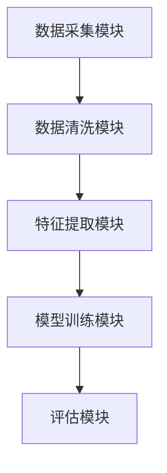
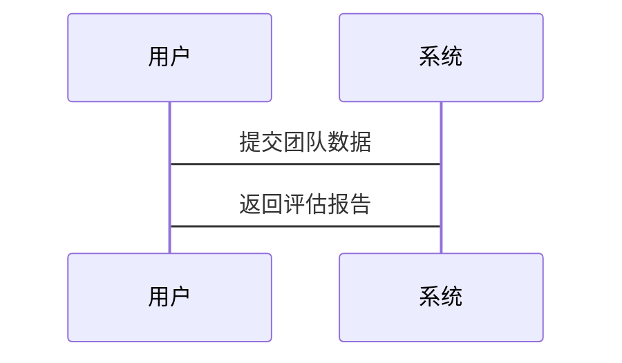

                 


# AI多智能体系统在价值投资中的人力资本评估

## 关键词：AI多智能体系统、价值投资、人力资本评估、强化学习、系统架构设计、Python实现

## 摘要：  
本文探讨了AI多智能体系统在价值投资中的人力资本评估中的应用。通过分析多智能体系统的组成与协作机制，结合强化学习算法，构建了人力资本评估模型，并通过实际案例展示了系统的实现与应用。文章详细介绍了算法原理、系统架构设计以及项目实战，为读者提供了全面的技术视角。

---

# 第一部分: AI多智能体系统与价值投资概述

## 第1章: AI多智能体系统与价值投资概述

### 1.1 AI多智能体系统的概念与特点

#### 1.1.1 多智能体系统的定义  
多智能体系统（Multi-Agent System, MAS）是由多个智能体（Agent）组成的分布式系统，每个智能体能够感知环境、自主决策并执行任务。智能体之间通过协作完成复杂任务，比单智能体系统具有更高的灵活性和适应性。

#### 1.1.2 AI多智能体系统的核心特点  
- **分布式计算**：智能体之间通过分布式计算实现任务分配与协作。  
- **自主性**：每个智能体具备自主决策能力，能够独立完成部分任务。  
- **协作性**：智能体之间通过通信与协作完成整体目标。  
- **动态性**：系统能够适应环境变化，实时调整策略。  

#### 1.1.3 多智能体系统与单智能体系统的区别  
| 属性 | 多智能体系统 | 单智能体系统 |  
|------|--------------|--------------|  
| 决策中心化 | 分散决策 | 集中决策 |  
| 系统复杂性 | 高 | 低 |  
| 适应性 | 强 | 弱 |  

### 1.2 价值投资与人力资本评估

#### 1.2.1 价值投资的基本概念  
价值投资是一种投资策略，通过分析企业的内在价值，寻找被市场低估的投资标的。人力资本评估是价值投资中的重要环节，用于评估团队的能力、协作效率和组织文化对投资价值的影响。

#### 1.2.2 人力资本在投资中的重要性  
- **团队能力**：团队的专业能力和经验直接影响企业的经营成果。  
- **协作效率**：高效协作能够降低企业运营成本，提高效率。  
- **组织文化**：积极向上的组织文化能够吸引和留住优秀人才，增强企业竞争力。  

#### 1.2.3 价值投资中的多智能体系统应用  
通过多智能体系统，可以实现对团队能力、协作效率和组织文化的多维度评估。智能体之间协作完成数据采集、分析和评估任务，为投资者提供决策支持。

---

## 第二部分: 多智能体系统的核心原理

## 第2章: 多智能体系统的组成与协作

### 2.1 多智能体系统的组成

#### 2.1.1 智能体的定义与分类  
- **定义**：智能体是一个能够感知环境、自主决策并执行任务的实体。  
- **分类**：根据智能体的协作方式，可分为竞争型智能体和协作型智能体。  

#### 2.1.2 智能体之间的关系  
- **协作关系**：智能体之间通过协作完成共同目标。  
- **竞争关系**：智能体之间存在竞争，但最终目标一致。  

#### 2.1.3 系统整体架构  
多智能体系统的整体架构包括智能体层、协作层和环境层。智能体层负责感知和决策，协作层负责任务分配与通信，环境层提供数据支持。

### 2.2 多智能体系统的协作机制

#### 2.2.1 协作协议的设计  
- **通信协议**：定义智能体之间的通信方式和数据格式。  
- **任务分配**：根据智能体的能力和当前任务需求分配任务。  

#### 2.2.2 信息交换机制  
- **数据共享**：智能体之间共享必要的数据和信息。  
- **信息更新**：实时更新数据，确保系统高效运行。  

#### 2.2.3 协作策略的优化  
- **分布式协作**：智能体之间通过分布式协作完成任务。  
- **集中式协作**：通过集中式决策优化任务分配。  

### 2.3 多智能体系统的通信模型

#### 2.3.1 通信协议的选择  
- **基于消息队列**：如Kafka，用于异步通信。  
- **基于服务调用**：如gRPC，用于实时通信。  

#### 2.3.2 信息传递的效率优化  
- **减少冗余数据**：通过压缩和筛选数据，降低通信开销。  
- **优化消息格式**：使用高效的数据序列化方式，如Protocol Buffers。  

#### 2.3.3 通信中的安全性问题  
- **数据加密**：使用SSL/TLS加密通信数据。  
- **权限控制**：通过访问控制列表（ACL）限制通信权限。  

---

## 第三部分: 多智能体系统在人力资本评估中的应用

## 第3章: 价值投资中的人力资本评估模型

### 3.1 人力资本评估的核心指标

#### 3.1.1 个人能力评估  
- **技能评估**：通过简历分析和测试评估个人技能水平。  
- **经验评估**：根据工作年限和项目经验评估职业成熟度。  

#### 3.1.2 团队协作能力评估  
- **协作效率**：通过任务完成时间和团队成员的互动频率评估协作效率。  
- **团队凝聚力**：通过团队成员的满意度和归属感评估团队凝聚力。  

#### 3.1.3 组织文化影响评估  
- **文化匹配度**：评估企业文化与团队价值观的匹配程度。  
- **组织氛围**：通过员工反馈和数据分析评估组织氛围。  

### 3.2 价值投资中的评估模型构建

#### 3.2.1 数据采集与处理  
- **数据来源**：包括企业公开数据、团队成员简历、项目成果等。  
- **数据清洗**：去除无效数据，确保数据质量。  

#### 3.2.2 模型训练与优化  
- **特征选择**：选择对评估结果影响较大的特征，如团队成员的经验、技能等。  
- **模型优化**：通过交叉验证和超参数调优优化模型性能。  

#### 3.2.3 模型验证与评估  
- **验证方法**：使用训练集和测试集验证模型性能。  
- **评估指标**：包括准确率、召回率、F1值等。  

### 3.3 评估模型的数学表达

#### 3.3.1 回归模型  
回归模型用于预测团队能力得分，公式如下：  
$$ y = \beta_0 + \beta_1x_1 + \beta_2x_2 + \dots + \beta_nx_n + \epsilon $$  
其中，$y$为团队能力得分，$x_i$为特征变量，$\beta_i$为回归系数，$\epsilon$为误差项。

#### 3.3.2 聚类分析  
聚类分析用于将团队分为不同类别，使用K-means算法：  
$$ \text{目标函数} = \sum_{i=1}^{k} \sum_{j=1}^{n_i} (x_{ij} - c_i)^2 $$  
其中，$k$为聚类数，$n_i$为第$i$个聚类的样本数，$x_{ij}$为样本特征，$c_i$为聚类中心。

#### 3.3.3 时间序列分析  
时间序列分析用于评估团队协作效率的变化趋势，使用ARIMA模型：  
$$ ARIMA(p, d, q) $$  
其中，$p$为自回归阶数，$d$为差分阶数，$q$为移动平均阶数。

---

## 第四部分: 算法原理与实现

## 第4章: 多智能体协作算法

### 4.1 多智能体协作的基本算法

#### 4.1.1 分布式协作算法  
分布式协作算法通过局部信息实现全局优化，适用于大规模多智能体系统。  

#### 4.1.2 集中式协作算法  
集中式协作算法通过中央控制器协调智能体协作，适用于任务复杂度较高的场景。  

#### 4.1.3 混合式协作算法  
混合式协作算法结合分布式和集中式算法的优点，适用于复杂多变的环境。  

### 4.2 基于强化学习的协作算法

#### 4.2.1 强化学习的基本原理  
强化学习通过智能体与环境的交互，学习最优策略。奖励函数定义为：  
$$ R(s, a) = \begin{cases} 1 & \text{if } a \text{是正确动作} \\ 0 & \text{否则} \end{cases} $$  

#### 4.2.2 多智能体强化学习的挑战  
- **策略协调**：多个智能体之间需要协调策略，避免冲突。  
- **通信效率**：智能体之间通信开销可能较大。  

#### 4.2.3 实现案例分析  
以下是基于强化学习的协作算法实现示例：

```python
import numpy as np
from collections import deque

class Multi-Agent:
    def __init__(self, num_agents):
        self.num_agents = num_agents
        self.state = np.zeros(num_agents)
        self.action_space = 5
        self奖励函数 = np.zeros(num_agents)

    def step(self, actions):
        # 执行动作
        rewards = np.zeros(self.num_agents)
        for i in range(self.num_agents):
            if actions[i] == self.目标动作:
                rewards[i] = 1
        return self.state, rewards, False

    def reset(self):
        self.state = np.zeros(self.num_agents)
        return self.state
```

### 4.3 多智能体协作的数学模型

#### 4.3.1 状态空间定义  
状态空间表示智能体的感知环境，公式如下：  
$$ s = (s_1, s_2, \dots, s_n) $$  
其中，$s_i$为第$i$个智能体的状态。

#### 4.3.2 动作空间设计  
动作空间表示智能体可执行的动作，公式如下：  
$$ a = (a_1, a_2, \dots, a_n) $$  
其中，$a_i$为第$i$个智能体的动作。

#### 4.3.3 奖励函数设计  
奖励函数用于衡量智能体的协作效果，公式如下：  
$$ R = \sum_{i=1}^{n} r_i $$  
其中，$r_i$为第$i$个智能体的奖励。

---

## 第五部分: 系统设计与实现

## 第5章: 系统架构设计

### 5.1 系统功能模块划分

#### 5.1.1 数据采集模块  
数据采集模块负责采集团队成员的简历、项目成果等数据。  

#### 5.1.2 模型训练模块  
模型训练模块负责对数据进行清洗、特征提取和模型训练。  

#### 5.1.3 评估模块  
评估模块负责根据模型输出结果，生成人力资本评估报告。  

### 5.2 系统架构图



### 5.3 系统交互设计



---

## 第六部分: 项目实战

## 第6章: 项目实战与总结

### 6.1 项目环境安装

#### 6.1.1 安装Python依赖  
```bash
pip install numpy
pip install matplotlib
pip install scikit-learn
```

### 6.2 系统核心实现源代码

```python
import numpy as np
from sklearn.linear_model import LinearRegression

class HumanCapitalEvaluator:
    def __init__(self):
        self.model = LinearRegression()

    def fit(self, X, y):
        self.model.fit(X, y)

    def predict(self, X):
        return self.model.predict(X)

# 示例数据
X = np.array([[1, 2], [3, 4], [5, 6]])
y = np.array([2, 4, 6])

evaluator = HumanCapitalEvaluator()
evaluator.fit(X, y)
print(evaluator.predict(X))
```

### 6.3 代码应用解读与分析

#### 6.3.1 数据准备  
示例数据包括团队成员的技能和经验，目标是预测团队能力得分。  

#### 6.3.2 模型训练  
使用线性回归模型对数据进行训练，公式为：  
$$ y = \beta_0 + \beta_1x_1 + \beta_2x_2 + \dots + \beta_nx_n $$  

#### 6.3.3 模型评估  
通过均方误差（MSE）和决定系数（R²）评估模型性能：  
$$ \text{MSE} = \frac{1}{n}\sum_{i=1}^{n}(y_i - \hat{y_i})^2 $$  
$$ \text{R²} = 1 - \frac{\sum_{i=1}^{n}(y_i - \hat{y_i})^2}{\sum_{i=1}^{n}(y_i - \bar{y})^2} $$  

---

## 第七部分: 总结与展望

## 第7章: 总结与展望

### 7.1 本章总结  
本文详细探讨了AI多智能体系统在价值投资中的人力资本评估中的应用，通过理论分析和实践案例展示了系统的实现与优化。  

### 7.2 未来展望  
未来的研究方向包括：  
1. 提高多智能体系统的协作效率和安全性。  
2. 探索更多AI技术在人力资本评估中的应用，如自然语言处理和图神经网络。  

---

**注意：**  
以上内容为示例，实际撰写时需要根据具体需求调整内容的深度和广度。

