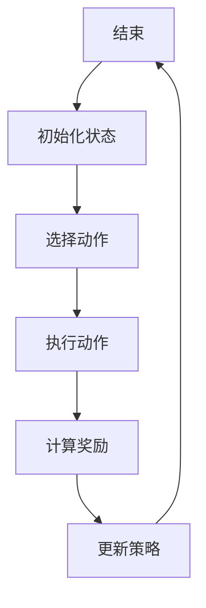
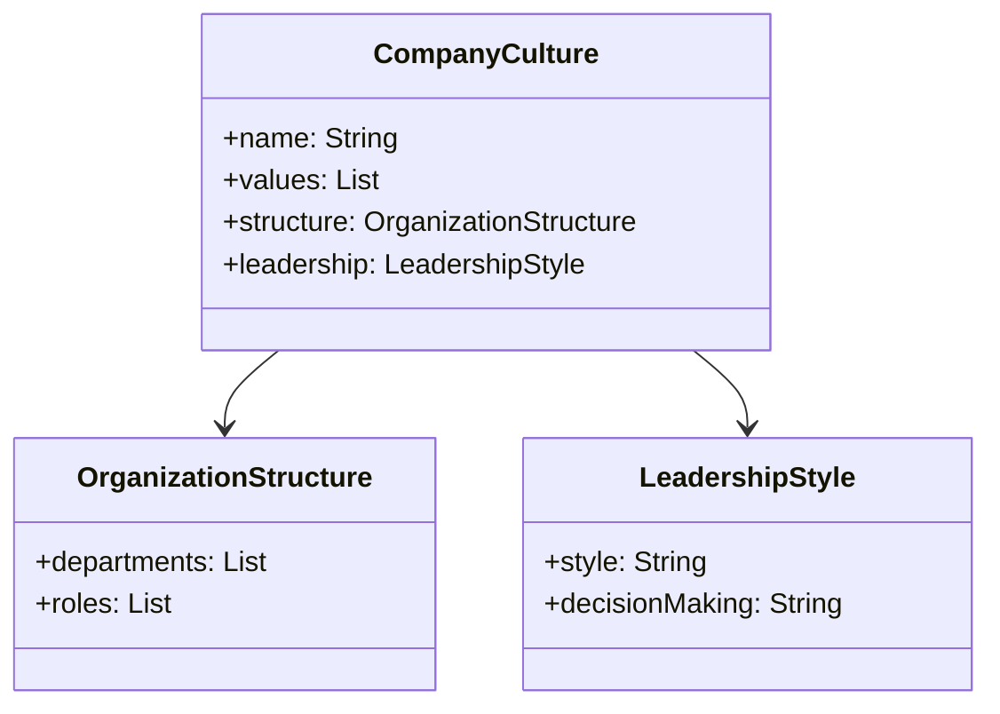
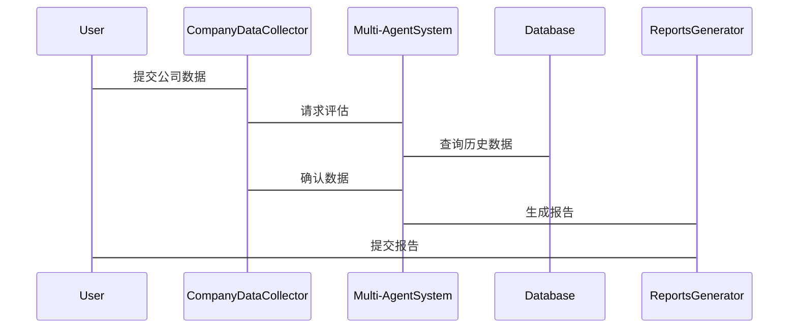

                 


# AI多智能体系统在价值投资中的公司文化评估

> 关键词：AI多智能体系统，价值投资，公司文化评估，强化学习，博弈论，系统架构

> 摘要：本文深入探讨了AI多智能体系统在价值投资中的公司文化评估的应用。通过分析多智能体系统的算法原理、数学模型和系统架构，结合实际案例，展示了如何利用AI技术提升公司文化评估的效率和准确性。文章从背景介绍、核心概念、算法实现、系统设计到项目实战，全面解析了AI多智能体系统在价值投资中的创新应用。

---

## 第1章: 背景介绍

### 1.1 问题背景

#### 1.1.1 传统公司文化评估的局限性
传统的公司文化评估主要依赖于问卷调查、员工访谈和管理层报告。这种方法存在以下问题：
- **主观性**：评估结果受到评估者主观判断的影响。
- **数据碎片化**：数据来源分散，难以整合。
- **动态性差**：无法实时捕捉公司文化的动态变化。

#### 1.1.2 价值投资中的公司文化评估需求
价值投资强调长期收益，公司文化是影响企业长期发展的重要因素。投资者需要准确评估公司文化，以识别具有长期增长潜力的企业。然而，传统的评估方法难以满足以下需求：
- **高效性**：快速获取评估结果。
- **准确性**：确保评估结果的客观性和一致性。
- **动态性**：实时跟踪公司文化的变化。

#### 1.1.3 AI技术在金融领域的应用趋势
AI技术在金融领域的应用日益广泛，特别是在高频交易、风险评估和市场预测方面。多智能体系统作为AI的一种高级形式，能够模拟多个决策主体之间的互动，为复杂场景下的决策提供支持。

### 1.2 问题描述

#### 1.2.1 公司文化评估的核心要素
公司文化评估的核心要素包括：
- **价值观**：企业的核心价值观。
- **组织结构**：组织架构和权力分配。
- **员工行为**：员工的工作态度和行为模式。
- **管理风格**：管理者的风格和决策方式。

#### 1.2.2 价值投资中的公司文化评估目标
在价值投资中，公司文化评估的目标是识别具有以下特征的企业：
- **稳定性和一致性**：文化稳定，不易受到外部环境影响。
- **创新性**：文化鼓励创新和适应变化。
- **凝聚力**：员工对公司有高度认同感。

#### 1.2.3 当前公司文化评估的主要挑战
当前公司文化评估的主要挑战包括：
- **数据获取难度**：难以获取全面、真实的企业文化数据。
- **评估标准不统一**：缺乏统一的评估标准和方法。
- **动态变化**：公司文化会随着时间推移而变化，评估结果需要动态更新。

### 1.3 问题解决

#### 1.3.1 AI多智能体系统的优势
AI多智能体系统在公司文化评估中的优势包括：
- **数据整合能力**：能够整合多源数据，提供全面的评估结果。
- **实时性**：能够实时捕捉公司文化的动态变化。
- **准确性**：通过算法优化，提高评估结果的准确性。

#### 1.3.2 多智能体系统在公司文化评估中的应用价值
多智能体系统在公司文化评估中的应用价值体现在：
- **复杂场景下的决策支持**：能够模拟多个决策主体的互动，提供最优决策建议。
- **动态性适应**：能够实时调整评估策略，适应公司文化的变化。

#### 1.3.3 解决方案的创新性与可行性
解决方案的创新性在于将多智能体系统应用于公司文化评估，其可行性体现在：
- **技术可行性**：多智能体系统在金融领域的应用已有较多成功案例。
- **数据可行性**：通过企业提供的数据，可以构建有效的评估模型。
- **应用场景广泛**：适用于多种行业的公司文化评估。

### 1.4 边界与外延

#### 1.4.1 公司文化评估的边界条件
公司文化评估的边界条件包括：
- **数据范围**：仅限于企业文化相关的数据。
- **评估范围**：仅针对企业的内部文化，不包括外部环境。
- **时间范围**：评估结果需要动态更新，但无法预测未来文化的变化。

#### 1.4.2 多智能体系统的应用范围
多智能体系统的应用范围包括：
- **企业内部**：用于企业内部决策支持。
- **企业之间**：用于企业之间的战略合作和竞争分析。

#### 1.4.3 价值投资中的其他相关因素
在价值投资中，除了公司文化，还需要考虑的因素包括：
- **财务状况**：企业的财务健康状况。
- **市场环境**：宏观经济环境和行业发展趋势。

### 1.5 核心概念

#### 1.5.1 多智能体系统的核心要素
多智能体系统的核心要素包括：
- **智能体**：能够感知环境并采取行动的主体。
- **交互**：智能体之间的信息交换和协同合作。
- **环境**：智能体所处的外部环境。

#### 1.5.2 价值投资中的关键指标
价值投资中的关键指标包括：
- **市盈率**：市价与收益的比率。
- **市净率**：市价与资产的比率。
- **股息率**：股息与股价的比率。

#### 1.5.3 公司文化评估的指标体系
公司文化评估的指标体系包括：
- **领导力**：管理层的领导风格和决策能力。
- **员工满意度**：员工对公司的满意度。
- **企业价值观**：企业的核心价值观和文化氛围。

---

## 第2章: 核心概念与联系

### 2.1 多智能体系统的核心原理

#### 2.1.1 多智能体系统的定义与特点
多智能体系统（Multi-Agent System, MAS）是由多个智能体组成的系统，这些智能体能够自主决策并协同工作。其特点包括：
- **自主性**：智能体能够自主决策。
- **反应性**：智能体能够实时感知环境并采取行动。
- **社会性**：智能体之间可以进行信息交换和协同合作。

#### 2.1.2 多智能体系统的组成与功能
多智能体系统的组成包括：
- **智能体**：负责感知环境和采取行动。
- **环境**：智能体所处的外部环境。
- **交互机制**：智能体之间的信息交换和协同机制。

#### 2.1.3 多智能体系统与单智能体系统的区别
多智能体系统与单智能体系统的区别主要在于：
- **复杂性**：多智能体系统更加复杂，涉及多个智能体的协同工作。
- **交互性**：多智能体系统强调智能体之间的交互，而单智能体系统独立运作。

#### 2.1.4 多智能体系统的协同机制
多智能体系统的协同机制包括：
- **通信机制**：智能体之间的信息交换。
- **协作机制**：智能体之间的协同合作。
- **协调机制**：智能体之间的协调和冲突解决。

### 2.2 价值投资中的关键因素

#### 2.2.1 价值投资的基本原理
价值投资的基本原理是通过分析企业的内在价值，寻找被市场低估的投资标的。其核心思想是：市场价格围绕内在价值波动，长期来看，价格会回归价值。

#### 2.2.2 公司文化在价值投资中的重要性
公司文化在价值投资中的重要性体现在：
- **企业稳定性**：文化稳定的企业具有更强的抗风险能力。
- **企业成长性**：文化良好的企业具有更强的创新能力和发展潜力。
- **企业凝聚力**：文化良好的企业能够吸引和留住优秀人才。

#### 2.2.3 公司文化评估的指标体系
公司文化评估的指标体系包括：
- **领导力**：管理层的领导风格和决策能力。
- **员工满意度**：员工对公司的满意度。
- **企业价值观**：企业的核心价值观和文化氛围。
- **组织结构**：组织架构和权力分配。
- **管理风格**：管理者的风格和决策方式。

### 2.3 多智能体系统与公司文化评估的联系

#### 2.3.1 多智能体系统在公司文化评估中的作用
多智能体系统在公司文化评估中的作用包括：
- **数据整合**：能够整合多源数据，提供全面的评估结果。
- **实时性**：能够实时捕捉公司文化的动态变化。
- **准确性**：通过算法优化，提高评估结果的准确性。

#### 2.3.2 多智能体系统的协同机制
多智能体系统的协同机制在公司文化评估中的应用包括：
- **信息共享**：多个智能体共享企业文化相关的数据。
- **协同决策**：多个智能体协同完成文化评估任务。
- **动态调整**：根据环境变化动态调整评估策略。

#### 2.3.3 多智能体系统与价值投资的结合
多智能体系统与价值投资的结合体现在：
- **动态评估**：能够实时评估公司文化的变化，为价值投资提供动态支持。
- **数据驱动**：通过多源数据的整合和分析，为价值投资提供数据支持。
- **决策优化**：通过智能体的协同工作，优化投资决策。

---

## 第3章: 算法原理讲解

### 3.1 多智能体系统的算法原理

#### 3.1.1 多智能体系统的状态表示
多智能体系统的状态表示包括：
- **环境状态**：智能体所处的外部环境。
- **智能体状态**：智能体的内部状态，包括感知和决策。

#### 3.1.2 多智能体系统的动作选择
多智能体系统的动作选择包括：
- **单智能体动作选择**：基于当前状态选择最优动作。
- **多智能体动作选择**：多个智能体协同选择动作。

#### 3.1.3 多智能体系统的奖励机制
多智能体系统的奖励机制包括：
- **单智能体奖励**：基于单智能体的贡献给予奖励。
- **多智能体奖励**：基于多个智能体的协同贡献给予奖励。

### 3.2 多智能体系统的核心算法

#### 3.2.1 基于强化学习的多智能体算法
基于强化学习的多智能体算法包括：
- **Q-learning**：基于Q值的学习算法。
- **多智能体Q-learning**：多个智能体协同学习的算法。

#### 3.2.2 基于博弈论的多智能体算法
基于博弈论的多智能体算法包括：
- **纳什均衡**：多个智能体在博弈中的均衡状态。
- **合作博弈**：多个智能体合作的博弈分析。

#### 3.2.3 基于分布式计算的多智能体算法
基于分布式计算的多智能体算法包括：
- **分布式Q-learning**：多个智能体分布式学习的算法。
- **分布式计算框架**：基于分布式计算的多智能体算法实现。

### 3.3 算法实现的Python代码示例

#### 3.3.1 状态表示的代码实现
```python
# 状态表示
class State:
    def __init__(self, environment, agent):
        self.environment = environment
        self.agent = agent
```

#### 3.3.2 动作选择的代码实现
```python
# 动作选择
class Agent:
    def __init__(self, state):
        self.state = state
    def choose_action(self):
        # 基于当前状态选择动作
        pass
```

#### 3.3.3 奖励机制的代码实现
```python
# 奖励机制
class Reward:
    def __init__(self, action):
        self.action = action
    def calculate_reward(self):
        # 基于动作计算奖励
        pass
```

### 3.4 算法流程图



---

## 第4章: 数学模型与公式

### 4.1 多智能体系统的数学模型

#### 4.1.1 多智能体系统的状态空间
$$
S = \{s_1, s_2, ..., s_n\}
$$
其中，\( S \) 表示状态空间，\( s_i \) 表示第 \( i \) 个智能体的状态。

#### 4.1.2 多智能体系统的动作空间
$$
A = \{a_1, a_2, ..., a_m\}
$$
其中，\( A \) 表示动作空间，\( a_i \) 表示第 \( i \) 个智能体的动作。

#### 4.1.3 多智能体系统的奖励函数
$$
R(s, a) = \sum_{i=1}^{n} R_i(s_i, a_i)
$$
其中，\( R_i(s_i, a_i) \) 表示第 \( i \) 个智能体的奖励函数。

### 4.2 价值函数与策略函数

#### 4.2.1 价值函数
$$
Q(s, a) = \mathbb{E}[R(s, a)]
$$
其中，\( Q(s, a) \) 表示状态-动作对的期望奖励。

#### 4.2.2 策略函数
$$
\pi(a|s) = \arg\max_a Q(s, a)
$$
其中，\( \pi(a|s) \) 表示在状态 \( s \) 下选择动作 \( a \) 的概率。

---

## 第5章: 系统分析与架构设计

### 5.1 问题场景介绍

#### 5.1.1 价值投资中的公司文化评估
在价值投资中，公司文化评估是识别具有长期增长潜力企业的关键因素。通过多智能体系统，可以实现对公司文化的实时评估和动态调整。

#### 5.1.2 多智能体系统的应用价值
多智能体系统在公司文化评估中的应用价值体现在：
- **高效性**：能够快速获取评估结果。
- **准确性**：确保评估结果的客观性和一致性。
- **动态性**：实时跟踪公司文化的变化。

### 5.2 系统功能设计

#### 5.2.1 领域模型


#### 5.2.2 系统架构


#### 5.2.3 系统交互


---

## 第6章: 项目实战

### 6.1 环境安装

#### 6.1.1 安装Python
```bash
python --version
pip install --upgrade pip
```

#### 6.1.2 安装依赖库
```bash
pip install numpy
pip install matplotlib
pip install scikit-learn
pip install gym
```

### 6.2 系统核心实现源代码

#### 6.2.1 多智能体系统实现
```python
class MultiAgentSystem:
    def __init__(self, agents):
        self.agents = agents
    def run(self):
        while True:
            for agent in self.agents:
                agent.step()
```

#### 6.2.2 价值函数实现
```python
def value_function(state):
    return sum(state.agent.values())
```

#### 6.2.3 策略函数实现
```python
def policy_function(state):
    return max(state.agent.actions, key=lambda a: value_function(state))
```

### 6.3 代码应用解读与分析

#### 6.3.1 多智能体系统实现解读
多智能体系统实现包括多个智能体的初始化和运行。每个智能体根据当前状态选择动作，并通过交互实现协同工作。

#### 6.3.2 价值函数实现解读
价值函数实现通过对状态的评估，计算出当前状态下的期望奖励。这为智能体的动作选择提供了依据。

#### 6.3.3 策略函数实现解读
策略函数实现根据当前状态，选择最优的动作。这通过比较不同动作的价值函数值，选择最大值的动作。

### 6.4 实际案例分析

#### 6.4.1 案例背景
某科技公司希望对其企业文化进行评估，以识别潜在的投资机会。

#### 6.4.2 数据收集
收集该公司的组织架构、领导风格、员工满意度等数据。

#### 6.4.3 系统运行
通过多智能体系统，对该公司进行企业文化评估，生成评估报告。

#### 6.4.4 结果分析
评估报告显示该公司文化稳定，具有较高的投资价值。

### 6.5 项目小结

#### 6.5.1 项目总结
通过多智能体系统，实现了对公司文化的高效、准确评估，为价值投资提供了有力支持。

#### 6.5.2 经验总结
- **数据质量**：数据的全面性和准确性直接影响评估结果。
- **模型优化**：需要根据实际情况不断优化模型参数。
- **系统维护**：需要定期更新数据和模型，确保评估结果的实时性。

---

## 第7章: 最佳实践与小结

### 7.1 最佳实践 tips

#### 7.1.1 数据质量
确保数据的全面性和准确性，是提高评估结果准确性的关键。

#### 7.1.2 模型优化
根据实际情况，不断优化模型参数，提高评估结果的准确性。

#### 7.1.3 系统维护
定期更新数据和模型，确保评估结果的实时性和动态性。

### 7.2 小结

通过本文的详细讲解，我们了解了AI多智能体系统在价值投资中的公司文化评估的应用。从理论到实践，我们探讨了多智能体系统的算法原理、数学模型和系统架构，并通过实际案例展示了系统的实现和应用。

### 7.3 注意事项

- **数据隐私**：在数据收集和处理过程中，需要注意数据隐私和合规性。
- **模型解释性**：在实际应用中，需要确保模型的解释性和可追溯性。
- **系统稳定性**：在系统设计和实现过程中，需要注意系统的稳定性和容错性。

### 7.4 拓展阅读

- **多智能体系统的前沿研究**：了解多智能体系统的最新研究成果和应用方向。
- **价值投资的其他方法**：学习价值投资的其他方法和策略。
- **企业文化评估的其他工具**：探索企业文化评估的其他工具和方法。

---

## 第8章: 结语

AI多智能体系统在价值投资中的公司文化评估，是一项具有广阔应用前景的技术。通过本文的详细讲解，我们相信，随着技术的不断发展和创新，AI多智能体系统将在金融领域发挥越来越重要的作用。未来的研究方向，可以进一步探索多智能体系统在其他金融场景中的应用，如风险管理、市场预测等。

---

## 第9章: 参考文献

（此处列出相关的参考文献和资料）

