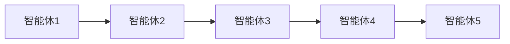
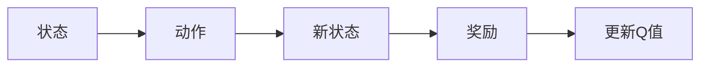
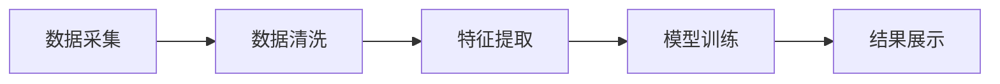
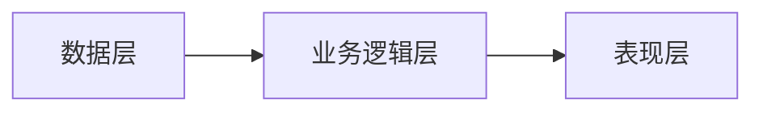
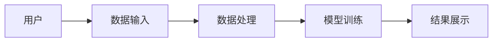

                 


# AI多智能体系统在价值投资中的客户忠诚度分析

## 关键词：AI多智能体系统、客户忠诚度分析、价值投资、数据分析、算法实现

## 摘要：本文探讨了AI多智能体系统在价值投资中的应用，重点分析了客户忠诚度的影响。通过背景介绍、核心概念、算法原理、系统架构和项目实战，详细阐述了如何利用AI技术提升客户忠诚度分析的效率和准确性。文章还提供了最佳实践和总结，为读者提供实用的指导和见解。

---

## 第一部分: 背景介绍

### 第1章: AI多智能体系统与价值投资

#### 1.1 AI多智能体系统的定义与特点
- **1.1.1 多智能体系统的定义**
  - 多智能体系统是由多个相互作用的智能体组成的系统，每个智能体能够感知环境并采取行动。
  - AI多智能体系统结合了人工智能技术，使智能体能够学习和优化其行为。

- **1.1.2 AI多智能体系统的独特优势**
  - 分布式计算能力：多个智能体协同工作，提高系统的处理效率。
  - 自适应性：智能体能够根据环境变化调整策略。
  - 协作与竞争：智能体之间可以协作完成任务，也可以通过竞争优化结果。

- **1.1.3 多智能体系统与单智能体系统的对比**
  - **单智能体系统**：结构简单，适用于简单任务，但扩展性差。
  - **多智能体系统**：处理复杂任务能力更强，但设计和协调更复杂。

#### 1.2 价值投资的基本概念
- **1.2.1 价值投资的定义**
  - 价值投资是一种投资策略，通过分析企业的内在价值，寻找被市场低估的投资标的。
  - 价值投资者关注企业的基本面，如盈利能力、财务状况和竞争优势。

- **1.2.2 价值投资的核心理念**
  - 长期投资：关注企业的长期价值，而非短期市场波动。
  - 安全边际：确保买入价格低于企业的内在价值，以降低风险。

- **1.2.3 价值投资与传统投资的差异**
  - 传统投资：基于技术分析，关注市场趋势和价格波动。
  - 价值投资：基于基本面分析，关注企业的内在价值。

#### 1.3 客户忠诚度的定义与分析
- **1.3.1 客户忠诚度的定义**
  - 客户忠诚度是指客户对企业产品或服务的持续购买意愿和行为。
  - 忠诚客户通常具有较高的回购率和推荐率。

- **1.3.2 客户忠诚度的影响因素**
  - 产品或服务质量：客户对产品的满意度直接影响忠诚度。
  - 客户关系管理：企业与客户的关系维护程度。
  - 竞争环境：市场竞争的激烈程度影响客户的选择。

- **1.3.3 客户忠诚度与企业价值的关系**
  - 忠诚客户为企业带来稳定的收入来源。
  - 忠诚客户通常具有较高的客户生命周期价值（CLV）。

#### 1.4 本章小结
- 本章介绍了AI多智能体系统、价值投资和客户忠诚度的基本概念，并分析了它们之间的关系。理解这些概念是后续分析的基础。

---

## 第二部分: 核心概念与联系

### 第2章: AI多智能体系统的核心原理

#### 2.1 多智能体系统的基本原理
- **2.1.1 多智能体系统的组成结构**
  - **智能体**：能够感知环境并采取行动的实体。
  - **通信机制**：智能体之间交换信息的方式，如消息传递。
  - **协调机制**：智能体之间协同工作的规则和协议。

- **2.1.2 多智能体系统的信息交互机制**
  - **同步与异步通信**：智能体之间可以同步或异步交换信息。
  - **信息共享**：智能体共享信息以提高整体系统的决策能力。

- **2.1.3 多智能体系统的协作与竞争关系**
  - **协作**：智能体之间协同工作，共同完成任务。
  - **竞争**：智能体之间通过竞争优化系统性能。

#### 2.2 AI多智能体系统的关键技术
- **2.2.1 强化学习在多智能体系统中的应用**
  - 强化学习：通过试错学习，智能体学习最优策略。
  - 多智能体强化学习：多个智能体协同学习，解决复杂任务。

- **2.2.2 联合学习与分布式计算**
  - 联合学习：多个智能体共同训练模型，共享数据和知识。
  - 分布式计算：任务分解到多个智能体，提高计算效率。

- **2.2.3 多智能体系统的协调与优化算法**
  - **协调算法**：确保智能体之间的协作和同步。
  - **优化算法**：通过优化目标函数，提升系统性能。

#### 图2-1: 多智能体系统架构图


### 第3章: 客户忠诚度分析的核心原理

#### 3.1 客户忠诚度分析的定义与方法
- **3.1.1 客户忠诚度分析的定义**
  - 通过数据分析，评估客户对企业的忠诚程度。
  - 分析客户行为数据，预测客户的忠诚度变化。

- **3.1.2 客户忠诚度分析的方法**
  - **基于数据挖掘的方法**：利用数据挖掘技术，发现客户行为模式。
  - **基于机器学习的方法**：构建预测模型，评估客户忠诚度。

#### 3.2 客户忠诚度分析的核心要素
- **客户行为数据**：包括购买频率、购买金额、购买时间等。
- **客户满意度**：客户对产品或服务的满意程度。
- **客户保留率**：客户在一定时间内的保留情况。

#### 3.3 本章小结
- 本章介绍了客户忠诚度分析的核心概念和方法，为后续分析奠定了基础。

---

## 第三部分: 算法原理讲解

### 第4章: 强化学习算法在客户忠诚度分析中的应用

#### 4.1 强化学习的基本原理
- **强化学习的定义**
  - 强化学习是一种机器学习方法，通过试错学习，智能体学习最优策略。
- **强化学习的核心要素**
  - **状态**：智能体所处的环境。
  - **动作**：智能体采取的行动。
  - **奖励**：智能体采取行动后获得的反馈。

#### 4.2 多智能体强化学习的实现
- **多智能体强化学习的挑战**
  - **协调问题**：智能体之间需要协调行动。
  - **通信问题**：智能体之间的信息交换。
- **多智能体强化学习的算法**
  - **Q-learning**：基于Q值的学习算法。
  - **Actor-Critic**：基于策略和价值函数的算法。

#### 图4-1: 强化学习流程图


#### 4.3 强化学习在客户忠诚度分析中的应用
- **客户忠诚度预测模型**
  - 基于强化学习，预测客户忠诚度变化。
  - 使用历史数据训练模型，预测未来行为。

#### 4.4 代码实现
```python
import numpy as np
import gym

# 创建环境
env = gym.make('CartPole-v0')

# 初始化Q表
Q = np.zeros([env.observation_space.shape[0], env.action_space.n])

# 参数设置
learning_rate = 0.01
gamma = 0.99

# 训练过程
for episode in range(1000):
    state = env.reset()
    for _ in range(1000):
        # 选择动作
        action = np.argmax(Q[state])
        # 采取行动
        next_state, reward, done, _ = env.step(action)
        # 更新Q表
        Q[state][action] += learning_rate * (reward + gamma * np.max(Q[next_state]) - Q[state][action])
        state = next_state
        if done:
            break

print("训练完成")
```

---

## 第四部分: 系统分析与架构设计

### 第5章: 系统分析与架构设计方案

#### 5.1 项目介绍
- **项目目标**：利用AI多智能体系统，分析客户忠诚度，优化价值投资策略。
- **项目范围**：涵盖数据采集、分析、预测和决策支持。

#### 5.2 系统功能设计
- **数据采集模块**
  - 采集客户行为数据、交易数据等。
- **数据分析模块**
  - 数据清洗、特征提取、数据建模。
- **模型训练模块**
  - 使用强化学习算法训练模型。
- **结果展示模块**
  - 可视化结果，展示客户忠诚度分析结果。

#### 图5-1: 系统功能模块图


#### 5.3 系统架构设计
- **分层架构**
  - 数据层：存储原始数据和处理后的数据。
  - 业务逻辑层：实现数据分析和模型训练。
  - 表现层：展示结果和用户交互界面。

#### 图5-2: 系统架构图


#### 5.4 系统接口设计
- **数据接口**
  - 数据输入接口：接收原始数据。
  - 数据输出接口：输出处理后的数据。
- **模型接口**
  - 模型训练接口：训练强化学习模型。
  - 模型预测接口：预测客户忠诚度。

#### 5.5 系统交互流程
- **交互流程**
  - 用户输入数据。
  - 系统处理数据，训练模型。
  - 系统输出分析结果。

#### 图5-3: 系统交互流程图


---

## 第五部分: 项目实战

### 第6章: 项目实战

#### 6.1 环境安装
- **安装Python**
  - 下载并安装Python 3.8及以上版本。
- **安装依赖库**
  - 使用pip安装numpy、gym等库。

#### 6.2 系统核心实现源代码
```python
import numpy as np
import gym

# 创建环境
env = gym.make('CartPole-v0')

# 初始化Q表
Q = np.zeros([env.observation_space.shape[0], env.action_space.n])

# 参数设置
learning_rate = 0.01
gamma = 0.99

# 训练过程
for episode in range(1000):
    state = env.reset()
    for _ in range(1000):
        # 选择动作
        action = np.argmax(Q[state])
        # 采取行动
        next_state, reward, done, _ = env.step(action)
        # 更新Q表
        Q[state][action] += learning_rate * (reward + gamma * np.max(Q[next_state]) - Q[state][action])
        state = next_state
        if done:
            break

print("训练完成")
```

#### 6.3 代码应用解读与分析
- **代码功能**
  - 初始化Q表，定义学习率和折扣因子。
  - 训练过程，更新Q表。
  - 输出训练结果。

#### 6.4 实际案例分析
- **案例介绍**
  - 数据来源：假设我们从某金融公司获取客户交易数据。
  - 数据预处理：清洗数据，提取特征。
  - 模型训练：使用强化学习算法训练模型。
  - 结果分析：评估模型预测的准确性。

#### 6.5 项目小结
- 本章通过实际案例，展示了AI多智能体系统在客户忠诚度分析中的应用。

---

## 第六部分: 最佳实践

### 第7章: 最佳实践、总结与注意事项

#### 7.1 最佳实践
- **数据质量**：确保数据准确、完整和及时。
- **模型调优**：根据实际需求，调整模型参数。
- **伦理风险**：注意客户隐私保护，避免数据滥用。

#### 7.2 总结
- 本文详细介绍了AI多智能体系统在价值投资中的客户忠诚度分析。
- 通过理论分析和实际案例，展示了AI技术在金融领域的应用潜力。

#### 7.3 注意事项
- **数据隐私**：遵守相关法律法规，保护客户隐私。
- **模型解释性**：确保模型结果可解释，便于决策者理解。
- **持续优化**：根据市场变化，持续优化模型和系统。

---

## 第七部分: 拓展阅读

### 7.1 拓展阅读推荐
- 《强化学习：理论与应用》
- 《多智能体系统：算法与实践》
- 《价值投资实战：客户忠诚度分析》

### 7.2 未来研究方向
- 多智能体系统的协同优化算法研究。
- 强化学习在金融领域的深入应用。
- 客户忠诚度分析的新型数据挖掘方法。

---

## 结语
通过本文的探讨，我们深入了解了AI多智能体系统在价值投资中的客户忠诚度分析。希望本文的内容能够为读者提供有价值的见解和指导，帮助他们在实际应用中取得更好的效果。

--- 

如果您对本文有任何疑问或需要进一步的帮助，请随时与我联系！

