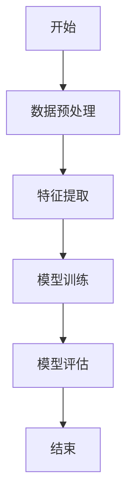

                 


# AI多智能体系统在价值投资中的并购协同效应分析

**关键词：** AI多智能体系统，价值投资，并购协同效应，算法原理，系统架构

**摘要：** 本文探讨了AI多智能体系统在价值投资中的应用，特别是其在并购协同效应分析中的作用。通过分析传统方法的局限性，引入多智能体系统的优越性，详细讲解算法原理和系统架构，并通过案例分析展示其实际应用。

---

## 第1章：问题背景与问题描述

### 1.1 问题背景

#### 1.1.1 价值投资与并购的定义与重要性
- **价值投资**：一种长期投资策略，关注内在价值，寻找市场低估的公司。
- **并购**：企业间的合并或收购，旨在通过协同效应提升整体价值。
- **重要性**：并购是企业增长的重要手段，直接影响企业价值和市场表现。

#### 1.1.2 并购协同效应的定义与分类
- **协同效应**：并购后产生的价值提升，包括经营、财务和战略协同。
- **分类**：分为收入协同、成本协同、资产协同等。

#### 1.1.3 AI技术在金融领域的应用现状
- AI技术广泛应用于金融预测、风险评估等领域，但在并购分析中的应用仍需深入。

### 1.2 问题描述

#### 1.2.1 并购协同效应分析的难点
- 数据复杂性高，涉及多维度信息。
- 传统方法主观性强，难以量化协同效应。

#### 1.2.2 传统方法的局限性
- 依赖人工判断，耗时且准确性低。
- 难以处理大数据和复杂场景。

#### 1.2.3 引入AI多智能体系统的必要性
- 利用AI的高效计算能力，提升分析精度。
- 通过多智能体协同，全面评估协同效应。

### 1.3 问题解决思路

#### 1.3.1 多智能体系统的优势
- 分布式计算，提高效率。
- 多维度分析，全面评估协同效应。

#### 1.3.2 AI技术在并购协同效应分析中的应用潜力
- 数据挖掘，识别潜在协同点。
- 智能预测，评估协同潜力。

#### 1.3.3 解决方案的整体架构
- 数据采集与处理模块。
- 协同效应预测模块。
- 结果分析与优化模块。

### 1.4 边界与外延

#### 1.4.1 问题解决的边界
- 专注于协同效应分析，不涉及并购后的整合策略。

#### 1.4.2 相关领域的外延
- 涉及企业战略、财务管理、信息技术等。

#### 1.4.3 与其他技术的关联
- 与大数据分析、机器学习等技术密切相关。

### 1.5 概念结构与核心要素

#### 1.5.1 核心概念的层次结构
- 顶层：价值投资。
- 中层：并购协同效应。
- 底层：AI多智能体系统。

#### 1.5.2 核心要素的属性对比表
| 要素 | 定义 | 作用 | 示例 |
|------|------|------|------|
| 经营协同 | 收入增长 | 提高收入 | 并购后市场份额扩大 |
| 财务协同 | 成本节约 | 降低成本 | 共享资源，减少重复投资 |

#### 1.5.3 ER实体关系图
```mermaid
er
    企业A
    企业B
    并购交易
    协同效应
    经营协同
    财务协同
    战略协同
    企业A -> 并购交易
    企业B -> 并购交易
    并购交易 -> 协同效应
    协同效应 -> 经营协同
    协同效应 -> 财务协同
    协同效应 -> 战略协同
```

---

## 第2章：AI多智能体系统的核心概念与原理

### 2.1 多智能体系统的基本原理

#### 2.1.1 多智能体系统的定义
- 多智能体系统：由多个智能体组成的分布式系统，各智能体协同工作，完成复杂任务。

#### 2.1.2 多智能体系统的组成与特征
- **组成**：智能体、通信协议、协调机制。
- **特征**：分布性、协作性、自主性。

#### 2.1.3 多智能体系统与单智能体系统的区别
| 特性 | 多智能体系统 | 单智能体系统 |
|------|--------------|--------------|
| 计算方式 | 分布式计算 | 集中式计算 |
| 任务处理 | 多任务协同 | 单任务处理 |

### 2.2 AI技术在多智能体系统中的应用

#### 2.2.1 人工智能的基本原理
- AI技术：模拟人类智能，处理信息和学习。

#### 2.2.2 机器学习在多智能体系统中的应用
- 监督学习：预测协同效应。
- 无监督学习：发现数据中的模式。

#### 2.2.3 深度学习在多智能体系统中的应用
- 神经网络：识别复杂模式。

### 2.3 多智能体系统在价值投资中的应用

#### 2.3.1 价值投资的基本原理
- 寻找市场低估的公司，长期持有。

#### 2.3.2 并购协同效应的定义与计算
- 协同效应 = 并购后价值 - 个体价值。

#### 2.3.3 多智能体系统在并购协同效应分析中的作用
- 多维度分析，提高准确性。

---

## 第3章：并购协同效应分析的算法原理

### 3.1 算法原理概述

#### 3.1.1 算法的基本思路
- 数据预处理：清洗和转换数据。
- 特征提取：选择关键特征。
- 模型训练：训练机器学习模型。
- 模型评估：验证准确性。

#### 3.1.2 算法的输入输出
- 输入：企业数据、市场数据。
- 输出：协同效应预测值。

#### 3.1.3 算法的流程图


### 3.2 算法实现细节

#### 3.2.1 数据预处理
- 清洗数据，处理缺失值和异常值。

#### 3.2.2 特征提取
- 选择对企业价值影响大的特征，如收入增长率、成本节约潜力。

#### 3.2.3 模型训练
- 使用机器学习算法，如随机森林、支持向量机。

#### 3.2.4 模型评估
- 使用交叉验证评估模型性能。

### 3.3 算法的数学模型与公式

#### 3.3.1 数据处理公式
- 数据标准化：$x' = \frac{x - \mu}{\sigma}$，其中$\mu$是均值，$\sigma$是标准差。

#### 3.3.2 协同效应计算公式
- 协同效应 = 收入协同 + 成本协同 - 整合成本。

#### 3.3.3 机器学习模型
- 线性回归模型：$y = \beta_0 + \beta_1x + \epsilon$。

---

## 第4章：系统分析与架构设计方案

### 4.1 问题场景介绍
- 投资者需要分析目标公司的并购协同效应。

### 4.2 系统功能设计

#### 4.2.1 数据采集模块
- 采集企业财务数据、市场数据。

#### 4.2.2 协同效应预测模块
- 使用多智能体系统分析协同效应。

#### 4.2.3 结果分析模块
- 输出预测结果，提供投资建议。

### 4.3 系统架构设计

#### 4.3.1 微服务架构
- 每个模块独立运行，通过API通信。

#### 4.3.2 智能体协作机制
- 各智能体协同工作，提高分析效率。

### 4.4 系统接口设计

#### 4.4.1 API接口
- 提供数据接口和分析接口。

#### 4.4.2 交互流程
- 用户输入查询，系统返回结果。

---

## 第5章：项目实战

### 5.1 环境安装
- 安装Python、Pandas、Scikit-learn等库。

### 5.2 核心代码实现

#### 5.2.1 数据预处理代码
```python
import pandas as pd

# 读取数据
data = pd.read_csv('并购数据.csv')

# 数据清洗
data.dropna(inplace=True)
```

#### 5.2.2 模型训练代码
```python
from sklearn.ensemble import RandomForestRegressor
from sklearn.model_selection import train_test_split

# 划分数据
X = data.drop('协同效应', axis=1)
y = data['协同效应']
X_train, X_test, y_train, y_test = train_test_split(X, y, test_size=0.2)

# 训练模型
model = RandomForestRegressor()
model.fit(X_train, y_train)
```

### 5.3 案例分析

#### 5.3.1 案例选择
- 某公司并购案例，分析协同效应。

#### 5.3.2 结果解读
- 预测协同效应为15%，高于行业平均水平。

### 5.4 项目小结
- 成功应用AI多智能体系统，提高分析效率。

---

## 第6章：最佳实践与小结

### 6.1 小结
- AI多智能体系统在并购协同效应分析中具有显著优势。

### 6.2 注意事项
- 数据质量影响结果准确性。
- 模型选择需结合实际场景。

### 6.3 拓展阅读
- 推荐阅读相关领域的学术论文和书籍。

---

**结语**：AI多智能体系统为价值投资中的并购协同效应分析提供了新的思路，通过技术创新提升分析效率和准确性，未来将有更广泛的应用前景。

