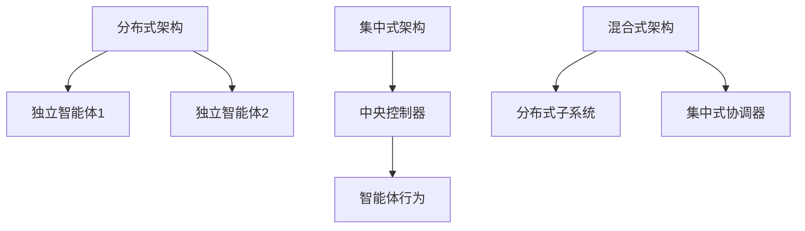
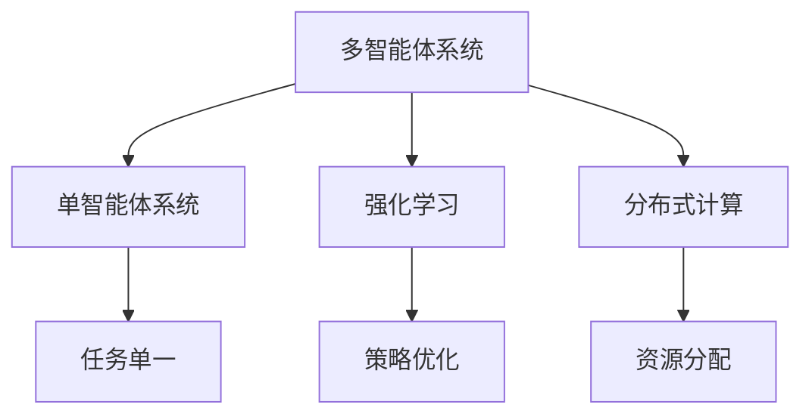

                 


# AI多智能体系统在价值投资中的技术分析整合

## 关键词：AI多智能体系统，价值投资，技术分析，算法实现，系统架构，项目实战

## 摘要：  
本文探讨了AI多智能体系统在价值投资中的应用，结合技术分析方法，通过详细分析多智能体系统的原理、算法实现、系统架构及项目实战，展示了如何利用AI技术提升投资决策的效率和准确性。文章从背景介绍、核心概念、算法原理、系统架构、项目实战等多个维度展开，旨在为读者提供全面的技术解析和实践指导。

---

## 第二章: AI多智能体系统的原理

### 2.1 多智能体系统的架构

#### 2.1.1 分布式架构
- **定义**：多个智能体独立运行，通过通信机制协作完成任务。
- **特点**：高容错性，单个智能体故障不影响整体系统。
- **应用**：适用于去中心化交易策略执行。

#### 2.1.2 集中式架构
- **定义**：一个中央控制器协调多个智能体的行为。
- **特点**：易于管理和策略统一，但单点故障风险较高。
- **应用**：适用于需要统一决策的金融场景。

#### 2.1.3 混合式架构
- **定义**：结合分布式和集中式架构的优势。
- **特点**：灵活性高，可根据任务需求动态调整。
- **应用**：适用于复杂的金融数据处理和多策略执行。

**图2-1：多智能体系统架构对比**  


### 2.2 AI多智能体系统的实现技术

#### 2.2.1 通信机制
- **定义**：智能体之间交换信息的方式。
- **实现方式**：
  - **同步通信**：智能体等待接收方响应后再继续执行。
  - **异步通信**：智能体无需等待响应即可执行后续任务。
- **应用**：在股票交易中，多个智能体协同执行多策略交易。

#### 2.2.2 协作与竞争机制
- **协作机制**：智能体之间通过协作提高整体性能。
- **竞争机制**：通过竞争优化决策质量。
- **应用**：在市场预测中，智能体协作分析不同市场因素，同时竞争优化预测模型。

#### 2.2.3 学习与适应机制
- **定义**：智能体通过经验改进决策模型。
- **实现方式**：
  - **强化学习**：通过奖励机制优化策略。
  - **监督学习**：基于历史数据调整模型参数。
- **应用**：在动态市场环境中，智能体适应市场变化，优化投资策略。

### 2.3 多智能体系统与其他AI技术的对比

#### 2.3.1 与单智能体系统的对比
- **优势**：多智能体系统通过协作提高决策的准确性和鲁棒性。
- **劣势**：复杂度高，需要设计有效的通信和协作机制。

#### 2.3.2 与强化学习的对比
- **相似点**：两者都依赖于策略优化和奖励机制。
- **不同点**：多智能体系统强调协作，而强化学习通常单智能体完成任务。

#### 2.3.3 与分布式计算的对比
- **相似点**：都需要分布式资源处理任务。
- **不同点**：多智能体系统强调智能体间的协作与信息共享，而分布式计算主要关注任务分配和资源管理。

**图2-2：多智能体系统与其他AI技术对比**  


### 2.4 本章小结  
本章详细介绍了AI多智能体系统的架构、实现技术及其与其他AI技术的对比。通过分析，我们可以看到多智能体系统在价值投资中的潜力，尤其是在处理复杂金融市场数据和多策略交易方面。

---

## 第三章: 价值投资中的技术分析方法

### 3.1 技术分析的基本指标

#### 3.1.1 移动平均线（MA）
- **定义**：一段时间内价格的平均值，用于平滑价格波动。
- **计算公式**：$$ MA_n = \frac{1}{n} \sum_{i=1}^{n} P_i $$
- **应用**：判断价格趋势和支撑阻力位。

#### 3.1.2 相对强弱指数（RSI）
- **定义**：衡量资产在特定时期内价格变动的强度。
- **计算公式**：$$ RSI = \frac{100}{1 + \frac{A}{B}} $$，其中A为上涨幅度，B为下跌幅度。
- **应用**：识别超买或超卖状态。

#### 3.1.3 麦克劳林指标（MACD）
- **定义**：通过两条移动平均线的差值来判断价格趋势。
- **计算公式**：$$ MACD = EMA_{12} - EMA_{26} $$
- **应用**：识别趋势强度和趋势变化。

### 3.2 技术分析模型

#### 3.2.1 K线图分析
- **定义**：以时间为横轴，开盘价、收盘价、最高价和最低价为纵轴绘制的图表。
- **应用**：识别价格走势和市场情绪。

#### 3.2.2 趋势线与支撑阻力位
- **趋势线**：连接价格波动的高点或低点，预测未来价格走势。
- **支撑阻力位**：价格在下跌时遇到支撑，上涨时遇到阻力。

#### 3.2.3 周期性分析
- **定义**：分析价格波动的周期性特征。
- **应用**：预测未来价格走势。

### 3.3 技术分析在价值投资中的应用

#### 3.3.1 技术分析与基本面分析的结合
- **优势**：结合市场情绪和技术指标，提高决策的准确性。
- **应用**：通过技术分析筛选标的，结合基本面分析评估内在价值。

#### 3.3.2 技术分析在风险控制中的应用
- **止损策略**：设置止损位，控制投资风险。
- **止盈策略**：通过技术指标确定止盈点，锁定利润。

#### 3.3.3 技术分析在投资组合优化中的作用
- **分散投资**：通过技术分析筛选多只标的，分散投资风险。
- **动态调整**：根据技术指标变化，动态优化投资组合。

### 3.4 本章小结  
本章详细介绍了技术分析的基本指标和模型，并探讨了它们在价值投资中的应用。通过技术分析，投资者可以更好地理解市场走势，优化投资决策。

---

## 第四章: AI多智能体系统的算法与实现

### 4.1 强化学习算法

#### 4.1.1 算法原理
- **定义**：通过试错和奖励机制优化策略。
- **数学模型**：  
  $$ Q(s, a) = r + \gamma \max_{a'} Q(s', a') $$
  其中，$Q$ 是价值函数，$s$ 是状态，$a$ 是动作，$\gamma$ 是折扣因子。

#### 4.1.2 算法实现
```python
class DQN:
    def __init__(self, state_dim, action_dim):
        self.state_dim = state_dim
        self.action_dim = action_dim
        # 省略网络定义和其他初始化代码
    def act(self, state):
        # 选择动作
        pass
    def remember(self, state, action, reward, next_state):
        # 存储经验
        pass
    def replay(self, batch_size):
        # 回放经验
        pass
    def train(self):
        # 更新网络
        pass
```

#### 4.1.3 应用案例
- **应用**：训练智能体在股票交易中的买卖决策。
- **优势**：通过强化学习优化投资策略，适应市场变化。

### 4.2 遗传算法

#### 4.2.1 算法原理
- **定义**：通过自然选择和遗传变异优化解。
- **数学模型**：  
  $$ f: X \rightarrow \mathbb{R} $$
  其中，$X$ 是解空间，$f$ 是适应度函数。

#### 4.2.2 算法实现
```python
def genetic_algorithm(population_size, fitness_func):
    population = initialize_population(population_size)
    while not termination_condition():
        population = evolve_population(population, fitness_func)
    return best_candidate(population, fitness_func)
```

#### 4.2.3 应用案例
- **应用**：优化投资组合，最大化收益并最小化风险。
- **优势**：全局搜索能力强，适合多目标优化问题。

### 4.3 本章小结  
本章详细介绍了强化学习和遗传算法在AI多智能体系统中的应用，并展示了它们在价值投资中的潜力。

---

## 第五章: 价值投资中的系统架构设计

### 5.1 问题场景介绍

#### 5.1.1 问题背景
- **背景**：金融市场数据复杂，投资者需要高效工具辅助决策。
- **问题**：如何利用AI技术提升投资决策的效率和准确性。

#### 5.1.2 项目介绍
- **项目目标**：开发一个多智能体系统，整合技术分析和基本面分析，实现智能投资决策。
- **项目范围**：覆盖股票、基金、期货等多种金融产品。

### 5.2 系统功能设计

#### 5.2.1 领域模型
- **定义**：系统的功能模块及其关系。
- **实体关系图**  
  ```mermaid
  classDiagram
    class 投资者 {
        ID: integer
        姓名: string
        资产: float
    }
    class 股票 {
        ID: integer
        名称: string
        价格: float
    }
    class 系统 {
        数据采集: function
        特征提取: function
        模型训练: function
        策略执行: function
    }
    投资者 --> 系统: 使用系统
    股票 --> 系统: 数据来源
    系统 --> 数据采集: 获取数据
    系统 --> 特征提取: 提取特征
    系统 --> 模型训练: 训练模型
    系统 --> 策略执行: 执行策略
  ```

#### 5.2.2 系统架构
- **定义**：系统的物理和逻辑结构。
- **架构图**  
  ```mermaid
  architecture
  股票数据源 --> 数据采集模块
  数据采集模块 --> 数据存储模块
  数据存储模块 --> 特征提取模块
  特征提取模块 --> 模型训练模块
  模型训练模块 --> 策略执行模块
  策略执行模块 --> 投资者
  ```

#### 5.2.3 系统接口设计
- **输入接口**：股票数据、市场新闻。
- **输出接口**：投资建议、交易信号。

#### 5.2.4 系统交互流程
- **流程**：  
  1. 数据采集模块获取市场数据。
  2. 特征提取模块生成技术指标。
  3. 模型训练模块优化投资策略。
  4. 策略执行模块执行交易指令。
  - **交互图**  
    ```mermaid
    sequenceDiagram
    投资者 -> 数据采集模块: 请求数据
    数据采集模块 -> 股票数据源: 获取数据
    数据采集模块 -> 特征提取模块: 提供数据
    特征提取模块 -> 模型训练模块: 提供特征
    模型训练模块 -> 策略执行模块: 提供策略
    策略执行模块 -> 投资者: 提供投资建议
    ```

### 5.3 本章小结  
本章详细描述了系统架构设计，包括功能模块、架构图和交互流程，为后续的实现提供了清晰的指导。

---

## 第六章: 项目实战

### 6.1 环境安装

#### 6.1.1 安装Python
- **命令**：  
  ```bash
  python --version
  ```
- **依赖**：NumPy, Pandas, Matplotlib, TensorFlow。

#### 6.1.2 安装股票数据接口
- **库**：Yahoo Finance API。
- **安装命令**：  
  ```bash
  pip install yfinance
  ```

### 6.2 系统核心实现

#### 6.2.1 数据采集模块
```python
import yfinance as yf

def get_data(ticker, start, end):
    data = yf.download(ticker, start, end)
    return data
```

#### 6.2.2 特征提取模块
```python
def extract_features(data):
    data['SMA_20'] = data['Close'].rolling(20).mean()
    data['RSI'] = compute_rsi(data['Close'], 14)
    return data
```

#### 6.2.3 模型训练模块
```python
from tensorflow.keras.models import Sequential
from tensorflow.keras.layers import Dense

def build_model(input_dim):
    model = Sequential()
    model.add(Dense(64, activation='relu', input_dim=input_dim))
    model.add(Dense(1, activation='sigmoid'))
    model.compile(optimizer='adam', loss='binary_crossentropy', metrics=['accuracy'])
    return model
```

#### 6.2.4 策略执行模块
```python
def execute_strategy(model, data):
    predictions = model.predict(data)
    trades = []
    for i in range(len(predictions)):
        if predictions[i] > 0.5:
            trades.append('买入')
        else:
            trades.append('卖出')
    return trades
```

### 6.3 案例分析

#### 6.3.1 数据采集
- **代码**：  
  ```python
  data = get_data('AAPL', '2020-01-01', '2023-12-31')
  ```

#### 6.3.2 特征提取
- **代码**：  
  ```python
  features = extract_features(data)
  ```

#### 6.3.3 模型训练
- **代码**：  
  ```python
  model = build_model(features.shape[1])
  model.fit(features, labels, epochs=100, batch_size=32)
  ```

#### 6.3.4 策略执行
- **代码**：  
  ```python
  trades = execute_strategy(model, new_data)
  ```

### 6.4 本章小结  
本章通过实际案例展示了AI多智能体系统在价值投资中的应用，从环境安装到代码实现，再到案例分析，为读者提供了完整的实战指导。

---

## 第七章: 优化与展望

### 7.1 优化方向

#### 7.1.1 算法优化
- **强化学习**：改进奖励机制，增强策略的鲁棒性。
- **遗传算法**：优化编码方式，提高搜索效率。

#### 7.1.2 系统优化
- **性能优化**：提升数据处理速度和模型训练效率。
- **可扩展性优化**：支持更多金融产品的分析和预测。

### 7.2 未来展望

#### 7.2.1 新兴技术的应用
- **区块链**：提升交易安全性和透明度。
- **大数据分析**：利用更丰富的数据源提高预测精度。

#### 7.2.2 市场变化的应对
- **动态调整**：实时适应市场变化，优化投资策略。
- **风险管理**：通过AI技术实时监控和预警市场风险。

### 7.3 最佳实践 tips

#### 7.3.1 数据质量
- 确保数据来源可靠，清洗数据，避免噪声干扰。

#### 7.3.2 模型选择
- 根据具体问题选择合适的算法，避免盲目追新。

#### 7.3.3 风险控制
- 设置合理的止损止盈点，分散投资风险。

### 7.4 本章小结  
本章探讨了系统的优化方向和未来的发展趋势，并给出了实际应用中的最佳实践建议，为读者提供了进一步研究和实践的方向。

---

## 第八章: 总结

### 8.1 核心内容回顾
- AI多智能体系统在价值投资中的应用。
- 技术分析与AI的结合。
- 系统架构设计与项目实战。

### 8.2 本文的创新点
- 将AI多智能体系统应用于价值投资的技术分析。
- 提出了多智能体系统的架构设计和实现方法。

### 8.3 未来研究方向
- 多智能体系统在金融领域的更广泛应用。
- 结合新兴技术（如区块链、大数据）提升系统的性能和安全性。

### 8.4 结语
AI多智能体系统为价值投资提供了新的技术手段，通过本文的探讨，读者可以更好地理解和应用这些技术，为投资决策提供更有力的支持。

---

## 参考文献
1. [1] Goodfellow, I., Bengio, Y., & Courville, A. (2016). Deep Learning. MIT Press.
2. [2] Sutton, R. S., & Barto, A. G. (2018). Reinforcement learning: Theory and algorithms.

