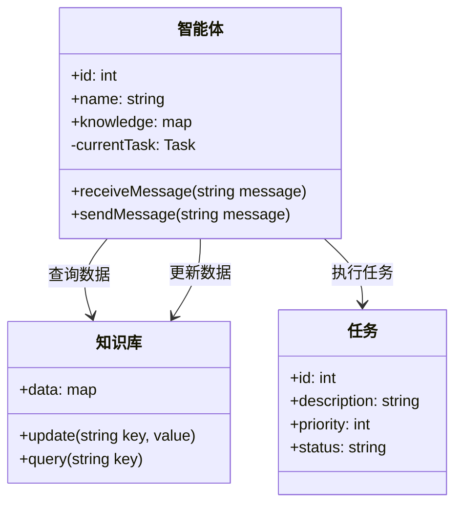
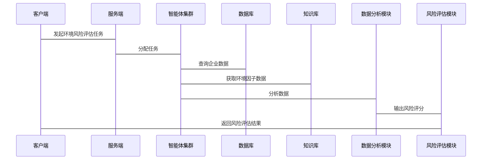

                 


# AI多智能体系统在价值投资中的环境风险评估

> 关键词：AI多智能体系统、价值投资、环境风险评估、金融建模、智能体协作、风险分析

> 摘要：本文探讨了AI多智能体系统在价值投资中的应用，重点分析了环境风险评估的方法与实现。通过系统架构设计、算法原理和项目实战，详细阐述了如何利用多智能体协作机制进行风险评估，为投资者提供科学决策支持。

---

## 第一部分: AI多智能体系统与价值投资概述

### 第1章: AI多智能体系统与价值投资概述

#### 1.1 AI多智能体系统的定义与特点
##### 1.1.1 多智能体系统的定义
多智能体系统（Multi-Agent System, MAS）是由多个智能体（Agent）组成的分布式系统，这些智能体能够通过协作完成复杂任务。AI多智能体系统结合人工智能技术，赋予智能体学习和推理能力。

##### 1.1.2 AI多智能体系统的独特优势
- **分布式计算**：多个智能体协同工作，提高系统效率。
- **自主性**：智能体能够自主决策，减少人工干预。
- **协作性**：通过协作完成复杂任务，优于单一智能体。
- **适应性**：能够根据环境变化自适应调整策略。

##### 1.1.3 多智能体与传统AI的区别
| 特性 | 多智能体系统 | 传统AI系统 |
|------|--------------|------------|
| 结构 | 分布式架构   | 集中式架构 |
| 智能体 | 多个智能体协作 | 单一智能体 |
| 应用 | 任务分配、信息共享 | 任务执行 |

#### 1.2 价值投资的核心概念
##### 1.2.1 价值投资的定义
价值投资是一种投资策略，通过分析企业基本面，寻找被市场低估的投资标的。其核心是“买入低于内在价值的股票”。

##### 1.2.2 价值投资的基本原理
- **内在价值**：企业未来现金流的现值。
- **市场价格**：股票的市场价格。
- **安全边际**：内在价值与市场价格的差额。

##### 1.2.3 价值投资与AI的结合
AI技术可以用于：
1. 数据分析：挖掘企业财务数据，评估内在价值。
2. 风险评估：预测市场风险，辅助投资决策。
3. 智能选股：基于AI算法筛选优质标的。

#### 1.3 环境风险评估的背景与意义
##### 1.3.1 环境风险的定义
环境风险是指企业在经营过程中由于环境因素（如政策变化、资源枯竭）带来的潜在风险。

##### 1.3.2 环境风险在价值投资中的重要性
- 环境风险影响企业长期发展。
- 环境合规成本上升，影响企业盈利能力。
- 环境事件可能导致股价波动。

##### 1.3.3 环境风险评估的挑战与机遇
| 挑战 | 机遇 |
|------|------|
| 数据复杂性 | 提高评估精度 |
| 多因素影响 | 优化投资策略 |
| 方法单一 | 创新评估模型 |

#### 1.4 本章小结
本章介绍了AI多智能体系统的基本概念和价值投资的核心原理，强调了环境风险评估在投资决策中的重要性。

---

## 第二部分: AI多智能体系统的核心原理

### 第2章: 多智能体系统的架构与协作机制

#### 2.1 多智能体系统的架构设计
##### 2.1.1 分层架构
- **感知层**：智能体感知环境信息。
- **决策层**：制定策略。
- **执行层**：执行任务。

##### 2.1.2 分布式架构
- **去中心化**：无单点依赖。
- **容错性**：部分故障不影响整体。

##### 2.1.3 协作式架构
- **任务分配**：智能体协作完成任务。
- **信息共享**：共享知识和数据。

#### 2.2 多智能体系统的协作机制
##### 2.2.1 任务分配
- **基于角色分配**：根据智能体能力分配任务。
- **动态调整**：根据环境变化调整任务分配。

##### 2.2.2 信息共享
- **知识共享**：智能体之间共享知识。
- **数据同步**：保持数据一致性。

##### 2.2.3 协作策略
- **协商机制**：智能体之间通过协商达成一致。
- **优先级排序**：根据任务优先级调整协作顺序。

#### 2.3 多智能体系统的通信协议
##### 2.3.1 通信模型
- **点对点通信**：两个智能体之间通信。
- **广播通信**：一个智能体向多个智能体广播信息。

##### 2.3.2 通信协议设计
- **协议定义**：定义通信格式和规则。
- **错误处理**：处理通信中的异常情况。

##### 2.3.3 通信优化
- **减少延迟**：优化通信路径。
- **提高带宽利用率**：压缩数据传输。

#### 2.4 本章小结
本章详细讲解了多智能体系统的架构设计和协作机制，强调了通信协议在系统设计中的重要性。

---

## 第三部分: 环境风险评估的AI多智能体实现

### 第3章: 环境风险评估的多智能体模型构建

#### 3.1 环境风险评估的核心要素
##### 3.1.1 环境因子分析
- **政策风险**：政府政策对企业的影响。
- **资源风险**：资源枯竭对企业的影响。
- **技术风险**：技术变革对企业的影响。

##### 3.1.2 企业经营状况评估
- **财务状况**：企业盈利能力、资产负债情况。
- **管理能力**：企业高管团队的能力。
- **市场地位**：企业在市场中的位置。

##### 3.1.3 市场风险评估
- **市场波动**：市场波动对企业股价的影响。
- **行业竞争**：行业竞争对企业的影响。

#### 3.2 多智能体模型的设计
##### 3.2.1 智能体角色分配
- **数据采集智能体**：采集企业环境数据。
- **分析智能体**：分析数据，评估风险。
- **决策智能体**：制定投资策略。

##### 3.2.2 智能体功能模块设计
- **感知模块**：感知环境信息。
- **推理模块**：基于知识库进行推理。
- **决策模块**：制定决策策略。

##### 3.2.3 智能体协作规则
- **任务分配规则**：基于智能体能力和任务需求分配任务。
- **信息共享规则**：智能体之间共享知识和数据。

#### 3.3 环境风险评估的数学模型
##### 3.3.1 风险评估公式
$$风险评分 = \sum_{i=1}^{n} w_i \cdot f_i$$
其中，$w_i$是因子权重，$f_i$是因子评分。

##### 3.3.2 多智能体协作的数学表达
$$C = \sum_{j=1}^{m} \sum_{i=1}^{n} w_i \cdot f_i \cdot \alpha_j$$
其中，$\alpha_j$是智能体$j$的权重。

##### 3.3.3 模型优化与验证
- **参数优化**：通过机器学习优化模型参数。
- **验证方法**：使用历史数据验证模型准确性。

#### 3.4 本章小结
本章构建了环境风险评估的多智能体模型，详细讲解了模型设计和数学表达。

---

## 第四部分: 项目实战

### 第4章: 环境风险评估系统的设计与实现

#### 4.1 项目背景与目标
- **项目背景**：当前环境风险评估的挑战。
- **项目目标**：构建一个基于AI多智能体的环境风险评估系统。

#### 4.2 系统功能设计
##### 4.2.1 领域模型类图


##### 4.2.2 系统架构设计


##### 4.2.3 接口设计
- **API接口**：
  - `/api/initiate_task`：发起任务。
  - `/api/retrieve_result`：获取结果。
  - `/api/update_knowledge`：更新知识库。

##### 4.2.4 交互流程


#### 4.3 项目实现
##### 4.3.1 环境安装
```bash
pip install numpy pandas scikit-learn
pip install agentframework
```

##### 4.3.2 核心功能实现
```python
class Agent:
    def __init__(self, id, knowledge_base):
        self.id = id
        self.knowledge_base = knowledge_base
        self.current_task = None

    def receive_message(self, message):
        # 处理消息
        pass

    def send_message(self, message):
        # 发送消息
        pass

    def execute_task(self):
        # 执行任务
        pass
```

##### 4.3.3 代码解读与分析
- **Agent类**：定义智能体的基本功能。
- **Task类**：定义任务结构。
- **KnowledgeBase类**：定义知识库接口。

##### 4.3.4 案例分析
假设我们要评估一家公司的环境风险，首先需要获取公司财务数据、行业数据和政策数据，然后通过多智能体协作进行分析，最终输出风险评分。

##### 4.3.5 项目小结
本章通过实际案例展示了AI多智能体系统在环境风险评估中的应用，详细讲解了系统设计和实现过程。

---

## 第五部分: 总结与展望

### 第5章: 总结与展望

#### 5.1 全文总结
本文详细讲解了AI多智能体系统在价值投资中的应用，重点分析了环境风险评估的方法与实现。通过系统架构设计、算法原理和项目实战，详细阐述了如何利用多智能体协作机制进行风险评估，为投资者提供科学决策支持。

#### 5.2 应用前景
- **行业扩展**：AI多智能体系统可以扩展到更多行业。
- **技术进步**：随着AI技术的发展，系统性能将不断提升。
- **数据驱动**：数据量的增加将提高评估的准确性。

#### 5.3 未来研究方向
- **智能体优化**：进一步优化智能体协作机制。
- **风险模型创新**：开发更复杂的环境风险评估模型。
- **多模态数据融合**：结合文本、图像等多种数据源进行分析。

#### 5.4 最佳实践 tips
- **数据质量**：确保数据来源可靠。
- **模型验证**：定期验证模型准确性。
- **系统维护**：定期更新知识库和模型参数。

#### 5.5 本章小结
本章总结了全文内容，展望了AI多智能体系统在环境风险评估中的未来发展方向。

---

## 参考文献
[此处列出参考文献]

---

通过以上目录结构，我们可以看到，文章从理论到实践，详细讲解了AI多智能体系统在环境风险评估中的应用。文章不仅涵盖基本概念和算法原理，还通过实际案例展示了系统设计和实现过程。希望这篇文章能为读者提供有价值的参考和启发。

