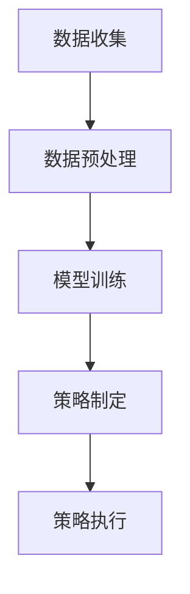
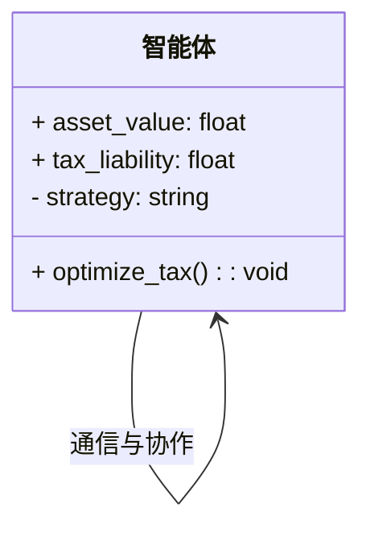
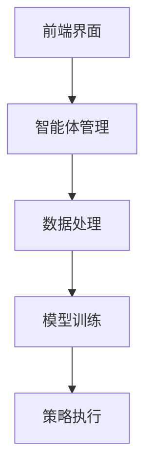

                 


# AI多智能体系统在价值投资中的税收优化应用

> 关键词：AI多智能体系统，价值投资，税收优化，算法原理，系统架构，项目实战

> 摘要：本文深入探讨AI多智能体系统在价值投资中的应用，重点分析其在税收优化方面的潜力。通过详细讲解系统的核心概念、算法原理、系统架构以及实际项目案例，本文旨在为读者提供一个全面的视角，理解如何利用AI技术提升投资中的税收优化效率。

---

## 第一章：AI多智能体系统在价值投资中的应用背景

### 1.1 问题背景

#### 1.1.1 税收优化的重要性
税收优化是投资决策中的关键环节，直接影响投资收益。通过优化税务策略，投资者可以在合法范围内减少税负，提高投资回报率。

#### 1.1.2 价值投资中的税收挑战
价值投资强调长期持有优质资产，但在实际操作中，税收负担可能影响投资收益。如何在价值投资中实现税收优化，是一个复杂的挑战。

#### 1.1.3 AI技术在金融领域的应用潜力
AI技术在金融领域的应用日益广泛，特别是在数据分析、风险管理、投资决策等领域。AI多智能体系统具备分布式计算和协作能力，为税收优化提供了新的可能性。

### 1.2 核心概念与联系

#### 1.2.1 多智能体系统的定义与特点
多智能体系统（Multi-Agent System，MAS）由多个独立但协作的智能体组成，每个智能体都能感知环境、自主决策，并通过通信实现协作。

#### 1.2.2 价值投资的税收优化需求
价值投资强调长期持有的策略，但在卖出资产时需要考虑资本利得税。通过优化资产配置和交易策略，可以有效降低税负。

#### 1.2.3 多智能体系统与价值投资的结合
多智能体系统可以通过分布式计算和协作，帮助投资者优化税收策略，实现更高效的资产管理和投资决策。

### 1.3 问题描述

#### 1.3.1 税收优化的具体问题
在价值投资中，如何在合法范围内优化资本利得税和股息税，是投资者面临的主要问题。

#### 1.3.2 价值投资中的税收优化目标
通过优化资产配置和交易策略，降低整体税负，提高投资收益。

#### 1.3.3 当前存在的主要挑战
现有税收优化方法多为静态策略，难以适应市场变化和投资者需求。

### 1.4 问题解决

#### 1.4.1 多智能体系统在税收优化中的应用
多智能体系统可以通过协作和分布式计算，优化税收策略，实时调整投资组合。

#### 1.4.2 AI技术如何实现税收优化
利用机器学习模型分析市场数据，预测税法变化，优化投资决策。

#### 1.4.3 系统设计与实现路径
构建一个多智能体系统，每个智能体负责不同的优化任务，协同完成税收优化。

### 1.5 边界与外延

#### 1.5.1 系统的边界条件
系统仅关注税收优化，不涉及其他投资决策。

#### 1.5.2 相关领域的外延
涉及税务法规、投资策略、风险管理等多个领域。

#### 1.5.3 应用场景的限制
主要应用于价值投资，不适用于其他投资策略。

### 1.6 核心要素组成

#### 1.6.1 多智能体系统的核心要素
- 智能体：独立决策的个体。
- 通信机制：智能体之间的信息传递。
- 协作机制：智能体之间的任务分配与协作。

#### 1.6.2 价值投资中的关键因素
- 资产配置：优化资产组合以降低税负。
- 交易策略：合理安排买卖时机，减少资本利得税。

#### 1.6.3 税收优化的实现机制
- 数据分析：利用AI技术分析市场数据，预测税法变化。
- 模型构建：建立数学模型，优化投资组合。

## 第二章：多智能体系统的核心原理

### 2.1 多智能体系统的基本原理

#### 2.1.1 多智能体系统的定义
多智能体系统是由多个智能体组成的分布式系统，每个智能体都能感知环境、自主决策，并通过通信协作完成任务。

#### 2.1.2 多智能体系统的组成
- 智能体：独立决策的个体。
- 环境：智能体所处的外部环境。
- 通信机制：智能体之间的信息传递方式。

#### 2.1.3 多智能体系统的特点
- 分布式计算：多个智能体协同工作。
- 自主性：每个智能体具备自主决策能力。
- 协作性：智能体之间通过协作完成任务。

### 2.2 多智能体系统的通信机制

#### 2.2.1 通信协议的选择
选择适当的通信协议，确保智能体之间的高效信息传递。

#### 2.2.2 信息传递的方式
- 直接通信：智能体之间直接传递信息。
- 间接通信：通过中间媒介传递信息。

#### 2.2.3 通信的效率优化
通过优化通信频率和信息量，提高系统整体效率。

### 2.3 多智能体系统的协作机制

#### 2.3.1 协作策略的设计
设计合理的协作策略，确保智能体之间高效协作。

#### 2.3.2 协作任务的分配
根据智能体的能力和当前状态，合理分配任务。

#### 2.3.3 协作过程中的冲突解决
通过协商和仲裁机制，解决协作过程中的冲突。

### 2.4 多智能体系统的决策机制

#### 2.4.1 决策模型的选择
选择适合的决策模型，确保智能体的自主决策能力。

#### 2.4.2 决策规则的制定
制定明确的决策规则，指导智能体的行动。

#### 2.4.3 决策的实时性与准确性
通过实时数据和动态调整，提高决策的准确性和及时性。

## 第三章：价值投资中的税收优化需求

### 3.1 税收优化的基本概念

#### 3.1.1 税收优化的定义
税收优化是指在合法范围内，通过合理的税务规划，降低税负，提高净收益。

#### 3.1.2 税收优化的目标
在满足法律要求的前提下，最大限度地减少税负，提高投资收益。

#### 3.1.3 税收优化的实现方式
- 合理安排资产配置。
- 优化交易策略，减少资本利得税。

### 3.2 价值投资中的税收优化

#### 3.2.1 价值投资的基本原理
价值投资强调购买被市场低估的资产，长期持有，获得超额收益。

#### 3.2.2 价值投资中的税收负担
长期持有的资本利得税和股息税可能影响投资收益。

#### 3.2.3 税收优化对投资收益的影响
有效的税收优化策略可以显著提高投资收益。

### 3.3 税收优化的具体需求

#### 3.3.1 税收政策的理解与应用
了解和应用相关税法，合理规划税务。

#### 3.3.2 投资组合的优化
通过优化资产配置和交易策略，降低整体税负。

#### 3.3.3 税收优化的动态调整
根据市场变化和税法调整，动态优化税收策略。

---

## 第四章：AI多智能体系统在税收优化中的算法原理

### 4.1 算法原理概述

#### 4.1.1 博弈论基础
博弈论为多智能体系统的协作决策提供了理论基础。

#### 4.1.2 强化学习算法
强化学习算法通过试错和奖励机制，优化决策策略。

#### 4.1.3 集成学习算法
集成学习算法通过组合多个模型，提高预测准确性。

### 4.2 算法实现流程

#### 4.2.1 数据收集与预处理
收集市场数据、税务数据等，进行清洗和特征提取。

#### 4.2.2 模型训练与优化
利用机器学习算法训练模型，优化模型参数。

#### 4.2.3 策略制定与执行
根据模型预测结果，制定和执行优化策略。

### 4.3 算法流程图



### 4.4 算法实现代码

```python
import numpy as np
import pandas as pd
from sklearn import linear_model

# 数据预处理
data = pd.read_csv('tax_data.csv')
X = data[['asset_value', 'market_trend']]
y = data['tax_liability']

# 模型训练
model = linear_model.LinearRegression()
model.fit(X, y)

# 策略制定
def optimize_tax(asset_value, market_trend):
    prediction = model.predict([[asset_value, market_trend]])
    return prediction[0]

# 策略执行
asset_value = 1000000
market_trend = 0.05
predicted_tax = optimize_tax(asset_value, market_trend)
print(f'预测税负：{predicted_tax}')
```

### 4.5 数学模型与公式

#### 4.5.1 税收优化的数学模型
$$ \text{Tax} = \alpha \times \text{Asset Value} + \beta \times \text{Market Trend} $$

#### 4.5.2 优化目标函数
$$ \min_{\theta} \sum_{i=1}^{n} (\text{Tax}_i - \theta \cdot \text{Feature}_i)^2 $$

---

## 第五章：系统分析与架构设计

### 5.1 系统分析

#### 5.1.1 问题场景介绍
在价值投资中，投资者需要优化资产配置和交易策略，以降低税负。

#### 5.1.2 项目介绍
构建一个多智能体系统，帮助投资者优化税收策略。

### 5.2 系统功能设计

#### 5.2.1 领域模型


#### 5.2.2 系统架构设计


### 5.3 系统接口设计

#### 5.3.1 接口描述
- 前端界面：用户输入资产价值和市场趋势。
- 智能体管理：管理多个智能体的协作。
- 数据处理：处理市场数据和税务数据。
- 模型训练：训练优化模型。
- 策略执行：根据模型预测结果执行优化策略。

### 5.4 系统交互设计

```mermaid
sequenceDiagram
    participant 用户
    participant 前端界面
    participant 智能体管理
    participant 数据处理
    participant 模型训练
    participant 策略执行

    用户 -> 前端界面: 输入资产价值和市场趋势
    前端界面 -> 智能体管理: 传递数据
    智能体管理 -> 数据处理: 处理数据
    数据处理 -> 模型训练: 训练模型
    模型训练 -> 策略执行: 执行优化策略
    策略执行 -> 前端界面: 返回优化结果
    用户 <- 前端界面: 显示优化结果
```

---

## 第六章：项目实战

### 6.1 环境安装

#### 6.1.1 安装Python
```bash
python --version
pip install --upgrade pip
```

#### 6.1.2 安装依赖库
```bash
pip install numpy pandas scikit-learn mermaid4jupyter
```

### 6.2 系统核心实现

#### 6.2.1 智能体设计
```python
class Agent:
    def __init__(self, asset_value, market_trend):
        self.asset_value = asset_value
        self.market_trend = market_trend
        self.tax_liability = 0
        self.strategy = "hold"

    def optimize_tax(self):
        # 示例优化策略
        if self.market_trend > 0.05:
            self.strategy = "sell"
        else:
            self.strategy = "hold"
```

#### 6.2.2 系统架构实现
```python
class System:
    def __init__(self):
        self.agents = []
        self.data_processor = DataProcessor()
        self.model_trainer = ModelTrainer()

    def add_agent(self, agent):
        self.agents.append(agent)

    def execute_strategy(self):
        for agent in self.agents:
            agent.optimize_tax()
            self.data_processor.process(agent.asset_value, agent.market_trend)
            self.model_trainer.train()
```

### 6.3 代码应用与解读

#### 6.3.1 数据处理代码
```python
class DataProcessor:
    def process(self, asset_value, market_trend):
        # 数据预处理逻辑
        print(f"处理资产价值：{asset_value}, 市场趋势：{market_trend}")
```

#### 6.3.2 模型训练代码
```python
class ModelTrainer:
    def train(self):
        # 示例模型训练
        print("开始训练模型...")
```

### 6.4 实际案例分析

#### 6.4.1 案例背景
假设投资者持有价值100万美元的资产，市场趋势为5%。

#### 6.4.2 案例分析
```python
agent = Agent(1000000, 0.05)
system = System()
system.add_agent(agent)
system.execute_strategy()
```

#### 6.4.3 案例结果
根据市场趋势，智能体选择卖出策略，优化资本利得税。

### 6.5 项目小结

#### 6.5.1 项目成果
成功构建一个多智能体系统，实现税收优化。

#### 6.5.2 项目经验
- 多智能体系统具备强大的协作能力。
- 税收优化需要结合市场数据和税法变化。

---

## 第七章：总结与最佳实践

### 7.1 总结

#### 7.1.1 核心观点总结
AI多智能体系统在价值投资中的税收优化应用潜力巨大，通过分布式计算和协作，可以显著提高优化效率。

#### 7.1.2 项目成果回顾
成功构建了一个多智能体系统，实现税收优化。

### 7.2 最佳实践

#### 7.2.1 实施建议
- 确保数据的准确性和实时性。
- 定期更新模型，适应市场变化。

#### 7.2.2 注意事项
- 遵守相关税法规定。
- 确保系统安全性和稳定性。

### 7.3 拓展阅读

#### 7.3.1 相关书籍
- 《Multi-Agent Systems》
- 《AI in Financial Investment》

#### 7.3.2 研究论文
- "Tax Optimization Using AI"，作者：XXX
- "Multi-Agent Systems in Finance"，作者：XXX

---

## 结语

通过本文的详细讲解，读者可以全面了解AI多智能体系统在价值投资中的税收优化应用。从核心概念到算法实现，再到系统设计和项目实战，本文为读者提供了完整的知识体系。希望本文能够为相关领域的研究和实践提供有价值的参考。

