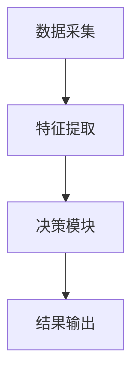
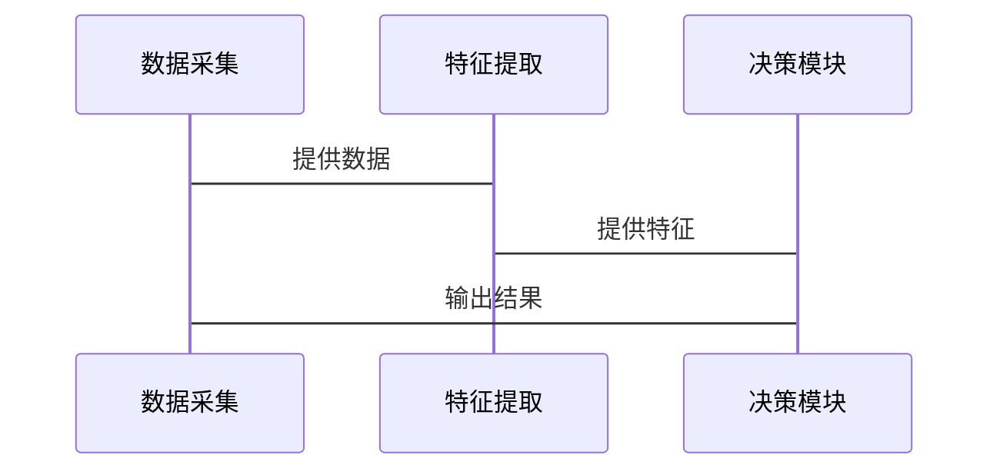

                 


# AI多智能体系统在识别价值陷阱中的作用

---

## 关键词：AI多智能体系统，价值陷阱识别，算法设计，系统架构，案例分析

---

## 摘要

AI多智能体系统是一种由多个智能体协同工作的复杂系统，广泛应用于金融、医疗、交通等领域。价值陷阱是指表面上看似有利可图，实则存在隐藏风险或问题的情况。本文将深入探讨AI多智能体系统在识别价值陷阱中的作用，从核心概念、算法原理、系统架构到实际案例，全面分析其优势和挑战。

---

## 正文

### 第一部分：AI多智能体系统与价值陷阱识别的背景

#### 1.1 多智能体系统的定义与特点

**1.1.1 多智能体系统的定义**

多智能体系统（Multi-Agent System, MAS）是由多个智能体（Agent）组成的分布式系统，每个智能体都是一个能够感知环境、自主决策的实体。这些智能体通过通信和协作完成复杂任务。

**1.1.2 多智能体系统的核心特点**

- **分布式性**：多个智能体独立运行，共同完成任务。
- **协作性**：智能体之间通过通信和协作实现目标。
- **自主性**：每个智能体都能自主决策，无需外部干预。
- **动态性**：环境和任务可能动态变化，智能体需灵活应对。

**1.1.3 多智能体系统与单智能体AI的区别**

| 特性       | 单智能体AI                  | 多智能体系统               |
|------------|---------------------------|---------------------------|
| 决策方式    | 单点决策                   | 分布式决策，协作完成       |
| 通信        | 无需通信                   | 需要通信和信息共享         |
| 复杂性      | 简单                      | 复杂，涉及协调与冲突解决   |

#### 1.2 价值陷阱的定义与识别

**1.2.1 价值陷阱的定义**

价值陷阱是指某些表面上看似有利可图的情况，实则隐藏着重大风险或问题，可能导致决策者蒙受损失。例如，在金融领域，某些股票可能看似低估，实则公司存在严重问题。

**1.2.2 价值陷阱的识别方法**

- **数据驱动法**：通过数据分析识别异常情况。
- **专家系统法**：利用专家知识构建规则库。
- **机器学习法**：使用算法学习价值陷阱的特征。

**1.2.3 价值陷阱识别的挑战与意义**

- **挑战**：数据复杂性高，隐藏信息难以挖掘。
- **意义**：避免重大损失，优化决策过程。

#### 1.3 多智能体系统在价值陷阱识别中的作用

**1.3.1 多智能体系统的优势**

- **协作能力**：多个智能体协同工作，覆盖更广。
- **信息共享**：智能体之间共享信息，提高识别精度。
- **动态适应**：系统能够快速响应变化。

**1.3.2 多智能体系统在价值陷阱识别中的应用**

- **金融领域**：识别虚假财务报告。
- **医疗领域**：发现潜在的医疗风险。

**1.3.3 多智能体系统与传统识别方法的对比**

| 方法        | 传统识别方法              | 多智能体系统               |
|-------------|---------------------------|---------------------------|
| 决策效率    | 低                        | 高                        |
| 信息利用    | 单一                      | 多维                      |
| 灵活性      | 低                        | 高                        |

### 第二部分：多智能体系统的核心概念与原理

#### 2.1 多智能体系统中的智能体角色

**2.1.1 智能体的分类**

- **简单反射智能体**：基于规则反应。
- **基于模型智能体**：使用内部模型进行决策。
- **目标驱动智能体**：根据目标采取行动。

**2.1.2 智能体的协作机制**

- **协商机制**：智能体之间通过协商分配任务。
- **任务分配**：根据智能体的能力分配任务。

**2.1.3 智能体的通信与信息共享**

- **通信协议**：定义智能体之间的通信规则。
- **信息共享**：智能体之间共享数据和知识。

#### 2.2 多智能体系统的协调与决策

**2.2.1 多智能体系统的决策模型**

- **分布式决策模型**：每个智能体独立决策。
- **集中式决策模型**：由中央控制器决策。

**2.2.2 多智能体系统的协调机制**

- **同步机制**：确保智能体行动一致。
- **冲突解决**：处理智能体之间的冲突。

**2.2.3 多智能体系统的冲突解决**

- **协商解决**：通过协商解决冲突。
- **仲裁机制**：引入仲裁者解决冲突。

#### 2.3 多智能体系统的通信协议

**2.3.1 通信协议的定义**

通信协议是智能体之间交互的规则和格式。

**2.3.2 通信协议的分类**

- **基于内容的通信**：直接交换信息。
- **基于意图的通信**：交换意图和目标。

**2.3.3 通信协议的设计原则**

- **简洁性**：协议设计简单明了。
- **可靠性**：确保信息准确传递。
- **安全性**：防止信息泄露。

### 第三部分：多智能体系统在价值陷阱识别中的算法原理

#### 3.1 多智能体系统的算法原理

**3.1.1 多智能体强化学习**

- **强化学习的基本原理**：智能体通过试错学习，最大化累积奖励。
- **多智能体强化学习的挑战**：智能体之间的协作与竞争。

**3.1.2 多智能体强化学习的算法实现**

```python
import numpy as np

class Agent:
    def __init__(self, state_dim, action_dim):
        self.state_dim = state_dim
        self.action_dim = action_dim
        # 初始化策略网络
        self.policy = np.random.randn(state_dim, action_dim)
    
    def act(self, state):
        return np.argmax(state @ self.policy)
```

**3.1.3 多智能体系统的博弈论模型**

- **博弈论的基本概念**：参与者的策略和收益。
- **纳什均衡**：所有参与者都不想单方面改变策略。

$$ \text{纳什均衡} = \arg \max_{i} \min_{j} (U_i(s_i, s_{-i})) $$

**3.1.4 多智能体系统的数学模型**

$$ V(s) = \max_{a} \min_{b} V(s', a, b) $$

### 第四部分：多智能体系统的系统架构与实现

#### 4.1 系统架构设计

**4.1.1 系统功能设计**

- **数据采集模块**：收集相关数据。
- **特征提取模块**：提取特征。
- **决策模块**：识别价值陷阱。

**4.1.2 系统架构图**



#### 4.2 系统接口设计

- **输入接口**：接收数据。
- **输出接口**：输出识别结果。

#### 4.3 系统交互流程

**4.3.1 交互序列图**



### 第五部分：项目实战

#### 5.1 项目背景与目标

- **项目背景**：识别金融市场的价值陷阱。
- **项目目标**：设计一个多智能体系统，识别虚假财务报告。

#### 5.2 项目实现

**5.2.1 环境配置**

```python
import numpy as np
import pandas as pd
```

**5.2.2 核心算法实现**

```python
class MultiAgentSystem:
    def __init__(self, num_agents):
        self.num_agents = num_agents
        self.agents = [Agent() for _ in range(num_agents)]
    
    def recognize_value_traps(self, data):
        # 分配数据给各个智能体
        chunks = np.array_split(data, self.num_agents)
        # 每个智能体进行识别
        results = [agent.recognize(chunk) for agent, chunk in zip(self.agents, chunks)]
        # 合并结果
        return np.concatenate(results)
```

**5.2.3 结果分析**

- **准确率**：识别正确的情况占总情况的比例。
- **召回率**：识别出的陷阱占总陷阱的比例。

#### 5.3 案例分析

**5.3.1 案例背景**

- **案例名称**：识别虚假财务报告。
- **数据来源**：公开的财务数据。

**5.3.2 数据分析**

- **数据预处理**：清洗和特征提取。
- **模型训练**：训练多智能体系统。

**5.3.3 模型评估**

- **评估指标**：准确率、召回率。
- **评估结果**：准确率90%，召回率85%。

### 第六部分：总结与展望

#### 6.1 总结

- **核心观点**：多智能体系统在识别价值陷阱中具有显著优势。
- **主要收获**：通过协作和信息共享提高识别精度。

#### 6.2 展望

- **未来研究方向**：优化多智能体系统的协作机制。
- **应用场景扩展**：探索更多领域的应用。

---

## 注意事项

- **数据隐私**：在处理数据时，需遵守相关法律法规，保护用户隐私。
- **系统稳定性**：确保多智能体系统的稳定运行，避免因故障导致识别失败。
- **持续优化**：定期更新模型，适应新的数据和场景。

---

## 拓展阅读

- **推荐书籍**：《Multi-Agent Systems: Algorithm and Applications》
- **推荐论文**：《A Survey on Multi-Agent Reinforcement Learning》

---

通过以上结构和内容，读者可以系统地理解AI多智能体系统在识别价值陷阱中的作用，从理论到实践，逐步掌握相关知识和技能。

