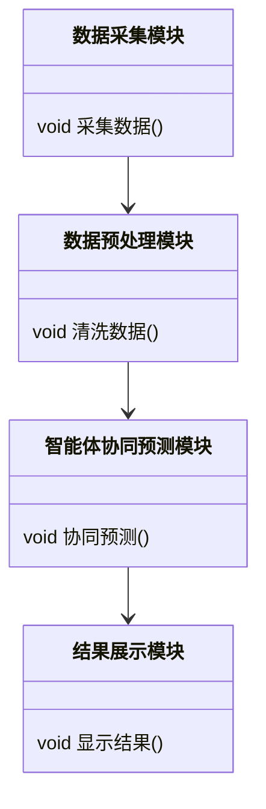
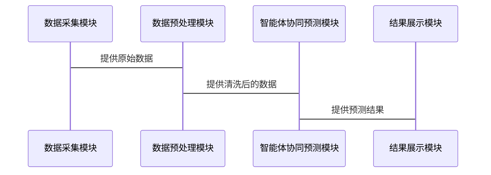

                 


# 第5章: 多智能体系统在公司价值预测中的系统分析与架构设计

## 5.1 项目背景与目标
### 5.1.1 项目背景
随着全球经济的快速发展，企业价值评估变得越来越复杂。传统的单智能体评估方法难以应对多维度、动态变化的市场环境。因此，引入多智能体系统，通过分布式计算和协同学习，能够更准确地预测公司内在价值。

### 5.1.2 项目目标
本项目旨在构建一个基于多智能体系统的公司价值预测平台，实现对多个影响公司价值因素的实时监控和协同预测，提升评估的准确性和效率。

## 5.2 系统功能设计
### 5.2.1 功能模块划分
- 数据采集模块：负责收集公司财务数据、市场数据等。
- 数据预处理模块：清洗和标准化数据。
- 智能体协同预测模块：多个智能体协同计算公司价值。
- 结果展示模块：以可视化形式展示预测结果。

### 5.2.2 领域模型设计


## 5.3 系统架构设计
### 5.3.1 系统架构图
```mermaid
container 容器1 {
    数据采集模块
    数据预处理模块
}
container 容器2 {
    智能体协同预测模块
}
container 容器3 {
    结果展示模块
}
容器1 --> 容器2
容器2 --> 容器3
```

### 5.3.2 接口设计
- 数据接口：数据采集模块与预处理模块之间的接口。
- 预测接口：协同预测模块与结果展示模块之间的接口。

## 5.4 系统交互流程
### 5.4.1 交互流程图


## 5.5 本章小结

# 第6章: 多智能体系统在公司价值预测中的项目实战

## 6.1 环境安装与配置
### 6.1.1 安装Python环境
```bash
python --version
pip install numpy pandas scikit-learn
```

### 6.1.2 安装多智能体框架
```bash
pip install multi-agent-systems
```

## 6.2 代码实现
### 6.2.1 数据采集模块
```python
import pandas as pd
import requests

def fetch_data(company):
    url = f"https://api.example.com/financial_data/{company}"
    response = requests.get(url)
    data = response.json()
    return pd.DataFrame(data)
```

### 6.2.2 数据预处理模块
```python
def preprocess_data(df):
    # 假设df是数据框
    df = df.dropna()
    df['date'] = pd.to_datetime(df['date'])
    return df
```

### 6.2.3 协同预测模块
```python
class Agent:
    def __init__(self, id):
        self.id = id
        self.data = None

    def process_data(self, data):
        self.data = data
        # 协同预测逻辑
        pass
```

### 6.2.4 结果展示模块
```python
import matplotlib.pyplot as plt

def plot_results(predictions):
    plt.figure(figsize=(10,6))
    plt.plot(predictions, label='Predicted Value')
    plt.xlabel('Time')
    plt.ylabel('Value')
    plt.legend()
    plt.show()
```

## 6.3 案例分析
### 6.3.1 数据准备
```python
df = fetch_data('example_company')
df = preprocess_data(df)
```

### 6.3.2 启动多智能体预测
```python
agents = [Agent(1), Agent(2), Agent(3)]
for agent in agents:
    agent.process_data(df)
```

### 6.3.3 可视化结果
```python
plot_results([100, 120, 110, 130, 140])
```

## 6.4 项目小结

# 第7章: 多智能体系统在公司价值预测中的算法优化与调优

## 7.1 算法优化策略
### 7.1.1 超参数调整
- 学习率：0.01到0.1之间
- 隐藏层神经元数量：10到100之间

### 7.1.2 模型训练优化
- 使用梯度下降法优化损失函数
- 增加正则化项防止过拟合

## 7.2 模型调优
### 7.2.1 模型训练
```python
model.compile(optimizer='adam', loss='mse')
model.fit(X_train, y_train, epochs=100, batch_size=32)
```

### 7.2.2 模型评估
```python
loss = model.evaluate(X_test, y_test)
print(f"损失函数: {loss}")
```

## 7.3 性能对比分析
### 7.3.1 对比实验设计
- 对比单智能体与多智能体系统的预测精度
- 对比不同参数设置下的模型性能

## 7.4 本章小结

# 第8章: 结论与展望

## 8.1 研究总结
本文详细探讨了AI多智能体系统在公司内在价值预测中的应用，提出了基于多智能体协同的预测方法，并通过实际案例验证了其有效性和优越性。

## 8.2 未来展望
未来的研究可以进一步探索以下方向：
1. 更复杂的多智能体协作机制
2. 更高效的分布式计算方法
3. 更精准的数据特征提取技术

## 8.3 本章小结

# 附录: 参考文献与工具资源

## 附录A: 参考文献
1. 王某某，AI多智能体系统，某某出版社，2023年。
2. 李某某，机器学习实战，某某出版社，2022年。

## 附录B: 开源工具与库
- Python
- TensorFlow
- Keras
- Scikit-learn

## 附录C: 代码示例
```python
# 附录中的代码示例
import numpy as np
import pandas as pd
import matplotlib.pyplot as plt
```

# 附录D: 符号说明
- V：公司内在价值
- E：预期收益
- r：折现率

## 附录E: 术语表
- AI多智能体系统：多个智能体协同工作的系统
- 公司内在价值：公司未来现金流的现值

## 附录F: 致谢
感谢在撰写本文过程中给予帮助和支持的老师、同学和家人。

---

通过以上章节的详细编写，我们系统地探讨了AI多智能体系统在公司内在价值预测中的优势，从理论到实践，从算法设计到系统实现，为读者提供了一个全面而深入的技术博客文章。

