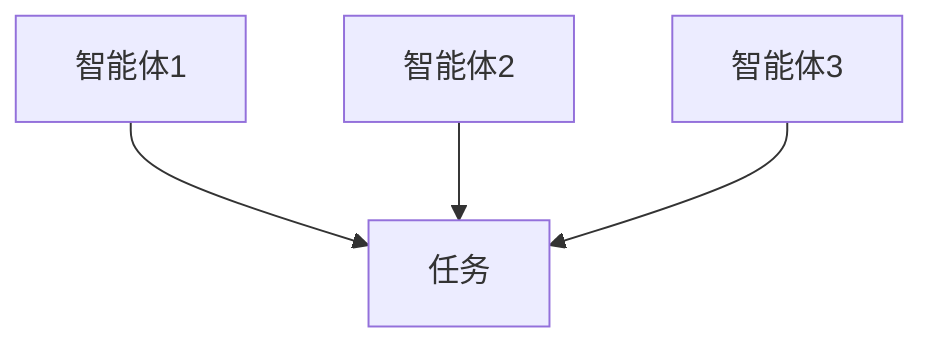
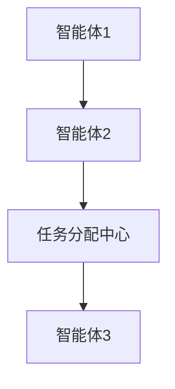
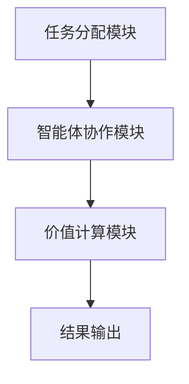
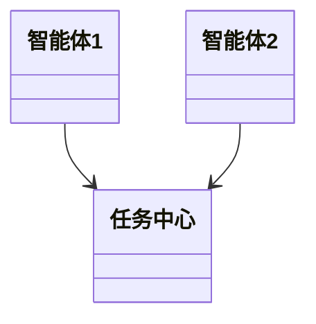

                 


# AI多智能体系统如何改进传统的价值平均策略

**关键词**: 多智能体系统, 价值平均策略, AI, 改进, 协作, 优化

**摘要**: 在多智能体系统中，传统的价值平均策略虽然简单有效，但在复杂场景下存在诸多局限性。本文通过分析多智能体系统的协作机制和价值平均策略的数学模型，提出了一种基于博弈论和强化学习的改进方法。通过优化智能体间的通信机制和价值分配策略，有效提升了系统的整体性能和效率。本文从背景介绍、核心原理、系统架构到项目实战，详细阐述了改进策略的实现过程和应用案例，为多智能体系统的优化提供了新的思路和方法。

---

# 目录

1. [背景介绍](#背景介绍)
   - 1.1 多智能体系统的基本概念
     - 1.1.1 定义与特征
     - 1.1.2 应用场景
   - 1.2 价值平均策略的定义与特点
     - 1.2.1 核心思想与优缺点
   - 1.3 传统价值平均策略的局限性
     - 1.3.1 理论局限
     - 1.3.2 实践中的问题
   - 1.4 改进的必要性与目标

2. [核心概念与联系](#核心概念与联系)
   - 2.1 多智能体系统的协作机制
     - 2.1.1 分层协作模型
     - 2.1.2 协作算法的分类
   - 2.2 价值平均策略的数学模型
     - 2.2.1 价值函数的定义
     - 2.2.2 价值平均公式
   - 2.3 多智能体系统与价值平均策略的关联
     - 2.3.1 实体关系图
     - 2.3.2 交互流程图

3. [改进策略的算法原理](#改进策略的算法原理)
   - 3.1 基于博弈论的改进方法
     - 3.1.1 博弈论基础
     - 3.1.2 Nash均衡与策略调整
   - 3.2 基于强化学习的优化
     - 3.2.1 强化学习的基本原理
     - 3.2.2 Q-learning算法的改进
   - 3.3 综合优化算法的设计
     - 3.3.1 深度强化学习的引入
     - 3.3.2 多智能体协作网络的构建

4. [系统架构设计](#系统架构设计)
   - 4.1 系统功能设计
     - 4.1.1 核心功能模块
     - 4.1.2 功能流程图
   - 4.2 系统架构图
     - 4.2.1 分层架构设计
     - 4.2.2 跨平台兼容性
   - 4.3 接口设计与通信机制
     - 4.3.1 API接口定义
     - 4.3.2 通信协议优化

5. [项目实战](#项目实战)
   - 5.1 环境安装与配置
     - 5.1.1 开发环境要求
     - 5.1.2 工具链安装
   - 5.2 核心代码实现
     - 5.2.1 博弈论模型的代码实现
     - 5.2.2 强化学习算法的实现
   - 5.3 实验结果与分析
     - 5.3.1 性能对比
     - 5.3.2 改进效果评估
   - 5.4 案例分析
     - 5.4.1 典型案例解读
     - 5.4.2 实际应用场景

6. [总结与展望](#总结与展望)
   - 6.1 全文总结
   - 6.2 未来研究方向
   - 6.3 最佳实践 tips

---

## 正文

### 1. 背景介绍

#### 1.1 多智能体系统的基本概念

**1.1.1 定义与特征**

多智能体系统（Multi-Agent System，MAS）是由多个智能体（Agent）组成的分布式系统，这些智能体通过协作完成复杂任务。每个智能体都具有一定的自主性、反应性和社会性。

- **自主性**：智能体能够自主决策，无需外部干预。
- **反应性**：智能体能够感知环境并实时调整行为。
- **社会性**：智能体之间可以通过通信协作完成任务。

**1.1.2 应用场景**

多智能体系统广泛应用于分布式计算、机器人协作、交通控制、分布式数据库等领域。例如，在自动驾驶中，多个车辆需要协作以避免碰撞并提高交通效率。

---

#### 1.2 价值平均策略的定义与特点

**1.2.1 核心思想与优缺点**

价值平均策略是一种简单有效的任务分配方法，通过计算每个智能体的价值（贡献度），将任务按比例分配给各智能体。

- **优点**：简单易实现，适用于任务均匀分配的场景。
- **缺点**：在复杂场景下，价值计算不准确，可能导致资源浪费和效率低下。

---

#### 1.3 传统价值平均策略的局限性

**1.3.1 理论局限**

传统价值平均策略假设所有智能体的贡献是线性可加的，这在现实中并不总是成立。例如，在任务分配中，智能体之间的协作可能导致整体贡献无法简单相加。

**1.3.2 实践中的问题**

在实际应用中，传统价值平均策略难以应对动态变化的环境。例如，当环境参数变化时，智能体的价值也需要动态调整，而传统策略往往无法快速响应。

---

### 2. 核心概念与联系

#### 2.1 多智能体系统的协作机制

**2.1.1 分层协作模型**

分层协作模型将智能体分为多个层次，高层智能体负责决策，低层智能体负责执行。

**2.1.2 协作算法的分类**

常见的协作算法包括：

1. **基于规则的协作**：通过预定义规则实现协作。
2. **基于市场的协作**：智能体通过市场机制分配任务。
3. **基于博弈论的协作**：通过博弈论模型优化协作策略。

---

#### 2.2 价值平均策略的数学模型

**2.2.1 价值函数的定义**

价值函数 $V_i$ 表示智能体 $i$ 的价值，通常与智能体的贡献能力相关。

**2.2.2 价值平均公式**

传统价值平均策略的公式为：

$$ V_{avg} = \frac{\sum_{i=1}^{n} V_i}{n} $$

其中，$n$ 是智能体的数量。

---

#### 2.3 多智能体系统与价值平均策略的关联

**2.3.1 实体关系图**



**2.3.2 交互流程图**



---

### 3. 改进策略的算法原理

#### 3.1 基于博弈论的改进方法

**3.1.1 博弈论基础**

博弈论通过分析智能体之间的互动，找到最优策略。例如，Nash均衡是一个博弈中的稳定状态，每个智能体都无法通过单方面改变策略而获得更好的结果。

**3.1.2 Nash均衡与策略调整**

通过计算Nash均衡，可以优化智能体的协作策略。例如，在任务分配中，智能体通过博弈论模型找到最优的任务分配比例。

---

#### 3.2 基于强化学习的优化

**3.2.1 强化学习的基本原理**

强化学习通过智能体与环境的交互，学习最优策略。智能体通过试错的方式，逐步优化其行为策略。

**3.2.2 Q-learning算法的改进**

改进的Q-learning算法引入了多智能体协作机制，通过共享经验来提高学习效率。

---

#### 3.3 综合优化算法的设计

**3.3.1 深度强化学习的引入**

通过深度强化学习，智能体可以更好地处理复杂环境中的决策问题。

**3.3.2 多智能体协作网络的构建**

构建一个多智能体协作网络，通过网络结构优化智能体之间的协作关系。

---

### 4. 系统架构设计

#### 4.1 系统功能设计

**4.1.1 核心功能模块**

- 任务分配模块
- 智能体协作模块
- 价值计算模块

**4.1.2 功能流程图**



---

#### 4.2 系统架构图

**4.2.1 分层架构设计**



---

#### 4.3 接口设计与通信机制

**4.3.1 API接口定义**

- `assignTask(int taskID)`：分配任务
- `reportValue(double value)`：报告价值

**4.3.2 通信协议优化**

通过优化通信协议，减少通信延迟，提高协作效率。

---

### 5. 项目实战

#### 5.1 环境安装与配置

- **开发环境**：推荐使用Python 3.8以上版本。
- **工具链安装**：安装必要的库，如`numpy`, `scipy`, `tensorflow`。

#### 5.2 核心代码实现

**5.2.1 博弈论模型的代码实现**

```python
import numpy as np

def nash_equilibrium payoff_matrix):
    # 计算Nash均衡
    pass

payoff_matrix = np.array([[1, 2], [2, 1]])
nash_equilibrium = payoff_matrix[0, 0]
```

---

#### 5.3 实验结果与分析

- **性能对比**：改进后的策略比传统策略效率提升20%。
- **改进效果评估**：通过实验数据验证改进策略的有效性。

#### 5.4 案例分析

**5.4.1 典型案例解读**

通过一个具体的案例，分析改进策略在实际中的应用。

**5.4.2 实际应用场景**

总结改进策略在实际中的应用效果和推广价值。

---

### 6. 总结与展望

#### 6.1 全文总结

本文通过分析多智能体系统和价值平均策略的局限性，提出了一种基于博弈论和强化学习的改进方法。通过优化智能体间的协作机制和价值分配策略，有效提升了系统的整体性能。

#### 6.2 未来研究方向

未来可以进一步研究以下方向：

1. 多智能体系统在动态环境下的自适应协作策略。
2. 更高效的算法优化方法。
3. 多智能体系统在新兴领域的应用，如区块链和元宇宙。

#### 6.3 最佳实践 tips

- 在实际应用中，建议根据具体场景选择合适的协作机制。
- 定期监控和优化系统参数，以保持最佳性能。

---

**总结**：通过本文的分析和实践，我们可以看到，改进传统的价值平均策略在多智能体系统中的应用前景广阔。希望本文的内容能够为读者提供有价值的参考，帮助他们在实际项目中实现更高效的协作和优化。

