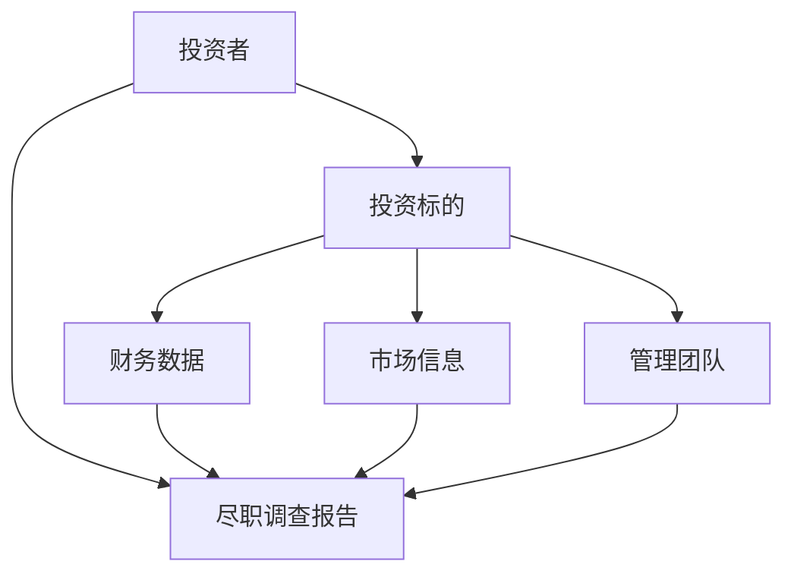
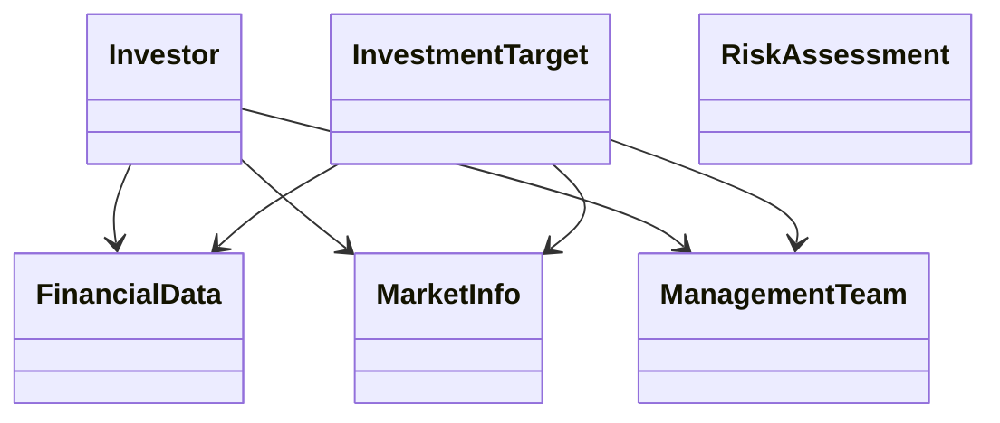
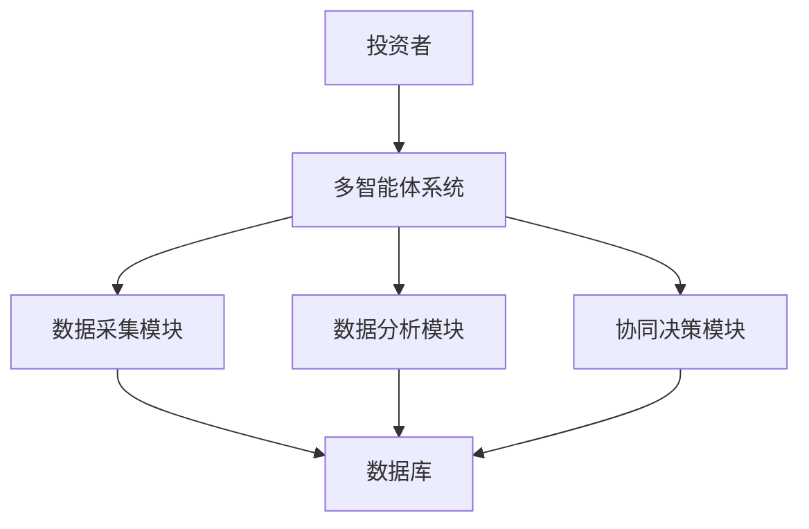
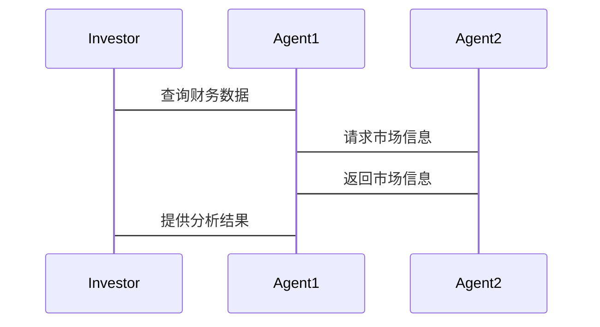
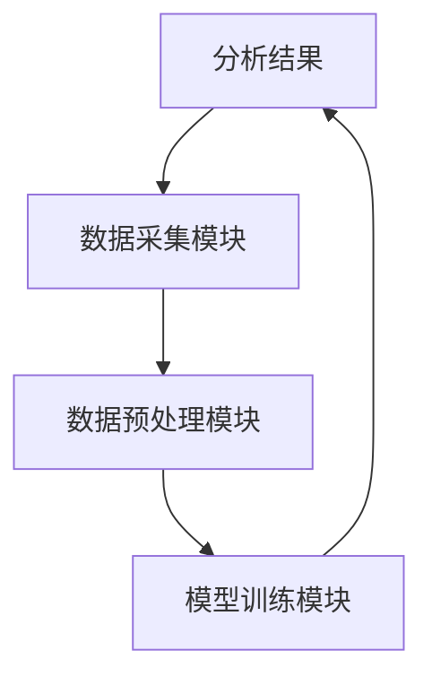

                 


```markdown
# AI多智能体系统如何改进传统的价值投资尽职调查流程

> 关键词：AI多智能体系统，价值投资，尽职调查，金融数据分析，分布式计算

> 摘要：本文探讨了如何利用AI多智能体系统改进传统的价值投资尽职调查流程。通过分析多智能体系统的协同机制、强化学习算法、系统架构设计以及实际案例，本文展示了AI技术如何提升尽职调查的效率和准确性。文章详细介绍了多智能体系统的算法原理、系统实现、项目实战以及最佳实践，为金融从业者和技术开发者提供了实用的指导。

---

## 第一部分: 背景介绍

### 第1章: 问题背景与描述

#### 1.1 问题背景
##### 1.1.1 传统价值投资尽职调查的局限性
传统的价值投资尽职调查依赖于人工分析，存在以下问题：
- 数据来源分散，信息整合困难
- 分析效率低，耗时长
- 易受主观因素影响，存在人为错误
- 需要大量经验，对新手投资者不友好

##### 1.1.2 多智能体系统在金融领域的应用潜力
AI多智能体系统具有以下优势：
- 分布式计算能力，能够并行处理大量数据
- 自适应学习能力，能够根据市场变化动态调整策略
- 协作能力强，能够协同多个智能体完成复杂任务

##### 1.1.3 当前行业对智能化尽职调查的需求
随着金融市场数据的爆炸性增长，传统尽职调查方法已难以应对复杂多变的市场环境。智能化、自动化的需求日益迫切。

#### 1.2 问题描述
##### 1.2.1 传统尽职调查流程的关键环节
1. 财务数据分析
2. 市场趋势分析
3. 管理团队评估
4. 风险评估

##### 1.2.2 AI多智能体系统如何解决现有问题
通过多智能体协同，实现数据的高效采集、分析和决策支持。

##### 1.2.3 多智能体系统在尽职调查中的边界与外延
- 边界：专注于数据收集与初步分析
- 外延：可与外部数据库和API接口集成

#### 1.3 概念结构与核心要素组成
- 核心要素：数据源、分析算法、协同机制、决策模块
- 结构：数据层、算法层、协同层、决策层

### 第2章: 核心概念与联系

#### 2.1 核心概念原理
##### 2.1.1 多智能体系统的定义与特点
- 定义：由多个智能体组成的分布式系统，通过协同完成复杂任务。
- 特点：分布式、协作性、自适应性

##### 2.1.2 价值投资尽职调查的核心要素
- 财务数据
- 市场信息
- 管理团队
- 风险评估

#### 2.2 概念属性特征对比
##### 2.2.1 多智能体系统与传统单智能体系统的对比
| 特性       | 单智能体系统 | 多智能体系统 |
|------------|--------------|--------------|
| 处理能力   | 单一          | 分布式       |
| 协作能力   | 无           | 强           |
| 学习能力   | 有限         | 丰富         |

##### 2.2.2 价值投资与投机投资的对比
| 特性       | 价值投资     | 投机投资     |
|------------|--------------|--------------|
| 标的选择   | 高质量       | 高流动性     |
| 投资期限   | 长期         | 短期         |
| 风险控制   | 严格         | 松散         |

#### 2.3 ER实体关系图


---

## 第二部分: AI多智能体系统的算法原理

### 第3章: 多智能体协同算法

#### 3.1 多智能体协同的基本原理
##### 3.1.1 分布式计算与协作机制
多智能体系统通过分布式计算，将任务分解为多个子任务，由多个智能体协同完成。

##### 3.1.2 多智能体系统中的通信与协调
智能体之间通过消息传递进行通信，实现任务分配和状态同步。

#### 3.2 强化学习在多智能体系统中的应用
##### 3.2.1 Q-learning算法
Q-learning算法是一种常用的强化学习算法，通过状态-动作-奖励机制，实现智能体的决策优化。

##### 3.2.2 多智能体强化学习的挑战与解决方案
- 挑战：智能体之间的协调问题
- 解决方案：使用分布式Q-learning或基于价值函数的方法

#### 3.3 算法实现
##### 3.3.1 多智能体协同的Python实现
```python
import numpy as np

class Agent:
    def __init__(self, state_space, action_space):
        self.state_space = state_space
        self.action_space = action_space
        self.q_table = np.zeros((state_space, action_space))

    def take_action(self, state):
        return np.argmax(self.q_table[state])

    def update_q_table(self, state, action, reward, next_state):
        self.q_table[state, action] = reward + np.max(self.q_table[next_state])
```

##### 3.3.2 强化学习算法的数学模型
$$ Q(s, a) = Q(s, a) + \alpha (r + \gamma \max Q(s', a') - Q(s, a)) $$

---

## 第三部分: 系统分析与架构设计

### 第4章: 问题场景与系统功能设计

#### 4.1 问题场景介绍
在价值投资中，投资者需要对多个投资标的进行尽职调查，包括财务数据、市场信息等多方面的分析。

#### 4.2 系统功能设计
##### 4.2.1 领域模型类图


##### 4.2.2 系统架构设计


##### 4.2.3 接口设计与交互流程图


---

## 第四部分: 项目实战

### 第5章: 系统实现与案例分析

#### 5.1 项目环境与安装
##### 5.1.1 环境配置
- Python 3.8+
- NumPy, Pandas, Scikit-learn

##### 5.1.2 安装依赖
```bash
pip install numpy pandas scikit-learn
```

#### 5.2 系统核心实现
##### 5.2.1 核心代码实现
```python
from sklearn.preprocessing import StandardScaler
from sklearn.cluster import KMeans

class DataAnalyzer:
    def __init__(self, data):
        self.data = data
        self.scaler = StandardScaler()
        self.model = KMeans(n_clusters=3)

    def preprocess(self):
        self.data_scaled = self.scaler.fit_transform(self.data)

    def analyze(self):
        self.model.fit(self.data_scaled)
        return self.model.labels_
```

##### 5.2.2 代码应用解读
- 数据预处理：标准化数据，便于模型分析
- 模型训练：使用K均值聚类，识别数据中的潜在模式

#### 5.3 实际案例分析
##### 5.3.1 案例背景
分析一家科技公司的财务数据，判断其投资价值。

##### 5.3.2 数据采集与预处理
```python
import pandas as pd

data = pd.read_csv('financial_data.csv')
data_analyzer = DataAnalyzer(data)
data_analyzer.preprocess()
```

##### 5.3.3 模型训练与结果分析
```python
labels = data_analyzer.analyze()
print(labels)
```

##### 5.3.4 交互流程图


#### 5.4 项目小结
通过实际案例分析，展示了AI多智能体系统在价值投资尽职调查中的应用价值。

---

## 第五部分: 最佳实践

### 第6章: 实践总结与注意事项

#### 6.1 小结
本文详细介绍了AI多智能体系统如何改进传统的价值投资尽职调查流程，通过理论分析和实际案例，展示了其在金融领域的应用潜力。

#### 6.2 注意事项
- 数据质量对系统性能影响重大
- 模型训练需要大量高质量数据
- 系统上线前需进行充分的测试与验证

#### 6.3 拓展阅读
- 推荐阅读《分布式计算与多智能体系统》
- 参考《强化学习算法与金融应用》

---

## 结语

通过本文的分析与实践，读者可以了解到AI多智能体系统在价值投资尽职调查中的具体应用。未来，随着AI技术的不断发展，其在金融领域的应用前景将更加广阔。
```

