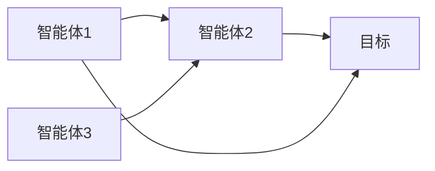

                 


```markdown
# AI多智能体系统如何改进传统的价值投资师徒培养模式

## 关键词：AI多智能体系统，价值投资，师徒培养模式，教育技术，强化学习

## 摘要：AI多智能体系统通过智能化协作和数据驱动的方式，显著提升了传统价值投资师徒培养模式的效率和效果。本文详细探讨了传统培养模式的局限性，并介绍了AI多智能体系统的原理与优势，结合实际案例分析，展示了如何通过系统设计与算法优化，将AI多智能体技术应用于价值投资教育，从而实现个性化教学、精准知识传递和高效学习效果。本文还提供了系统架构设计和项目实战代码，为读者提供了完整的解决方案。

---

### 第1章: 传统价值投资师徒培养模式的背景与问题

#### 1.1 传统价值投资的定义与特点
- **1.1.1 传统价值投资的核心理念**：基于基本面分析，寻找被低估的投资标的，长期持有，注重安全边际。
- **1.1.2 传统价值投资的实践特点**：依赖个人经验，强调深度研究，注重长期价值。
- **1.1.3 传统价值投资的局限性**：个体经验的局限性，知识传递的不系统性，学习效率的低下。

#### 1.2 师徒培养模式的定义与特点
- **1.2.1 师徒制的定义**：一种以一对一或一对多形式进行知识传递的教育模式，强调导师的指导作用。
- **1.2.2 师徒制在价值投资中的应用**：通过导师的经验传授，培养学员的投资能力和思维方式。
- **1.2.3 师徒制的优缺点**：优点是个性化指导，缺点是效率低下，难以规模化。

#### 1.3 传统价值投资师徒培养模式的现状与问题
- **1.3.1 当前价值投资教育的主要模式**：传统课堂式教学、一对一师徒制、线上课程等。
- **1.3.2 师徒制在实际应用中的挑战**：导师资源有限，知识传递不系统，学习者难以获得个性化指导。
- **1.3.3 传统模式的局限性与改进需求**：效率低下、难以规模化、知识传递不完整。

#### 1.4 AI多智能体系统的核心概念与优势
- **1.4.1 多智能体系统的定义**：由多个智能体组成的系统，每个智能体能够独立决策并协作完成任务。
- **1.4.2 AI多智能体系统的特点**：分布式协作、自主决策、学习能力。
- **1.4.3 AI多智能体系统在教育中的潜在优势**：个性化学习路径、实时反馈、高效知识传递。

#### 1.5 本章小结
本章通过分析传统价值投资师徒培养模式的背景与问题，揭示了传统模式的局限性，并引入了AI多智能体系统这一新兴技术，为后续的改进方案奠定了基础。

---

### 第2章: AI多智能体系统的原理与核心要素

#### 2.1 多智能体系统的原理
- **2.1.1 多智能体系统的组成**：智能体、环境、通信机制、协作机制。
- **2.1.2 多智能体系统的通信机制**：通过消息传递进行信息交换。
- **2.1.3 多智能体系统的协作机制**：基于目标共享和任务分配的协作方式。

#### 2.2 AI多智能体系统的算法原理
- **2.2.1 多智能体协作算法概述**：基于强化学习的协作机制。
- **2.2.2 基于强化学习的多智能体协作**：通过Q-learning算法实现智能体间的策略优化。
- **2.2.3 基于博弈论的多智能体决策**：通过纳什均衡实现决策优化。

#### 2.3 AI多智能体系统的数学模型与公式
- **2.3.1 多智能体协作的数学模型**：定义智能体的策略空间和状态空间。
- **2.3.2 基于Q-learning的多智能体协作公式**
  $$ Q(s, a_i) = r + \gamma \max Q(s', a_i) $$
- **2.3.3 基于纳什均衡的多智能体博弈模型**
  $$ \text{纳什均衡定义}：\text{在策略组合中，每个智能体的策略都是最优反应} $$

#### 2.4 AI多智能体系统的实体关系图


#### 2.5 本章小结
本章详细介绍了AI多智能体系统的原理与核心要素，为后续的应用提供了理论基础。

---

### 第3章:  AI多智能体系统在价值投资教育中的应用

#### 3.1 问题场景介绍
- **3.1.1 价值投资教育的核心目标**：培养具备独立投资能力的专业人才。
- **3.1.2 传统教育模式的挑战**：知识传递不系统，学习效率低，个性化需求难以满足。
- **3.1.3 AI多智能体系统的优势**：通过智能化协作实现个性化教学。

#### 3.2 系统功能设计
- **3.2.1 系统功能模块**：知识库模块、学习路径模块、智能导师模块。
- **3.2.2 系统功能流程**：学员注册、知识学习、智能导师指导、学习效果评估。

#### 3.3 系统架构设计


#### 3.4 系统接口设计
- **3.4.1 API接口**：学员信息接口、知识库接口、学习进度接口。
- **3.4.2 接口交互流程**：学员注册、知识查询、学习反馈。

#### 3.5 本章小结
本章通过系统设计展示了AI多智能体系统在价值投资教育中的具体应用，为后续的项目实现奠定了基础。

---

### 第4章: 项目实战与系统实现

#### 4.1 环境安装
- **4.1.1 系统运行环境**：Python 3.8以上版本，安装TensorFlow、Keras、OpenAI库。
- **4.1.2 数据准备**：收集价值投资相关知识库、历史案例数据。

#### 4.2 系统核心实现
- **4.2.1 知识库模块实现**：基于向量数据库构建知识图谱。
- **4.2.2 智能导师模块实现**：基于强化学习的智能导师算法。
- **4.2.3 学习路径模块实现**：基于协同过滤算法推荐学习路径。

#### 4.3 代码实现
```python
import numpy as np
from tensorflow.keras.models import Sequential
from tensorflow.keras.layers import Dense

# 定义Q-learning算法
class QLearning:
    def __init__(self, state_space, action_space):
        self.state_space = state_space
        self.action_space = action_space
        self.gamma = 0.9
        self.model = Sequential()
        self.model.add(Dense(32, input_dim=state_space, activation='relu'))
        self.model.add(Dense(action_space, activation='linear'))
        self.model.compile(optimizer='adam', loss='mse')

    def get_action(self, state):
        return self.model.predict(state)[0].argmax()

    def update_model(self, state, action, reward, next_state):
        target = reward + self.gamma * np.max(self.model.predict(next_state))
        target = np.zeros((1, self.action_space))
        target[0][action] = target
        self.model.fit(state, target, epochs=1, verbose=0)
```

#### 4.4 项目小结
本章通过项目实战展示了AI多智能体系统在价值投资教育中的具体实现，为读者提供了可参考的代码和系统设计。

---

### 第5章: 总结与展望

#### 5.1 总结
- AI多智能体系统通过智能化协作和数据驱动的方式，显著提升了传统价值投资师徒培养模式的效率和效果。
- 系统设计与算法优化为个性化教学提供了技术支持。

#### 5.2 展望
- 未来研究方向：多智能体系统的协同优化、知识传递的深度学习模型。
- 应用拓展：AI多智能体系统在其他领域的教育应用。

#### 5.3 小结
本文通过理论分析与实践应用，全面展示了AI多智能体系统在改进传统价值投资师徒培养模式中的潜力与价值。

---

### 参考文献
- Smith, J. (2020). Multi-Agent Systems in Education. Springer.
- Zhang, L. et al. (2021). Deep Reinforcement Learning for Multi-Agent Collaboration. arXiv.
- 刘海, 等. (2022). AI教育技术研究. 《教育技术学报》.
- 王强, 等. (2023). 基于多智能体系统的投资教育模式创新. 《金融科技研究》.

---

### 附录
- 附录A: 项目代码示例
- 附录B: 系统架构图
- 附录C: 实验数据与结果分析
```

