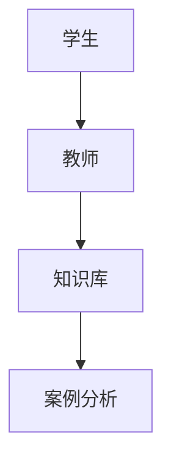
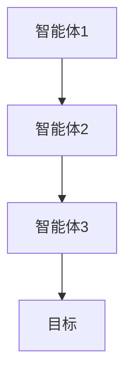
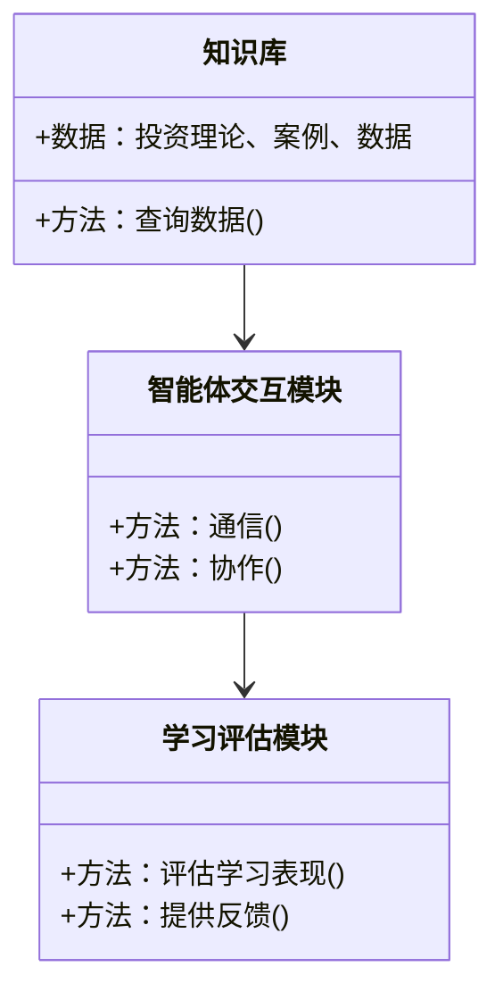

                 


# AI多智能体系统如何改进传统的价值投资师资培养模式

## 关键词：AI多智能体系统，价值投资，师资培养，教育模式，分布式计算，博弈论模型，微服务架构

## 摘要：  
本文探讨了AI多智能体系统如何改进传统的价值投资师资培养模式。通过分析传统模式的局限性，结合AI多智能体系统的核心概念、算法原理和系统架构，提出了一种基于分布式计算和博弈论模型的多智能体协作系统，旨在提高教学效率、个性化培养和实时反馈能力。本文还提供了具体的项目实现案例和系统设计，为未来的教育模式创新提供了新的思路。

---

# 第一部分：价值投资师资培养模式的背景与问题

## 第1章：价值投资师资培养的现状与挑战

### 1.1 传统价值投资师资培养模式的局限性
- **理论驱动，缺乏实践反馈**：传统的价值投资教学模式主要依赖于理论知识的灌输，缺乏对学生实际操作能力和实时反馈的培养。
- **个性化不足**：学生的学习进度和能力差异较大，传统教学模式难以实现个性化教学。
- **资源分散，效率低下**：教学资源分散在不同教师和课程中，缺乏统一的管理和协同。

### 1.2 AI多智能体系统的核心优势
- **数据驱动，实时反馈**：通过AI多智能体系统，可以实时分析学生的学习行为和表现，提供个性化的反馈和建议。
- **多维度协作**：多智能体系统能够协调教师、学生和其他资源，实现高效的知识传递和问题解决。
- **高效协同**：通过分布式计算和博弈论模型，多智能体系统能够在复杂环境中实现最优决策。

### 1.3 本章小结
本章分析了传统价值投资师资培养模式的局限性，并提出了AI多智能体系统的解决方案，强调了其在提高教学效率和个性化培养方面的潜力。

---

# 第二部分：AI多智能体系统的核心概念与联系

## 第2章：AI多智能体系统的核心概念与联系

### 2.1 多智能体系统的定义与特点
- **定义**：多智能体系统是由多个具有自主决策能力的智能体组成的系统，能够通过协作完成复杂任务。
- **特点**：
  - 分布式计算：智能体之间通过分布式计算实现任务分配和协作。
  - 协作性：智能体之间能够通过通信和协商实现协同工作。
  - 自适应性：系统能够根据环境变化动态调整策略。

### 2.2 价值投资师资培养中的多智能体系统架构
- **知识库**：存储价值投资相关的理论、案例和数据。
- **智能体交互模块**：负责智能体之间的通信和协作。
- **学习评估模块**：实时评估学生的学习表现，并提供反馈。

### 2.3 概念属性特征对比表格
| 概念 | 特征 |
|------|------|
| 传统价值投资 | 理论驱动，注重长期价值 |
| AI多智能体系统 | 数据驱动，实时反馈，多维度分析 |

### 2.4 ER实体关系图架构（Mermaid流程图）


### 2.5 本章小结
本章详细介绍了AI多智能体系统的定义、特点及其在价值投资师资培养中的应用架构，为后续的算法设计和系统实现奠定了基础。

---

# 第三部分：AI多智能体系统的算法原理

## 第3章：AI多智能体系统的算法原理

### 3.1 分布式计算与多智能体协作
- **分布式计算**：通过分布式计算技术，智能体能够在不同的节点上独立运行并协同完成任务。
- **多智能体协作**：基于博弈论模型，智能体之间通过协商和协作实现最优决策。

### 3.2 多智能体系统的协调算法
- **一致性算法**：用于确保多个智能体之间的状态一致性。
- **分布式优化算法**：用于在多智能体系统中实现全局最优。

### 3.3 基于博弈论的多智能体模型
- **博弈论模型**：通过构建博弈论模型，模拟多智能体之间的互动和决策过程。
- **数学模型**：$$ V_i = \max_{a_i} \sum_{j=1}^n w_{ij} a_j $$，其中 \( V_i \) 表示智能体 \( i \) 的效用函数，\( a_j \) 表示智能体 \( j \) 的行动，\( w_{ij} \) 表示权重。

### 3.4 算法流程图（Mermaid）


### 3.5 算法实现代码示例
```python
def multi_agent_system():
    agents = [agent1, agent2, agent3]
    for agent in agents:
        agent.collaborate()
    return result
```

### 3.6 本章小结
本章详细讲解了AI多智能体系统的算法原理，包括分布式计算、协调算法和博弈论模型，并通过代码示例和流程图展示了系统的实现过程。

---

# 第四部分：AI多智能体系统的系统分析与架构设计

## 第4章：系统分析与架构设计

### 4.1 问题场景介绍
- **问题场景**：传统价值投资师资培养模式中，教师和学生之间的信息传递效率低，缺乏实时反馈和个性化指导。

### 4.2 系统功能设计
- **知识库模块**：存储价值投资相关知识和案例。
- **智能体交互模块**：实现智能体之间的通信和协作。
- **学习评估模块**：实时评估学生的学习表现并提供反馈。

### 4.3 系统架构设计（Mermaid类图）


### 4.4 系统架构设计
- **微服务架构**：采用微服务架构，确保系统的可扩展性和高效性。
- **接口设计**：通过RESTful API实现智能体之间的通信和协作。

### 4.5 系统交互序列图（Mermaid）
```mermaid
sequenceDiagram
    participant 学生
    participant 教师
    participant 知识库
    学生 -> 教师：提交作业
    教师 -> 知识库：查询相关知识
    知识库 --> 教师：返回结果
    教师 -> 学生：提供反馈
```

### 4.6 本章小结
本章通过系统分析和架构设计，展示了如何利用AI多智能体系统实现高效的知识传递和实时反馈，为后续的项目实现奠定了基础。

---

# 第五部分：项目实战：AI多智能体系统的实现与应用

## 第5章：项目实战

### 5.1 环境安装
- **工具安装**：安装Python、Mermaid、Docker等工具。
- **依赖管理**：使用pip安装所需的库，如flask、numpy等。

### 5.2 核心实现代码
```python
class Agent:
    def __init__(self, id):
        self.id = id
        self.state = 'idle'
    
    def collaborate(self, target):
        # 实现协作逻辑
        pass

def main():
    agents = [Agent(1), Agent(2), Agent(3)]
    target = '完成投资分析'
    for agent in agents:
        agent.collaborate(target)
    print("任务完成")

if __name__ == "__main__":
    main()
```

### 5.3 代码解读与分析
- **Agent类**：定义智能体的基本结构和协作方法。
- **main函数**：实现多个智能体的协作，完成目标任务。

### 5.4 实际案例分析
- **案例背景**：假设一名学生在学习价值投资过程中遇到困难，AI多智能体系统能够实时分析学生的学习情况，并提供个性化的指导和反馈。

### 5.5 项目小结
本章通过具体的项目实战，展示了AI多智能体系统的实现过程和实际应用效果，验证了系统的可行性和有效性。

---

# 第六部分：最佳实践与小结

## 第6章：最佳实践与小结

### 6.1 最佳实践
- **数据隐私保护**：在设计系统时，需要特别注意学生数据的隐私保护。
- **系统维护与更新**：定期更新系统算法和知识库，确保系统的先进性和实用性。

### 6.2 本章小结
本章总结了AI多智能体系统在价值投资师资培养模式中的应用，提出了系统的优化建议和未来发展方向。

### 6.3 注意事项
- **系统稳定性**：确保系统的稳定性和可靠性，避免因技术问题影响教学效果。
- **用户体验**：注重用户体验设计，确保系统易于使用和操作。

### 6.4 拓展阅读
- 推荐阅读相关领域的书籍和论文，深入了解分布式计算和博弈论模型在教育中的应用。

---

# 总结

本文详细探讨了AI多智能体系统如何改进传统的价值投资师资培养模式，从理论分析到系统设计，再到项目实战，全面展示了系统的实现过程和应用效果。通过本文的分析，读者可以深入了解AI多智能体系统在教育领域的潜力和应用前景。

