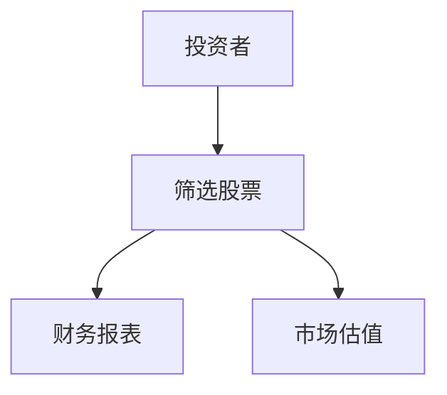
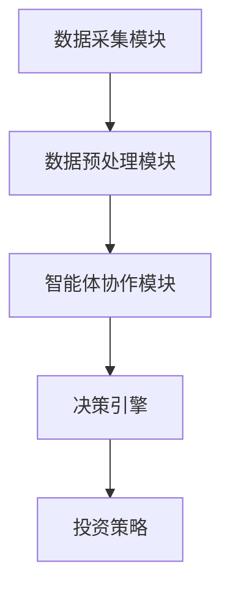
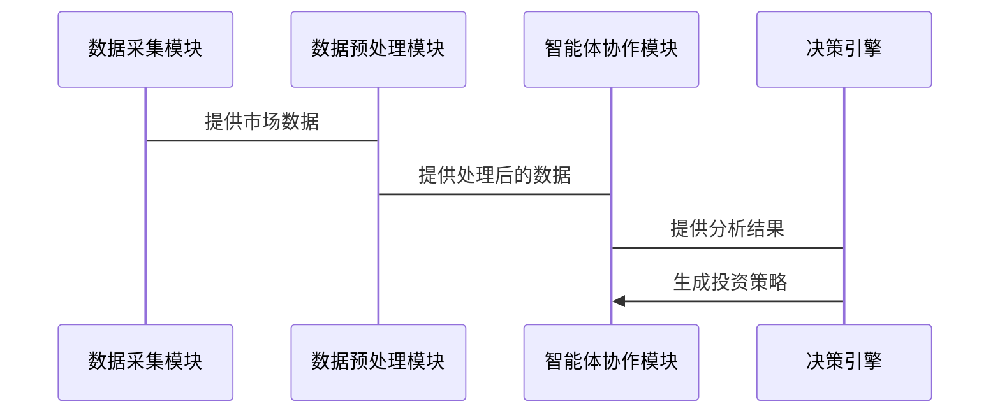

                 


# AI多智能体系统如何改进传统的价值投资筛选方法

## 关键词：AI多智能体系统，价值投资，筛选方法，传统投资，算法优化

## 摘要：本文探讨了如何利用AI多智能体系统改进传统的价值投资筛选方法。通过分析传统方法的局限性，提出基于多智能体系统的优化方案，结合算法原理和系统架构设计，展示了如何通过AI技术提升投资决策的效率和准确性。

---

# 第1章 价值投资的传统筛选方法

## 1.1 价值投资的核心概念

### 1.1.1 价值投资的定义与历史发展
- 价值投资是一种以低于公平价值的价格购买优质股票的投资策略。
- 历史发展：从格雷厄姆的“捡烟蒂”策略到巴菲特的长期价值投资理念。
- 核心思想：市场先生是短期情绪化的，但长期会反映企业的内在价值。

### 1.1.2 传统价值投资筛选方法的局限性
- 数据维度有限：主要依赖财务报表和市场估值，忽略了非财务数据（如市场情绪、新闻）。
- 计算复杂性：手动筛选股票耗时耗力，且容易出错。
- 风险控制不足：传统方法难以实时捕捉市场变化，导致投资决策滞后。

### 1.1.3 传统筛选方法的数学模型与公式
- 财务指标：市盈率（P/E）、市净率（P/B）、股息率（Dividend Yield）等。
- 估值模型：DCF（Discounted Cash Flow）模型。



## 1.2 传统价值投资的核心要素

### 1.2.1 财务指标分析
- 利润能力：净利率、ROE（净资产收益率）。
- 偿债能力：资产负债率、流动比率。
- 运营效率：存货周转率、应收账款周转率。

### 1.2.2 市场估值分析
- 相对估值法：市盈率、市净率、EV/EBITDA。
- 绝对估值法：DCF模型。

### 1.2.3 行业分析与竞争地位
- 行业趋势：宏观经济指标、行业生命周期。
- 竞争地位：市场占有率、竞争优势（护城河）。

## 1.3 传统价值投资筛选方法的优缺点对比

| 优缺点对比 | 优点 | 缺点 |
|------------|------|------|
| 数据来源 | 依赖财务报表，数据可靠 | 忽略非财务数据，信息不全面 |
| 计算方式 | 逻辑简单，易于理解 | 计算复杂，耗时耗力 |
| 风险控制 | 稳定性高，注重长期价值 | 反应滞后，难以捕捉短期变化 |

## 1.4 本章小结
- 传统价值投资的核心要素包括财务指标分析、市场估值分析和行业分析。
- 传统方法的局限性主要体现在数据维度有限、计算复杂性和风险控制不足。

---

# 第2章 多智能体系统的基本概念

## 2.1 多智能体系统的定义与特点

### 2.1.1 多智能体系统的定义
- 多智能体系统（Multi-Agent System, MAS）是由多个智能体组成的系统，每个智能体都能感知环境、自主决策并协同工作。

### 2.1.2 多智能体系统的核心特点
- 分布式：智能体独立运行，协同完成任务。
- 协作性：智能体之间通过通信和协作优化整体目标。
- 反应性：智能体能够实时感知环境并做出反应。

### 2.1.3 多智能体系统与单智能体系统的区别
| 特性 | 单智能体系统 | 多智能体系统 |
|------|--------------|--------------|
| 结构 | 单一中心 | 分布式结构 |
| 决策 | 集中决策 | 分布式决策 |
| 优势 | 简单高效 | 更强的并行性和容错性 |

## 2.2 多智能体系统中的智能体角色

### 2.2.1 智能体的分类
- 知识型智能体：基于知识库进行决策。
- 反应型智能体：基于感知环境实时做出反应。
- 学习型智能体：通过机器学习不断优化决策策略。

### 2.2.2 智能体之间的关系
- 协作关系：智能体之间通过协作完成共同目标。
- 竞争关系：智能体之间存在竞争，但最终目标一致。

### 2.2.3 智能体的协作机制
- 通信机制：智能体之间通过消息传递进行通信。
- 协作协议：定义智能体之间的交互规则和协作流程。

## 2.3 多智能体系统的数学模型与公式

### 2.3.1 多智能体系统的数学模型
- 状态表示：每个智能体的状态可以用向量表示。
- 行动选择：智能体根据当前状态选择最优行动。
- 协作优化：通过优化算法最大化整体收益。

### 2.3.2 多智能体系统中的协作公式
- 协作收益：$R_{total} = \sum_{i=1}^{n} R_i$
- 协作权重：$w_i = \frac{R_i}{\sum_{j=1}^{n} R_j}$

## 2.4 本章小结
- 多智能体系统的核心概念包括定义、特点、智能体角色和协作机制。
- 多智能体系统在价值投资中的应用潜力巨大，但需要克服协作复杂性和计算复杂性。

---

# 第3章 AI多智能体系统在价值投资中的应用前景

## 3.1 价值投资筛选方法的改进方向

### 3.1.1 数据来源的扩展
- 传统数据：财务报表、市场估值。
- 新增数据：市场情绪、新闻、社交媒体数据。

### 3.1.2 计算能力的提升
- 利用AI技术提高计算效率和准确性。

### 3.1.3 算法的优化
- 引入强化学习、协同学习等算法优化投资策略。

## 3.2 多智能体系统在价值投资中的优势

### 3.2.1 数据处理能力的增强
- 能够处理和分析非结构化数据，如文本和图像。
- 通过分布式计算提高数据处理效率。

### 3.2.2 策略优化的效率提升
- 多智能体系统能够同时优化多个投资策略。
- 通过协作机制提高策略的稳定性和收益性。

### 3.2.3 风险控制的强化
- 多智能体系统能够实时监控市场变化，及时调整投资策略。
- 通过分散投资降低风险。

## 3.3 多智能体系统在价值投资中的潜在挑战

### 3.3.1 数据质量的控制
- 非结构化数据的处理难度大，容易引入噪声。
- 数据来源的多样性和可靠性问题。

### 3.3.2 系统协作的复杂性
- 智能体之间的协作需要复杂的通信和协议设计。
- 系统的实时性和稳定性要求高。

### 3.3.3 技术实现的难度
- 多智能体系统的实现需要高水平的编程和算法优化能力。
- 系统的可扩展性和维护难度较大。

## 3.4 本章小结
- 多智能体系统在价值投资中的应用前景广阔，能够显著提升投资效率和准确性。
- 需要克服数据质量、系统协作和技术创新等挑战。

---

# 第4章 AI多智能体系统的算法原理

## 4.1 多智能体系统的算法选择

### 4.1.1 强化学习算法
- Q-Learning：通过奖励机制优化智能体的决策策略。
- Deep Q-Networks（DQN）：利用深度神经网络实现强化学习。

### 4.1.2 协作学习算法
- 协作分布式Q-learning：通过智能体之间的协作优化决策。
- 联合策略优化：多个智能体共同优化策略。

### 4.1.3 聚类算法
- K-means：用于市场数据的聚类分析。
- 层次聚类：用于分析股票的相似性。

## 4.2 多智能体系统的算法流程

### 4.2.1 算法输入与输出
- 输入：市场数据（如股票价格、新闻数据）。
- 输出：优化后的投资策略。

### 4.2.2 算法步骤分解
1. 数据预处理：清洗和结构化数据。
2. 智能体初始化：定义智能体的角色和初始状态。
3. 智能体决策：基于当前状态做出最优决策。
4. 协作优化：智能体之间通过协作优化整体策略。
5. 策略执行：根据优化后的策略进行投资。

### 4.2.3 算法的数学模型与公式
- 强化学习模型：$Q(s, a) = r + \gamma \max Q(s', a')$
- 协作学习模型：$C(s) = \sum_{i=1}^{n} w_i Q_i(s, a)$

## 4.3 算法的实现与优化

### 4.3.1 强化学习算法实现
```python
import numpy as np

class DQN:
    def __init__(self, state_space, action_space, gamma=0.99, epsilon=1.0):
        self.state_space = state_space
        self.action_space = action_space
        self.gamma = gamma
        self.epsilon = epsilon
        self.Q = np.zeros((state_space, action_space))

    def act(self, state):
        if np.random.random() < self.epsilon:
            return np.random.randint(self.action_space)
        return np.argmax(self.Q[state, :])

    def update(self, state, action, reward, next_state):
        self.Q[state, action] = reward + self.gamma * np.max(self.Q[next_state, :])
```

### 4.3.2 算法优化
- 网络结构优化：使用更深的神经网络提高预测精度。
- 超参数优化：通过试验选择最佳的超参数组合。

---

# 第5章 系统架构设计

## 5.1 问题场景介绍
- 系统目标：通过多智能体系统优化股票筛选策略。
- 使用场景：实时股票筛选、投资组合优化。

## 5.2 系统功能设计

### 5.2.1 数据采集模块
- 数据来源：财务报表、新闻、社交媒体。
- 数据预处理：清洗和结构化数据。

### 5.2.2 智能体协作模块
- 智能体角色：数据分析师、市场情绪分析、估值模型优化。
- 协作机制：消息传递、状态同步。

### 5.2.3 决策引擎
- 策略生成：根据智能体协作结果生成投资策略。
- 风险控制：实时监控市场变化，调整投资策略。

## 5.3 系统架构设计



## 5.4 系统接口设计
- 数据接口：与数据源（如数据库、API）对接。
- 策略接口：与投资管理系统对接。

## 5.5 系统交互设计

### 5.5.1 系统交互流程
1. 数据采集模块获取市场数据。
2. 数据预处理模块清洗数据。
3. 智能体协作模块分析数据，生成投资建议。
4. 决策引擎根据分析结果生成投资策略。
5. 投资策略输出并执行。

### 5.5.2 交互时序图



---

# 第6章 项目实战

## 6.1 环境安装与配置
- 安装Python环境：Python 3.8以上。
- 安装依赖库：numpy、pandas、scikit-learn、tensorflow。

## 6.2 系统核心实现源代码

### 6.2.1 数据预处理代码
```python
import pandas as pd

def preprocess_data(data):
    # 数据清洗
    data = data.dropna()
    # 数据标准化
    data = (data - data.mean()) / data.std()
    return data
```

### 6.2.2 多智能体系统实现
```python
class MultiAgentSystem:
    def __init__(self, agents):
        self.agents = agents

    def collaborate(self, data):
        # 智能体协作
        for agent in self.agents:
            agent.receive_data(data)
            agent.make_decision()
        return self.get_result()

    def get_result(self):
        # 获取协作结果
        result = []
        for agent in self.agents:
            result.append(agent.get_decision())
        return result
```

### 6.2.3 投资策略生成代码
```python
class InvestmentStrategy:
    def generate_strategy(self, data):
        # 根据数据生成投资策略
        pass
```

## 6.3 代码应用解读与分析
- 数据预处理：清洗和标准化数据，为后续分析提供基础。
- 多智能体系统协作：智能体之间协作分析数据，生成最优投资策略。
- 投资策略生成：根据协作结果生成具体的投资策略。

## 6.4 实际案例分析
- 数据来源：某段时间内的股票数据和新闻数据。
- 数据分析：多个智能体分别分析财务数据、市场情绪、估值指标。
- 投资策略生成：综合各智能体的分析结果，生成优化后的投资策略。

## 6.5 项目小结
- 通过实际案例分析，验证了多智能体系统在价值投资中的有效性。
- 项目实现了从数据采集到投资策略生成的完整流程。

---

# 第7章 总结与展望

## 7.1 系统的优势
- 数据处理能力强：能够分析多种数据源。
- 策略优化效率高：通过多智能体协作提高策略优化速度。
- 风险控制能力强：实时监控市场变化，及时调整投资策略。

## 7.2 系统的潜在挑战
- 数据质量控制：如何处理非结构化数据中的噪声。
- 系统协作复杂性：智能体之间的协作机制设计难度大。
- 技术实现难度：多智能体系统的实现需要高水平的编程和算法优化能力。

## 7.3 未来展望
- 技术融合：结合其他AI技术（如自然语言处理、图像识别）进一步优化投资策略。
- 应用场景扩展：将多智能体系统应用于更多金融领域，如外汇交易、风险管理。

## 7.4 最佳实践 tips
- 数据来源多样化：结合财务数据和非财务数据，提高分析精度。
- 系统协作机制设计：确保智能体之间的协作高效且稳定。
- 算法优化：不断优化算法，提高系统性能和投资收益。

---

# 结语
通过本文的探讨，我们可以看到AI多智能体系统在改进传统价值投资筛选方法中的巨大潜力。尽管存在一些挑战，但随着技术的不断进步，多智能体系统必将在金融领域发挥越来越重要的作用，为投资者带来更高的收益和更低的风险。

